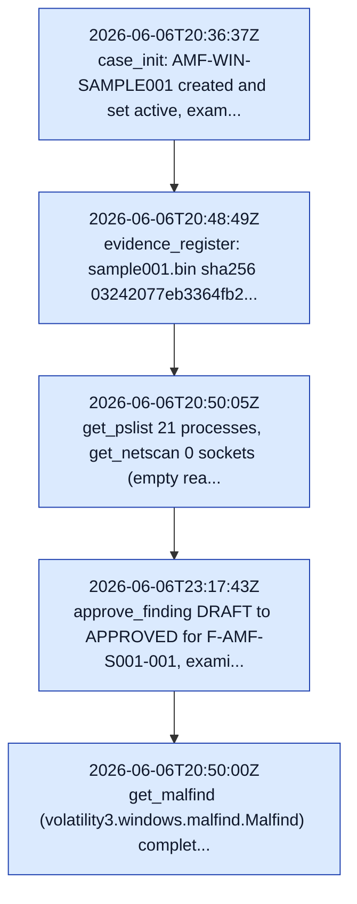

# Analyst / Technical Report — AMF-WIN-SAMPLE001

*Report ID:* `4159bc46eddc9b8adc32dbc84db51554b9e72524d0b44f63d2206affe235aa16`  ·  *Snapshot:* 2026-06-07T01:30:33.897125+00:00

> **Likelihood scale (FIRST 5-tier):** almost_certain > highly_likely > likely > unlikely > remote. Likelihood estimates the probability of the assessed activity; it is kept separate from analytic confidence.
>
> **Confidence (LCA):** high / moderate / low — the analyst's confidence in the assessment given evidence quality and corroboration. Distinct from likelihood.

## Findings

### malfind recovered 15 executable VAD hits (11 PAGE_EXECUTE_READWRITE / RWX, 4 PAGE_EXECUTE_READ / RX) across 5 processes; RWX concentrated in winlogon.exe (PID 628, x9)
- **Finding ID:** `F-AMF-S001-001`  ·  **Severity:** medium  ·  **Likelihood:** unlikely  ·  **Confidence:** moderate  ·  **Risk score:** 6
- **MITRE ATT&CK:** `T1055`

get_malfind (volatility3.windows.malfind.Malfind) reported 15 executable VAD hits: 11 RWX (PAGE_EXECUTE_READWRITE) and 4 RX (PAGE_EXECUTE_READ). RWX by process: winlogon.exe PID 628 x9, csrss.exe PID 604 x1, msimn.exe PID 1984 x1. RX (not RWX): winlogon.exe PID 628 x1 (0x580000), lsass.exe PID 692 x2, msmsgs.exe PID 548 x1. RWX is concentrated in winlogon.exe, the canonical AMF process-injection teaching signal.

_Evidence:_ `malfind RWX winlogon.exe PID 628 x9 (0x42e20000,0x22f40000,0x24c00000,0x248a0000,0x40a60000,0x2b7f0000,0x43400000,0x57500000,0x548a0000) vad_tag VadS PAGE_EXECUTE_READWRITE` `malfind RWX csrss.exe PID 604 0x7f6f0000 vad_tag Vad PAGE_EXECUTE_READWRITE` `malfind RWX msimn.exe PID 1984 0x1eb0000 vad_tag VadS PAGE_EXECUTE_READWRITE` `malfind RX winlogon.exe PID 628 0x580000 vad_tag Vad PAGE_EXECUTE_READ` `malfind RX lsass.exe PID 692 0x280000,0x7f6f0000 vad_tag Vad PAGE_EXECUTE_READ` `malfind RX msmsgs.exe PID 548 0x520000 vad_tag Vad PAGE_EXECUTE_READ` `plugin volatility3.windows.malfind.Malfind hit_count=15`

### 9 RWX (PAGE_EXECUTE_READWRITE) malfind regions in winlogon.exe (PID 628, ppid 356) — dominant injected/unpacked-code concentration
- **Finding ID:** `F-AMF-S001-002`  ·  **Severity:** medium  ·  **Likelihood:** unlikely  ·  **Confidence:** moderate  ·  **Risk score:** 6
- **MITRE ATT&CK:** `T1055`

get_malfind reported 10 executable VAD hits in winlogon.exe (PID 628, ppid 356 smss.exe), of which 9 are RWX (PAGE_EXECUTE_READWRITE, vad_tag VadS) and 1 is RX (PAGE_EXECUTE_READ at 0x580000, vad_tag Vad). The 9 RWX regions are the dominant injected/unpacked-code concentration in this image and the canonical AMF process-injection teaching signal.

_Evidence:_ `winlogon.exe PID 628 RWX VadS: 0x42e20000,0x22f40000,0x24c00000,0x248a0000,0x40a60000,0x2b7f0000,0x43400000,0x57500000,0x548a0000 (9 x PAGE_EXECUTE_READWRITE)` `winlogon.exe PID 628 RX Vad: 0x580000 (PAGE_EXECUTE_READ, not RWX)` `pslist: winlogon.exe pid 628 ppid 356` `plugin volatility3.windows.malfind.Malfind`

### 2 PAGE_EXECUTE_READ (RX, not RWX) malfind regions in lsass.exe (PID 692) — read-execute, no write permission
- **Finding ID:** `F-AMF-S001-003`  ·  **Severity:** low  ·  **Likelihood:** unlikely  ·  **Confidence:** moderate  ·  **Risk score:** 4
- **MITRE ATT&CK:** `T1055`

get_malfind reported 2 executable VAD regions in lsass.exe (PID 692, ppid 628 winlogon.exe), both PAGE_EXECUTE_READ (RX), vad_tag Vad — NOT PAGE_EXECUTE_READWRITE. An earlier draft mislabeled these as RWX injection into the credential process; the authoritative malfind output (step6_malfind_300s.json) shows protection PAGE_EXECUTE_READ for both, so these are read-execute mapped regions with no write permission and are not RWX injection. Lower confidence accordingly.

_Evidence:_ `lsass.exe PID 692 0x280000 vad_tag Vad PAGE_EXECUTE_READ (RX)` `lsass.exe PID 692 0x7f6f0000 vad_tag Vad PAGE_EXECUTE_READ (RX)` `pslist: lsass.exe pid 692 ppid 628` `plugin volatility3.windows.malfind.Malfind`

### 1 RWX (PAGE_EXECUTE_READWRITE) malfind region in csrss.exe (PID 604)
- **Finding ID:** `F-AMF-S001-004`  ·  **Severity:** medium  ·  **Likelihood:** unlikely  ·  **Confidence:** moderate  ·  **Risk score:** 6
- **MITRE ATT&CK:** `T1055`

get_malfind reported 1 RWX VAD region in csrss.exe (PID 604, ppid 356 smss.exe) at 0x7f6f0000, vad_tag Vad, PAGE_EXECUTE_READWRITE.

_Evidence:_ `csrss.exe PID 604 0x7f6f0000 vad_tag Vad PAGE_EXECUTE_READWRITE (RWX)` `pslist: csrss.exe pid 604 ppid 356` `plugin volatility3.windows.malfind.Malfind`

### 1 RWX (PAGE_EXECUTE_READWRITE) malfind region in msimn.exe (PID 1984); msmsgs.exe (PID 548) region is PAGE_EXECUTE_READ (RX, not RWX)
- **Finding ID:** `F-AMF-S001-005`  ·  **Severity:** low  ·  **Likelihood:** unlikely  ·  **Confidence:** moderate  ·  **Risk score:** 4
- **MITRE ATT&CK:** `T1055`

get_malfind reported 1 RWX VAD region in msimn.exe (Outlook Express, PID 1984) at 0x1eb0000, vad_tag VadS, PAGE_EXECUTE_READWRITE. The msmsgs.exe (Windows Messenger, PID 548) region at 0x520000 is PAGE_EXECUTE_READ (RX), vad_tag Vad — NOT RWX. An earlier draft labeled both as RWX; the authoritative malfind output shows only msimn.exe is RWX. RWX in these GUI apps is commonly benign JIT/packing on XP-era images, hence low confidence.

_Evidence:_ `msimn.exe PID 1984 0x1eb0000 vad_tag VadS PAGE_EXECUTE_READWRITE (RWX)` `msmsgs.exe PID 548 0x520000 vad_tag Vad PAGE_EXECUTE_READ (RX, not RWX)` `plugin volatility3.windows.malfind.Malfind`

### Process inventory recovered: 21 running processes, coherent PPID forest (2 roots, 0 orphans, 0 LOLBin flags)
- **Finding ID:** `F-AMF-S001-006`  ·  **Severity:** low  ·  **Likelihood:** unlikely  ·  **Confidence:** moderate  ·  **Risk score:** 4
- **MITRE ATT&CK:** `T1057`

get_pslist returned 21 processes (System pid4, smss 356, csrss 604, winlogon 628, services 680, lsass 692, svchost 852...); build_process_tree: process_count 21, root_count 2 (System, smss.exe), orphan_count 0, suspicious_count 0. cmdline recovered all 21 command lines consistent with pslist. get_netscan recovered 0 sockets (honest empty real result on this XP-era image). Baseline process-discovery context for the injection findings.

_Evidence:_ `get_pslist process_count=21` `build_process_tree: process_count 21, root_count 2 (System pid4, smss.exe pid356), orphan_count 0, suspicious_count 0` `get_netscan socket_count=0` `get_svcscan service_count=229` `cmdline rows=21`

## Indicators of Compromise

_No IOCs extracted._

## Timeline

| Timestamp | Host | Event | Phase | Description |
| --- | --- | --- | --- | --- |
| 2026-06-06T20:36:37Z | sample001 | TL-AMF-S001-001 | — | case_init: AMF-WIN-SAMPLE001 created and set active, examiner victor.galvan, severity medium, scope /cases/AMF_MemorySamples/windows/sample001.bin |
| 2026-06-06T20:48:49Z | sample001 | TL-AMF-S001-002 | — | evidence_register: sample001.bin sha256 03242077eb3364fb248d1c7730fd0a94074583df8deb2606d6c93c31316d561c, size 536330240 bytes, indexed to agentropix-evidence-2026.06.06 |
| 2026-06-06T20:50:05Z | sample001 | TL-AMF-S001-004 | — | get_pslist 21 processes; get_netscan 0 sockets (empty real result, XP-era image); get_svcscan 229 services; build_process_tree clean (2 roots, 0 orphans, 0 suspicious) |
| 2026-06-06T23:17:43Z | sample001 | TL-AMF-S001-005 | — | approve_finding DRAFT->APPROVED for F-AMF-S001-001, examiner victor.galvan, approval_id 4a881577139b59efadb980816d47adfcecbda4ad6bb94fd92fa8a797973696b4. NOTE: Playwright-automated demo approval, not a human HMAC sign-off. |
| 2026-06-06T20:50:00Z | sample001 | TL-AMF-S001-003 | — | get_malfind (volatility3.windows.malfind.Malfind) completed in 75s: 15 executable VAD hits — 11 PAGE_EXECUTE_READWRITE (RWX) + 4 PAGE_EXECUTE_READ (RX). RWX by process: winlogon.exe x9 (PID 628), csrss.exe x1 (PID 604), msimn.exe x1 (PID 1984). RX (not RWX): winlogon.exe x1 (PID 628, 0x580000), lsass.exe x2 (PID 692), msmsgs.exe x1 (PID 548). |
