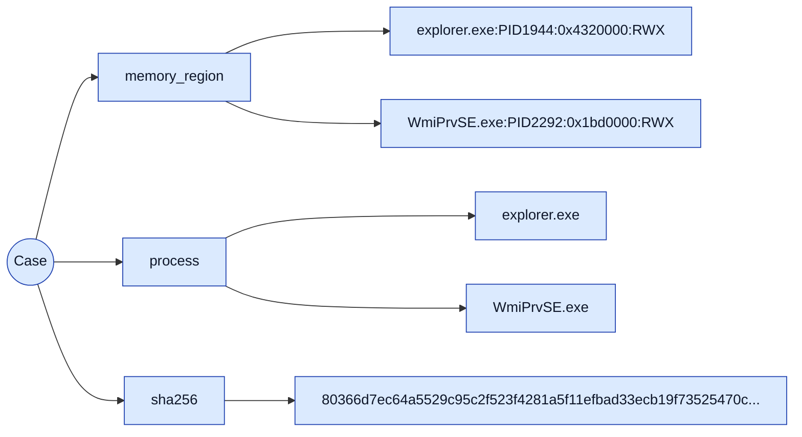
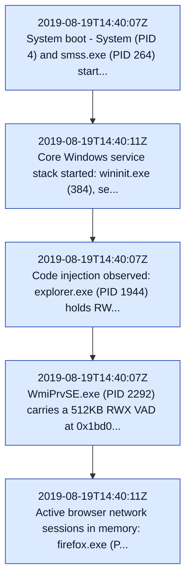

# Analyst / Technical Report — CHALLENGE-NOTCHITUP

> **Likelihood scale (FIRST 5-tier):** almost_certain > highly_likely > likely > unlikely > remote. Likelihood estimates the probability of the assessed activity; it is kept separate from analytic confidence.
>
> **Confidence (LCA):** high / moderate / low — the analyst's confidence in the assessment given evidence quality and corroboration. Distinct from likelihood.

## Findings

### PAGE_EXECUTE_READWRITE injected region in explorer.exe (PID 1944)
- **Finding ID:** `F-NOTCH-001`  ·  **Severity:** high  ·  **Likelihood:** unlikely  ·  **Confidence:** high  ·  **Risk score:** 8
- **MITRE ATT&CK:** `T1055`

malfind flagged a 64KB PAGE_EXECUTE_READWRITE VAD at 0x4320000 in explorer.exe (PID 1944) carrying executable indirect-jump shellcode bytes (41 ba 80 00 00 00 48 b8 ... 48 ff 20). Classic code-injection signature.

_Evidence:_ `windows.malfind: PID 1944 explorer.exe VAD 0x4320000 PAGE_EXECUTE_READWRITE 65536B (executable bytes 41 ba 80 00 00 00 48 b8 ...)` `carved region payload_sha256 65196e1a65d8e4bfcf42f03b7db79cd07a2573f57c6aad40a97c37791726ca6f` `source_evidence_sha256 80366d7ec64a5529c95c2f523f4281a5f11efbad33ecb19f73525470c1407b23`

### PAGE_EXECUTE_READWRITE zeroed RWX region in explorer.exe (PID 1944)
- **Finding ID:** `F-NOTCH-002`  ·  **Severity:** medium  ·  **Likelihood:** unlikely  ·  **Confidence:** moderate  ·  **Risk score:** 6
- **MITRE ATT&CK:** `T1055`

malfind flagged a second 4KB PAGE_EXECUTE_READWRITE VAD at 0x3ce0000 in explorer.exe (PID 1944), zeroed - a second RWX VAD in the same injected host process.

_Evidence:_ `windows.malfind: PID 1944 explorer.exe VAD 0x3ce0000 PAGE_EXECUTE_READWRITE 4096B (zeroed)` `carved region payload_sha256 3da12179ac97a8fdcfbdfc5318ba0da46974e1c1ae648dc37e861a926e8563ca` `source_evidence_sha256 80366d7ec64a5529c95c2f523f4281a5f11efbad33ecb19f73525470c1407b23`

### PAGE_EXECUTE_READWRITE RWX region in chrome.exe (PID 2124)
- **Finding ID:** `F-NOTCH-003`  ·  **Severity:** medium  ·  **Likelihood:** unlikely  ·  **Confidence:** moderate  ·  **Risk score:** 6
- **MITRE ATT&CK:** `T1055`

malfind flagged a 4KB PAGE_EXECUTE_READWRITE VAD at 0x4830000 in chrome.exe (PID 2124), zeroed.

_Evidence:_ `windows.malfind: PID 2124 chrome.exe VAD 0x4830000 PAGE_EXECUTE_READWRITE 4096B (zeroed)` `carved region payload_sha256 3243bcc13c7c564288355046c5bc1123888837aeb8ada9ed5cf7800d9c462c1d` `source_evidence_sha256 80366d7ec64a5529c95c2f523f4281a5f11efbad33ecb19f73525470c1407b23`

### Large PAGE_EXECUTE_READWRITE region in WmiPrvSE.exe (PID 2292)
- **Finding ID:** `F-NOTCH-004`  ·  **Severity:** high  ·  **Likelihood:** unlikely  ·  **Confidence:** high  ·  **Risk score:** 8
- **MITRE ATT&CK:** `T1047`, `T1055`

malfind flagged a 512KB PAGE_EXECUTE_READWRITE VAD at 0x1bd0000 in WmiPrvSE.exe (PID 2292) - WMI provider host carrying a large RWX region.

_Evidence:_ `windows.malfind: PID 2292 WmiPrvSE.exe VAD 0x1bd0000 PAGE_EXECUTE_READWRITE 524288B (512KB)` `carved region payload_sha256 75b4c5d8fc85525f97106ddf84197731942bb9acb2d992de50b8a4b7bcfad9a2` `source_evidence_sha256 80366d7ec64a5529c95c2f523f4281a5f11efbad33ecb19f73525470c1407b23`

### Evidence image registered (chain-of-custody hash)
- **Finding ID:** `F-NOTCH-005`  ·  **Severity:** info  ·  **Likelihood:** unlikely  ·  **Confidence:** high  ·  **Risk score:** 0

evidence_register computed the chain-of-custody SHA-256 for the 1.6GB raw memory image.

_Evidence:_ `evidence_register: /cases/Challenge_NotchItUp/Challenge.raw sha256 80366d7ec64a5529c95c2f523f4281a5f11efbad33ecb19f73525470c1407b23 size 1610547200 bytes` `source_evidence_sha256 80366d7ec64a5529c95c2f523f4281a5f11efbad33ecb19f73525470c1407b23`

## Indicators of Compromise

| Value | Type | Confidence | MITRE | Provenance |
| --- | --- | --- | --- | --- |
| `explorer.exe:PID1944:0x4320000:RWX` | memory_region | — | T1055 | — |
| `WmiPrvSE.exe:PID2292:0x1bd0000:RWX` | memory_region | — | T1047, T1055 | — |
| `explorer.exe` | process | — | T1055 | — |
| `WmiPrvSE.exe` | process | — | T1047, T1055 | — |
| `80366d7ec64a5529c95c2f523f4281a5f11efbad33ecb19f73525470c1407b23` | sha256 | — | — | — |

## Timeline

| Timestamp | Host | Event | Phase | Description |
| --- | --- | --- | --- | --- |
| 2019-08-19T14:40:07Z | notch-it-up | TL-NOTCH-001 | — | System boot - System (PID 4) and smss.exe (PID 264) started; Windows x64 kernel symbols matched by Volatility3 (53 processes) |
| 2019-08-19T14:40:11Z | notch-it-up | TL-NOTCH-002 | — | Core Windows service stack started: wininit.exe (384), services.exe (480), lsass.exe (496), svchost.exe (608), VBoxService.exe (668) - VirtualBox guest |
| 2019-08-19T14:40:07Z | notch-it-up | TL-NOTCH-003 | — | Code injection observed: explorer.exe (PID 1944) holds RWX VAD at 0x4320000 with 64KB executable shellcode (41 ba ... 48 b8 ...) and a zeroed RWX VAD at 0x3ce0000 |
| 2019-08-19T14:40:07Z | notch-it-up | TL-NOTCH-004 | — | WmiPrvSE.exe (PID 2292) carries a 512KB RWX VAD at 0x1bd0000; chrome.exe (PID 2124) holds a 4KB RWX VAD at 0x4830000 |
| 2019-08-19T14:40:11Z | notch-it-up | TL-NOTCH-005 | — | Active browser network sessions in memory: firefox.exe (PID 2080) ESTABLISHED to Google ranges (172.217.160.131:80, 172.217.194.189:443) from guest 10.0.2.15; chrome.exe (PID 2124) UDP 5353 mDNS |
