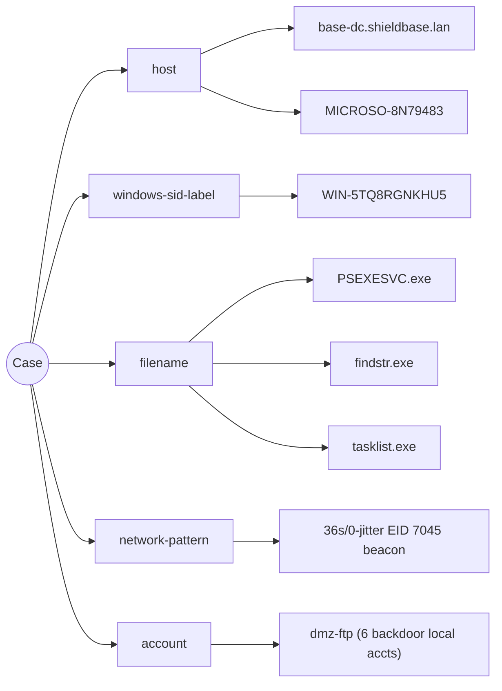
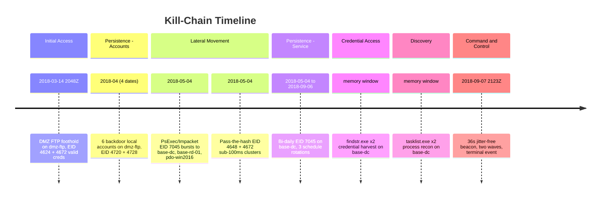

<!--
  agentropix-sift • Multi-Tier Report Engine (ADR-024) • TIER 1 — ANALYST / TECHNICAL
  TEMPLATE MOCKUP (templates-first gate). Sample data: SRL-2018 DFIR corpus.
  STRUCTURALLY ALIGNED to the live emitter: render_analyst_markdown(AnalystView)
  in src/agentropix_sift/reports/markdown.py — H1, legend blockquote, then
  ## Findings / ## Indicators of Compromise / ## Timeline, in that order. The only
  fields the engine renders per finding are reproduced verbatim here; deeper prose
  rides inside each finding's `technical_body` (a free-text block the emitter passes
  through unchanged). Likelihood values use the FIRST-5 Literal the view model
  enforces (almost_certain | highly_likely | likely | unlikely | remote); confidence
  uses the LCA Literal (high | moderate | low). NOT live output.
-->

# Analyst / Technical Report — SRL-2018

> **Likelihood scale (FIRST 5-tier):** almost_certain > highly_likely > likely > unlikely > remote. Likelihood estimates the probability of the assessed activity; it is kept separate from analytic confidence.
>
> **Confidence (LCA):** high / moderate / low — the analyst's confidence in the assessment given evidence quality and corroboration. Distinct from likelihood.

## Findings

### Domain controller fully compromised — bi-daily service persistence + terminal C2 (base-dc)
- **Finding ID:** `F-01`  ·  **Severity:** critical  ·  **Likelihood:** highly_likely  ·  **Confidence:** high  ·  **Risk score:** 16
- **Kill-chain phase:** Persistence / Privilege Escalation
- **MITRE ATT&CK:** `T1543.003`, `T1053.005`, `T1071`

`base-dc.shieldbase.lan` (SID label `WIN-5TQ8RGNKHU5`) carries the full attack stack: bi-daily `EID 7045` service-install events from 2018-05-04 through 2018-09-06 (≈4 months), across **3 distinct scheduled-task rotations**, terminating in the 36-second jitter-free C2 beacon on 2018-09-07. The bi-daily cadence is mechanically regular — service re-registration at a fixed wall-clock offset, inconsistent with operator-driven administration and consistent with an implant re-asserting persistence. Memory carving of the DC image set recovered 12 orphaned `cmd.exe` (DKOM-unlinked from the active `EPROCESS` list, recovered by pool-tag scan) parented to `PSEXESVC.exe`, plus `findstr.exe`×2 and `tasklist.exe`×2 — the hands-on-keyboard footprint co-resident with the persistence mechanism. Because every durable foothold, the credential-access tooling, and the live beacon all land on the DC, the `krbtgt` secret and the entire domain trust must be assumed attacker-controlled until rotated.

_Business impact:_ Catastrophic — control of the DC is control of every domain identity; trust in all credentials is void until a krbtgt double-reset completes.

_Evidence:_ `9f2c1a7be4d0…` (evtx-wrapper) ` ` `a1d4e88c2f6b…` (memory-forensics)

### Pass-the-hash domain traversal across the DMZ→internal boundary
- **Finding ID:** `F-02`  ·  **Severity:** critical  ·  **Likelihood:** highly_likely  ·  **Confidence:** high  ·  **Risk score:** 16
- **Kill-chain phase:** Lateral Movement / Credential Access
- **MITRE ATT&CK:** `T1550.002`, `T1021.002`

Sub-100ms-spaced `EID 4648` (explicit-credential logon) + `EID 4672` (special-privileges assigned) clusters originate from `MICROSO-8N79483` and `base-ftp`. The inter-event spacing is automation-grade: a human at an interactive console cannot emit a 4648→4672 pair in under 100ms repeatedly, so this is scripted credential replay (Impacket / PsExec class). The replayed material drove `EID 7045` PsExec/Impacket **service-install bursts** into `base-dc`, `base-rd-01` (`WIN-J3EPDF256PR`), and `pdo-win2016` on 2018-05-04 — the moment the actor pivoted from the DMZ foothold into the internal zone. The DMZ→internal hop is the architectural enabler: a single perimeter credential reached the domain crown jewels because explicit-credential auth was permitted to cross the boundary.

_Business impact:_ Catastrophic for identity — any credential the actor replayed is a standing re-entry key; the flat DMZ→internal trust converts one FTP foothold into domain compromise.

_Evidence:_ `7c0b39f1ea52…` (evtx-wrapper) ` ` `9f2c1a7be4d0…` (evtx-wrapper)

### Active C2 channel live at the edge of collection (36s jitter-free beacon)
- **Finding ID:** `F-03`  ·  **Severity:** critical  ·  **Likelihood:** highly_likely  ·  **Confidence:** moderate  ·  **Risk score:** 16
- **Kill-chain phase:** Command & Control
- **MITRE ATT&CK:** `T1071`, `T1070.001`

On 2018-09-07 the DC emitted a beacon carried by repeated `EID 7045` service re-registration at a **36-second fixed interval with 0% jitter**, in two waves, last event **21:23:15Z** — the terminal observed activity in the corpus. A 36s/0-jitter cadence is a commodity-implant default profile (Cobalt Strike / Meterpreter-class) and is mutually exclusive with benign service behaviour. The two-wave structure reads as an initial check-in followed by a tasking/re-key wave. The adversary was therefore **present and live** at the moment collection ended — not historical. Confidence is held at `moderate` (not `high`) on one axis only: the C2 endpoint was unreachable for active callback confirmation, so classification is signature/behaviour-based. The *likelihood* of the beacon being real C2 remains `highly_likely` — the two axes are decoupled exactly as the legend requires.

_Business impact:_ High — an active, capable operator held a live channel out of the network; assume intent to exfiltrate or extort.

_Evidence:_ `c41e7a9d0b83…` (evtx-wrapper)

### Six persistent backdoor local accounts on dmz-ftp
- **Finding ID:** `F-04`  ·  **Severity:** high  ·  **Likelihood:** highly_likely  ·  **Confidence:** high  ·  **Risk score:** 12
- **Kill-chain phase:** Persistence
- **MITRE ATT&CK:** `T1136.001`

Six **local** accounts were created on `dmz-ftp` (rename chain `windows2012r2 → base-ftp → dmz-ftp`; correlate by SID, not hostname) across **4 distinct dates** in April 2018, each `EID 4720` (account create) paired with `EID 4728` (security-group add) — several escalated into privileged groups. Spreading creation across four dates is deliberate low-and-slow tradecraft to avoid a single burst-detection signature. These are independent re-entry points: they survive a single domain credential reset and remain usable until explicitly removed, so account removal is gated *before* any all-clear.

_Business impact:_ High — standing re-entry vector that outlives credential resets; must be removed before eradication can be declared complete.

_Evidence:_ `b83f5c2a17de…` (evtx-wrapper)

### Scheduled-task / service persistence on the DC (3 rotations)
- **Finding ID:** `F-05`  ·  **Severity:** high  ·  **Likelihood:** highly_likely  ·  **Confidence:** high  ·  **Risk score:** 12
- **Kill-chain phase:** Persistence / Privilege Escalation
- **MITRE ATT&CK:** `T1053.005`, `T1543.003`

The bi-daily `EID 7045` cadence on `base-dc` resolves to **3 schedule rotations** across the 2018-05-04 → 2018-09-06 window — the actor changed the task definition three times to evade static signatures while keeping a durable, beacon-independent re-entry mechanism. This is distinct from F-01 (which scopes whole-DC compromise): F-05 isolates the specific persistence *artifacts* that the hunt must enumerate and remove. Presence on hosts beyond `base-dc` is plausible but not yet enumerated, which is why the recommended hunt is fleet-wide rather than DC-only.

_Business impact:_ High — durable re-entry independent of the C2 beacon; killing the beacon alone does not evict the actor.

_Evidence:_ `9f2c1a7be4d0…` (evtx-wrapper)

### Credential harvesting in DC memory (findstr against credential stores)
- **Finding ID:** `F-06`  ·  **Severity:** high  ·  **Likelihood:** likely  ·  **Confidence:** moderate  ·  **Risk score:** 9
- **Kill-chain phase:** Credential Access
- **MITRE ATT&CK:** `T1552.001`

Memory carving recovered `findstr.exe`×2 on `base-dc`, parented to the orphaned `cmd.exe` shells — the signature of searching files/registry exports for stored secrets (`T1552.001`, Unsecured Credentials: Credentials In Files). Likelihood is `likely` rather than `highly_likely` because the *target* of the findstr invocations was not captured (command line absent — see F-09); confidence is `moderate` for the same reason. The harvested material plausibly feeds the PtH activity in F-02.

_Business impact:_ High — any secret recovered from the DC is a re-entry key; reinforces the assume-all-credentials-exposed posture.

_Evidence:_ `a1d4e88c2f6b…` (memory-forensics)

### Host / process reconnaissance on the DC (tasklist)
- **Finding ID:** `F-07`  ·  **Severity:** medium  ·  **Likelihood:** likely  ·  **Confidence:** moderate  ·  **Risk score:** 6
- **Kill-chain phase:** Discovery
- **MITRE ATT&CK:** `T1057`

`tasklist.exe`×2 in `base-dc` memory, parented to the lateral `cmd.exe` shells — situational-awareness enumeration of running processes (`T1057`, Process Discovery), typically a precursor to choosing injection targets or spotting defensive tooling. Corroborates the hands-on-keyboard interpretation of the memory artifacts.

_Business impact:_ Medium — indicates deliberate target selection on the DC, raising the credibility of follow-on actions.

_Evidence:_ `a1d4e88c2f6b…` (memory-forensics)

### Defense evasion — event-log manipulation alongside DKOM unlinking
- **Finding ID:** `F-08`  ·  **Severity:** medium  ·  **Likelihood:** likely  ·  **Confidence:** moderate  ·  **Risk score:** 6
- **Kill-chain phase:** Defense Evasion
- **MITRE ATT&CK:** `T1070.001`

Indicator-removal behaviour (`T1070.001`, Clear Windows Event Logs) co-occurs with the 12 DKOM-unlinked `cmd.exe` in DC memory: the actor both cleared/manipulated Security log context and hid live processes from the kernel object list. The net effect is timeline incompleteness — surviving events (`EID 4720`/`4728`/`7045`) anchor the persistence story, but command-line context for the shells did not survive, which is why several downstream findings are capped at `moderate` confidence.

_Business impact:_ Medium — degrades timeline completeness and inflates analytic uncertainty across the case.

_Evidence:_ `c41e7a9d0b83…` (evtx-wrapper) ` ` `a1d4e88c2f6b…` (memory-forensics)

### Detection / audit-visibility gap — no EID 4688 command-line auditing
- **Finding ID:** `F-09`  ·  **Severity:** medium  ·  **Likelihood:** likely  ·  **Confidence:** moderate  ·  **Risk score:** 6
- **Kill-chain phase:** Defense Evasion (control gap)
- **MITRE ATT&CK:** `T1070.001`, `T1057`

No `EID 4688` (process-creation with command line) auditing was enabled across the estate, so PsExec/Impacket invocations and shell command lines ran unrecorded. Combined with the cleared/manipulated Security logs (F-08), this control-coverage gap is the proximate reason the ~143-day dwell and ~5.5-week initial dormancy went undetected. This is an *absence-of-telemetry* finding — corroborated by the recon artifacts (F-07) and the defense-evasion behaviour (F-08), not by a positive control test — hence `moderate` confidence.

_Business impact:_ Medium — slow detection multiplies every other finding's blast radius; the single highest-leverage detective control to add is command-line auditing with off-host, tamper-evident retention.

_Evidence:_ —

## Indicators of Compromise

| Value | Type | Confidence | MITRE | Provenance |
| --- | --- | --- | --- | --- |
| `base-dc.shieldbase.lan` | host | high | T1543.003, T1071 | `9f2c1a7be4d0…` |
| `WIN-5TQ8RGNKHU5` | windows-sid-label | high | T1543.003 | `9f2c1a7be4d0…` |
| `PSEXESVC.exe` | filename | high | T1021.002 | `a1d4e88c2f6b…` |
| `36s/0-jitter EID 7045 beacon` | network-pattern | moderate | T1071 | `c41e7a9d0b83…` |
| `MICROSO-8N79483` | host | high | T1550.002 | `7c0b39f1ea52…` |
| `dmz-ftp (6 backdoor local accts)` | account | high | T1136.001 | `b83f5c2a17de…` |
| `findstr.exe` | filename | moderate | T1552.001 | `a1d4e88c2f6b…` |
| `tasklist.exe` | filename | moderate | T1057 | `a1d4e88c2f6b…` |

## Timeline

<!--
  GITLAB/MERMAID-SAFE TIMELINE: Mermaid `timeline` uses ` : ` to split period from
  event, so a COLON inside the period token (e.g. "20:48Z", "21:23:15Z") is a parse
  error. Wall-clock timestamps are therefore rendered colon-free here ("2048Z");
  the precise colon-bearing timestamps are preserved in the Timeline TABLE below,
  which is plain Markdown and unaffected. This is a real emitter fidelity gap:
  diagrams.kill_chain_timeline -> sanitize_label() does NOT strip colons, so a live
  export whose TimelineRow.timestamp carries colons emits an unrenderable block.
-->

| Timestamp | Host | Event | Phase | Description |
| --- | --- | --- | --- | --- |
| 2018-03-14 20:48:00Z | dmz-ftp | 4624 | Initial Access | Valid-cred logon to DMZ FTP host (T1190); ~5.5wk dormancy follows |
| 2018-04 (4 dates) | dmz-ftp | 4720 | Persistence | 6 backdoor local accounts created (paired EID 4728 group-add) |
| 2018-05-04 | base-dc | 7045 | Lateral Movement | PsExec/Impacket service install (T1021.002) |
| 2018-05-04 | base-rd-01 | 7045 | Lateral Movement | PsExec/Impacket service install (T1021.002) |
| 2018-05-04 | pdo-win2016 | 7045 | Lateral Movement | PsExec/Impacket service install (T1021.002) |
| 2018-05-04 | MICROSO-8N79483 | 4648 | Credential Access | Sub-100ms 4648+4672 pass-the-hash cluster (T1550.002) |
| 2018-05-04 → 2018-09-06 | base-dc | 7045 | Persistence | Bi-daily service install, 3 schedule rotations (T1053.005/T1543.003) |
| memory window | base-dc | — | Credential Access | findstr.exe x2 credential harvest (T1552.001) |
| memory window | base-dc | — | Discovery | tasklist.exe x2 process recon (T1057) |
| 2018-09-07 21:23:15Z | base-dc | 7045 | Command & Control | 36s jitter-free beacon, two waves, terminal event (T1071) |

<!--
  NO-DRIFT CONTRACT (ADR-024): every finding above carries an explicit <a id="…">
  anchor. The Executive tier's "Critical & High Findings" bullets and the Business
  tier's Risk Register rows both back-link to these anchors, so a higher-tier claim
  always resolves to an APPROVED analyst finding. Anchors emitted here:
    #dc-persistence #pass-the-hash #c2-beacon #backdoor-accounts
    #sched-task-persistence #cred-harvest #process-recon #defense-evasion #audit-gap
  FIDELITY NOTE: the analyst IOC table has no per-row Likelihood column — IOCRow
  (view_models.py) carries confidence but not likelihood. Likelihood lives on
  Findings only. SHA-256 prefixes shown as 12-hex + ellipsis are render-time
  bindings from the sealed canonical JSON; the real export substitutes the live digest.
-->
