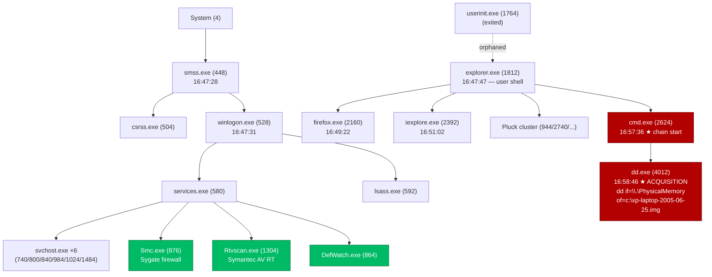

# Execution-Chain Storyboard — Windows XP SP2 Laptop Memory

**Training artifact · Case `WINXP-LAPTOP-2005`**

| Field | Value |
|---|---|
| Image | `win-xp-laptop-2005-06-25.img` (raw physical memory, ~512 MB) |
| SHA-256 | `c4aeeb1b461378eef796944884d1d60adaa99cbae4d035923c144b08deee1e6e` |
| OS | Windows XP SP2 x86 |
| Acquired | 2005-06-25 (all event times UTC) |
| Examiner | victor.galvan |
| Volatility | 3 Framework 2.28.0 · `pslist`, `cmdline`, `pstree` |
| Verdict | **Clean baseline** — `suspicious_count=0`, no injection/LOLBin. Training value = recognizing normal boot→user→acquisition flow. |

> **Why this image is a teaching gem:** the memory was acquired with `dd` reading `\\.\PhysicalMemory`, and `dd.exe` was *still running* at capture time — so the acquisition tool is recorded inside its own dump. Students learn to spot the acquisition footprint and reason about the "observer effect" in live memory forensics.

---

## Learning objectives

1. Reconstruct a process-execution chain from RAM using PPID + process create-times.
2. Distinguish a **benign orphan** (parent legitimately exited) from a DKOM-hidden process.
3. Establish a **host baseline** (AV + firewall stack) before hunting for anomalies.
4. Identify the **memory-acquisition footprint** (`cmd → dd → \\.\PhysicalMemory`).

---

## The execution chain (visual — drop straight into the video)



---

## Scene-by-scene storyboard

Each scene = one segment of the training video. **On-screen** = what to show (terminal/diagram). **Narration** = voiceover.

### Scene 1 — Boot chain (Phase 1, 16:47:28–16:47:31)
- **On-screen:** `vol pslist` top rows; highlight System → smss → csrss/winlogon.
- **Narration:** "Every Windows analysis starts at the root. `System` (PID 4) spawns `smss.exe`, the Session Manager, which brings up `csrss` and `winlogon`. `winlogon` then launches `services.exe` and `lsass.exe` — the service control manager and the security subsystem. These PIDs and their order are your sanity check: anything claiming to be `lsass` with the wrong parent is a red flag."

### Scene 2 — Service & security baseline (Phase 2, 16:47:33–16:47:58)
- **On-screen:** highlight the six `svchost.exe`, then `Smc.exe`, `Rtvscan.exe`, `DefWatch.exe`.
- **Narration:** "`services.exe` fans out into six `svchost` host processes plus the host's security stack: Sygate Personal Firewall (`Smc.exe`) and Symantec AntiVirus (`Rtvscan`, `DefWatch`, `VPTray`). Record this — it's your baseline. When you later hunt for injected code, knowing what *should* be running is what makes the anomaly jump out."

### Scene 3 — Interactive shell & the benign orphan (Phase 3, 16:47:47)
- **On-screen:** `explorer.exe` (1812) with PPID 1764 not present in pslist.
- **Narration:** "`explorer.exe` is the user's shell. Its parent, `userinit.exe` (1764), is gone — `userinit` always exits right after launching the desktop. So `explorer` shows up as an *orphan*, but a completely benign one. This is the key lesson: an orphan is not automatically evil. Tooling flagged three orphans here — explorer, a Logitech tray app, and a Citrix helper — and all three are legitimate parents-have-exited cases."

### Scene 4 — User activity (Phase 4, 16:49:22–16:51:02)
- **On-screen:** `firefox.exe` and `iexplore.exe` both childed to explorer.
- **Narration:** "The user was active: Firefox at 16:49, Internet Explorer at 16:51, plus the Pluck RSS reader. Both browsers parent cleanly to `explorer` — normal interactive launches. The bulk_extractor carve of this image (URLs, email, domains) corroborates the browsing session."

### Scene 5 — The acquisition footprint (Phase 5, 16:57:36–16:58:46) ★
- **On-screen:** `cmd.exe` (2624) → `dd.exe` (4012); blow up the command line.
- **Narration:** "Here's the payoff. At 16:57:36 a console opens from the shell. Seventy seconds later it launches `dd.exe`, running `dd if=\\.\PhysicalMemory of=c:\xp-laptop-2005-06-25.img conv=noerror`. That's the memory acquisition itself — `dd` reading the raw physical-memory device and writing the very file we're analyzing. The acquisition tool is frozen inside its own snapshot. When you see `dd`, `winpmem`, `FTK Imager`, or similar reading `\\.\PhysicalMemory`, you're looking at the capture event — orient your timeline around it."

---

## Ordered timeline (table form)

| # | Time (UTC) | Phase | Process (PID) | Parent (PID) | Command |
|---|---|---|---|---|---|
| 1 | 16:47:28 | boot | smss.exe (448) | System (4) | `\SystemRoot\System32\smss.exe` |
| 2 | 16:47:31 | boot | winlogon→services(580)+lsass(592) | smss (448) | — |
| 3 | 16:47:33 | services | Smc.exe (876) | services (580) | `"...\Sygate\SPF\smc.exe"` |
| 4 | 16:47:47 | shell | explorer.exe (1812) | userinit (1764, exited) | `C:\WINDOWS\Explorer.EXE` |
| 5 | 16:47:58 | services | Rtvscan.exe (1304) | services (580) | `...\SYMANTEC\Rtvscan.exe` |
| 6 | 16:49:22 | user | firefox.exe (2160) | explorer (1812) | `"...\Mozilla Firefox\firefox.exe"` |
| 7 | 16:51:02 | user | iexplore.exe (2392) | explorer (1812) | `"...\Internet Explorer\iexplore.exe"` |
| 8 | 16:57:36 | acquisition | cmd.exe (2624) | explorer (1812) | `"C:\WINDOWS\system32\cmd.exe"` |
| 9 | 16:58:46 | acquisition | **dd.exe (4012)** | cmd (2624) | `dd if=\\.\PhysicalMemory of=c:\xp-laptop-2005-06-25.img conv=noerror` |

*(These 9 events are staged in the case timeline index as `exec-chain-01..09`.)*

---

## Reproduce it (commands for the demo)

```bash
# Profile / processes
vol -f win-xp-laptop-2005-06-25.img windows.pslist
vol -f win-xp-laptop-2005-06-25.img windows.pstree
vol -f win-xp-laptop-2005-06-25.img windows.cmdline   # <- reveals the dd command line
```

**Caveat for instructors:** `windows.netscan` does **not** work on XP SP2 under Volatility 3 (it targets Vista+). For network artifacts on this image use the bulk_extractor carve (`_carved/.../be_output/` — `url.txt`, `domain.txt`, `email.txt`) instead of live socket enumeration.

---

## Case artifacts produced
- **Evidence** registered (chain of custody): `agentropix-evidence-2026.06.13`
- **Timeline** events `exec-chain-01..09`: `agentropix-timeline-2026.06.13`
- **Finding** `winxp-laptop-exec-chain-acquisition` (DRAFT): `agentropix-findings-2026.06.13`

> To render these into the **official canonical case report** (`report_export`), an authorized approver must run `approve_finding` (and approve the timeline events) with their credentials — that human gate is intentional and was not bypassed. This storyboard is the standalone, approval-independent training deliverable.
