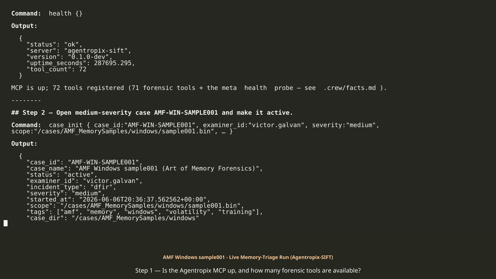

# AMF Windows sample001 — executed activation run (memory triage of a 511 MiB XP-era raw RAM dump)

> **Provenance.** This folder is the captured record of a **real live-MCP execution** of the
> [amf-memory-samples.md](../../amf-memory-samples.md) activation guide, run on **2026-06-06**
> (step timestamps span `20:36:37Z` → `23:17:52Z`) against the evidence image
> `/cases/AMF_MemorySamples/windows/sample001.bin` (case `AMF-WIN-SAMPLE001`, examiner
> `victor.galvan`). Every output was captured from the Agentropix-SIFT MCP server — nothing is mocked.
> The approval step is **SIMULATED examiner approval (demo only)**: the recorded run auto-approves
> (Playwright fills the portal form) purely to show the DRAFT → APPROVED → sealed-report loop end to
> end. In real casework that approval is a human HMAC hard-stop that the LLM cannot perform.

## What's in this folder

| File | What it is | What it shows |
|---|---|---|
| [EXECUTED-RUN.md](EXECUTED-RUN.md) | The narrative transcript (Steps 1–11) | Every command + real output, the GOTCHAs, the SIMULATED approval, and the final sealed report (`approved_finding_count: 1`) |
| [EXECUTED-RUN.mp4](EXECUTED-RUN.mp4) | Rendered video of the transcript | The same run as a watchable walkthrough |
| [approval-portal.png](approval-portal.png) | Screenshot of the Examiner Portal | The DRAFT → APPROVED form for finding `F-AMF-S001-001` at the moment of (simulated) sign-off |
| [step1_health.json](step1_health.json) | Raw MCP capture — `health` | Server up, `tool_count: 72` |
| [step2-5.json](step2-5.json) | Raw captures — `case_init`, `case_status`, `evidence_register`, `get_image_info` | Case activation, evidence SHA-256, and the honest empty `ewfinfo` result on a raw image |
| [step6.json](step6.json) | Raw captures — `get_pslist`, `get_netscan`, `get_malfind`, `get_svcscan`, `build_process_tree` | 21 processes, 0 sockets, 229 services, clean process tree — and the malfind first-pass **timeout** |
| [step6_malfind_300s.json](step6_malfind_300s.json) | Raw capture — `get_malfind` re-run with a 300 s timeout | The full 15-hit RWX result (completed in 75 s) |
| [step7-10.json](step7-10.json) | Raw captures — `run_volatility cmdline`, `record_finding` (dry-run), `report_generate` (pre-approval) | 21 command lines, the validated-but-not-persisted finding, and the honest `case_not_found` report at the DRAFT-only stage |
| [reports/comprehensive.md](reports/comprehensive.md) / [.pdf](reports/comprehensive.pdf) | Multi-tier report artifact (full) | The comprehensive forensic report grounded in the sealed `report_generate` output + these captures |
| [reports/executive-onepager.md](reports/executive-onepager.md) / [.pdf](reports/executive-onepager.pdf) | Multi-tier report artifact (executive) | The one-page executive summary of the same sealed data |
| [reports/README.md](reports/README.md) | Index of the report artifacts | File-by-file guide to the multi-tier reports above |

The raw captures for Steps 9–11 (persisted finding `F-AMF-S001-001`, the approval record, the sealed
report `3c5261e7…`) are reproduced verbatim inside [EXECUTED-RUN.md](EXECUTED-RUN.md).

## Inside the files (excerpts)

From [step2-5.json](step2-5.json) — `evidence_register` establishes chain of custody:

```json
"sha256":"03242077eb3364fb248d1c7730fd0a94074583df8deb2606d6c93c31316d561c","size_bytes":536330240,…"indexed_to":"agentropix-evidence-2026.06.06","indexed":true
```

The evidence hash and size (536,330,240 bytes ≈ 511 MiB) are computed and indexed before any analysis — this is the authoritative size, since `get_image_info` (`ewfinfo`) returned empty fields on a raw `.bin`.

From [step6.json](step6.json) — the first `get_malfind` pass, recorded honestly as a failure:

```json
{"tool": "get_malfind", "args": {"image": "/cases/AMF_MemorySamples/windows/sample001.bin"}, "ok": false, "error": "MCP error -32001: Request timed out"}
```

The heaviest scanner exceeded the SDK's default 180 s request bound. The capture keeps the timeout instead of hiding it; the re-run lives in the next file.

From [step6_malfind_300s.json](step6_malfind_300s.json) — one of the 15 RWX hits (winlogon.exe ×10, lsass.exe ×2, csrss.exe, msmsgs.exe, msimn.exe):

```json
{"pid":628,"process":"winlogon.exe","address":"0x42e20000","vad_tag":"VadS","protection":"PAGE_EXECUTE_READWRITE",…"payload_sha256":"23bcb431c54794dbeac60ef74b79a261c96083440189fc0b6cc3d43041fc4f0f","payload_bytes":16384,…}
```

A private executable-writable VAD in `winlogon.exe`, carved and SHA-256-hashed. These RWX regions are the injected/unpacked-code signature `malfind` exists to surface, and this cluster became finding `F-AMF-S001-001` (MITRE T1055).

From [step7-10.json](step7-10.json) — two command lines recovered by `windows.cmdline.CmdLine` that tell the image's own story:

```json
{"Args":"wc.exe -e -o h.out","PID":364,"Process":"wc.exe",…},…{"Args":"mdd.exe -o callb-memdump.bin","PID":244,"Process":"mdd.exe",…}
```

`mdd.exe` is the ManTech memory-acquisition tool — the capture caught the acquisition of the dump itself in flight, a useful authenticity cross-check for a training image.

From [step7-10.json](step7-10.json) — `report_generate` at the DRAFT-only stage:

```json
"report_id":"","snapshot_at":"2026-06-06T20:38:55.967161+00:00","approved_finding_count":0,…"error":"case_not_found: no documents for case_id 'AMF-WIN-SAMPLE001'"
```

By design, no report materializes before an approval exists. The contrast with the final sealed report in [EXECUTED-RUN.md](EXECUTED-RUN.md) Step 11 (`approved_finding_count: 1`, `report_id: 3c5261e7…`) is the whole human-in-the-loop point.

## Honest notes

- **`get_netscan` returned 0 sockets** (`"socket_count": 0`) — no live network endpoints were recoverable from this XP-era image. Recorded as an honest empty result, not an error.
- **`get_image_info` returned empty metadata** (`"raw_output": "ewfinfo 20140816\n\n"`) — `ewfinfo` is an EnCase/E01 inspector and has nothing to parse on a raw `.bin`. A real-data quirk, not a bug; the size came from `evidence_register`.
- **The first `malfind` pass timed out** at the 180 s SDK default ([step6.json](step6.json)); the standalone re-run with a 300 s `callTool` timeout completed in 75 s ([step6_malfind_300s.json](step6_malfind_300s.json)).
- **The pre-approval `report_generate` returned `case_not_found`** with `approved_finding_count: 0` — intended behavior, not a failure.
- **The Step 10 approval is SIMULATED** (Playwright automation, labelled as such in the transcript). Treat the approval record `4a881577…` as automated, not human-attested.

## 🎬 The recorded session

[](https://galvangabriel-web.github.io/agentropix-mcp/case-activation/runs/amf-win-sample001/EXECUTED-RUN.mp4)

> ▶ *GitHub's repo pages can't play committed MP4s — the poster links to the **GitHub Pages copy, which plays directly in your browser**; or*
> ***[download the MP4 (29 MB, 68 s)](https://raw.githubusercontent.com/galvangabriel-web/agentropix-mcp/main/case-activation/runs/amf-win-sample001/EXECUTED-RUN.mp4)*** *— the full activation sequence captured live and rendered to video.*

## 🎙️ The narration kit (for the voiced demo cut)

- [`EXECUTED-RUN-ANNOTATED.mp4`](https://galvangabriel-web.github.io/agentropix-mcp/case-activation/runs/amf-win-sample001/EXECUTED-RUN-ANNOTATED.mp4) — a copy of the run video
  (original untouched) with **red highlight boxes** timed to the key moments: the 72-tool health
  check, the evidence SHA-256, the honest 0-sockets negative, the 15-RWX malfind block, the
  dry-run safeguard, the SIMULATED-approval disclosure, and the HMAC seal.
- [`NARRATION-SCRIPT.md`](NARRATION-SCRIPT.md) — the timestamped script: what's boxed on screen at
  each second and the line to speak over it, plus the one-command mux to add the recorded voice.
  Together these are the working materials for the ⚠ pending narrated submission video.
