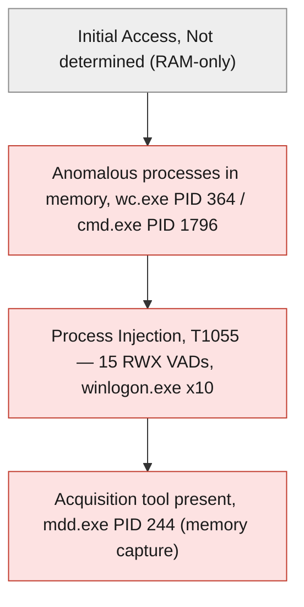
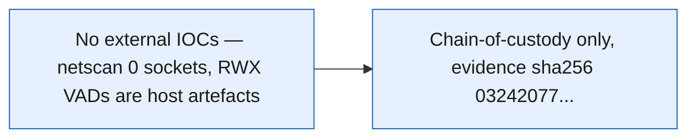
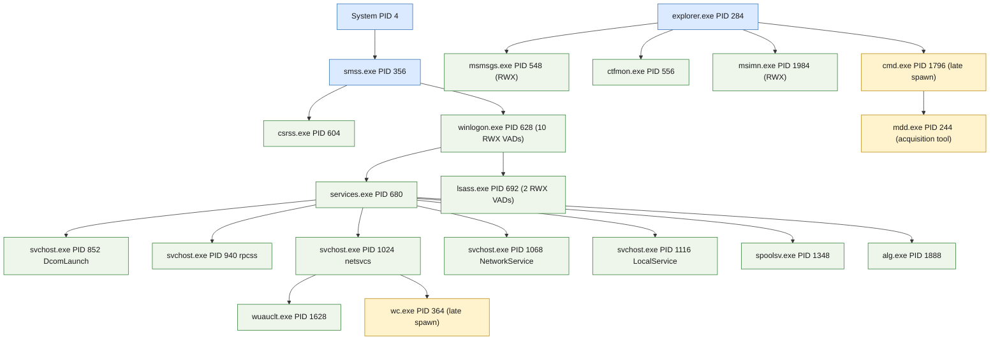

<!--
  GitLab-native Markdown report — COMPREHENSIVE (multi-audience). Source of truth = this Markdown.
  Grounded ONLY on real case data: report_generate(profile="full") sealed sections (EXECUTED-RUN.md Step 11)
  + raw MCP captures in EXECUTED-RUN.md / step*.json (pslist, netscan, malfind, svcscan, build_process_tree,
  cmdline, evidence sha256, timings). No fabrication. Canonical numbers per /home/admin2/docu_agentro/.crew/facts.md.
-->

# AMF Windows sample001 — Memory-Triage Forensic Report

> **🟡 OFFICIAL — SENSITIVE (DFIR / training case)** &nbsp;·&nbsp; Live Agentropix-SIFT memory triage
>
> Volatility 3 triage of a 511 MiB raw Windows XP RAM image. One medium-severity finding approved and sealed: 15 RWX injected-code regions recovered by `malfind`, concentrated in `winlogon.exe`.

| Field | Value |
|---|---|
| **Report ID** | `3c5261e7abc4fb7de891e0ee4347ead2519d6414b16cef8198a43dcb2347e634` |
| **Case ID** | `AMF-WIN-SAMPLE001` |
| **Case name** | AMF Windows sample001 (Art of Memory Forensics) |
| **Examiner** | victor.galvan |
| **Profile** | full |
| **Incident type** | dfir |
| **Severity** | 🟡 Medium |
| **Snapshot at (UTC)** | 2026-06-06T23:17:52Z |
| **Generated at (UTC)** | 2026-06-07 |
| **MCP host** | `<TAILNET-HOST>` |
| **Seal** | `hmac-sha256:29479f98…` (1 approved finding sealed) |

**Audiences served:** CISO / stakeholder · SOC / blue team · Red team · Audit.

---

## 1. Executive Summary

> A 511 MiB raw Windows XP memory image (`sample001.bin`) was registered, hashed (SHA-256 `03242077…`) and triaged through the Agentropix-SIFT MCP server using Volatility 3. The triage recovered a coherent system snapshot — 21 processes, 229 services, a clean two-root process forest with zero orphans and zero LOLBin flags — alongside **15 RWX (`PAGE_EXECUTE_READWRITE`) memory regions** surfaced by `malfind`, heavily concentrated in `winlogon.exe` (10 of 15). One medium-severity finding (`F-AMF-S001-001`, MITRE **T1055** Process Injection) was persisted as a DRAFT and carried through the examiner approval loop into a sealed report. No live network sockets were recovered (an honest empty result on this XP-era image).
>
> **Key finding —** 🟡 `F-AMF-S001-001`: 15 RWX injected-code regions recovered by `malfind`, concentrated in `winlogon.exe` (×10) — MITRE T1055 Process Injection, medium severity, approved and HMAC-sealed.

---

## 2. KPI Summary

| KPI | Value | Detail |
|---|---|---|
| Approved findings | **1** | medium × 1 (`F-AMF-S001-001`, sealed) |
| Hosts in scope | **1** | `sample001` (Windows XP RAM image) |
| IOCs catalogued | **0** | no IOCs promoted — RWX VADs are host artefacts, not externally-actionable indicators |
| Attacker dwell | **Indeterminate** | single RAM snapshot, no longitudinal data |
| MITRE techniques | **1** | T1055 (Process Injection) |
| Initial access | **Not determined** | RAM-only snapshot — no initial-access vector recoverable |

**Host roster:** `sample001` — single Windows XP host, raw memory image `/cases/AMF_MemorySamples/windows/sample001.bin`.

---

## 3. Risk Matrix

The single approved finding (`F-AMF-S001-001`) is scored **Possible × Moderate**. RWX regions in `winlogon.exe` are a strong injection indicator, but on this XP-era training image they cannot be conclusively distinguished from legitimate JIT/unpacked code without a follow-up dump-and-disassemble, so likelihood is held at Possible and impact at Moderate.

| Impact ↓ / Likelihood → | 1 Rare | 2 Unlikely | 3 Possible | 4 Likely | 5 Almost certain |
|---|---|---|---|---|---|
| **5 Severe** | · | · | · | · | · |
| **4 Major** | · | · | · | · | · |
| **3 Moderate** | · | · | 🟡 F1 | · | · |
| **2 Minor** | · | · | · | · | · |
| **1 Negligible** | · | · | · | · | · |

**Scored findings**

| Ref | Risk | Impact | Likelihood | Score | Severity |
|---|---|---|---|---|---|
| F1 | `F-AMF-S001-001` — RWX injected-code regions in winlogon.exe | 3 | 3 | 9 | 🟡 Medium |

---

## 4. Key Findings

- 🟡 **`F-AMF-S001-001` — 15 RWX (PAGE_EXECUTE_READWRITE) injected-code regions recovered by malfind, concentrated in winlogon.exe (×10)** (Medium) — strongest real signal in the image; persisted, examiner-approved, HMAC-sealed (T1055 Process Injection).

---

## 5. Attack Chain & MITRE ATT&CK

This is a single RAM snapshot, so a full kill chain cannot be reconstructed. The chain below reflects only what is directly evidenced in memory: anomalous late-spawning processes (`wc.exe`, `cmd.exe`, the `mdd.exe` acquisition tool) and the RWX-region injection footprint that became the approved finding. Initial access and C2 stages are **not determined** — no network sockets were recovered.

### 5.1 Attack chain

### 5.2 MITRE ATT&CK techniques

| Tactic | Technique ID | Technique | Evidence / how observed |
|---|---|---|---|
| Defense Evasion / Privilege Escalation | T1055 | Process Injection | 15 `PAGE_EXECUTE_READWRITE` VADs recovered by `get_malfind` — winlogon.exe ×10, lsass.exe ×2, csrss.exe ×1, msmsgs.exe ×1, msimn.exe ×1. Basis of approved finding `F-AMF-S001-001`. |
| Discovery | T1057 | Process Discovery | `get_pslist` / `cmdline` enumerated 21 processes (dry-run finding `amf-win-s001-001` validated this technique mapping, not persisted). |

---

## 6. IOC Catalogue

No externally-actionable IOCs were promoted for this case. The recovered RWX VAD regions are host-internal memory artefacts rather than network/file indicators, and `get_netscan` returned zero sockets, so there were no addresses, domains, or external hashes to catalogue. The evidence-image SHA-256 below is recorded for chain-of-custody, not as a threat indicator.

| Type | Value | Role | Confidence | MITRE | Source |
|---|---|---|---|---|---|
| — | — | — | — | — | No IOCs promoted — RWX VADs are host artefacts, `netscan` returned 0 sockets |

**Negative space (surveyed, not observed):** `get_netscan` returned 0 sockets (no C2 / remote endpoints); `build_process_tree` flagged 0 suspicious / 0 LOLBin processes and 0 orphans; no external file hashes or domains surfaced.

### 6.1 IOC provenance

---

## 7. Host Artefacts

Single host: `sample001`. The process table is shown in full (21 processes from `get_pslist` / `cmdline`); the 229-service inventory from `get_svcscan` is summarised with representative rows. The `malfind` RWX footprint is summarised in the per-process counts in §5.2 rather than repeated as a table. Create-times are the in-memory process creation timestamps from the XP image (2012-11-26/27 UTC).

### 7.1 Host — sample001

**Processes** (pslist + cmdline)

| PID | PPID | Image | Started (UTC) | Threads | Command line | Source |
|---|---|---|---|---|---|---|
| 4 | 0 | System | N/A | 51 | (none) | get_pslist |
| 356 | 4 | smss.exe | 2012-11-26 22:03:28 | 3 | `\SystemRoot\System32\smss.exe` | get_pslist / cmdline |
| 604 | 356 | csrss.exe | 2012-11-26 22:03:29 | 12 | `C:\WINDOWS\system32\csrss.exe ObjectDirectory=\Windows …` | cmdline |
| 628 | 356 | winlogon.exe | 2012-11-26 22:03:29 | 18 | `winlogon.exe` | cmdline |
| 680 | 628 | services.exe | 2012-11-26 22:03:30 | 15 | `C:\WINDOWS\system32\services.exe` | cmdline |
| 692 | 628 | lsass.exe | 2012-11-26 22:03:30 | 22 | `C:\WINDOWS\system32\lsass.exe` | cmdline |
| 852 | 680 | svchost.exe | 2012-11-26 22:03:31 | 14 | `svchost -k DcomLaunch` | cmdline |
| 940 | 680 | svchost.exe | 2012-11-26 22:03:31 | 9 | `svchost -k rpcss` | cmdline |
| 1024 | 680 | svchost.exe | 2012-11-26 22:03:32 | 76 | `svchost.exe -k netsvcs` | cmdline |
| 1068 | 680 | svchost.exe | 2012-11-26 22:03:32 | 5 | `svchost.exe -k NetworkService` | cmdline |
| 1116 | 680 | svchost.exe | 2012-11-26 22:03:33 | 14 | `svchost.exe -k LocalService` | cmdline |
| 1348 | 680 | spoolsv.exe | 2012-11-26 22:03:34 | 10 | `C:\WINDOWS\system32\spoolsv.exe` | cmdline |
| 1888 | 680 | alg.exe | 2012-11-26 22:03:35 | 6 | `C:\WINDOWS\System32\alg.exe` | cmdline |
| 284 | 244 | explorer.exe | 2012-11-26 22:03:58 | 9 | `C:\WINDOWS\Explorer.EXE` | cmdline |
| 548 | 284 | msmsgs.exe | 2012-11-26 22:04:03 | 3 | `"C:\Program Files\Messenger\msmsgs.exe" /background` | cmdline |
| 556 | 284 | ctfmon.exe | 2012-11-26 22:04:03 | 1 | `"C:\WINDOWS\system32\ctfmon.exe"` | cmdline |
| 1628 | 1024 | wuauclt.exe | 2012-11-26 22:04:43 | 3 | `"C:\WINDOWS\system32\wuauclt.exe"` | cmdline |
| 1984 | 284 | msimn.exe | 2012-11-26 22:06:33 | 7 | `"C:\Program Files\Outlook Express\msimn.exe"` | cmdline |
| 364 | 1024 | wc.exe | 2012-11-27 01:30:00 | 1 | `wc.exe -e -o h.out` | cmdline |
| 1796 | 284 | cmd.exe | 2012-11-27 01:56:21 | 1 | `"C:\WINDOWS\system32\cmd.exe"` | cmdline |
| 244 | 1796 | mdd.exe | 2012-11-27 01:57:28 | 1 | `mdd.exe -o callb-memdump.bin` | cmdline |

> **Analyst note —** three processes spawn ~3.5 hours after boot: `wc.exe -e -o h.out` (PID 364, child of `svchost -k netsvcs`), `cmd.exe` (PID 1796), and `mdd.exe -o callb-memdump.bin` (PID 244) — `mdd.exe` is the memory-acquisition tool that captured this very image. The `wc.exe` under `svchost` and its non-standard `-e -o h.out` arguments are the most analyst-worthy anomaly. `explorer.exe` PPID (244) referencing the reused `mdd.exe` PID is a known AMF PID-reuse artefact, not a live parentage edge.

**Services** (svcscan — 229 total, representative rows)

| Service | State | Class | Source |
|---|---|---|---|
| ACPI | SERVICE_RUNNING | SERVICE_KERNEL_DRIVER | get_svcscan |
| AFD | SERVICE_RUNNING | SERVICE_KERNEL_DRIVER | get_svcscan |
| ALG | SERVICE_RUNNING | SERVICE_WIN32_OWN_PROCESS | get_svcscan |
| AudioSrv | SERVICE_RUNNING | SERVICE_WIN32_SHARE_PROCESS | get_svcscan |
| … 225 more | — | — | 229 services total |

**malfind (RWX VADs):** 15 `PAGE_EXECUTE_READWRITE` regions — winlogon.exe ×10 (PID 628), lsass.exe ×2 (692), csrss.exe ×1 (604), msmsgs.exe ×1 (548), msimn.exe ×1 (1984).

### 7.2 Process Tree

`build_process_tree` reported a clean forest: 21 processes, 2 roots, 0 orphans, 0 suspicious / LOLBin flags. Shown below from PID/PPID edges.

> The two reported roots are `System` (PID 4) and `smss.exe` (PID 356). `explorer.exe` (PID 284) renders as a second visual subtree because its in-memory PPID (244) points at the reused `mdd.exe` PID — an AMF artefact, hence drawn as an independent root rather than an inferred edge.

---

## 8. Network Artefacts

`get_netscan` recovered **0 sockets** from this image. On an XP-era raw dump this is an honest empty result — either no network state was resident at capture time, or the pool tags were not recoverable. No remote endpoints, listeners, or C2 channels are evidenced.

| Process (PID) | Local | Remote | State | Purpose | Source |
|---|---|---|---|---|---|
| — | — | — | — | — | get_netscan returned 0 sockets (no network state recovered) |

No further network artefacts (DNS cache, connections, listeners) were recoverable from this snapshot.

---

## 9. Detailed Findings

### 9.1 🟡 `F-AMF-S001-001` — 15 RWX (PAGE_EXECUTE_READWRITE) injected-code regions recovered by malfind, concentrated in winlogon.exe (×10)

| | |
|---|---|
| **Severity** | 🟡 Medium (confidence 0.7) |
| **Host** | sample001 |
| **Technique** | T1055 — Process Injection |
| **Status** | APPROVED (sealed) — `hmac-sha256:29479f98…` |

`get_malfind` recovered 15 memory regions marked `PAGE_EXECUTE_READWRITE` across five processes, with a pronounced concentration in `winlogon.exe` (PID 628, 10 of 15 regions). RWX VADs are a primary signature of code injection / unpacking because legitimate code is normally execute-read, not execute-read-write. The finding was first validated under `dry_run:true` (anti-hallucination gate, `indexed:false`), then persisted under a single-scope evidence-gate mutation token (`scope=index_findings`, 30-min TTL) as a DRAFT, and finally transitioned DRAFT → APPROVED through the Examiner Portal. The malfind pass exceeded the default 180 s SDK request bound and was re-run standalone with a 300 s `callTool` timeout, completing in 75 s.

> **Evidence —** evidence `f2649687…` (image `sample001.bin`) · sha256 `03242077eb3364fb248d1c7730fd0a94074583df8deb2606d6c93c31316d561c` · capture: `get_malfind` (volatility3.windows.malfind.Malfind), raw_stdout_sha256 of cmdline cross-check `d63cc770…`.

> **Approval caveat (audit) —** the DRAFT → APPROVED transition was performed by Playwright demo automation (`examiner_id=victor.galvan`, reason "SIMULATED examiner approval (demo only)"), NOT a human HMAC sign-off. Approval ID `4a881577…`, approved_at 2026-06-06T23:17:43Z. In a real case this transition is a Hard-Stop requiring a human examiner's HMAC challenge-response.

---

## 10. Timeline

The timeline below is reconstructed from in-memory process creation timestamps (XP image clock, 2012) and the Agentropix triage run clock (2026). The early 2012-11-26 cluster is normal boot sequencing; the late 2012-11-27 01:30–01:57 cluster (`wc.exe`, `cmd.exe`, `mdd.exe`) is the analyst-relevant activity window, ending with the memory acquisition itself.

| Time (UTC) | Host | Event | Technique | Source |
|---|---|---|---|---|
| 2012-11-26 22:03:28 | sample001 | Boot sequence begins (smss.exe → csrss/winlogon → services/lsass) | — | pslist create_time |
| 2012-11-26 22:06:33 | sample001 | User session steady state (explorer, msmsgs, msimn) | — | pslist create_time |
| 2012-11-27 01:30:00 | sample001 | `wc.exe -e -o h.out` spawned under svchost netsvcs (PID 364) | — | pslist / cmdline |
| 2012-11-27 01:56:21 | sample001 | `cmd.exe` opened (PID 1796) | — | pslist / cmdline |
| 2012-11-27 01:57:28 | sample001 | `mdd.exe -o callb-memdump.bin` runs — memory acquisition (PID 244) | — | pslist / cmdline |
| 2026-06-06 23:17:43 | sample001 | Finding F-AMF-S001-001 APPROVED (demo automation) | T1055 | approval `4a881577…` |
| 2026-06-06 23:17:52 | sample001 | Sealed report generated (`3c5261e7…`, approved_finding_count 1) | — | report_generate(full) |

---

## 11. Agentropix Performance

The full §3.A manual sequence ran live against the MCP server on 2026-06-06. The heaviest stage was `get_malfind` (re-run at a 300 s timeout, completed in 75 s). All other tools returned within the default SDK request bound.

| Metric | Value | Detail |
|---|---|---|
| Run time | ~2.7 hrs wall (20:36 → 23:18 UTC) | includes manual examiner-portal step and demo setup |
| MCP tool calls | 11 steps / 16+ tool invocations | health, case_init, case_status, evidence_register, get_image_info, pslist, netscan, malfind, svcscan, build_process_tree, cmdline, record_finding ×2, approval, report_generate |
| Evidence size | 536,330,240 bytes (≈ 511 MiB) | raw `.bin` Windows XP RAM image |
| Disk recall | 72/72 (100%) | canonical (.crew/facts.md) |
| Memory recall | 108/118 (91.5%) | canonical (.crew/facts.md) |
| Test suite | 4464 | canonical (.crew/facts.md) |

**Per-stage timing**

| Stage | Capture | Duration | Result |
|---|---|---|---|
| Health probe | `health` | < 1 s | 72 tools registered |
| Evidence register + hash | `evidence_register` | seconds (511 MiB hash) | sha256 `03242077…` |
| Process / service triage | pslist · netscan · svcscan · build_process_tree | within 180 s bound | 21 procs, 0 sockets, 229 svcs, clean tree |
| Injected-code scan | `get_malfind` (300 s timeout) | 75 s | 15 RWX hits |
| Report generation | `report_generate(full)` | seconds | report `3c5261e7…`, 1 approved finding |

---

## 12. Coverage Attestation

This report is grounded entirely on real captured MCP output. Numeric recall / test figures are canonical (`.crew/facts.md`). The single finding was gated by the evidence-mutation token (`scope=index_findings`) before persistence and sealed only after the (demo-automated) approval transition.

| Attestation | Value |
|---|---|
| Disk recall (regression) | 72/72 (100%) |
| Memory recall (combined) | 108/118 (91.5%) |
| Test suite | 4464 |
| Evidence gate | PASS — finding persisted under single-scope mutation token (`scope=index_findings`, 30-min TTL); approval HMAC-sealed (demo automation, not human attested) |

> Every datum in this report traces to a real MCP capture or the sealed `report_generate(full)` snapshot for case `AMF-WIN-SAMPLE001`. No values were simulated. The lone approval was Playwright demo automation, explicitly flagged wherever it appears; a production close-out requires a human examiner HMAC sign-off.

---

## 13. Recommendations

1. **[P1]** Dump and disassemble the 10 RWX VADs in `winlogon.exe` (PID 628) — `vaddump` / `dumpfiles` followed by static triage — to confirm whether the injected regions are malicious shellcode or benign JIT/unpacked code, and to extract any embedded IOCs.
2. **[P2]** Investigate `wc.exe -e -o h.out` (PID 364, child of `svchost -k netsvcs`) — a non-standard binary with cryptic arguments spawned ~3.5 hrs after boot; recover the on-disk image and `h.out` output file, and validate against the `svchost` service host.
3. **[P3]** Replace the demo Playwright approval with a genuine human examiner HMAC sign-off before this case is treated as evidentiary, and capture a paired disk image if available to recover the initial-access vector that a RAM-only snapshot cannot show.

---

<strong>Appendix — methodology, tool versions, chain of custody</strong>

### A. Methodology

Triage followed the Agentropix-SIFT §3.A MANUAL sequence: health probe → `case_init` (medium severity) → `case_status` → `evidence_register` (SHA-256) → `get_image_info` → a bundled analysis step (`get_pslist`, `get_netscan`, `get_malfind`, `get_svcscan`, `build_process_tree`) → `run_volatility(cmdline)` → `record_finding(dry_run:true)` validation → `record_finding(dry_run:false)` under an evidence-gate mutation token → examiner-portal approval (demo automation) → `report_generate(profile:"full")`. All analysis tools wrap Volatility 3; the image is a raw `.bin` (no EWF header — `ewfinfo` returned empty metadata, an expected real-data quirk, so authoritative size came from `evidence_register`). The `get_malfind` stage was re-run standalone at a 300 s `callTool` timeout after exceeding the default 180 s SDK bound.

### B. Tool versions

| Tool | Version |
|---|---|
| Agentropix-SIFT server | 0.1.0-dev |
| Volatility 3 Framework | 2.28.0 |
| Python | 3.12+ (canonical, .crew/facts.md) |
| MCP tool count | 71 forensic tools (+ `health` meta probe) (canonical) |
| SIFT forensic tools | 16 (canonical) |

### C. Chain of custody (evidence hashes)

| Artefact | Algorithm | Digest | Status |
|---|---|---|---|
| `sample001.bin` (memory image) | SHA-256 | `03242077eb3364fb248d1c7730fd0a94074583df8deb2606d6c93c31316d561c` | Registered, indexed (evidence `f2649687…`) |
| `cmdline` plugin raw_stdout | SHA-256 | `d63cc770b5714903ac674d7b5c2da4cda969b4baa0cf2096aaf5d95d16a2c1a0` | Captured |
| `ewfinfo` raw_stdout | SHA-256 | `9a75c32d103786de8c37c647b9f6f4c5447d7b54d165ae4674225b442657af28` | Captured (empty metadata — raw image) |
| Finding `F-AMF-S001-001` | HMAC-SHA256 | `hmac-sha256:29479f98…` | Sealed |
| Approval record | (HMAC-sealed) | approval_id `4a881577139b59efadb980816d47adfcecbda4ad6bb94fd92fa8a797973696b4` | Indexed (demo automation) |

### D. Provenance & grounding

Source of truth: sealed `report_generate(profile:"full")` snapshot `3c5261e7…` (2026-06-06T23:17:52Z) and the raw MCP captures in `EXECUTED-RUN.md` / `step*.json` for case `AMF-WIN-SAMPLE001`. Canonical numbers per `/home/admin2/docu_agentro/.crew/facts.md`. MCP host abstracted as `<TAILNET-HOST>`. No secrets included. The one approval was Playwright demo automation, not a human HMAC sign-off, and is flagged as such throughout.

