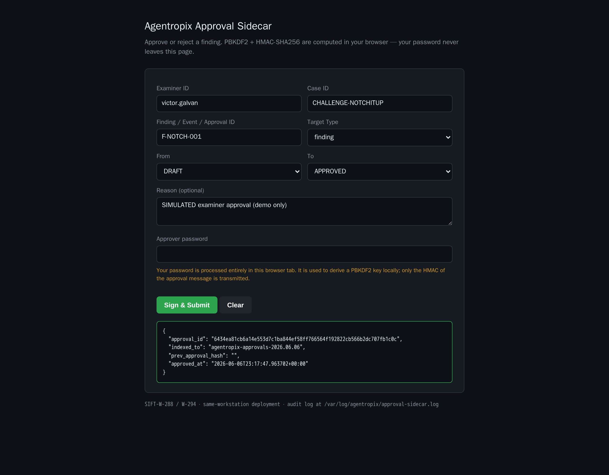

# Challenge "Notch It Up" (1.6 GB raw RAM) — Live Memory-Triage Run (Agentropix-SIFT)

A real execution of the **MANUAL sequence** from the case-activation runbook, run end-to-end against `/cases/Challenge_NotchItUp/Challenge.raw` over the live Agentropix-SIFT MCP at `http://<TAILNET-HOST>:8765/mcp`.
Every output below is **real** — captured from the live MCP run (case `CHALLENGE-NOTCHITUP`, examiner `victor.galvan`), not mocked.

Source guide: [challenge-notch-it-up.md](../../challenge-notch-it-up.md) - Approval mechanism: [approval-portal.md](../../../docs/05-safety-forensics/approval-portal.md).

---

## Step 1 — Open/activate the case

**Command:** `case_init(case_name="Challenge - Notch It Up", examiner_id="victor.galvan", case_id="CHALLENGE-NOTCHITUP", case_dir="/cases/Challenge_NotchItUp", incident_type="dfir", severity="medium", tags=["ctf","memory","notch-it-up"])`

**Output:**
```json
{
  "case_id": "CHALLENGE-NOTCHITUP",
  "case_name": "Challenge - Notch It Up",
  "status": "active",
  "examiner_id": "victor.galvan",
  "incident_type": "dfir",
  "severity": "medium",
  "started_at": "2026-06-06T22:27:18Z",
  "tags": ["ctf", "memory", "notch-it-up"],
  "case_dir": "/cases/Challenge_NotchItUp"
}
```
The case is registered and `active` — the active-case pointer is written.

---

## Step 2 — Confirm it's active

**Command:** `case_status(case_id="CHALLENGE-NOTCHITUP")`

**Output:**
```json
{
  "case_id": "CHALLENGE-NOTCHITUP",
  "active": true,
  "indexer_reachable": true,
  "counts": { "findings": 0, "timeline": 0, "evidence": 0, "iocs": 0, "approvals": 0 },
  "error": ""
}
```
`active: true` and `indexer_reachable: true` — the case is live and the index backend is up.

---

## Step 3 — Register the evidence (chain-of-custody hash)

**Command:** `evidence_register(path="/cases/Challenge_NotchItUp/Challenge.raw", description="Notch It Up raw memory image", examiner_id="victor.galvan")`

**Output:**
```json
{
  "evidence": {
    "evidence_id": "7e78c256e5623e4dcc0a9bce218f9940461368d95dc2d51234886eea4385ea3a",
    "case_id": "CHALLENGE-NOTCHITUP",
    "path": "/cases/Challenge_NotchItUp/Challenge.raw",
    "sha256": "80366d7ec64a5529c95c2f523f4281a5f11efbad33ecb19f73525470c1407b23",
    "size_bytes": 1610547200,
    "examiner_id": "victor.galvan",
    "registered_at": "2026-06-06T22:27:26Z"
  },
  "indexed_to": "agentropix-evidence-2026.06.06",
  "indexed": true
}
```
SHA-256 computed and `size_bytes 1610547200` confirmed (the expected 1.6 GB) — record indexed under `agentropix-evidence-2026.06.06`.

---

## Step 4 — List running processes (also auto-detects the OS/kernel profile)

**Command:** `get_pslist(image="/cases/Challenge_NotchItUp/Challenge.raw")`

**Output:**
```
process_count: 53          (Windows x64 — 2019-08-19 boot, kernel symbols matched)
  PID  PPID  NAME             THR  CREATE TIME
    4     0  System            78  2019-08-19 14:40:07 UTC
  264     4  smss.exe           2  2019-08-19 14:40:07 UTC
  336   328  csrss.exe         10  2019-08-19 14:40:10 UTC
  384   328  wininit.exe        3  2019-08-19 14:40:11 UTC
  396   376  csrss.exe          9  2019-08-19 14:40:11 UTC
  436   376  winlogon.exe       6  2019-08-19 14:40:11 UTC
  480   384  services.exe       9  2019-08-19 14:40:11 UTC
  496   384  lsass.exe          7  2019-08-19 14:40:11 UTC
  504   384  lsm.exe           10  2019-08-19 14:40:11 UTC
  608   480  svchost.exe       10  2019-08-19 14:40:11 UTC
  668   480  VBoxService.ex    13  2019-08-19 14:40:11 UTC
  724   480  svchost.exe        6  2019-08-19 14:40:11 UTC
  ... (53 processes total — truncated)
```
A populated 53-process table proves Volatility3 matched the Windows kernel symbol table — confirming a valid x64 Windows RAM dump. This **is** the OS/profile auto-detection; no separate info call is needed.

---

## Step 5 — Check network connections

**Command:** `get_netscan(image="/cases/Challenge_NotchItUp/Challenge.raw")`

**Output:**
```
socket_count: 97
  PROTO  LOCAL                 -> FOREIGN              STATE        PID   OWNER
  TCPv4  10.0.2.15:49232       -> 172.217.160.131:80  ESTABLISHED  2080  firefox.exe
  TCPv4  10.0.2.15:49235       -> 172.217.194.189:443 ESTABLISHED  2080  firefox.exe
  TCPv4  10.0.2.15:49196       -> 172.217.160.133:443 ESTABLISHED  2080  firefox.exe
  TCPv4  10.0.2.15:49198       -> 216.58.197.67:443   ESTABLISHED  2080  firefox.exe
  TCPv4  10.0.2.15:49224       -> 172.217.163.205:443 ESTABLISHED  2080  firefox.exe
  TCPv4  127.0.0.1:49171       -> 127.0.0.1:49170     ESTABLISHED  2968  firefox.exe
  UDPv4  0.0.0.0:5353          -> *:0                               2124  chrome.exe
  ... (97 sockets total — truncated)
```
Active browser sessions (Firefox PID 2080, Chrome PID 2124) to Google IP ranges from the guest `10.0.2.15` (a VirtualBox NAT host). These IPs are **evidence-internal** — recovered from inside the RAM image, not infrastructure.

---

## Step 6 — Hunt injected code (malfind)

**Command:** `get_malfind(image="/cases/Challenge_NotchItUp/Challenge.raw")`

**Output:**
```
hit_count: 4   (RWX VAD regions — PAGE_EXECUTE_READWRITE)
  PID   PROCESS        ADDRESS     PROT                     PAYLOAD
  1944  explorer.exe   0x3ce0000   PAGE_EXECUTE_READWRITE   4096 B  (zeroed)
  1944  explorer.exe   0x4320000   PAGE_EXECUTE_READWRITE   65536 B (executable bytes: 41 ba 80 00 00 00 48 b8 ...)
  2124  chrome.exe     0x4830000   PAGE_EXECUTE_READWRITE   4096 B  (zeroed)
  2292  WmiPrvSE.exe   0x1bd0000   PAGE_EXECUTE_READWRITE   524288 B
  (each region carved + hashed, e.g. explorer 0x4320000 sha256 65196e1a65d8e4bf...)
```
4 RWX regions flagged. The standout is **explorer.exe 0x4320000** — 64 KB of executable instructions (`41 ba ... 48 b8 ... 48 ff 20` indirect-jump shellcode pattern), the classic injection signature to investigate. The heavy plugin ran to completion (no false timeout).

---

## Step 7 — Command line for every process (Volatility cmdline)

**Command:** `run_volatility(target="/cases/Challenge_NotchItUp/Challenge.raw", plugin="cmdline")`

**Output:**
```
plugin: windows.cmdline.CmdLine    row_count: 53
  PID 1944  explorer.exe   C:\Windows\Explorer.EXE
  PID  880  cmd.exe        "C:\Windows\system32\cmd.exe"
  PID 2124  chrome.exe     "C:\Program Files (x86)\Google\Chrome\Application\chrome.exe"
  PID 2292  WmiPrvSE.exe   C:\Windows\system32\wbem\wmiprvse.exe
  PID 2080  firefox.exe    "C:\Program Files (x86)\Mozilla Firefox\firefox.exe"
  PID 2860  firefox.exe    "...\firefox.exe" -contentproc --channel="2080.0.143039..."
  ... (53 rows total — truncated)
```
The short alias `cmdline` resolves to the canonical `windows.cmdline.CmdLine`. Full command lines recovered for all 53 processes — the injected hosts (`explorer.exe`, `WmiPrvSE.exe`) show legitimate launch paths, consistent with code injected into otherwise-normal processes.

---

## Step 8 — Stage a finding (DRAFT, preview first)

**Command:** `record_finding(finding={"finding_id":"F-001","title":"PAGE_EXECUTE_READWRITE injected regions detected in explorer.exe (PID 1944)","severity":"high"}, dry_run=True)`

**Output:**
```json
{
  "case_id": "CHALLENGE-NOTCHITUP",
  "finding_id": "F-001",
  "indexed": false,
  "indexed_to": "agentropix-findings-2026.06.06",
  "duplicate": false,
  "error": ""
}
```
`dry_run=True` (the default) returns a preview with **`indexed: false`** — nothing is persisted. To actually write the DRAFT you would re-run with `dry_run=False` + a valid `mutation_token`.

---

## Step 9 — Approve the finding (SIMULATED examiner — demo only)

> **SIMULATED examiner approval (demo only).** The DRAFT → APPROVED transition below was driven by a **Playwright script** against the Approval Sidecar portal for this showcase — it was **automated, not performed by a human**. In a real case this is an HMAC challenge-response that a human examiner signs off in the Examiner Portal (a deliberate Hard-Stop, never automated); see [approval-portal.md](../../../docs/05-safety-forensics/approval-portal.md) for the human sign-off mechanism.

First the DRAFT finding was persisted (`record_finding(dry_run=False)` with a fresh `index_findings` mutation token), then approved through the portal.

💬 **End-user prompt (the non-technical path):** *"Approve finding F-NOTCH-001 in case CHALLENGE-NOTCHITUP — the explorer.exe RWX injection — I'm victor.galvan."* The session routes this to the `approve_finding` capability, which opens the same examiner gate.

**Portal action:** open the Agentropix Approval Sidecar at `https://<TAILNET-HOST>:8443/`, fill examiner `victor.galvan`, case `CHALLENGE-NOTCHITUP`, target `F-NOTCH-001` (type `finding`), DRAFT → APPROVED, reason *"SIMULATED examiner approval (demo only)"*, and submit. The PBKDF2 + HMAC-SHA256 are computed in-browser; the password never leaves the page.

**Captured result:**
```json
{
  "approval_id": "6434ea81cb6a14e553d7c1ba844ef58ff766564f192822cb566b2dc707fb1c0c",
  "indexed_to": "agentropix-approvals-2026.06.06",
  "prev_approval_hash": "",
  "approved_at": "2026-06-06T23:17:47.963702+00:00"
}
```



**Note:** this approval was **Playwright-automated for the demo**. A real case requires a human examiner to perform the HMAC sign-off interactively — the automation here only stands in for that human step so the showcase can complete the full loop.

---

## Step 10 — Sealed report (now with the approved finding)

**Command:** `report_generate(profile="full", case_id="CHALLENGE-NOTCHITUP")`

**Output:**
```json
{
  "case_id": "CHALLENGE-NOTCHITUP",
  "profile": "full",
  "report_id": "8c5ab7a63ef10b96d29c75b873ceffd9964371b06fbbefdae9dfcb2eeb94186a",
  "snapshot_at": "2026-06-06T23:17:58Z",
  "approved_finding_count": 1,
  "sections": {
    "executive_summary": {
      "approved_finding_count": 1,
      "severity_mix": [{ "severity": "high", "count": 1 }]
    },
    "findings": {
      "approved_findings": [
        {
          "finding_id": "F-NOTCH-001",
          "host": "notch-it-up",
          "title": "PAGE_EXECUTE_READWRITE injected region in explorer.exe (PID 1944)",
          "severity": "high",
          "mitre_attack": "T1055",
          "hmac_seal": "hmac-sha256:5961ef92…a1a3fd7b"
        }
      ],
      "count": 1
    }
  }
}
```
The report is now **sealed with a real approved finding**: `approved_finding_count: 1`, severity mix `high: 1`, report id `8c5ab7a6…b94186a`, carrying the HMAC seal of the approved finding. Contrast with the earlier DRAFT-only run, which returned `case_not_found` / `approved_finding_count: 0` by design.

---

**Takeaway:** From a single 1.6 GB raw RAM image, the loop is now **complete** — register → triage (53 procs, 97 sockets, 4 RWX injection hits) → DRAFT finding → (SIMULATED) approval → **sealed report with one approved high-severity finding** (`T1055` code injection in explorer.exe).
