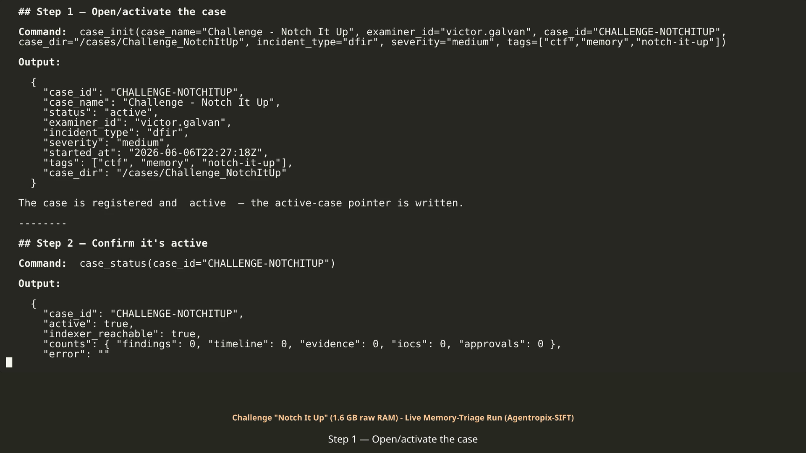

# Challenge "Notch It Up" — executed activation run (code-injection triage of a 1.6 GB Windows x64 raw RAM image)

> **Provenance.** This folder is the captured record of a **real live-MCP execution** of the
> [challenge-notch-it-up.md](../../challenge-notch-it-up.md) activation guide, run on **2026-06-06**
> (step timestamps span `22:27:18Z` → `23:17:58Z`) against the evidence image
> `/cases/Challenge_NotchItUp/Challenge.raw` (case `CHALLENGE-NOTCHITUP`, examiner `victor.galvan`).
> Every output was captured from the live Agentropix-SIFT MCP — nothing is mocked. The approval step
> is **SIMULATED examiner approval (demo only)**: the recorded run auto-approves (a Playwright script
> drives the Approval Sidecar portal) purely to show the DRAFT → APPROVED → sealed-report loop. In
> real casework that approval is a human HMAC hard-stop that is never automated.

## What's in this folder

| File | What it is | What it shows |
|---|---|---|
| [EXECUTED-RUN.md](EXECUTED-RUN.md) | The narrative transcript (Steps 1–10) | Every command + real output, the SIMULATED approval, and the final sealed report (`approved_finding_count: 1`, high severity) |
| [EXECUTED-RUN.mp4](EXECUTED-RUN.mp4) | Rendered video of the transcript | The same run as a watchable walkthrough |
| [approval-portal.png](approval-portal.png) | Screenshot of the Approval Sidecar portal | The DRAFT → APPROVED form for finding `F-NOTCH-001` at the moment of (simulated) sign-off |
| [steps1-3.json](steps1-3.json) | Raw MCP captures — `case_init`, `case_status`, `evidence_register` | Case activation, indexer reachability, and the evidence SHA-256 / size |
| [step4_get_pslist.json](step4_get_pslist.json) | Raw capture — `get_pslist` | 53 processes (2019-08-19 boot) — a populated table is the kernel-profile auto-detection proof |
| [step5_get_netscan.json](step5_get_netscan.json) | Raw capture — `get_netscan` | 97 sockets, incl. Firefox/Chrome sessions from the guest `10.0.2.15` |
| [step6_get_malfind.json](step6_get_malfind.json) | Raw capture — `get_malfind` | 4 RWX VAD regions (explorer.exe ×2, chrome.exe, WmiPrvSE.exe), each carved + hashed |
| [step7_run_volatility_cmdline.json](step7_run_volatility_cmdline.json) | Raw capture — `run_volatility plugin=cmdline` | 53 command lines via `windows.cmdline.CmdLine` |
| [step8_record_finding.json](step8_record_finding.json) | Raw capture — `record_finding` (dry-run) | The finding validated as a preview, `indexed: false` — nothing persisted |
| [step10_report_generate.json](step10_report_generate.json) | Raw capture — `report_generate` (pre-approval) | The honest `case_not_found` / `approved_finding_count: 0` at the DRAFT-only stage |
| [reports/comprehensive.md](reports/comprehensive.md) / [.pdf](reports/comprehensive.pdf) | Multi-tier report artifact (full) | The comprehensive forensic report grounded in the sealed `report_generate` output + these captures |
| [reports/executive-onepager.md](reports/executive-onepager.md) / [.pdf](reports/executive-onepager.pdf) | Multi-tier report artifact (executive) | The one-page executive summary of the same sealed data |
| [reports/README.md](reports/README.md) | Index of the report artifacts | File-by-file guide to the multi-tier reports above |

The raw captures for Steps 9–10 final state (persisted finding `F-NOTCH-001`, approval record
`6434ea81…`, sealed report `8c5ab7a6…`) are reproduced verbatim inside [EXECUTED-RUN.md](EXECUTED-RUN.md).

> 🔗 **Same evidence, second engine:** a separate autonomous `agentropix-sift` **engine** triage of
> this exact `Challenge.raw` (identical evidence SHA-256 `80366d7e…c1407b23`; 10 findings · 60 tool
> calls · 5 iterations) is documented in the evaluator-facing
> [AGENT-EXECUTION-LOGS-REPORT.md](../../../docs/12-CASES-REPORTS/srl-2018-report/submission/AGENT-EXECUTION-LOGS-REPORT.md),
> with its raw sealed `notch-*` evidence (report, audit-log, session-key, live run.log, Thymus trail)
> committed alongside.

## Inside the files (excerpts)

From [steps1-3.json](steps1-3.json) — `evidence_register` establishes chain of custody before any analysis:

```json
"path":"/cases/Challenge_NotchItUp/Challenge.raw",…"sha256":"80366d7ec64a5529c95c2f523f4281a5f11efbad33ecb19f73525470c1407b23","size_bytes":1610547200,…"indexed_to":"agentropix-evidence-2026.06.06","indexed":true
```

The image is hashed and its 1,610,547,200-byte size confirmed (the expected 1.6 GB), and the record indexed — every later artifact traces back to this hash.

From [step5_get_netscan.json](step5_get_netscan.json) — one of 97 recovered sockets:

```json
{"proto": "TCPv4", "local_addr": "10.0.2.15", "local_port": 49232, "foreign_addr": "172.217.160.131", "foreign_port": 80, "state": "ESTABLISHED", "pid": 2080, "owner": "firefox.exe", …}
```

Live browser sessions (Firefox PID 2080) from the VirtualBox-NAT guest `10.0.2.15` to Google address space. These IPs are evidence-internal — recovered from inside the RAM image, not infrastructure.

From [step6_get_malfind.json](step6_get_malfind.json) — the standout injection hit:

```json
{"pid": 1944, "process": "explorer.exe", "address": "0x4320000", "protection": "PAGE_EXECUTE_READWRITE", "payload_bytes": 65536, "payload_sha256": "65196e1a65d8e4bfcf42f03b7db79cd07a2573f57c6aad40a97c37791726ca6f"}
```

with its carved hexdump head:

```text
41 ba 80 00 00 00 48 b8 38 a1 86 ff fe 07 00 00 A.....H.8....... 48 ff 20 90 41 ba 81 00 00 00 48 b8 38 a1 86 ff …
```

64 KB of executable bytes in an RWX region of `explorer.exe` — the `48 b8 … 48 ff 20` (mov rax / jmp [rax]) indirect-jump pattern is the classic injected-shellcode signature. This region became finding `F-NOTCH-001` (MITRE T1055).

From [step8_record_finding.json](step8_record_finding.json) — the anti-hallucination preview:

```json
{"case_id":"CHALLENGE-NOTCHITUP","finding_id":"F-001","indexed":false,"indexed_to":"agentropix-findings-2026.06.06","error":"","duplicate":false}
```

`dry_run: true` validates the finding and shows where it *would* index — `indexed: false` means nothing was persisted. Persisting requires `dry_run: false` plus a scoped mutation token.

From [step10_report_generate.json](step10_report_generate.json) — the report at the DRAFT-only stage:

```json
"report_id":"","snapshot_at":"2026-06-06T22:30:06.451201+00:00","approved_finding_count":0,…"error":"case_not_found: no documents for case_id 'CHALLENGE-NOTCHITUP'"
```

By design, no report materializes before an approval exists. The final sealed report in [EXECUTED-RUN.md](EXECUTED-RUN.md) Step 10 (`approved_finding_count: 1`, severity mix `high: 1`, `report_id: 8c5ab7a6…`) only appeared after the (simulated) approval.

## Honest notes

- **The captured `report_generate` JSON is the pre-approval run** and returns `case_not_found` with `approved_finding_count: 0` — intended gating behavior, not a failure. The sealed post-approval report exists only in the transcript.
- **The captured `record_finding` is the dry-run preview** (`indexed: false`); the persisted `F-NOTCH-001` (non-dry-run with a fresh `index_findings` mutation token) is documented in the transcript.
- **The Step 9 approval is SIMULATED** (Playwright-automated, labelled as such in the transcript). Treat the approval record `6434ea81…` as automated, not human-attested.
- **No separate "identify the OS" step was run**: the populated 53-row pslist *is* the kernel-symbol-table match (Windows x64, 2019-08-19 boot). `malfind` ran to completion with no false timeout on this image.
- The netscan IPs (`172.217.x.x`, `10.0.2.15`) and browser endpoints are artifacts recovered from inside the evidence image, presented as-is.

## 🎬 The recorded session

[](https://galvangabriel-web.github.io/agentropix-mcp/case-activation/runs/challenge-notchitup/EXECUTED-RUN.mp4)

> ▶ *GitHub's repo pages can't play committed MP4s — the poster links to the **GitHub Pages copy, which plays directly in your browser**; or*
> ***[download the MP4 (24 MB, 59 s)](https://raw.githubusercontent.com/galvangabriel-web/agentropix-mcp/main/case-activation/runs/challenge-notchitup/EXECUTED-RUN.mp4)*** *— the full activation sequence captured live and rendered to video.*
