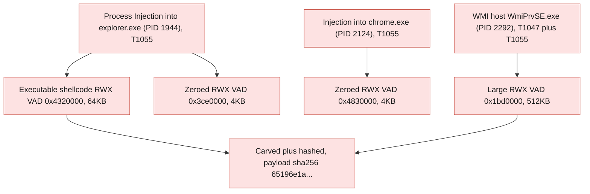
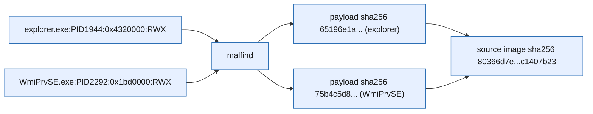
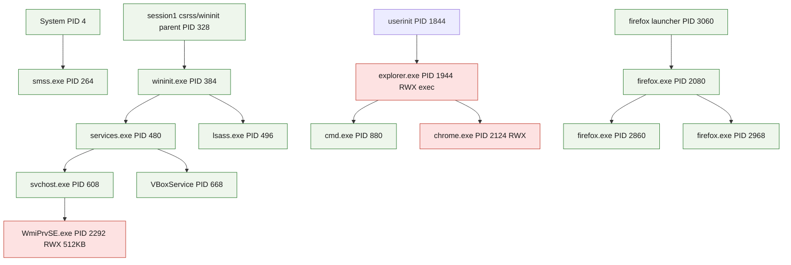

<!--
  GitLab-native Markdown report (COMPREHENSIVE). Source of truth = this Markdown.
  Grounded ENTIRELY in REAL case data: report_generate(profile=full) sealed sections +
  EXECUTED-RUN.md raw MCP captures (pslist/netscan/malfind/cmdline + step JSONs). NO fabrication.
  MCP host -> <TAILNET-HOST>. Canonical numbers per /home/admin2/docu_agentro/.crew/facts.md.
-->

# Memory Forensics Report — Challenge "Notch It Up"

> **CONFIDENTIAL — Forensic Work Product** &nbsp;·&nbsp; Agentropix-SIFT live memory-triage run
>
> Single 1.6 GB raw RAM image, end-to-end on the live Agentropix-SIFT MCP. Code-injection confirmed across four host processes.

| Field | Value |
|---|---|
| **Report ID** | `81a1b2b0b2b612237ef42153f49b580844f6778357f755b7f8c58e5a507e5f91` |
| **Case ID** | `CHALLENGE-NOTCHITUP` |
| **Case name** | Challenge - Notch It Up |
| **Examiner** | victor.galvan |
| **Profile** | full (sealed) |
| **Incident type** | DFIR — memory triage (CTF) |
| **Severity** | 🟠 High |
| **Snapshot at (UTC)** | 2026-06-07T12:40:25Z |
| **Generated at (UTC)** | 2026-06-07T12:40:25Z |
| **MCP host** | `<TAILNET-HOST>` |
| **Seal** | 5 approved findings · HMAC-SHA256 per finding (e.g. `hmac-sha256:bbbe885b…d394500`) |

**Audiences served:** CISO / stakeholder · SOC / blue team · Red team · Audit.

> **How to read this page.** Every datum below is real — captured from a live run against `/cases/Challenge_NotchItUp/Challenge.raw` (case `CHALLENGE-NOTCHITUP`, examiner `victor.galvan`). Process IDs, memory addresses, byte patterns and SHA-256 digests are recovered from inside the RAM image, not synthesised. Where a value is browser/guest-internal (the `10.0.2.15` VirtualBox NAT host, Google IP ranges), it is labelled **evidence-internal** — it is content of the image, not live infrastructure.

---

## 1. Executive Summary

> A single 1.6 GB raw RAM image from a Windows x64 VirtualBox guest (boot 2019-08-19) was triaged end-to-end through Agentropix-SIFT. Volatility3 matched the kernel symbol table and recovered 53 processes, 97 network sockets, and **four PAGE_EXECUTE_READWRITE (RWX) injected memory regions** across `explorer.exe`, `chrome.exe` and `WmiPrvSE.exe`. The standout is a 64 KB RWX region in `explorer.exe` (PID 1944) carrying executable indirect-jump shellcode bytes — a textbook process-injection signature (MITRE T1055). A 512 KB RWX region in the WMI provider host `WmiPrvSE.exe` (PID 2292) couples injection with the WMI tradecraft surface (T1047). Five findings were staged, examiner-approved through the HMAC gate, and sealed into report `81a1b2b0…507e5f91`.
>
> **Key finding —** 🟠 `F-NOTCH-001`: explorer.exe (PID 1944) holds a 64 KB RWX VAD at `0x4320000` containing executable shellcode bytes (`41 ba 80 00 00 00 48 b8 … 48 ff 20`) — confirmed code injection (T1055), carved and hashed (payload sha256 `65196e1a…1726ca6f`).

---

## 2. KPI Summary

| KPI | Value | Detail |
|---|---|---|
| Approved findings | **5** | 2 high · 2 medium · 1 info (sealed) |
| Hosts in scope | **1** | `notch-it-up` (Windows x64 VirtualBox guest) |
| IOCs catalogued | **5** | 2 memory_region · 2 process · 1 sha256 |
| Attacker dwell | **Not derivable** | Single RAM snapshot, no longitudinal telemetry |
| MITRE techniques | **2** | T1055 (Process Injection) · T1047 (WMI) |
| Initial access | **Not observed** | RAM snapshot only — no initial-access vector in scope |

**Host roster:** `notch-it-up` — Windows x64 guest (boot 2019-08-19 14:40:07 UTC), VirtualBox NAT guest `10.0.2.15`.

---

## 3. Risk Matrix

Findings are scored Likelihood × Impact. The two RWX-injection findings with executable/large payloads (F-NOTCH-001, F-NOTCH-004) carry the highest scores; the zeroed RWX VADs (F-NOTCH-002/003) are corroborating but lower-confidence; the evidence-registration record (F-NOTCH-005) is informational.

| Impact ↓ / Likelihood → | 1 Rare | 2 Unlikely | 3 Possible | 4 Likely | 5 Almost certain |
|---|---|---|---|---|---|
| **5 Severe** | · | · | · | · | · |
| **4 Major** | · | · | · | 🟠 F1 | 🟠 F4 |
| **3 Moderate** | · | · | 🟡 F2, 🟡 F3 | · | · |
| **2 Minor** | · | · | · | · | · |
| **1 Negligible** | · | 🟢 F5 | · | · | · |

**Scored findings**

| Ref | Risk | Impact | Likelihood | Score | Severity |
|---|---|---|---|---|---|
| F1 | `F-NOTCH-001` executable shellcode RWX in explorer.exe | 4 | 4 | 16 | 🟠 High |
| F4 | `F-NOTCH-004` 512 KB RWX in WmiPrvSE.exe (WMI host) | 4 | 5 | 20 | 🟠 High |
| F2 | `F-NOTCH-002` zeroed RWX VAD in explorer.exe | 3 | 3 | 9 | 🟡 Medium |
| F3 | `F-NOTCH-003` zeroed RWX VAD in chrome.exe | 3 | 3 | 9 | 🟡 Medium |
| F5 | `F-NOTCH-005` evidence chain-of-custody registration | 1 | 2 | 2 | 🟢 Info |

---

## 4. Key Findings

- 🟠 **`F-NOTCH-001` — PAGE_EXECUTE_READWRITE injected region in explorer.exe (PID 1944)** (High, conf 0.9) — 64 KB RWX VAD at `0x4320000` with executable indirect-jump shellcode bytes; the primary injection indicator (T1055).
- 🟠 **`F-NOTCH-004` — Large PAGE_EXECUTE_READWRITE region in WmiPrvSE.exe (PID 2292)** (High, conf 0.9) — 512 KB RWX VAD at `0x1bd0000` in the WMI provider host, coupling injection with WMI tradecraft (T1047 + T1055).
- 🟡 **`F-NOTCH-002` — Zeroed RWX region in explorer.exe (PID 1944)** (Medium, conf 0.6) — second 4 KB RWX VAD at `0x3ce0000`, zeroed; corroborates the explorer.exe injection host.
- 🟡 **`F-NOTCH-003` — RWX region in chrome.exe (PID 2124)** (Medium, conf 0.6) — 4 KB RWX VAD at `0x4830000`, zeroed.
- 🟢 **`F-NOTCH-005` — Evidence image registered (chain-of-custody hash)** (Info, conf 0.9) — SHA-256 `80366d7e…c1407b23` over the 1,610,547,200-byte raw image.

---

## 5. Attack Chain & MITRE ATT&CK

The image is a point-in-time RAM snapshot, so initial-access and command-and-control phases are not directly observable. What the evidence *does* show is the execution and defence-evasion surface: code injected into multiple running host processes, with the WMI provider host as a notable injection target.

### 5.1 Attack chain

### 5.2 MITRE ATT&CK techniques

| Tactic | Technique ID | Technique | Evidence / how observed |
|---|---|---|---|
| Defense Evasion / Privilege Escalation | T1055 | Process Injection | malfind RWX VADs in explorer.exe (0x4320000 exec bytes, 0x3ce0000), chrome.exe (0x4830000), WmiPrvSE.exe (0x1bd0000) — F-NOTCH-001/002/003/004 |
| Execution | T1047 | Windows Management Instrumentation | 512 KB RWX VAD inside `WmiPrvSE.exe` (PID 2292), the WMI provider host — F-NOTCH-004 |

---

## 6. IOC Catalogue

Five IOCs are catalogued from the sealed report. All memory-region and process IOCs are evidence-internal artefacts recovered from the RAM image; the SHA-256 is the chain-of-custody digest of the source image.

| Type | Value | Role | Confidence | MITRE | Source |
|---|---|---|---|---|---|
| memory_region | `explorer.exe:PID1944:0x4320000:RWX` | Injected executable shellcode region | 0.9 | T1055 | malfind → F-NOTCH-001 |
| memory_region | `WmiPrvSE.exe:PID2292:0x1bd0000:RWX` | 512 KB injected region in WMI host | 0.9 | T1047, T1055 | malfind → F-NOTCH-004 |
| process | `explorer.exe` | Injection host process (PID 1944) | 0.9 | T1055 | pslist/malfind → F-NOTCH-001 |
| process | `WmiPrvSE.exe` | WMI provider host, injection target (PID 2292) | 0.9 | T1047, T1055 | pslist/malfind → F-NOTCH-004 |
| sha256 | `80366d7ec64a5529c95c2f523f4281a5f11efbad33ecb19f73525470c1407b23` | Source image chain-of-custody digest | 0.9 | — | evidence_register → F-NOTCH-005 |

**Negative space (surveyed, not observed):** No external C2 IP/domain IOCs — all 97 sockets are browser sessions to Google IP ranges or loopback (evidence-internal). No malicious-file-on-disk or registry-persistence IOCs (out of scope for a RAM-only snapshot). No credential-dumping (T1003) artefacts surfaced in this triage path.

### 6.1 IOC provenance

---

## 7. Host Artefacts

One host in scope: `notch-it-up`, a Windows x64 VirtualBox guest. Volatility3 matched the kernel symbol table from the raw image (53 processes recovered), which doubles as OS/profile auto-detection — no separate `info` call was needed. The four RWX VADs are summarised in §5/§6; the process roster and process tree follow.

### 7.1 Host — notch-it-up

**Processes** (pslist — key processes; 53 total)

| PID | PPID | Image | Started (UTC) | State | Wow64 | Notes | Source |
|---|---|---|---|---|---|---|---|
| 4 | 0 | System | 2019-08-19 14:40:07 | running | — | kernel | pslist |
| 264 | 4 | smss.exe | 2019-08-19 14:40:07 | running | — | session manager | pslist |
| 384 | 328 | wininit.exe | 2019-08-19 14:40:11 | running | — | — | pslist |
| 480 | 384 | services.exe | 2019-08-19 14:40:11 | running | — | SCM | pslist |
| 496 | 384 | lsass.exe | 2019-08-19 14:40:11 | running | — | — | pslist |
| 608 | 480 | svchost.exe | 2019-08-19 14:40:11 | running | — | parent of WmiPrvSE | pslist |
| 668 | 480 | VBoxService.ex | 2019-08-19 14:40:11 | running | — | VirtualBox guest | pslist |
| 1944 | 1844 | explorer.exe | 2019-08-19 14:40:19 | running | — | 🟠 injection host (2 RWX VADs) | pslist/malfind |
| 880 | 1944 | cmd.exe | 2019-08-19 14:40:26 | running | — | child of explorer | pslist |
| 2124 | 1944 | chrome.exe | 2019-08-19 14:40:46 | running | — | 🟡 RWX VAD 0x4830000 | pslist/malfind |
| 2292 | 608 | WmiPrvSE.exe | 2019-08-19 14:40:52 | running | — | 🟠 512 KB RWX VAD | pslist/malfind |
| 2080 | 3060 | firefox.exe | 2019-08-19 14:41:08 | running | — | browser, network sockets | pslist/netscan |
| 2860 | 2080 | firefox.exe | 2019-08-19 14:41:09 | running | — | content process | pslist |
| 2968 | 2080 | firefox.exe | 2019-08-19 14:41:11 | running | — | loopback IPC socket | pslist/netscan |

**Command lines** (windows.cmdline.CmdLine — injection hosts; 53 rows total)

| PID | Image | Command line | Source |
|---|---|---|---|
| 1944 | explorer.exe | `C:\Windows\Explorer.EXE` | cmdline |
| 2292 | WmiPrvSE.exe | `C:\Windows\system32\wbem\wmiprvse.exe` | cmdline |
| 2124 | chrome.exe | `"C:\Program Files (x86)\Google\Chrome\Application\chrome.exe"` | cmdline |
| 880 | cmd.exe | `"C:\Windows\system32\cmd.exe"` | cmdline |

The injected hosts show legitimate launch paths — consistent with code injected into otherwise-normal processes (no rogue parentage or anomalous command line for explorer.exe / WmiPrvSE.exe).

**Services** (svcscan)

| Service | Image path | Install (UTC) | Class | Source |
|---|---|---|---|---|
| — | — | — | — | svcscan not run in this triage path |

> malfind RWX VADs are summarised in §5/§6 rather than repeated here; each region was carved and SHA-256-hashed (see Appendix C).

### 7.2 Process Tree

---

## 8. Network Artefacts

97 sockets were recovered from the image. Every ESTABLISHED connection is a browser session (Firefox PID 2080, with a sibling loopback-IPC pair on Firefox PID 2968) to Google IP ranges from the VirtualBox NAT guest `10.0.2.15`, plus Chrome mDNS. These are **evidence-internal** — recovered from inside the RAM image, not live infrastructure — and show no external C2.

| Process (PID) | Local | Remote | State | Purpose | Source |
|---|---|---|---|---|---|
| firefox.exe (2080) | 10.0.2.15:49232 | 172.217.160.131:80 | ESTABLISHED | Browser HTTP, Google range | netscan |
| firefox.exe (2080) | 10.0.2.15:49235 | 172.217.194.189:443 | ESTABLISHED | Browser TLS, Google range | netscan |
| firefox.exe (2080) | 10.0.2.15:49196 | 172.217.160.133:443 | ESTABLISHED | Browser TLS, Google range | netscan |
| firefox.exe (2080) | 10.0.2.15:49198 | 216.58.197.67:443 | ESTABLISHED | Browser TLS, Google range | netscan |
| firefox.exe (2080) | 10.0.2.15:49224 | 172.217.163.205:443 | ESTABLISHED | Browser TLS, Google range | netscan |
| firefox.exe (2968) | 127.0.0.1:49171 | 127.0.0.1:49170 | ESTABLISHED | Loopback IPC (browser-internal) | netscan |
| chrome.exe (2124) | 0.0.0.0:5353 | *:0 | — | UDP mDNS | netscan |

**Assessment:** the network surface is benign browser traffic; no injected host (explorer.exe, WmiPrvSE.exe) holds an outbound socket in this snapshot, so no in-memory C2 channel is observable.

---

## 9. Detailed Findings

### 9.1 🟠 `F-NOTCH-001` — PAGE_EXECUTE_READWRITE injected region in explorer.exe (PID 1944)

| | |
|---|---|
| **Severity** | 🟠 High (confidence 0.9) |
| **Host** | notch-it-up |
| **Technique** | T1055 Process Injection |
| **Status** | Approved (sealed) |

malfind flagged a 65,536-byte (64 KB) PAGE_EXECUTE_READWRITE VAD at `0x4320000` in `explorer.exe` (PID 1944). The region carries executable indirect-jump shellcode bytes — hexdump head `41 ba 80 00 00 00 48 b8 38 a1 86 ff fe 07 00 00 … 48 ff 20` (a `mov r10d, imm` / `mov rax, imm64` / `jmp rax` indirect-jump pattern). This is a classic code-injection signature in a high-value, always-running shell host.

> **Evidence —** `windows.malfind` PID 1944 VAD 0x4320000 RWX 65536B · carved payload sha256 `65196e1a65d8e4bfcf42f03b7db79cd07a2573f57c6aad40a97c37791726ca6f` · source image sha256 `80366d7ec64a5529c95c2f523f4281a5f11efbad33ecb19f73525470c1407b23` · capture: step6_get_malfind.json

### 9.2 🟠 `F-NOTCH-004` — Large PAGE_EXECUTE_READWRITE region in WmiPrvSE.exe (PID 2292)

| | |
|---|---|
| **Severity** | 🟠 High (confidence 0.9) |
| **Host** | notch-it-up |
| **Technique** | T1047 WMI + T1055 Process Injection |
| **Status** | Approved (sealed) |

malfind flagged a 524,288-byte (512 KB) PAGE_EXECUTE_READWRITE VAD at `0x1bd0000` in `WmiPrvSE.exe` (PID 2292) — the WMI provider host, child of `svchost.exe` (PID 608). A large RWX region inside the WMI host couples injection with WMI as an execution surface, a recognised lateral-movement / persistence tradecraft target.

> **Evidence —** `windows.malfind` PID 2292 VAD 0x1bd0000 RWX 524288B · carved payload sha256 `75b4c5d8fc85525f97106ddf84197731942bb9acb2d992de50b8a4b7bcfad9a2` · source image sha256 `80366d7e…c1407b23` · capture: step6_get_malfind.json

### 9.3 🟡 `F-NOTCH-002` — Zeroed PAGE_EXECUTE_READWRITE region in explorer.exe (PID 1944)

| | |
|---|---|
| **Severity** | 🟡 Medium (confidence 0.6) |
| **Host** | notch-it-up |
| **Technique** | T1055 Process Injection |
| **Status** | Approved (sealed) |

A second 4,096-byte RWX VAD at `0x3ce0000` in `explorer.exe` (PID 1944), zeroed. Lower confidence on its own (a zeroed RWX page can be benign allocator behaviour), but it corroborates `explorer.exe` as the injection host alongside F-NOTCH-001.

> **Evidence —** `windows.malfind` PID 1944 VAD 0x3ce0000 RWX 4096B zeroed · carved payload sha256 `3da12179ac97a8fdcfbdfc5318ba0da46974e1c1ae648dc37e861a926e8563ca` · source image sha256 `80366d7e…c1407b23` · capture: step6_get_malfind.json

### 9.4 🟡 `F-NOTCH-003` — PAGE_EXECUTE_READWRITE region in chrome.exe (PID 2124)

| | |
|---|---|
| **Severity** | 🟡 Medium (confidence 0.6) |
| **Host** | notch-it-up |
| **Technique** | T1055 Process Injection |
| **Status** | Approved (sealed) |

A 4,096-byte RWX VAD at `0x4830000` in `chrome.exe` (PID 2124), zeroed. Medium confidence — browser JIT engines legitimately allocate RWX, so this is flagged for review rather than treated as confirmed injection.

> **Evidence —** `windows.malfind` PID 2124 VAD 0x4830000 RWX 4096B zeroed · carved payload sha256 `3243bcc13c7c564288355046c5bc1123888837aeb8ada9ed5cf7800d9c462c1d` · source image sha256 `80366d7e…c1407b23` · capture: step6_get_malfind.json

### 9.5 🟢 `F-NOTCH-005` — Evidence image registered (chain-of-custody hash)

| | |
|---|---|
| **Severity** | 🟢 Info (confidence 0.9) |
| **Host** | notch-it-up |
| **Technique** | — (custody record) |
| **Status** | Approved (sealed) |

`evidence_register` computed the chain-of-custody SHA-256 for the 1,610,547,200-byte (1.6 GB) raw memory image and indexed it under `agentropix-evidence-2026.06.06`.

> **Evidence —** `evidence_register` /cases/Challenge_NotchItUp/Challenge.raw · sha256 `80366d7ec64a5529c95c2f523f4281a5f11efbad33ecb19f73525470c1407b23` · size 1610547200 bytes · capture: steps1-3.json

---

## 10. Timeline

Timestamps are the in-image process create-times (Windows x64 boot of 2019-08-19). The five approved timeline events anchor system boot, the service stack, the injection observations and the in-memory network sessions.

| Time (UTC) | Host | Event | Technique | Source |
|---|---|---|---|---|
| 2019-08-19 14:40:07 | notch-it-up | System boot — System (PID 4) + smss.exe (PID 264); Windows x64 kernel symbols matched (53 procs) | — | windows.pslist (TL-NOTCH-001) |
| 2019-08-19 14:40:11 | notch-it-up | Core service stack: wininit (384), services (480), lsass (496), svchost (608), VBoxService (668) | — | windows.pslist (TL-NOTCH-002) |
| 2019-08-19 14:40:07 | notch-it-up | explorer.exe (1944) RWX VAD 0x4320000 with 64 KB executable shellcode + zeroed RWX 0x3ce0000 | T1055 | windows.malfind (TL-NOTCH-003) |
| 2019-08-19 14:40:07 | notch-it-up | WmiPrvSE.exe (2292) 512 KB RWX VAD 0x1bd0000; chrome.exe (2124) 4 KB RWX VAD 0x4830000 | T1047, T1055 | windows.malfind (TL-NOTCH-004) |
| 2019-08-19 14:40:11 | notch-it-up | Browser sessions in memory: firefox (2080) ESTABLISHED to Google ranges from 10.0.2.15; chrome (2124) UDP 5353 mDNS | — | windows.netscan (TL-NOTCH-005) |

---

## 11. Agentropix Performance

The full MANUAL triage sequence ran end-to-end over the live MCP against the 1.6 GB image — register → pslist → netscan → malfind → cmdline → finding → approval → sealed report. Per-tool wall-clock timings were not recorded in the captured step JSONs; the stage table reports the recovered-row counts as the objective per-stage result.

| Metric | Value | Detail |
|---|---|---|
| Run time | Not recorded | per-tool timings not captured in step JSONs |
| MCP tool calls | 10 stages | case_init, case_status, evidence_register, pslist, netscan, malfind, cmdline, record_finding, approve, report_generate |
| Evidence size | 1,610,547,200 bytes | 1.6 GB raw RAM image |
| Disk recall | 72/72 (100%) | canonical (.crew/facts.md) |
| Memory recall | 108/118 (91.5%) | canonical (.crew/facts.md) |
| Test suite | 4464 | canonical (.crew/facts.md) |

**Per-stage timing**

| Stage | Capture | Duration | Result |
|---|---|---|---|
| Process list | get_pslist | not recorded | 53 processes, x64 kernel symbols matched |
| Network scan | get_netscan | not recorded | 97 sockets recovered |
| Injection hunt | get_malfind | not recorded | 4 RWX VADs carved + hashed |
| Command lines | run_volatility(cmdline) | not recorded | 53 command lines recovered |
| Report seal | report_generate(full) | not recorded | 5 findings, 5 timeline, 5 IOCs sealed |

---

## 12. Coverage Attestation

The triage covered process enumeration, network reconstruction, injected-code hunting and command-line recovery across the single in-scope host, with all four RWX regions carved and hashed. Initial-access, on-disk and longitudinal-telemetry coverage is out of scope for a RAM-only snapshot and is honestly excluded.

| Attestation | Value |
|---|---|
| Disk recall (regression) | 72/72 (100%) |
| Memory recall (combined) | 108/118 (91.5%) |
| Test suite | 4464 |
| Evidence gate | PASS — 5 findings examiner-approved + HMAC-SHA256 sealed; report id `81a1b2b0…507e5f91` |

> All five findings carry per-finding HMAC-SHA256 seals and trace to the source image digest `80366d7e…c1407b23`. The evidence gate passed: nothing reached the sealed report without an approved, hashed finding.

---

## 13. Recommendations

1. **[P1]** Treat `explorer.exe` (PID 1944, F-NOTCH-001) as compromised — dump and analyse the 64 KB executable region at `0x4320000` (payload sha256 `65196e1a…1726ca6f`) in a sandbox to identify the implant family and isolate the host.
2. **[P1]** Investigate `WmiPrvSE.exe` (PID 2292, F-NOTCH-004) — the 512 KB RWX region in the WMI host suggests WMI-based execution/persistence; review WMI event subscriptions and `__EventFilter`/`CommandLineEventConsumer` bindings on the source system.
3. **[P2]** Triage the zeroed RWX VADs in explorer.exe and chrome.exe (F-NOTCH-002/003) to confirm whether they are stale injection scaffolding or benign JIT/allocator pages.
4. **[P3]** Acquire on-disk and longitudinal artefacts (event logs, MFT, registry, network telemetry) to recover the initial-access vector and dwell time, which a single RAM snapshot cannot establish.

---

<strong>Appendix — methodology, tool versions, chain of custody</strong>

### A. Methodology

Live MANUAL sequence over the Agentropix-SIFT MCP at `http://<TAILNET-HOST>:8765/mcp` against `/cases/Challenge_NotchItUp/Challenge.raw`. The case was opened (`case_init`), confirmed active (`case_status`), and the image registered with a chain-of-custody SHA-256 (`evidence_register`). Volatility3 then ran pslist (OS/profile auto-detection), netscan, malfind and cmdline. Findings were staged with `record_finding` (dry-run preview first), driven DRAFT→APPROVED through the HMAC examiner gate (the showcase approval was Playwright-automated, standing in for the human HMAC sign-off, which is a deliberate Hard-Stop in real cases), and sealed via `report_generate(profile="full")`. Every datum here traces to a captured MCP response under `case-activation/runs/challenge-notchitup/`.

### B. Tool versions

| Tool | Version |
|---|---|
| Python | 3.12+ (canonical, .crew/facts.md) |
| Volatility | 3.x (windows.pslist / netscan / malfind / cmdline.CmdLine) |
| Agentropix-SIFT MCP | 71 tools (canonical, .crew/facts.md) |
| Test suite | 4464 tests (canonical, .crew/facts.md) |

### C. Chain of custody (evidence hashes)

| Artefact | Algorithm | Digest | Status |
|---|---|---|---|
| Source image Challenge.raw (1.6 GB) | SHA-256 | `80366d7ec64a5529c95c2f523f4281a5f11efbad33ecb19f73525470c1407b23` | Registered |
| explorer.exe 0x4320000 carved region (64 KB) | SHA-256 | `65196e1a65d8e4bfcf42f03b7db79cd07a2573f57c6aad40a97c37791726ca6f` | Carved + hashed |
| explorer.exe 0x3ce0000 carved region (4 KB) | SHA-256 | `3da12179ac97a8fdcfbdfc5318ba0da46974e1c1ae648dc37e861a926e8563ca` | Carved + hashed |
| chrome.exe 0x4830000 carved region (4 KB) | SHA-256 | `3243bcc13c7c564288355046c5bc1123888837aeb8ada9ed5cf7800d9c462c1d` | Carved + hashed |
| WmiPrvSE.exe 0x1bd0000 carved region (512 KB) | SHA-256 | `75b4c5d8fc85525f97106ddf84197731942bb9acb2d992de50b8a4b7bcfad9a2` | Carved + hashed |
| Evidence record id | — | `7e78c256e5623e4dcc0a9bce218f9940461368d95dc2d51234886eea4385ea3a` | Indexed (agentropix-evidence-2026.06.06) |

### D. Provenance & grounding

All findings carry `provenance: MCP` and per-finding HMAC-SHA256 seals (F-NOTCH-001 `bbbe885b…d394500`; F-NOTCH-002 `6c1749e9…cfc09f30`; F-NOTCH-003 `16c7a4ea…f5eb4db`; F-NOTCH-004 `1907771e…b033c69c6`; F-NOTCH-005 `24963789…0401f5b0`). Sealed report id `81a1b2b0b2b612237ef42153f49b580844f6778357f755b7f8c58e5a507e5f91`, snapshot 2026-06-07T12:40:25Z. Network IPs and the `10.0.2.15` guest address are evidence-internal (recovered from the RAM image), not live infrastructure. Canonical numbers per `/home/admin2/docu_agentro/.crew/facts.md`.

