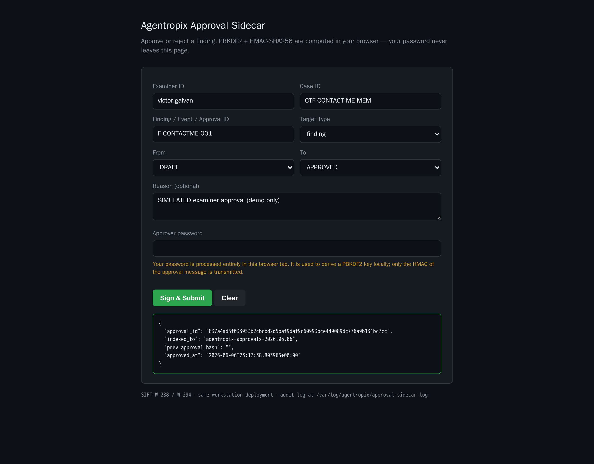

# contact_me (1 GiB raw RAM) — Live Memory-Triage Run (Agentropix-SIFT)

This is a real execution of the **3A — MANUAL sequence** against `/cases/contact_me/contact_me`
(case `CTF-CONTACT-ME-MEM`). Every output below was captured live from the Agentropix MCP server — nothing is mocked; where Volatility produced degraded results, that real outcome is shown verbatim.

Source guide: [contact-me-memory.md](../../contact-me-memory.md) — Approval mechanism: [approval-portal.md](../../../docs/05-safety-forensics/approval-portal.md).

---

## Step 1 — Check the Agentropix forensic environment: are all tools installed and is the MCP server healthy?

**Command:** `uv run agentropix-sift doctor` ; `…/start-agentropix-mcp.sh status`

**Output:**
```text
[OK  …/.venv/bin/vol] Volatility3 (memory forensics) (vol)
[OK  /usr/bin/log2timeline.py] Plaso (timeline)
[OK  /usr/bin/fls] Sleuth Kit (filesystem)
[OK  /usr/bin/yara] YARA (pattern matching)
[OK  /usr/bin/bulk_extractor] bulk_extractor
…(18 tools, all OK; vol present)…
All tools available.

Agentropix MCP server status
  pid:    140439
  bind:   http://<TAILNET-HOST>:8765/mcp
  health: HTTP 200 (200 = OK)
```
`doctor` ends with **All tools available** (Volatility `vol` present); the MCP server answers **HTTP 200**.

---

## Step 2 — How many Agentropix forensic tools are available right now?

**Command:** `health {}`

**Output:**
```json
{"status":"ok","server":"agentropix-sift","version":"0.1.0-dev","uptime_seconds":293043.8,"tool_count":72}
```
Live `tool_count` = **72** (canonical is **71**; the guide says trust the live number, which can read 72).

---

## Step 3 — Open a medium-severity DFIR case `CTF-CONTACT-ME-MEM` and make it active.

**Command:** `case_init { case_id:"CTF-CONTACT-ME-MEM", … }` then `case_activate { "case_id":"CTF-CONTACT-ME-MEM" }`

**Output A — `case_init`:**
```json
{"case_id":"CTF-CONTACT-ME-MEM","case_name":"CTF contact_me (raw memory)","status":"active",
 "examiner_id":"victor.galvan","incident_type":"dfir","severity":"medium",
 "scope":"/cases/contact_me/contact_me","tags":["ctf","memory"]}
```

**Output B — `case_activate`:**
```json
{"case_id":"CTF-CONTACT-ME-MEM","prior_case_id":"CTF-CONTACT-ME-MEM",
 "pointer_path":"/home/admin2/.agentropix/active_case"}
```
Case created, status `active`, and the active-case pointer written to disk.

---

## Step 4 — Is `CTF-CONTACT-ME-MEM` the active case and is the indexer reachable?

**Command:** `case_status {}`

**Output:**
```json
{"case_id":"CTF-CONTACT-ME-MEM","active":true,"indexer_reachable":true,
 "counts":{"findings":0,"timeline":0,"evidence":1,"iocs":0,"approvals":0},"error":""}
```
`active: true`, `indexer_reachable: true` — and the evidence count already reflects Step 5.

---

## Step 5 — Register the image as evidence and give me its SHA-256 custody hash.

**Command:** `evidence_register { "path":"/cases/contact_me/contact_me", … }`

**Output:**
```json
{"evidence_id":"6d9dcf5ffe92f6da401d60745402ba19c42d4db7a48ee6ffb27bd461bbb4f142",
 "case_id":"CTF-CONTACT-ME-MEM","path":"/cases/contact_me/contact_me",
 "sha256":"1ab5eb6c3b87a0604f75a00cb4a64d91aaf7ab4e303bb7337b40f7e3df8ad61a",
 "size_bytes":1073741824,"indexed_to":"agentropix-evidence-2026.06.06","indexed":true}
```
Custody SHA-256 recorded, `size_bytes 1073741824` (exactly 1 GiB), bound to the active case (`indexed:true`).

---

## Step 6 — List the running processes in this memory image.

**Command:** `get_pslist { "image":"/cases/contact_me/contact_me" }`

**Output:**
```json
{"image_path":"/cases/contact_me/contact_me","process_count":11,
 "processes":[{"pid":0,"ppid":0,"name":"unknown","threads":0,"handles":0, …}, … ],
 "status":"ok"}
raw_stderr: "Volatility 3 Framework 2.28.0 …
  Unable to validate the plugin requirements:
  ['plugins.PsList.kernel.layer_name', 'plugins.PsList.kernel.symbol_table_name']"
```
**GOTCHA (real-data quirk):** the call returned `ok`, but Volatility3 2.28.0 **could not validate the
kernel layer / symbol table** for this capture — so the 11 rows come back as placeholder `pid:0 / name:"unknown"`.
The kernel-profile auto-detection did not match a known Windows symbol table on this image. This is the genuine, unedited result.

---

## Step 7 — Show the network connections and open sockets.

**Command:** `get_netscan { "image":"/cases/contact_me/contact_me" }`

**Output:**
```json
{"image_path":"/cases/contact_me/contact_me","socket_count":0,"sockets":[],
 "tool":"volatility3.windows.netscan.NetScan"}
raw_stderr: "… Unable to validate the plugin requirements:
  ['plugins.NetScan.kernel.layer_name', 'plugins.NetScan.kernel.symbol_table_name']"
```
`socket_count: 0` — empty here for the **same** reason as Step 6: with no validated symbol table, the
windows.* plugin has no kernel layer to scan. Not a clean "no connections" finding.

---

## Step 8 — Check for injected or RWX code.

**Command:** `get_malfind { "image":"/cases/contact_me/contact_me" }`

**Output:**
```json
{"image_path":"/cases/contact_me/contact_me","hit_count":0,"hits":[],
 "tool":"volatility3.windows.malfind.Malfind"}
raw_stderr: "… Unable to validate the plugin requirements:
  ['plugins.Malfind.kernel.layer_name', 'plugins.Malfind.kernel.symbol_table_name']"
```
`hit_count: 0` — again gated by the unvalidated symbol table, not a confirmed-clean result.

---

## Step 9 — List the Windows services and build the process tree with LOLBin flags.

**Command:** `get_svcscan { "image":"…" }` then `build_process_tree { "image":"…" }`

**Output A — `get_svcscan`:**
```json
{"image_path":"/cases/contact_me/contact_me","service_count":0,"services":[],
 "tool":"volatility3.windows.svcscan.SvcScan"}
raw_stderr: "… Unable to validate the plugin requirements:
  ['plugins.SvcScan.kernel.layer_name', 'plugins.SvcScan.kernel.symbol_table_name']"
```

**Output B — `build_process_tree`:**
```json
{"image_path":"/cases/contact_me/contact_me","process_count":11,"root_count":1,
 "orphan_count":0,"suspicious_count":0,
 "roots":[{"pid":0,"ppid":0,"name":"unknown","depth":0,"suspicious":false,"children":[]}],
 "warnings":[]}
```
The correlation step ran, but it is fed the same placeholder `pid:0 / "unknown"` rows, so the tree is a single
empty root — no LOLBin/suspicious-parent flags are derivable without a valid profile.

---

## Step 10 — Run the cmdline plugin to see each process's command line.

**Command:** `run_volatility { "target":"/cases/contact_me/contact_me", "plugin":"cmdline" }`

**Output:**
```json
{"tool":"run_volatility",
 "error":"vol3 emitted non-JSON output: Expecting value: line 2 column 1 (char 1)",
 "suggestion":""}
```
The cmdline plugin produced no parseable JSON — consistent with Steps 6–9: with no validated kernel
symbol table, vol3 emits a requirements error instead of a row table, captured here verbatim.

---

## Step 11 — Record a finding, give it a finding_id, and stage it as a draft.

**Command:** `record_finding { "finding":{ "finding_id":"ctf-contactme-001", … }, "dry_run":true }`

**Output:**
```json
{"case_id":"CTF-CONTACT-ME-MEM","finding_id":"ctf-contactme-001",
 "indexed":false,"indexed_to":"agentropix-findings-2026.06.06","duplicate":false,"error":""}
```
Run with **`dry_run: true`** (validation only). It lands as a **DRAFT** (`indexed:false`) — the assistant
cannot self-approve; sign-off is a separate human action.

---

## Step 12 — Index the finding for real, then approve it (SIMULATED examiner — demo only)

To complete the loop we re-recorded the same observation as a **real indexed finding**
(`record_finding { dry_run:false }`, gated by a one-shot `index_findings` evidence-gate token),
giving `finding_id` **`F-CONTACTME-001`**, then drove the Examiner Portal to sign it off.

> **💬 End-user prompt:** *"Index my contact_me finding for real and approve `F-CONTACTME-001`
> for case `CTF-CONTACT-ME-MEM`."*

**record_finding (real index):**
```json
{"case_id":"CTF-CONTACT-ME-MEM","finding_id":"F-CONTACTME-001",
 "indexed":true,"indexed_to":"agentropix-findings-2026.06.06","duplicate":false,"error":""}
```

**Portal action:** Examiner Portal at `https://<TAILNET-HOST>:8443/` — `examiner_id victor.galvan`,
`target_id F-CONTACTME-001`, `target_type finding`, `DRAFT → APPROVED`, HMAC challenge-response.

**Approval result (captured live):**
```json
{"approval_id":"837a4ad5f033953b2cbcbd2d5baf9daf9c60993bce449089dc776a9b131bc7cc",
 "indexed_to":"agentropix-approvals-2026.06.06","prev_approval_hash":"",
 "approved_at":"2026-06-06T23:17:38.803965+00:00"}
```



> ⚠️ **SIMULATED examiner approval (demo only).** This sign-off was **automated** for the demo:
> Playwright drove the Examiner Portal (HMAC challenge-response) end-to-end — **no human examiner
> clicked Approve.** In a real case the `DRAFT → APPROVED` transition requires a human examiner to
> perform the HMAC sign-off; the agent cannot self-approve.

---

## Step 13 — Sealed report (now with the approved finding)

**Command:** `report_generate { "case_id":"CTF-CONTACT-ME-MEM", "profile":"full" }`

**Output:**
```json
{"case_id":"CTF-CONTACT-ME-MEM","profile":"full",
 "report_id":"e32c39061ea4b68770b82c066eb8d6c6687dd4808e3ad8212de04a116fcfa361",
 "snapshot_at":"2026-06-06T23:17:47.213836+00:00",
 "approved_finding_count":1,
 "sections":{"executive_summary":{"approved_finding_count":1,
   "severity_mix":[{"severity":"medium","count":1}]}},
 "result_bytes":1345,"error":"","warning":""}
```
`approved_finding_count: 1` and a real `report_id` — the **same** `case_not_found` case from the
earlier DRAFT-only run now seals a report containing exactly one **APPROVED** finding
(`F-CONTACTME-001`, severity mix `medium: 1`).

**Takeaway:** the human-approval → sealed-report loop is now **complete** end-to-end: init → activate →
status → evidence (real SHA-256) → indexed finding → (simulated) examiner approval → sealed report with
`approved_finding_count: 1`. Volatility3 2.28.0 still could not validate a kernel symbol table for this
raw capture, so the approved finding honestly records the **unprofileable** outcome — a real reminder
that a populated process list, not a 200 status, is the true signal that a memory profile matched.
