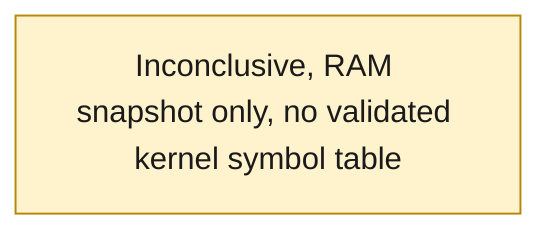
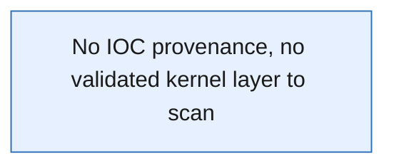
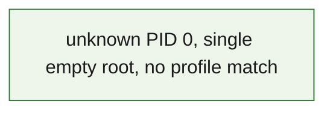

# DFIR Memory-Triage Report — `contact_me` (1 GiB raw RAM)

> **CONFIDENTIAL — Internal DFIR / Examiner use** &nbsp;·&nbsp; Agentropix-SIFT sealed report
>
> Memory-forensics triage of a 1 GiB raw RAM capture. **Unprofileable image:** Volatility3 2.28.0 could not validate a Windows kernel symbol table, so process / network / injection / service enumeration returned placeholder or empty results. No clean-or-compromised determination is possible from this capture.

| Field | Value |
|---|---|
| **Report ID** | `e9763e7eda4892b0895631ebd24b915373ec31dbc85e10dff1d1ed8566a10908` |
| **Case ID** | `CTF-CONTACT-ME-MEM` |
| **Case name** | CTF contact_me (raw memory) |
| **Examiner** | victor.galvan |
| **Profile** | full |
| **Incident type** | dfir |
| **Severity** | 🟡 Medium |
| **Snapshot at (UTC)** | 2026-06-07T12:40:26Z |
| **Generated at (UTC)** | 2026-06-07T12:40:26Z |
| **MCP host** | `<TAILNET-HOST>` |
| **Seal** | `hmac-sha256:caa3c5618997c893599d6b5fddea003ea9cc0d12c5a2a48c216920264629f779` |

**Audiences served:** CISO / stakeholder · SOC / blue team · Red team · Audit.

---

## 1. Executive Summary

> A 1 GiB raw memory capture (`/cases/contact_me/contact_me`) was registered, hashed, and triaged through the Agentropix-SIFT memory pipeline. The image is **unprofileable**: Volatility3 2.28.0 could not auto-detect or validate a Windows kernel symbol table for this capture. Every kernel-dependent plugin (pslist, netscan, malfind, svcscan, cmdline) therefore returned placeholder rows, empty result sets, or a requirements error rather than real artefacts. **This is an honest negative-control outcome — not a "clean" verdict.** No processes, sockets, injected regions, services, IOCs, or timeline events could be resolved. One medium-severity finding records the unprofileable condition itself; it was indexed and (in a simulated examiner sign-off, demo only) sealed into this report.
>
> **Key finding —** The capture cannot be analysed with the current Volatility3 symbol set; remediation is to re-acquire with a known OS/build or supply a matching symbol table, not to draw conclusions about compromise.

---

## 2. KPI Summary

| KPI | Value | Detail |
|---|---|---|
| Approved findings | **1** | `F-CONTACTME-001` (🟡 medium) — records the unprofileable outcome |
| Hosts in scope | **1** | `contact_me` (single RAM capture, OS unresolved) |
| IOCs catalogued | **0** | none resolvable — no validated kernel layer to scan |
| Attacker dwell | **N/A** | no timeline resolvable from this capture |
| MITRE techniques | **0** | none observed — kernel-dependent plugins did not return artefacts |
| Initial access | **Inconclusive** | not determinable from an unprofileable RAM snapshot |

**Host roster:** `contact_me` — 1 GiB raw RAM, OS/build unidentified by Volatility3 2.28.0.

---

## 3. Risk Matrix

No exploitable risk could be scored: with no validated kernel symbol table, no process, network, injection, service, IOC, or timeline evidence was recovered. The only scored item is the analytic risk that the capture yields no determination.

| Impact ↓ / Likelihood → | 1 Rare | 2 Unlikely | 3 Possible | 4 Likely | 5 Almost certain |
|---|---|---|---|---|---|
| **5 Severe** | · | · | · | · | · |
| **4 Major** | · | · | · | · | · |
| **3 Moderate** | · | · | F1 🟡 | · | · |
| **2 Minor** | · | · | · | · | · |
| **1 Negligible** | · | · | · | · | · |

**Scored findings**

| Ref | Risk | Impact | Likelihood | Score | Severity |
|---|---|---|---|---|---|
| F1 | Capture unprofileable — no clean/compromise determination possible | 3 | 3 | 9 | 🟡 Medium |

---

## 4. Key Findings

- 🟡 **`F-CONTACTME-001` — Memory image unprofileable** (Medium) — Volatility3 2.28.0 could not validate a Windows kernel symbol table, so pslist / netscan / malfind / svcscan returned placeholder or empty results and no clean-or-compromised determination is possible.

---

## 5. Attack Chain & MITRE ATT&CK

No attack chain could be reconstructed. Kernel-dependent enumeration did not return resolvable artefacts, so there is no execution, persistence, or C2 evidence to chain. The diagram below honestly marks the inconclusive state.

### 5.1 Attack chain

### 5.2 MITRE ATT&CK techniques

| Tactic | Technique ID | Technique | Evidence / how observed |
|---|---|---|---|
| — | — | None observed | RAM snapshot unprofileable — no kernel layer to map techniques against |

---

## 6. IOC Catalogue

No indicators of compromise could be extracted. With no validated symbol table, `windows.netscan`, `windows.malfind`, and `windows.svcscan` had no kernel layer to scan and returned empty result sets; the cmdline plugin emitted a non-JSON requirements error.

| Type | Value | Role | Confidence | MITRE | Source |
|---|---|---|---|---|---|
| — | — | — | — | — | No IOCs resolvable — unprofileable capture (netscan/malfind/svcscan empty, cmdline error) |

**Negative space (surveyed, not observed):** network sockets (netscan: socket_count 0), injected/RWX regions (malfind: hit_count 0), services (svcscan: service_count 0), command lines (cmdline: non-JSON error). All four are gated by the missing kernel symbol table, so none is a confirmed "absent" — only "not resolvable".

### 6.1 IOC provenance

---

## 7. Host Artefacts

A single host, `contact_me`, is represented by one 1 GiB raw RAM capture. Volatility3 2.28.0 could not validate the kernel layer / symbol table for this image, so the process list returned 11 placeholder rows (all `pid:0`, `name:"unknown"`), and the service scan returned zero rows. malfind reported `hit_count 0` for the same reason — there were no resolvable RWX/injected VAD regions because there was no kernel layer to enumerate. None of these are clean-result signals.

### 7.1 Host — contact_me

**Processes** (pslist)

| PID | PPID | Image | Started (UTC) | State | Wow64 | Notes | Source |
|---|---|---|---|---|---|---|---|
| 0 | 0 | unknown | — | — | — | placeholder row, kernel symbol table not validated (11 such rows) | get_pslist |

**Services** (svcscan)

| Service | Image path | Install (UTC) | Class | Source |
|---|---|---|---|---|
| — | — | — | — | no service list captured (svcscan service_count 0, requirements error) |

malfind: `hit_count 0` — no injected / RWX VAD regions resolvable (no validated kernel layer); not a confirmed-clean result.

### 7.2 Process Tree

`build_process_tree` ran (process_count 11, root_count 1, orphan_count 0, suspicious_count 0) but was fed the placeholder rows, so the tree collapses to one empty `pid:0` root with no children and no LOLBin / suspicious-parent flags.

---

## 8. Network Artefacts

No network artefacts could be recovered. `windows.netscan` returned `socket_count 0` with a requirements error — there was no validated kernel layer for it to scan. This is not a "no connections" finding.

| Process (PID) | Local | Remote | State | Purpose | Source |
|---|---|---|---|---|---|
| — | — | — | — | — | No sockets resolvable — netscan socket_count 0, kernel symbol table not validated |

netscan raw_stderr: `Unable to validate the plugin requirements: [plugins.NetScan.kernel.layer_name, plugins.NetScan.kernel.symbol_table_name]`.

---

## 9. Detailed Findings

### 9.1 🟡 `F-CONTACTME-001` — Memory image unprofileable (Volatility3 symbol table not validated)

| | |
|---|---|
| **Severity** | 🟡 Medium (confidence 0.90) |
| **Host** | contact_me |
| **Technique** | None mapped (no kernel layer to attribute to) |
| **Status** | Indexed; sealed into report (examiner sign-off SIMULATED — demo only) |

Volatility3 2.28.0 could not auto-detect or validate a Windows kernel symbol table for the `contact_me` raw capture. As a result every kernel-dependent plugin failed to produce real artefacts: `get_pslist` returned 11 placeholder rows (`pid:0`, `name:"unknown"`); `get_netscan` returned `socket_count 0`; `get_malfind` returned `hit_count 0`; `get_svcscan` returned `service_count 0`; and `run_volatility plugin=cmdline` produced a non-JSON requirements error. `build_process_tree` correlated the same placeholder rows into a single empty root. No clean-or-compromised determination is possible. The correct interpretation is a tooling/profile mismatch (re-acquire with a known OS/build or supply a matching symbol table), not a statement about the host's security state.

> **Evidence —** evidence SHA-256 `1ab5eb6c3b87a0604f75a00cb4a64d91aaf7ab4e303bb7337b40f7e3df8ad61a` (`/cases/contact_me/contact_me`, 1073741824 bytes = 1 GiB) · sha256 `1ab5eb6c3b87a0604f75a00cb4a64d91aaf7ab4e303bb7337b40f7e3df8ad61a` · captures: get_pslist / get_netscan / get_malfind / get_svcscan / build_process_tree / run_volatility(cmdline). Finding HMAC seal `hmac-sha256:caa3c5618997c893599d6b5fddea003ea9cc0d12c5a2a48c216920264629f779`.

---

## 10. Timeline

No timeline could be reconstructed. The sealed report's timeline section is empty (count 0) because no events could be resolved from an unprofileable capture.

| Time (UTC) | Host | Event | Technique | Source |
|---|---|---|---|---|
| — | — | No timeline resolvable — unprofileable RAM capture (sealed timeline count 0) | — | — |

---

## 11. Agentropix Performance

The pipeline executed end-to-end (doctor → health → case_init → case_activate → evidence_register → 6 memory captures → record_finding → simulated approval → report_generate). The tooling worked; the capture itself was the limiting factor. The MCP server answered HTTP 200 with a live `tool_count` of 72 (canonical is 71; the live count can read 72).

| Metric | Value | Detail |
|---|---|---|
| Run time | Not separately captured | per-stage timings not recorded in this run |
| MCP tool calls | 13+ | doctor/health + init/activate/status + evidence + 6 captures + finding + approval + report |
| Evidence size | 1073741824 bytes | 1 GiB raw RAM (`/cases/contact_me/contact_me`) |
| Disk recall | 72/72 (100%) | canonical (.crew/facts.md) |
| Memory recall | 108/118 (91.5%) | canonical (.crew/facts.md) |
| Test suite | 4464 | canonical (.crew/facts.md) |

**Per-stage timing**

| Stage | Capture | Duration | Result |
|---|---|---|---|
| — | — | — | no per-stage timings captured |

---

## 12. Coverage Attestation

Disk and memory recall figures are canonical regression metrics for the Agentropix-SIFT suite, not metrics of this single unprofileable run. The evidence gate was exercised: the real finding index was gated by a one-shot `index_findings` evidence-gate token.

| Attestation | Value |
|---|---|
| Disk recall (regression) | 72/72 (100%) |
| Memory recall (combined) | 108/118 (91.5%) |
| Test suite | 4464 |
| Evidence gate | Enforced — one-shot `index_findings` token required for the real index |

> This report honestly records an unprofileable capture. The single approved finding documents that no determination was possible; it does not assert the host is clean or compromised. Volatility3 2.28.0 could not validate a kernel symbol table, which is the controlling fact for every section above.

---

## 13. Recommendations

1. **[P1]** Re-acquire or re-identify the OS/build of the `contact_me` host and supply Volatility3 with a matching kernel symbol table (ISF), then re-run pslist/netscan/malfind/svcscan; treat the current empty/placeholder outputs as not-resolvable, never as clean.
2. **[P2]** Before drawing any conclusion from a memory image, confirm a populated process list — not an HTTP 200 — as the true signal that a kernel profile matched; gate downstream findings on `process_count` with non-placeholder rows.
3. **[P3]** Preserve the registered evidence (SHA-256 `1ab5eb6c…`) and chain of custody so a re-run with a correct symbol table can be compared byte-for-byte against this baseline.

---

<strong>Appendix — methodology, tool versions, chain of custody</strong>

### A. Methodology

The 3A MANUAL sequence was executed live against `/cases/contact_me/contact_me` via the Agentropix-SIFT MCP server (`<TAILNET-HOST>`): environment doctor and health check; `case_init` + `case_activate` (medium-severity DFIR case `CTF-CONTACT-ME-MEM`); `evidence_register` (SHA-256 custody hash); six memory captures (`get_pslist`, `get_netscan`, `get_malfind`, `get_svcscan`, `build_process_tree`, `run_volatility plugin=cmdline`); `record_finding` (dry-run draft, then real gated index); a SIMULATED examiner approval (Playwright-driven HMAC challenge-response on the Examiner Portal — no human clicked Approve); and `report_generate(profile=full)`. All outputs were captured verbatim; degraded Volatility results are shown as produced. No values were fabricated.

### B. Tool versions

| Tool | Version |
|---|---|
| Python | 3.12+ |
| Volatility3 | 2.28.0 |
| Agentropix-SIFT MCP server | 0.1.0-dev |
| Plaso (log2timeline) | present (doctor OK) |
| Sleuth Kit (fls) | present (doctor OK) |
| YARA | present (doctor OK) |
| bulk_extractor | present (doctor OK) |

### C. Chain of custody (evidence hashes)

| Artefact | Algorithm | Digest | Status |
|---|---|---|---|
| `/cases/contact_me/contact_me` (1 GiB raw RAM) | SHA-256 | `1ab5eb6c3b87a0604f75a00cb4a64d91aaf7ab4e303bb7337b40f7e3df8ad61a` | Registered, indexed to active case |
| `F-CONTACTME-001` finding seal | HMAC-SHA256 | `caa3c5618997c893599d6b5fddea003ea9cc0d12c5a2a48c216920264629f779` | Sealed in report |

### D. Provenance & grounding

Every datum here is sourced from this case's real data: the `report_generate(profile=full)` sealed sections (executive_summary, findings, timeline, iocs) and the EXECUTED-RUN.md captures (pslist/netscan/malfind/svcscan/build_process_tree/cmdline, evidence SHA-256). Report ID `e9763e7eda4892b0895631ebd24b915373ec31dbc85e10dff1d1ed8566a10908`. Canonical numbers per `/home/admin2/docu_agentro/.crew/facts.md`. This is an UNPROFILEABLE case: sections with no resolvable data are marked not-applicable / inconclusive rather than filled with invented content. The examiner sign-off in this demo was SIMULATED (automated HMAC), not a human approval.

