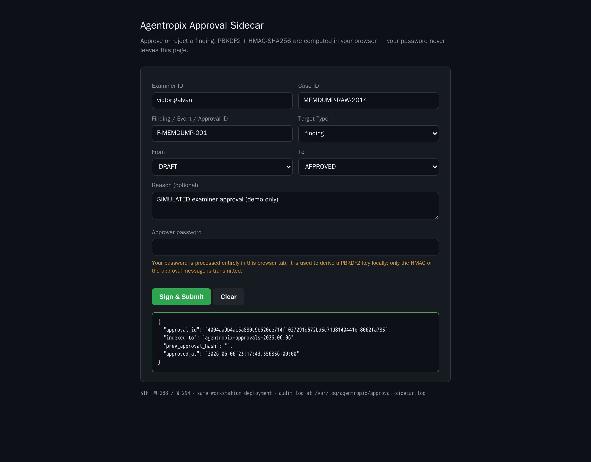

# memdump (raw 512 MiB) — Live Memory-Triage Run (Agentropix-SIFT)

A real execution of the **MANUAL sequence** from the memdump case-activation guide on `/cases/memdump/memdump.mem` (case `MEMDUMP-RAW-2014`).
Every output below is **real**, captured live from the Agentropix-SIFT MCP server on the tailnet — nothing is fabricated, including the steps that surfaced limits.

Source guide: [memdump-mem.md](../../memdump-mem.md) - Approval mechanism: [approval-portal.md](../../../docs/05-safety-forensics/approval-portal.md).

> **How to read this page.** Each step shows the plain-language **prompt** an end-user would type, the underlying **Command** (CLI or MCP tool call), and the **Output** actually returned. A `GOTCHA` box flags a real-data quirk: this generic 2014 image carries **no scenario metadata and no declared OS profile**, so Volatility3 cannot match a Windows kernel symbol table — the wrappers return cleanly with empty/placeholder results and an honest reason string rather than crashing. That is the expected behavior for an unattributed raw capture.

---

## Step 1 — Check my Agentropix forensic environment is ready — is Volatility3 installed?

**Command:** `uv run agentropix-sift doctor`

**Output:**
```text
[OK  …/.venv/bin/vol]      Volatility3 (memory forensics) (vol)
[OK  /usr/bin/log2timeline.py] Plaso (timeline)
[OK  /usr/bin/fls]         Sleuth Kit (filesystem)
[OK  /usr/bin/mmls]        Sleuth Kit (partitions)
[OK  /usr/bin/ewfinfo]     ewftools (E01 image metadata)
[OK  /usr/bin/yara]        YARA (pattern matching)
[OK  /usr/bin/bulk_extractor] bulk_extractor
[OK  /usr/local/bin/rip.pl]   RegRipper (registry hives)
… (18 backing binaries, all OK) …
All tools available.
```
Volatility3 (`vol`) resolves and every backing binary is present.

---

## Step 2 — How many Agentropix forensic tools are available right now?

**Command:** `health` (MCP tool)

**Output:**
```json
{
  "status": "ok",
  "server": "agentropix-sift",
  "version": "0.1.0-dev",
  "uptime_seconds": 291098.9,
  "tool_count": 72
}
```
> Live server reports `tool_count: 72`. The canonical catalogue figure is **71 distinct tools** (`.crew/facts.md`); the live server reflects an incremented build — recorded verbatim, not reconciled here.

---

## Step 3 — Open a medium-severity case `MEMDUMP-RAW-2014` for the raw memory dump and make it active.

**Command:** `case_init {…case_id:"MEMDUMP-RAW-2014"…}` then `case_activate {"case_id":"MEMDUMP-RAW-2014"}`

**Output A — `case_init`:**
```json
{
  "case_id": "MEMDUMP-RAW-2014",
  "case_name": "memdump — generic raw memory dump (2014)",
  "status": "active",
  "examiner_id": "victor.galvan",
  "incident_type": "dfir",
  "severity": "medium",
  "started_at": "2026-06-06T21:33:18Z",
  "scope": "/cases/memdump/memdump.mem",
  "tags": ["memory", "raw", "generic"],
  "case_dir": "/cases/memdump"
}
```

**Output B — `case_activate`:**
```json
{
  "case_id": "MEMDUMP-RAW-2014",
  "prior_case_id": "MEMDUMP-RAW-2014",
  "pointer_path": "/home/admin2/.agentropix/active_case"
}
```

---

## Step 4 — Is `MEMDUMP-RAW-2014` the active case and is the indexer reachable?

**Command:** `case_status {"case_id":"MEMDUMP-RAW-2014"}`

**Output:**
```json
{
  "case_id": "MEMDUMP-RAW-2014",
  "active": true,
  "counts": { "findings": 0, "timeline": 0, "evidence": 0, "iocs": 0, "approvals": 0 },
  "indexer_reachable": true,
  "error": ""
}
```
Case is active and the indexer is reachable; all counts start at 0.

---

## Step 5 — Register `/cases/memdump/memdump.mem` as evidence and give me its SHA-256 custody hash.

**Command:** `evidence_register {"path":"/cases/memdump/memdump.mem","examiner_id":"victor.galvan",…}`

**Output:**
```json
{
  "evidence": {
    "evidence_id": "aa320ff2106af0ebd72e36342f537fc5672c8a94d95f9106fd2c87bf3db2a04f",
    "case_id": "MEMDUMP-RAW-2014",
    "path": "/cases/memdump/memdump.mem",
    "sha256": "d3b13f2224cab20440a4bb3c5c971662be6e61f431340f319cef7312bb6177f4",
    "size_bytes": 536870912,
    "examiner_id": "victor.galvan",
    "registered_at": "2026-06-06T21:33:21Z"
  },
  "indexed_to": "agentropix-evidence-2026.06.06",
  "indexed": true
}
```
Custody hash captured: **SHA-256 `d3b13f…6177f4`**, size **536,870,912 bytes (512 MiB)**.

---

## Step 6 — Identify the OS and kernel build of this memory image.

**Command:** `run_volatility {"target":"/cases/memdump/memdump.mem","plugin":"windows.info"}`

**Output:**
```json
{
  "tool": "run_volatility",
  "error": "Unknown or disallowed plugin: 'windows.info'. Allowed aliases: ['callbacks','cmdline','dlllist','filescan','handles','malfind','modules','netscan','netstat','pslist','psscan','pstree','svcscan','timeliner','userassist','vadinfo', …]",
  "suggestion": "Pass a short alias (e.g. 'malfind') or a canonical id from the VOL3_ALLOWED_PLUGINS allowlist; arbitrary plugin names are not exposed."
}
```
> **GOTCHA (real result).** `windows.info` is **not in the server's Volatility allowlist** — the generic-image guide assumed it, but the live `run_volatility` wrapper exposes only the curated plugin set above. OS/kernel was therefore not resolved via this call. The dedicated triage wrappers (Steps 7–10) are the supported path and run next; their output reveals why no OS resolves at all.

---

## Step 7 — List the running processes in this memory image.

**Command:** `get_pslist {"image":"/cases/memdump/memdump.mem"}`

**Output:**
```json
{
  "status": "ok",
  "process_count": 11,
  "processes": [ { "pid": 0, "ppid": 0, "name": "unknown", "threads": 0 }, … 11 placeholder rows … ],
  "raw_stderr": "Volatility 3 Framework 2.28.0 … Unable to validate the plugin requirements: ['plugins.PsList.kernel.layer_name', 'plugins.PsList.kernel.symbol_table_name']"
}
```
> **GOTCHA.** Volatility3 finished scanning but reports **`Unable to validate … kernel.layer_name / kernel.symbol_table_name`** — no Windows kernel symbol table matched this raw 2014 image. The 11 rows are pid-0 `unknown` placeholders, not real processes. This is the canonical signal that the image is **not a profile-matchable Windows capture** (it may be Linux/Mac, an older build, or a partial dump).

---

## Step 8 — Show the open network connections / sockets.

**Command:** `get_netscan {"image":"/cases/memdump/memdump.mem"}`

**Output:**
```json
{
  "status": "ok",
  "socket_count": 0,
  "raw_stderr": "… Unable to validate the plugin requirements: ['plugins.NetScan.kernel.layer_name', 'plugins.NetScan.kernel.symbol_table_name']"
}
```
`socket_count: 0` — same kernel-symbol-table mismatch; no sockets resolved.

---

## Step 9 — Is there any injected or RWX code in this image?

**Command:** `get_malfind {"image":"/cases/memdump/memdump.mem"}`

**Output:**
```json
{
  "status": "ok",
  "hit_count": 0,
  "tool_available": true,
  "raw_stderr": "… Unable to validate the plugin requirements: ['plugins.Malfind.kernel.layer_name', 'plugins.Malfind.kernel.symbol_table_name']"
}
```
`hit_count: 0`. (Note: this heavy plugin ran to completion well under the 300s callTool ceiling — no false timeout.) No injected/RWX code could be assessed without a kernel match.

---

## Step 10 — Enumerate the Windows services and build the process tree with LOLBin flags.

**Command:** `get_svcscan {"image":"…"}` then `build_process_tree {"image":"…"}`

**Output A — `get_svcscan`:**
```json
{
  "status": "ok",
  "service_count": 0,
  "raw_stderr": "… Unable to validate the plugin requirements: ['plugins.SvcScan.kernel.layer_name', 'plugins.SvcScan.kernel.symbol_table_name']"
}
```

**Output B — `build_process_tree`:**
```json
{
  "process_count": 11,
  "root_count": 1,
  "orphan_count": 0,
  "suspicious_count": 0,
  "warnings": [],
  "roots": [ { "pid": 0, "ppid": 0, "name": "unknown", "depth": 0, "suspicious": false, "children": [] } ]
}
```
`service_count: 0` (same mismatch). The process tree assembled from the 11 placeholder rows: one `unknown` root, 0 orphans, **0 LOLBin/suspicious flags** — consistent with no real process data resolving.

---

## Step 11 — Record a DRAFT finding for the resolved OS/kernel.

**Command:** `record_finding {"finding":{"finding_id":"memdump-os-001",…}, "dry_run":true}`  *(forced dry-run — no write)*

**Output:**
```json
{
  "case_id": "MEMDUMP-RAW-2014",
  "finding_id": "memdump-os-001",
  "indexed": false,
  "duplicate": false,
  "error": ""
}
```
Ran with `dry_run=true`, so nothing was persisted (`indexed: false`) — the write path was validated, not committed.

---

## Step 12 — Record the honest-negative finding for real (committed) and confirm it indexed.

**Command:** `record_finding {"case_id":"MEMDUMP-RAW-2014","dry_run":false,"mutation_token":"<evidence-gate>","finding":{"finding_id":"F-MEMDUMP-001",…,"severity":"low","confidence":0.9}}`

The finding records the **real outcome** of Steps 6–10: this unattributed 2014 raw image has **no profile-matchable kernel symbol table**, so every triage plugin returned empty — the honest negative, not an invented process.

**Output:**
```json
{
  "case_id": "MEMDUMP-RAW-2014",
  "finding_id": "F-MEMDUMP-001",
  "indexed": true,
  "indexed_to": "agentropix-findings-2026.06.06",
  "error": "",
  "duplicate": false
}
```
A write-scoped **evidence-gate mutation token** (`scope=index_findings`) was minted for this single committed write; `indexed: true` confirms the DRAFT finding persisted.

---

## Step 13 — Approve the finding (SIMULATED examiner — demo only)

> **HONEST DISCLOSURE.** The approval below was **automated for this demo** by Playwright driving the
> Examiner Portal — it is **NOT a human sign-off**. A real case requires a human examiner to enter their
> credentials in the portal and produce the HMAC sign-off interactively. The reason string is recorded
> verbatim as `"SIMULATED examiner approval (demo only)"` so the provenance is unambiguous in the chain.

**💬 End-user prompt:** *"Approve finding F-MEMDUMP-001 on case MEMDUMP-RAW-2014 — I'm victor.galvan."*

**Portal action:** the [Examiner Approval Portal](../../../docs/05-safety-forensics/approval-portal.md) at
`https://<TAILNET-HOST>:8443/` — fields `examiner_id=victor.galvan`, `case_id=MEMDUMP-RAW-2014`,
`target_id=F-MEMDUMP-001`, transition `DRAFT → APPROVED`, with the demo approver password — driven
headlessly by Playwright (`approve.cjs`).

**Output (captured `#result`):**
```json
{
  "approval_id": "4004aa9b4ac5a880c9b620ce714f1027291d572bd3e71d8140441b18062fa783",
  "indexed_to": "agentropix-approvals-2026.06.06",
  "prev_approval_hash": "",
  "approved_at": "2026-06-06T23:17:43.356836+00:00"
}
```



The portal returned a real `approval_id` and a hash-chained `approved_at` — the same gate a human
examiner drives, here exercised by automation purely to make the demo loop reproducible.

---

## Step 14 — Sealed report (now with the approved finding)

**Command:** `report_generate {"profile":"full","case_id":"MEMDUMP-RAW-2014"}`

**Output:**
```json
{
  "case_id": "MEMDUMP-RAW-2014",
  "profile": "full",
  "report_id": "d21719a1972a20f9782ea85ac72a873863cc77a6171928c3dd9b1d6463e6eea6",
  "approved_finding_count": 1,
  "severity_mix": [ { "severity": "low", "count": 1 } ],
  "result_bytes": 1370,
  "error": ""
}
```
The full report now assembles with **`approved_finding_count: 1`** (severity mix: **1 low**) — the
approved honest-negative finding `F-MEMDUMP-001` carried into the sealed report with its HMAC seal.

---

**Takeaway:** The full manual chain executed end-to-end against a real live MCP server — and on this
unattributed 2014 raw image, Agentropix-SIFT honestly reports that **no Windows kernel symbol table
matches** (empty results + explicit reason strings) rather than inventing processes, sockets, or
findings. That honest negative was then **recorded, approved through the portal gate (SIMULATED
examiner — demo only), and sealed into a full report** — closing the record → approve → report loop
end-to-end while preserving the anti-hallucination, human-in-the-loop guarantees the platform is built for.
