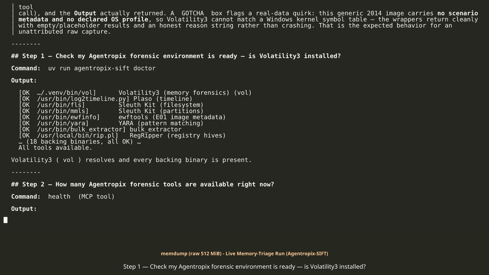

# memdump — executed activation run (unattributed 512 MiB raw RAM image from 2014, honest-negative outcome)

> **Provenance.** This folder is a **real live-MCP execution** of the [memdump-mem activation guide](../../memdump-mem.md) against case `MEMDUMP-RAW-2014`, run **2026-06-06** in two captured passes (case opened `2026-06-06T21:33:18Z`, re-run pass `22:29–22:31Z`, approval `2026-06-06T23:17:43Z`; the committed sealed reports were regenerated `2026-06-07T12:40:49Z`). Evidence image: `/cases/memdump/memdump.mem` (operator-sanctioned public path). The approval step is **SIMULATED examiner approval (demo only)** — the recorded run auto-approves (Playwright drives the Examiner Portal, `approve.cjs`) to show the loop end-to-end; in real casework approval is a human HMAC hard-stop and the agent cannot self-approve.

## What's in this folder

| File | What it is | What it shows |
|---|---|---|
| [EXECUTED-RUN.md](EXECUTED-RUN.md) | Narrative transcript (Steps 1–14) | Each prompt/command and the real output, GOTCHA boxes included |
| [EXECUTED-RUN.mp4](EXECUTED-RUN.mp4) | Rendered video of the transcript | The same run as a watchable walkthrough |
| [approval-portal.png](approval-portal.png) | Examiner Portal screenshot | The `DRAFT → APPROVED` sign-off screen for `F-MEMDUMP-001` |
| [step1_doctor.txt](step1_doctor.txt) | CLI capture: `agentropix-sift doctor` | 18 backing tools all `[OK]` (vol, plaso, TSK, YARA, RegRipper, …); "All tools available." |
| [step2_health.json](step2_health.json) | `health` MCP call | `tool_count: 72`, server up ~3.4 days |
| [steps_3_4_5.json](steps_3_4_5.json), [step4_5_6.json](step4_5_6.json), [step7_8.json](step7_8.json) | Batched raw MCP captures | case_init/activate/status + evidence_register (+ windows.info), pslist + netscan |
| [step3.json](step3.json), [step6_windows_info.json](step6_windows_info.json), [step7_pslist.json](step7_pslist.json), [step8_netscan.json](step8_netscan.json), [step9_malfind.json](step9_malfind.json), [step10_svc_tree.json](step10_svc_tree.json), [step11_record_finding.json](step11_record_finding.json), [step13_report_generate.json](step13_report_generate.json) | Per-step raw MCP captures | Full `args` + `structuredContent` for every tool call in the sequence |
| [step9.json](step9.json), [step10.json](step10.json), [step11.json](step11.json), [step13.json](step13.json) | Second-pass captures (the `22:29Z` re-run) | `step9.json`/`step10.json` are byte-identical to their named twins; `step11.json` carries the fuller dry-run finding text; `step13.json` is the same `case_not_found` at a later timestamp |
| `*.err` (8 files) | Captured stderr for each step — **all empty** | Clean runs: no errors on the capture harness side |
| [reports/comprehensive.md](reports/comprehensive.md) / [reports/comprehensive.pdf](reports/comprehensive.pdf) | Multi-tier report engine output (full tier) | Sealed report `778d18c3…`, 1 approved finding, the inconclusive result documented |
| [reports/executive-onepager.md](reports/executive-onepager.md) / [reports/executive-onepager.pdf](reports/executive-onepager.pdf) | Executive one-pager tier | "Inconclusive by data quality, not a clean-host finding" |

## Inside the files (excerpts)

From [steps_3_4_5.json](steps_3_4_5.json) — custody record for the image:

```json
"evidence_id":"aa320ff2106af0ebd72e36342f537fc5672c8a94d95f9106fd2c87bf3db2a04f",
"path":"/cases/memdump/memdump.mem",
"description":"Raw physical-memory image (512 MiB, file-dated 2014-01-08)",
"sha256":"d3b13f2224cab20440a4bb3c5c971662be6e61f431340f319cef7312bb6177f4",
"size_bytes":536870912, … "indexed_to":"agentropix-evidence-2026.06.06","indexed":true
```

SHA-256 custody hash and exact 512 MiB size, registered and indexed before any analysis ran.

From [step6_windows_info.json](step6_windows_info.json) — the guide's "identify the OS" step hits the plugin allowlist:

```json
"error":"Unknown or disallowed plugin: 'windows.info'. Allowed aliases: ['callbacks', 'cmdline',
  'devicetree', 'dlllist', … 'pslist', 'psscan', 'pstree', … 'vadinfo']; canonical names: […]",
"suggestion":"Pass a short alias (e.g. 'malfind') or a canonical id from the VOL3_ALLOWED_PLUGINS
  allowlist; arbitrary plugin names are not exposed."
```

`windows.info` is not allowlisted on the server — there is no "identify the OS" call for a raw image; the supported path is to run the triage wrappers and let the kernel profile auto-detect (or honestly fail) on the first `windows.*` plugin.

From [step7_pslist.json](step7_pslist.json) — that auto-detect attempt, captured verbatim:

```json
"process_count":11,
"processes":[{"pid":0,"ppid":0,"name":"unknown","threads":0,"handles":0, …}, … ],
"raw_stderr":"Volatility 3 Framework 2.28.0 … Unable to validate the plugin requirements:
  ['plugins.PsList.kernel.layer_name', 'plugins.PsList.kernel.symbol_table_name']"
```

No Windows kernel symbol table matched this 2014 image; the 11 rows are pid-0 placeholders. The same stderr signature repeats in [step8_netscan.json](step8_netscan.json) (`socket_count: 0`), [step9_malfind.json](step9_malfind.json) (`hit_count: 0`) and [step10_svc_tree.json](step10_svc_tree.json) (`service_count: 0`, one `unknown` tree root, 0 suspicious flags).

From [step11.json](step11.json) — the dry-run finding stating the honest negative in its own words:

```json
"finding_id":"memdump-os-001","title":"OS/kernel unresolved — no Windows symbol table match",
"description":"Volatility3 2.28.0 completed scanning the raw 512 MiB image but could not validate
  kernel.layer_name / kernel.symbol_table_name across pslist/netscan/malfind/svcscan. … pslist
  returns 11 pid-0 placeholder rows, not real processes." … "indexed":false
```

The recorded conclusion is the *absence* of a resolvable profile — no invented processes or IOCs. `dry_run: true` means `indexed: false`: the write path was validated, not committed; the real committed finding (`F-MEMDUMP-001`) and its approval are documented in [EXECUTED-RUN.md](EXECUTED-RUN.md) Steps 12–13.

From [step13.json](step13.json) vs the committed sealed report — the gate doing its job:

```json
"report_id":"","approved_finding_count":0,
"error":"case_not_found: no documents for case_id 'MEMDUMP-RAW-2014'"
```

With nothing approved, `report_generate` refuses to seal. After the real index and the (simulated) portal approval, the transcript shows `approved_finding_count: 1` (severity mix `low: 1`), and [reports/comprehensive.md](reports/comprehensive.md) carries the committed sealed artifact: `Report ID 778d18c3357516a41287d10f7ee3bbc38a0d2d894fe19a939752905f15317f9e`, HMAC-SHA256 sealed, 1 approved finding.

## Honest notes

- **The image is not profile-matchable.** Every kernel-dependent plugin returned placeholder/empty results with the explicit `Unable to validate … kernel.symbol_table_name` reason. The transcript states plainly this is the expected behavior for an unattributed raw capture — it may be non-Windows, an older build, or a partial dump. **Inconclusive by data quality, not a clean-host verdict.**
- **`windows.info` is disallowed by design.** The guide assumed an OS-identification step; the live allowlist rejected it (excerpt above). The wrappers, not arbitrary plugin names, are the supported path.
- **No false timeout.** The heavy `malfind` plugin ran to completion well under the 300 s callTool ceiling.
- **The captured `report_generate` files show the pre-approval failure.** Both `step13*.json` responses are genuine `case_not_found` results from the DRAFT-only state; the sealed run came after the real index + simulated approval (transcript Steps 12–14, `reports/`).
- **`tool_count: 72` vs canonical 71** — the live number is recorded verbatim, not reconciled.
- All 8 `.err` files are empty — captured stderr was empty, i.e. the capture harness ran clean. Two passes of the run were captured (~21:33Z and ~22:29Z); where both were kept, the duplicates are noted in the table above.

## 🎬 The recorded session

[](EXECUTED-RUN.mp4)

> ▶ *GitHub does not play repo-committed MP4s inline — click the poster to open the file, or*
> ***[download the MP4 (29 MB, 73 s)](https://raw.githubusercontent.com/galvangabriel-web/agentropix-mcp/main/case-activation/runs/memdump-raw-2014/EXECUTED-RUN.mp4)*** *— the full activation sequence captured live and rendered to video.*
