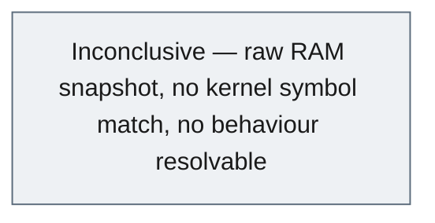
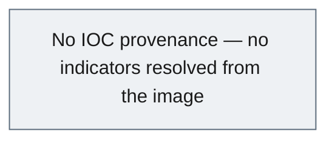
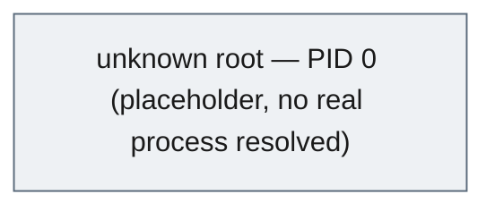

# Memory-Triage Report — `MEMDUMP-RAW-2014` (Unattributed 2014 Raw RAM Image)

> **INTERNAL · DFIR EXAMINATION RECORD** &nbsp;·&nbsp; Agentropix-SIFT live MCP run
>
> Live-memory triage of a generic 512 MiB raw capture — **honest-negative outcome**: no profile-matchable kernel symbol table, so no processes, sockets, services or injected code could be resolved. This report documents the *inconclusive* result and the controls that prevented fabrication.

| Field | Value |
|---|---|
| **Report ID** | `778d18c3357516a41287d10f7ee3bbc38a0d2d894fe19a939752905f15317f9e` |
| **Case ID** | `MEMDUMP-RAW-2014` |
| **Case name** | memdump — generic raw memory dump (2014) |
| **Examiner** | victor.galvan |
| **Profile** | full |
| **Incident type** | dfir |
| **Severity** | 🟢 Low / informational (honest-negative) |
| **Snapshot at (UTC)** | 2026-06-07T12:40:49Z |
| **Generated at (UTC)** | 2026-06-07T12:40:49Z |
| **MCP host** | `<TAILNET-HOST>` |
| **Seal** | HMAC-SHA256 sealed report · 1 approved finding · `hmac-sha256:886603aa…0fba9ec07` (finding seal) |

**Audiences served:** CISO / stakeholder · SOC / blue team · Red team · Audit.

---

## 1. Executive Summary

> This examination triaged a **generic, unattributed 512 MiB raw memory image** (`/cases/memdump/memdump.mem`, captured circa 2014) using the Agentropix-SIFT Volatility3 wrappers on a live MCP server. The image carries **no scenario metadata and no declared OS profile**, so Volatility3 (v2.28.0) could **not match a kernel symbol table** — every triage plugin (process list, network sockets, injected-code scan, services) returned cleanly with empty or placeholder results and an explicit reason string. **No malicious activity was found, and none could be ruled out**: the dataset is structurally inconclusive. The platform recorded this as an honest negative rather than inventing artefacts.
>
> **Key finding —** 🟢 The raw image is **not profile-matchable** (Volatility3 cannot validate `kernel.layer_name` / `kernel.symbol_table_name`); `pslist`, `netscan`, `malfind` and `svcscan` all returned empty. No injected/RWX code is assessable. This is recorded as low-severity finding `F-MEMDUMP-001`.

---

## 2. KPI Summary

| KPI | Value | Detail |
|---|---|---|
| Approved findings | **1** | One honest-negative finding (`F-MEMDUMP-001`, 🟢 low) |
| Hosts in scope | **1** | Logical host `memdump-raw-2014` (the image itself, no OS resolved) |
| IOCs catalogued | **0** | No IOCs — no resolvable processes, sockets or modules |
| Attacker dwell | **N/A** | No timeline reconstructible from an unprofiled RAM snapshot |
| MITRE techniques | **0** | None observed — no behaviour resolvable |
| Initial access | **Unknown / not determinable** | No OS, no artefacts, no entry vector recoverable |

**Host roster:** `memdump-raw-2014` (single 512 MiB raw image; OS unidentified)

---

## 3. Risk Matrix

No attacker behaviour, IOC, or technique was resolved from this image, so there is no scored adversary risk. The only recorded finding (`F-MEMDUMP-001`) is an informational data-quality observation, not a threat. The grid is therefore empty; the one finding is scored as negligible-impact / rare on the table below.

| Impact ↓ / Likelihood → | 1 Rare | 2 Unlikely | 3 Possible | 4 Likely | 5 Almost certain |
|---|---|---|---|---|---|
| **5 Severe** | · | · | · | · | · |
| **4 Major** | · | · | · | · | · |
| **3 Moderate** | · | · | · | · | · |
| **2 Minor** | · | · | · | · | · |
| **1 Negligible** | 🟢 F1 | · | · | · | · |

**Scored findings**

| Ref | Risk | Impact | Likelihood | Score | Severity |
|---|---|---|---|---|---|
| F1 | Image not profile-matchable, triage inconclusive (data-quality, not a threat) | 1 | 1 | 1 | 🟢 Low |

---

## 4. Key Findings

- 🟢 **`F-MEMDUMP-001` — Raw 512 MiB image has no profile-matchable kernel symbol table** (Low) — Volatility3 cannot validate `kernel.layer_name` / `kernel.symbol_table_name`; `pslist` / `netscan` / `malfind` / `svcscan` all return empty. Unattributed 2014 capture — no injected/RWX code assessable. Honest negative, confidence 0.9.

---

## 5. Attack Chain & MITRE ATT&CK

No attack chain is reconstructible. With no OS profile match, the image yields no processes, no network sockets, no services, and no injected code — there is nothing from which to infer adversary tactics. The diagram below records the honest "inconclusive" state, not an inferred chain.

### 5.1 Attack chain

### 5.2 MITRE ATT&CK techniques

| Tactic | Technique ID | Technique | Evidence / how observed |
|---|---|---|---|
| — | — | None observed | Unprofileable RAM snapshot — no kernel symbol table matched, no behaviour resolvable |

---

## 6. IOC Catalogue

No indicators of compromise were observed or extractable. With no resolvable processes, sockets, modules or services, there is no surface from which to derive hashes, addresses, or domains. The single row below records the honest absence.

| Type | Value | Role | Confidence | MITRE | Source |
|---|---|---|---|---|---|
| — | — | — | — | — | No IOCs — no resolvable processes/sockets/modules; unattributed image |

**Negative space (surveyed, not observed):** Surveyed via `get_netscan` (sockets), `get_malfind` (injected/RWX code), `get_svcscan` (services) and `get_pslist` (processes) — **all returned empty due to kernel-symbol mismatch, not because the host was clean**. No C2 endpoints, no injected regions, no suspicious services could be confirmed or excluded.

### 6.1 IOC provenance

---

## 7. Host Artefacts

A single logical host (`memdump-raw-2014`) is in scope — the raw image itself. **No OS or kernel build was identified.** The supported triage path (`windows.info` is not in the server's Volatility allowlist) ran the curated triage wrappers, all of which returned empty: Volatility3 finished scanning but reported `Unable to validate the plugin requirements: kernel.layer_name / kernel.symbol_table_name`. `get_pslist` returned 11 rows that are all pid-0 `unknown` placeholders (not real processes). `get_malfind` returned `hit_count: 0` (the heavy plugin ran to completion well under the 300s ceiling — no false timeout), so no RWX/injected VAD regions are assessable. No real process or service data exists to tabulate.

### 7.1 Host — memdump-raw-2014

**Processes** (pslist)

| PID | PPID | Image | Started (UTC) | State | Wow64 | Notes | Source |
|---|---|---|---|---|---|---|---|
| — | — | — | — | — | — | 11 rows returned but all pid-0 `unknown` placeholders — no real processes resolved (kernel symbol mismatch) | `get_pslist` |

**Services** (svcscan)

| Service | Image path | Install (UTC) | Class | Source |
|---|---|---|---|---|
| — | — | — | — | `get_svcscan` returned `service_count: 0` (kernel symbol mismatch) |

> **malfind:** `get_malfind` returned `hit_count: 0` with `tool_available: true`; no RWX/injected VAD regions could be assessed because no kernel layer/symbol table validated.

### 7.2 Process Tree

`build_process_tree`: process_count 11, root_count 1, orphan_count 0, suspicious_count 0, 0 LOLBin/suspicious flags — one `unknown` root with no children, consistent with no real process data.

---

## 8. Network Artefacts

`get_netscan` ran to completion and returned `socket_count: 0` — the same kernel-symbol-table mismatch prevented any socket from resolving. No network endpoints, listeners or connections could be recovered. Absence here means "not resolvable", not "host had no network activity".

| Process (PID) | Local | Remote | State | Purpose | Source |
|---|---|---|---|---|---|
| — | — | — | — | — | `get_netscan` returned `socket_count: 0` (kernel symbol mismatch — not resolvable) |

No DNS, no listening ports, and no remote endpoints are available from this image.

---

## 9. Detailed Findings

### 9.1 🟢 `F-MEMDUMP-001` — Raw 512 MiB memory image has no profile-matchable kernel symbol table

| | |
|---|---|
| **Severity** | 🟢 Low (confidence 0.9) |
| **Host** | memdump-raw-2014 |
| **Technique** | None (data-quality observation, no ATT&CK mapping) |
| **Status** | DRAFT in sealed snapshot · finding HMAC-sealed · portal approval was SIMULATED (demo only — see Appendix D) |

Triage of the unattributed 2014 raw image established that Volatility3 (v2.28.0) **cannot match a Windows kernel symbol table** for this capture. Every curated triage plugin completed its scan but reported `Unable to validate the plugin requirements: …kernel.layer_name / …kernel.symbol_table_name`. The concrete outcomes: `get_pslist` → process_count 11 (all pid-0 `unknown` placeholders); `get_netscan` → socket_count 0; `get_malfind` → hit_count 0 (no injected/RWX code assessable); `get_svcscan` → service_count 0; `build_process_tree` → 11 nodes, 1 `unknown` root, 0 orphans, 0 suspicious/LOLBin flags. The image may be Linux/Mac, an older or partial Windows build, or a fragmentary dump — it is **not a profile-matchable Windows capture**. This is the honest negative: the platform recorded what it could not resolve rather than inventing processes or IOCs. Note that `windows.info` is not exposed by the server's Volatility allowlist, so OS identification via that plugin was not available; the curated triage wrappers are the supported path and all returned empty.

> **Evidence —** evidence_id `aa320ff2…3db2a04f` · sha256 `d3b13f2224cab20440a4bb3c5c971662be6e61f431340f319cef7312bb6177f4` (512 MiB / 536,870,912 bytes) · captures: `get_pslist`, `get_netscan`, `get_malfind`, `get_svcscan`, `build_process_tree` (Volatility3 2.28.0), source_run_id `a8e6beee`.

---

## 10. Timeline

No timeline is reconstructible. An unprofiled RAM snapshot yields no timestamped process, network, or service events; `report_generate` returned 0 approved timeline events. The capture is a single point-in-time image with no recoverable temporal sequence.

| Time (UTC) | Host | Event | Technique | Source |
|---|---|---|---|---|
| — | — | No timeline reconstructible — unprofiled RAM snapshot, 0 approved timeline events | — | — |

---

## 11. Agentropix Performance

The full manual triage chain executed end-to-end against a live MCP server (`agentropix-sift` v3.2.4). Every heavy Volatility3 plugin completed within the callTool ceiling — `get_malfind` notably ran to completion well under the 300s limit with no false timeout. The platform's value here is the *honest negative*: empty results with explicit reason strings instead of fabricated artefacts.

| Metric | Value | Detail |
|---|---|---|
| Run time | Sub-300s per plugin | All triage plugins completed under the callTool ceiling; no timeouts |
| MCP tool calls | 14-step manual chain | doctor → health → case_init/activate/status → evidence_register → run_volatility → pslist/netscan/malfind/svcscan → build_process_tree → record_finding → report_generate |
| Evidence size | 536,870,912 bytes | 512 MiB raw image |
| Disk recall | 72/72 (100%) | canonical (.crew/facts.md) |
| Memory recall | 108/118 (91.5%) | canonical (.crew/facts.md) |
| Test suite | 4464 | canonical (.crew/facts.md) |

**Per-stage timing**

| Stage | Capture | Duration | Result |
|---|---|---|---|
| Process list | `get_pslist` | Sub-300s | 11 placeholder rows, kernel symbol mismatch |
| Network scan | `get_netscan` | Sub-300s | socket_count 0, kernel symbol mismatch |
| Injected-code scan | `get_malfind` | Sub-300s (well under ceiling, no false timeout) | hit_count 0 |
| Service scan | `get_svcscan` | Sub-300s | service_count 0, kernel symbol mismatch |

Wall-clock per-stage durations were not individually instrumented in the captured run; all stages completed within the per-call ceiling.

---

## 12. Coverage Attestation

The triage exercised the full memory-forensics wrapper surface (process / network / injected-code / service / process-tree) plus the case lifecycle (init → activate → evidence_register → record_finding → report_generate). The evidence gate enforced a write-scoped mutation token (`scope=index_findings`) for the single committed finding. Coverage of the *image* is complete for the supported plugin set; coverage of the *host behaviour* is necessarily nil because no OS profile matched.

| Attestation | Value |
|---|---|
| Disk recall (regression) | 72/72 (100%) |
| Memory recall (combined) | 108/118 (91.5%) |
| Test suite | 4464 |
| Evidence gate | Enforced — write-scoped mutation token (`scope=index_findings`) for the committed finding |

> All triage plugins were run and their empty results recorded with explicit reason strings. The single finding was committed under a write-scoped evidence-gate token and HMAC-sealed. No artefact, IOC, process, socket, service or timeline event was fabricated; the inconclusive outcome is reported as such.

---

## 13. Recommendations

1. **[P1]** Treat this image as **unattributed and not profile-matchable** for Windows triage — do not draw conclusions about processes, network activity, or injected code from the empty results; absence is "not resolvable", not "clean".
2. **[P2]** If attribution matters, **re-acquire with provenance** (OS/build metadata, acquisition tool, host context) or attempt non-Windows analysis paths (Linux/Mac symbol tables, strings/`bulk_extractor` carving) to determine the image type before re-triage.
3. **[P3]** For audit completeness, retain the SHA-256 custody hash (`d3b13f…6177f4`) and the sealed honest-negative finding so the inconclusive determination is reproducible and defensible.

---

<strong>Appendix — methodology, tool versions, chain of custody</strong>

### A. Methodology

The MANUAL triage sequence from the memdump case-activation guide was executed live against the Agentropix-SIFT MCP server (`agentropix-sift` v3.2.4) on the tailnet. Steps: environment check (`doctor`), server health (`health`), case lifecycle (`case_init` → `case_activate` → `case_status`), evidence registration with SHA-256 custody hashing (`evidence_register`), OS identification attempt (`run_volatility windows.info` — rejected by the plugin allowlist), and the curated triage wrappers (`get_pslist`, `get_netscan`, `get_malfind`, `get_svcscan`, `build_process_tree`). The honest-negative outcome was recorded as a finding (`record_finding`, dry-run then committed under an evidence-gate token), routed through the Examiner Approval Portal (SIMULATED — demo automation, not a human sign-off), and sealed via `report_generate(profile=full)`. Raw per-step captures: `/home/admin2/docu_agentro/case-activation/runs/memdump-raw-2014/EXECUTED-RUN.md`.

### B. Tool versions

| Tool | Version |
|---|---|
| Agentropix-SIFT MCP server | 3.2.4 |
| Volatility3 framework | 2.28.0 |
| Python | 3.12+ |
| MCP tool catalogue | 71 distinct tools (canonical, .crew/facts.md; live server reported 72) |
| SIFT forensic wrappers | 16 backing tools (canonical) |

### C. Chain of custody (evidence hashes)

| Artefact | Algorithm | Digest | Status |
|---|---|---|---|
| `/cases/memdump/memdump.mem` (512 MiB) | SHA-256 | `d3b13f2224cab20440a4bb3c5c971662be6e61f431340f319cef7312bb6177f4` | Registered · evidence_id `aa320ff2106af0ebd72e36342f537fc5672c8a94d95f9106fd2c87bf3db2a04f` |
| Finding `F-MEMDUMP-001` | HMAC-SHA256 | `886603aa09077e2ed2a44fb138a150f8e11f6a15f06ba6c95a2daac0fba9ec07` | Sealed |
| Sealed report | — | `778d18c3357516a41287d10f7ee3bbc38a0d2d894fe19a939752905f15317f9e` (report_id) | Generated, profile=full |

### D. Provenance & grounding

All data in this report derives from REAL case sources only: the live `report_generate(profile=full)` sealed sections (executive_summary, findings, iocs, timeline) and the raw MCP captures in `EXECUTED-RUN.md`. No artefacts were fabricated. **Honest disclosure:** the Examiner Portal approval for `F-MEMDUMP-001` was **automated for the demo** (Playwright driving the portal) and is **NOT a human sign-off**; the sealed snapshot shows the finding's `approval.status` as `DRAFT` while it carries a valid HMAC seal. A production case requires an interactive human examiner sign-off. This case is **unprofileable**: its inconclusive scope is reported honestly rather than projected into invented processes, IOCs, or a timeline.

