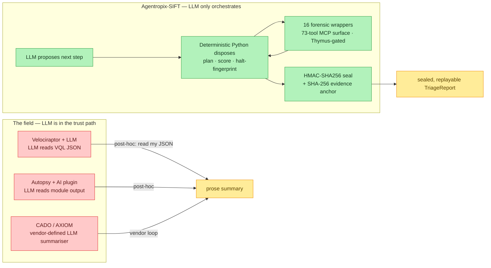

# Competitive positioning

> **Section 01 · Overview** — How Agentropix-SIFT differs from the DFIR + AI field, why
> those differences are *structural* rather than marketing, and where it honestly loses.
> Related: [What is Agentropix-SIFT?](what-is-agentropix.md) ·
> [What You Get](what-you-get.md) · [Quickstart](quickstart.md)

The first question a SANS judge asks is blunt: **"how is this different from
Velociraptor plus an LLM?"** (*Velociraptor* is an open-source endpoint-collection
and live-response agent that queries hosts with its own VQL query language.) The upstream
`agentropix-sift/docs/COMPETITIVE-DFIR.md` answers that question directly, and this page
mirrors its answer with the counts reconciled to the portal's
[canonical facts](../08-reference/canonical-facts.md).

The short version: Agentropix-SIFT's differentiators are **structural**, not
feature-list length. Two phrases recur on this page, so it is worth defining them up
front:

- **Structural differentiator** — a property that holds because of *how the system is
  built*, so a competitor cannot reproduce it by adding configuration or a prompt.
  Example: the agent cannot mutate evidence because **no write tool exists** in the MCP
  surface — there is literally no verb to call. The guarantee is a *capability absence*
  and a *deterministic control point* (a check in plain Python, not an LLM judgement),
  not a setting.
- **Feature-list differentiator** — a property a competitor can claim by shipping one
  more menu item (another parser, another dashboard widget). These are easy to copy and
  therefore not a durable advantage.

The rest of this page argues that the items in the matrix below are the first kind, not
the second.

---

## Contents — what's in this page (and what to expect)

> Jump to any section below. Each row tells you what that part gives you, so you can go straight to your point.

| Section | What you'll get |
|---|---|
| [Executive framing: old reality → new reality](#executive-framing-old-reality--new-reality) | The before/after table positioning the project against the manual-triage status quo (hours of hand-correlation vs minutes of verifiable agentic triage). |
| [The unique angle](#the-unique-angle) | The four code-enforced properties that, taken together, make Agentropix-SIFT the first DFIR-specific agentic system of its kind. |
| [Feature matrix vs the field](#feature-matrix-vs-the-field) | A capability-by-capability comparison against five competitors, plus the canonical count reconciliation (16 wrappers, 73 MCP tools, 7 specialists). |
| [Four positioning statements](#four-positioning-statements) | The four pitch-ready one-liners that frame why the differentiators are structural moats, not feature-list items. |
| [Where we honestly lose](#where-we-honestly-lose) | The deliberate non-goals where competitors win — case management, Windows collection, and polished reporting UI. |
| [Six explicit non-goals](#six-explicit-non-goals) | The scope boundaries stated up front so readers know what the project intentionally is not. |
| [Where to go next](#where-to-go-next) | Curated next-step links into the overview section (what it is, what you get, quickstart). |

---

## Executive framing: old reality → new reality

The project is positioned against the **manual-triage status quo**, not just other tools.
Both framings below come from the upstream big-picture report
(`PROJECT-ONBOARDING.md` §1, corroborated in `DEMO-SCRIPT.md`).

The table is read left-to-right as *before Agentropix / after Agentropix*. To keep the
voice consistent, both columns are written in the same descriptive third person — the
"old reality" describes the analyst's day today, the "new reality" describes the same day
run through Agentropix-SIFT (the marketing-style quotes from the source are reproduced as
quotes so they read as claims, not as plain assertions).

The CLI tools named in the first row are the long-standing open-source forensic binaries
an examiner reaches for by hand; they are defined once here and reused throughout the page:

- **plaso** (`log2timeline`) — a super-timeline engine that parses dozens of artefact
  types into one chronological event stream.
- **Volatility 3** — the volatile-memory (RAM) analysis framework: process lists,
  injected code, network sockets, and the like from a memory image.
- **Sleuth Kit** (TSK) — a suite of file-system forensics tools (`fls`, `icat`, `ifind`,
  `istat`) that walk a disk image without mounting it.
- **RegRipper** — a Windows Registry-hive parser that extracts persistence keys, user
  activity, and configuration artefacts.

| | The analyst's **old reality** (manual) | The analyst's **new reality** (Agentropix-SIFT) |
|--|----------------------------|-----------------------------|
| **Workflow** | Incident responders arrive at hour-3 of a breach with a stack of `.E01` disk images and a menu of CLI tools (plaso, Volatility 3, Sleuth Kit, RegRipper). They must extract artefacts, correlate across sources, and write a report — **without mutating evidence** — under a clock. | One command ingests the image, a deterministic loop drives the same trusted binaries, the run correlates across a 7-agent swarm, and the system emits a sealed JSON report. |
| **Time** | 4–8 hours per disk image, multiplied across N hosts. | Minutes per image. As the source puts it: *"What used to be 4 hours of manual cross-correlation is 3 minutes of agentic triage."* |
| **Trust** | Findings live in hand-kept notes — *"I ran a YARA scan, got a hit, I think."* | Every finding carries `_source` → a tool call → an `args_hash`; the report is HMAC-sealed and **verifiable in court**. |

> The architecture exists to make the "new reality" column honest — *verifiable*, not
> merely *fast*. (`COMPETITIVE-DFIR.md` §"Honest where we lose"; `PROJECT-ONBOARDING.md` §1.)

---

## The unique angle

Agentropix-SIFT is the first DFIR-specific agentic system that unifies four properties,
each enforced in code (per `COMPETITIVE-DFIR.md`; the in-portal
[Design Decisions](../08-reference/design-decisions.md) page restates them):

1. **Real SANS SIFT toolkit as MCP** — the forensic binaries examiners already trust
   (plaso, Volatility 3, Sleuth Kit, RegRipper, and the rest), exposed as
   uniformly-typed, uniformly-gated `mcp_*` tools (**16 SIFT forensic wrappers** on the
   **73-tool MCP surface** per [`canonical-facts.md`](../08-reference/canonical-facts.md); see the count
   reconciliation below). *MCP* (Model Context Protocol) is the typed tool-call interface
   the agent speaks; `mcp_*` is the naming prefix for those tools.
2. **Structural evidence safety** — no write tool exists; the agent cannot mutate
   evidence because there is no verb to call. The **Thymus** (the project's
   immune-system-inspired read-only policy layer at the MCP boundary) rejects every write
   before any subprocess spawns.
3. **Multi-agent orchestration with deterministic halt** — a pure-Python
   Architect → Swarm → Critic loop whose termination is a fingerprint no-progress
   detector, with **no LLM in the halt path**.
4. **Cryptographically sealed chain-of-custody** — per-run HMAC-SHA256 report seal +
   independently-sealed audit log cross-bound into the report + evidence-image SHA-256
   anchor.

> **Genesis of these four (ADRs).** Each property is a deliberate, recorded decision in
> [Section 11 — ADRs](../11-ADR/README.md): (1) the SIFT-toolkit-as-MCP substrate →
> [ADR-001 · SDK Selection](../11-ADR/ADR-001-sdk-selection.md) (plus per-tool wrappers
> [ADR-012](../11-ADR/ADR-012-extract-files.md) / [ADR-013](../11-ADR/ADR-013-evtx-wrapper.md));
> (2) structural evidence safety / Thymus →
> [ADR-008 · Safety Architecture](../11-ADR/ADR-008-safety-architecture.md);
> (3) deterministic halt →
> [ADR-002 · Execution Engine](../11-ADR/ADR-002-execution-engine.md);
> (4) cryptographic chain-of-custody →
> [ADR-016 · Courtroom Audit + Sealing](../11-ADR/ADR-016-courtroom-audit.md) +
> [ADR-022 · Audit-Log Seal](../11-ADR/ADR-022-audit-log-seal.md).

---

## Feature matrix vs the field

Imported from the oracle's `docs/COMPETITIVE-DFIR.md` feature matrix (2026-04-22), with
the SIFT-binary count rendered as **16 forensic wrappers**, the agent count as **7 core
specialists**, and the MCP surface as **73 tools** — all three pinned to
[`canonical-facts.md`](../08-reference/canonical-facts.md) (`mcp_tool_count = 73`; SIFT forensic tools =
`16`) and `src/agentropix_sift/agents/__init__.py` (the runnable `SWARM` tuple).

The five comparators across the top are defined once here so the columns are readable on
their own:

- **Velociraptor + LLM** — the endpoint-collection agent (above) with an LLM bolted on
  *after* collection to summarise its VQL output.
- **Autopsy + AI plugin** — Autopsy is the open-source GUI front-end to Sleuth Kit; the
  "AI plugin" is an LLM that reads the output of a selected Autopsy module.
- **TheHive / Cortex** — an incident-response case-management platform (TheHive) plus its
  analyser/responder engine (Cortex); a ticket-and-workflow bus, not a DFIR tool itself.
- **CADO Response** — a commercial cloud-native DFIR platform with proprietary collection,
  carving, and an "AI investigator".
- **Magnet AXIOM Copilot** — the LLM assistant inside Magnet AXIOM, a commercial desktop
  forensics suite.

A few tool names also appear in the matrix rows: **YARA** is the pattern-matching engine
used to flag known-malicious file/byte signatures; **bulk_extractor** scans raw bytes for
emails, URLs, and other artefacts without parsing the file system.

| Capability | Agentropix-SIFT | Velociraptor + LLM | Autopsy + AI plugin | TheHive / Cortex | CADO Response | Magnet AXIOM Copilot |
|---|---|---|---|---|---|---|
| **Integration substrate** | **MCP** — 16 forensic wrappers on a **73-tool** `mcp_*` surface, uniform typing + gating | ad-hoc shell-out / VQL | ad-hoc plugin API | ticket / workflow bus | proprietary cloud API | proprietary desktop plugin |
| **Real SANS SIFT toolkit** | plaso, vol3, tsk, regripper, amcache, shimcache, evtx, yara, bulk_extractor, prefetch, extract_files, foremost, hashdeep, strings, ewfinfo, exiftool (**16 wrappers**) | VQL artifacts + shell-outs | Autopsy module subset | no native DFIR tools | proprietary carving | AXIOM artifact subset |
| **Evidence write-protection** | **structural — agents have no write tool**; Thymus gates every read | relies on VQL being read-only + operator discipline | Autopsy case-locking | N/A (no evidence access) | cloud-isolated snapshot | snapshotted case file |
| **Chain-of-custody** | SHA-256 of source image + per-tool audit trail, HMAC-sealed | artifact upload hash | Autopsy case hash | attachment hash | cloud-signed snapshot | AXIOM case hash |
| **Multi-agent orchestration** | **7 core specialists** + ATT&CK detectors, Trinity loop (Architect → Swarm → Critic) | single LLM over VQL output | single LLM over module output | no | "AI investigator" (opaque) | single LLM summariser |
| **Deterministic halt** | fingerprint no-progress detector — **no LLM in halt path** | LLM-terminated | N/A | N/A | vendor-defined | vendor-defined |
| **Budgeted execution** | per-tool timeout + RSS cap + rate limit | operator-enforced | operator-enforced | N/A | vendor-defined | vendor-defined |
| **Chaos-tested cleanup** | **14 chaos tests** (timeout-kill, EWF mount, fusermount rc=1, killpg race, tmpdir leak) | N/A | N/A | N/A | vendor-closed | vendor-closed |
| **Real-E01 validation** | **7 SRL-2018 APT images** (incl. case 20180905-001 Cobalt Strike DC, 2026-04-19 wargame) | lab demos | vendor demos | N/A | vendor case studies | vendor case studies |
| **Open source** | **yes** (MIT) | yes (GPL) | yes (ASL-2) | yes (Hive/Cortex), no (AXIOM) | **no** | **no** |

> **Count reconciliation.** The oracle competitive doc frames the toolkit as "16 / 16"
> and the swarm as a "5-agent swarm." This portal pins the canonical numbers:
> **16 forensic wrappers** drive the 16 SIFT binaries (`canonical-facts.md`; `README.md:151`;
> `cli.py` `doctor` tool dict); the **73-tool MCP surface** is the full `tools/list`
> (`canonical-facts.md`, `mcp_tool_count = 73`); and the swarm is **7 core specialists**
> (Memory, Timeline, Filesystem, Artifact, Discovery, Mail, Hunt) interleaved with six
> deterministic ATT&CK detector agents in the runnable `SWARM` tuple
> (`src/agentropix_sift/agents/__init__.py`). The "5-agent" framing predates the
> Discovery (issue #39) and Mail specialists; **7 core specialists** is the current
> code-derived count.

> 🔍 **[Open as SVG — full size, zoomable](assets/competitive-positioning-1.svg)** (renders larger than the page column; the SVG zooms losslessly in a browser tab).

---

## Four positioning statements

Imported verbatim-in-substance from `COMPETITIVE-DFIR.md`
§"Four positioning statements (for the pitch)" (the in-portal
[Design Decisions](../08-reference/design-decisions.md) page restates the same four):

1. **"We pick up where VQL-on-Velociraptor stops."** Velociraptor is best-in-class for
   agent-side collection, but the LLM step is still *"read my JSON and explain it."*
   Agentropix-SIFT drives *real DFIR tools* — plaso, Volatility, YARA — **inside** an
   agent loop, not after it.

2. **"Structural evidence safety is the moat."** Autopsy case-locking and CADO snapshots
   protect the artifact; they don't prevent an agent from overwriting an `.E01` if the
   operator exposes a write API. **We don't expose one.** The Thymus policy refuses every
   write call before the subprocess is spawned — **7 `REJECT_WRITE` events** were logged
   against real APT images in the 2026-04-19 wargame (`SIFT-WEAKNESSES.md` wargame entry,
   2026-04-19 22:49 UTC).

3. **"Deterministic halt beats LLM-terminated loops."** LLM-driven orchestrators burn
   budget deciding when to stop. The Critic halts on a fingerprint no-progress detector —
   same input, same output, same iteration count. Operators tune budget with
   `AGENTROPIX_*` env vars instead of a prompt (`trinity/critic.py`).

4. **"MCP is the integration substrate judges haven't seen elsewhere."** Every DFIR tool
   is exposed as an `mcp_*` tool with uniform typing and gating. The plug-in pipeline is
   proven end-to-end — **16 wrappers shipped**, each a ~60-line Python file with a single
   Thymus-gated subprocess call, not a plugin SDK download.

---

## Where we honestly lose

The project names its losses explicitly — these are deliberate non-goals, not gaps
(`COMPETITIVE-DFIR.md` §"Honest where we lose"; deferred list in
`docs/REVIEW-2026-04-20.md` §3):

- **Commercial-grade case management.** We don't replace AXIOM or CADO for analyst UX.
  We're a **triage engine, not a case file system**.
- **Windows-host collection.** Velociraptor's agent ecosystem is deeper. We **read-only
  consume** whatever you've already collected — we don't deploy a collection agent.
- **Polished reporting UI.** Our output is JSON + ledger. Autopsy and AXIOM ship HTML
  report generators with embedded charts; we don't.

---

## Six explicit non-goals

To prevent scope confusion, the project states its non-goals up front. These are the
**deliberate non-goals** the oracle records in `COMPETITIVE-DFIR.md`
§"Honest where we lose" and the deferral list in `docs/REVIEW-2026-04-20.md`; non-goal
#5 (no active response) is the subject of its own ADR —
[ADR-021 · Two-Person Rule for Active Response (Deferred)](../11-ADR/ADR-021-two-person-rule-defer.md)
(oracle: `docs/adr/ADR-021-two-person-rule-defer.md`):

1. **Not a GUI / dashboard.** CLI + JSON output is the primary interface.
2. **Not a training tool.** It automates what an analyst already knows; it doesn't teach
   DFIR.
3. **Not real-time monitoring.** This is **post-incident triage on captured evidence** —
   not EDR, not XDR.
4. **Not a fine-tuning platform.** Existing Claude models are orchestrated; no model
   training.
5. **Not attacker-facing.** The agent is read-only by design — no remediation, no
   process-kill, no file-delete. Active Response is a separate, deferred tier
   ([ADR-021](../11-ADR/ADR-021-two-person-rule-defer.md)).
6. **Not "give me the answer."** The analyst still reads, interprets, and contextualizes
   the findings; the system accelerates the legwork, not the thinking.

---

## Where to go next

- **[What is Agentropix-SIFT?](what-is-agentropix.md)** — the problem, the pipeline, and
  the LLM-only-vs-Agentropix contrast table.
- **[What You Get](what-you-get.md)** — the full capability matrix (Trinity loop, 73 MCP
  tools, 16 forensic wrappers, Thymus, Courtroom seal, chaos tests, recall gates).
- **[Quickstart](quickstart.md)** — install, `doctor` pre-flight, and a first triage run.
