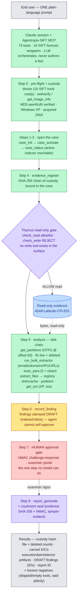

# Try it end-to-end — one prompt, a full investigation

> **Section 01 · Overview.** A brand-new user's fastest path to a *complete* result: one copy-paste
> prompt that drives Agentropix-SIFT through the whole **8-step procedure** (`case_init → … → report`)
> on a **publicly downloadable** case, and gives you every artifact back. Grounded in the gold-standard
> [User Guide](user-guide.md) and the per-case [Activation Guides](../../case-activation/INDEX.md).
> Canonical numbers (73 MCP tools · 16 SIFT forensic wrappers · Python 3.12+) are governed by
> [Canonical Facts](../08-reference/canonical-facts.md).

## How to read this page

You type **one plain-language prompt** into a Claude session that has the Agentropix-SIFT MCP attached;
the session recognizes each request as an Agentropix capability and routes the right deterministic tool.
You do **not** memorize tool names — but this page shows you which tool each part triggers and what you
get back, so you can follow along and verify. The example uses **real values from a real case**, so
expect real artifacts, real IDs, and **honest negatives** (tools that find nothing, or are skipped, are
reported as such — that is the design, not a failure).

The one step the agent **cannot** do for you is **approval** — promoting a finding from DRAFT to
APPROVED is a human cryptographic sign-off (see [Step 7](#the-one-manual-step--approval)). Everything
else runs autonomously from a single prompt.

---

## Prerequisites (one-time)

1. **Connect the MCP.** Attach the `agentropix-sift` MCP server to Claude Desktop or Claude CLI — see
   [Client Setup](../09-integrations/client-setup.md) ("Connect in 60 seconds").
2. **Have the evidence on the host.** This example uses the **CFReDS "Hacking Case"** — a free NIST
   Windows-XP disk image (Greg Schardt / "Mr. Evil"). Download `4Dell Latitude CPi.E01` + `.E02` from
   <https://cfreds-archive.nist.gov/Hacking_Case.html> and place them at `/cases/cfreds-fresh/` (or
   wherever your MCP path allowlist points — adjust the paths in the prompt to match). Provenance and
   the integrity anchor are in [reproduce-datasets §1.1](../06-use-cases/reproduce-datasets.md) and the
   [CFReDS Activation Guide](../../case-activation/cfreds-hacking-case-4dell.md).

---

## At a glance — what the one prompt does

The single prompt below drives the whole pipeline. Colour key: 🟢 MCP tools (the LLM orchestrates but
never authors a fact) · 🔵 read-only evidence · 🟣 the Thymus gate + courtroom seal · 🟡 DRAFT findings ·
🔴 the human approval hard-stop.



> Source: [`assets/try-it-end-to-end/flow.mmd`](assets/try-it-end-to-end/flow.mmd) (Mermaid, rendered to PNG).

## The prompt (disk case) — paste this whole block into Claude

```text
You are my DFIR analyst, and you have the Agentropix-SIFT MCP server connected. Investigate ONE
case end-to-end and show me every result. Work autonomously — don't ask me questions — and stop
only at the human approval gate.

THE CASE
- Name: CFReDS "Hacking Case" (Greg Schardt / "Mr. Evil")
- Case ID: CFREDS-HACKING-CASE-4DELL  (examiner: victor.galvan, severity: high)
- Evidence (disk, EWF): /cases/cfreds-fresh/4Dell-Latitude-CPi.E01   (the .E02 segment is read automatically)
- It is a Windows XP disk image. There is NO memory dump — do NOT use any memory/Volatility tools
  (no pslist / netscan / malfind / svcscan / process_tree).

PER-CASE RULES (follow exactly — they matter):
- The NTFS volume starts at sector offset 63. Pass offset 63 to file-listing and file-extraction.
  Confirm the partition layout first.
- Windows XP event logs are ".evt" → use the .evt event-log tool (get_evt), NOT the Vista+ .evtx one.
  Skip Amcache (it is Windows 7+ only).
- Put any carving output dir under /tmp/agentropix-sift-  (e.g. /tmp/agentropix-sift-cfreds-be).

DO THIS IN ORDER, AND SHOW ME EACH RESULT:
0. Pre-flight + custody: confirm the forensic environment is ready, then verify the image integrity
   and show me who acquired it and what OS it is. (Expect stored MD5 == aee4fcd9301c03b3b054623ca261959a.)
1-3. Open case CFREDS-HACKING-CASE-4DELL (high severity, examiner victor.galvan, evidence in
   /cases/cfreds-fresh), make it the active case, and confirm it's active and the indexer is reachable.
4. Register the E01 as evidence and give me its SHA-256 chain-of-custody hash.
5. Analyze the disk and report each result:
   a. Partition layout — confirm NTFS at offset 63.
   b. List all files (offset 63, recursive); then list just the deleted files.
   c. Carve indicators (emails, domains, IPs, URLs) into /tmp/agentropix-sift-cfreds-be.
   d. Run a YARA smoke-scan (0 matches is a clean pass, not a failure).
   e. Lift the registry hives (offset 63) and pull execution/persistence artifacts: registry,
      shimcache, prefetch, and the XP .evt event logs.
6. Record what you found as findings (they will be saved as DRAFT — that is expected; you cannot
   self-approve evidence).
7. STOP at the approval gate: list exactly which findings are waiting for MY approval, with their IDs,
   and tell me how to approve them (the human HMAC examiner portal). Do NOT approve them yourself.
8. Generate the case report and give me the report ID + section counts. (Approved-finding count will
   be 0 until I approve in step 7 — that is correct.)

FINALLY, give me a concise summary: the custody SHA-256, the partition offset, the file + deleted-file
counts, the IOCs carved, the artifacts found, the DRAFT findings (with IDs), and the report ID — plus
any honest negatives (tools that found nothing or were skipped, and why).
```

---

## What it does, step by step

Each block of the prompt maps to one step of the canonical procedure, the deterministic tool it routes,
and the result you get back.

| Prompt step | Tool(s) it routes | What you get back |
|---|---|---|
| **0 · Pre-flight + custody** | `doctor` → `ewfverify` / `get_image_info` | "All tools available," and **integrity confirmed** — stored MD5 == computed MD5 `aee4fcd9…`, plus acquisition metadata (examiner Shane Robinson, case "Greg Schardt," Windows XP, acquired 2004). The chain-of-custody anchor. |
| **1–3 · Open + activate** | `case_init` → `case_activate` → `case_status` | Case `CFREDS-HACKING-CASE-4DELL` created, marked **active**, indexer reachable. Idempotent on the slug — re-running updates, never duplicates. |
| **4 · Register evidence** | `evidence_register` | A **SHA-256 custody hash** for the E01, bound to the case and indexed — what makes every finding traceable to the exact bytes. |
| **5a · Partition** | `get_partitions` / `mmls` | Confirms the NTFS volume **starts at sector 63** — the offset every later disk tool needs (the #1 gotcha). |
| **5b · Files** | `fls` (offset 63, recursive) + `fls` deleted-only | The full filesystem listing **and** the deleted-file set (the deletion / anti-forensics review). |
| **5c · IOC carve** | `run_bulk_extractor` (allowlisted out-dir) | Carved **emails / domains / IPs / URLs** — the high-signal step for a hacking-tools image (it surfaces the "Mr. Evil" tool-author email fingerprint). |
| **5d · YARA** | `scan_yara` (smoke ruleset) | A scan result — **0 matches = clean pass** (an honest negative, not an error). |
| **5e · Artifacts** | `extract_files` (offset 63) → `get_registry`, `get_shimcache`, `get_prefetch`, `get_evt` | Execution + persistence artifacts from the registry hives, shimcache, prefetch, and the **XP `.evt`** event logs. (Amcache is skipped — XP predates it.) |
| **6 · Findings** | `record_finding` | Findings saved as **DRAFT** (`indexed:false`) — the agent **cannot self-approve**, by design. |
| **7 · Approval gate (human)** | *(you)* the examiner portal / `approve_finding` | The agent **stops** and lists the DRAFT findings + IDs. **You** approve them via the HMAC examiner portal — see below. |
| **8 · Report** | `report_generate` | A **report ID + section counts**. Approved-finding count is 0 until you do step 7; re-run after approving and the approved findings populate. |
| **Summary** | — | One recap: custody hash, offset, file/deleted counts, IOCs, artifacts, DRAFT findings (IDs), report ID, and the honest negatives. |

### The one manual step — approval

Step 7 is the deliberate **human hard-stop**. DRAFT → APPROVED requires *your* cryptographic sign-off in
the **Examiner Approval Portal** (a single-use nonce + HMAC challenge-response derived from your
password). The agent does everything else, but it **physically cannot approve evidence** on your behalf —
that is the integrity guarantee. See [Human-in-the-Loop](../05-safety-forensics/human-in-the-loop.md) and
the [Approval Portal walkthrough](../05-safety-forensics/approval-portal.md). After you approve, re-run
step 8 (`report_generate`) and the approved findings appear in the report.

---

## Memory-case variant

If your case is a **memory dump** instead of a disk image, the chain is different: drop the disk tools
(no partition/`fls`/`extract_files`) and use the **Volatility memory chain**. Example with the generic
public `memdump` RAM image (`/cases/memdump/memdump.mem`):


> Source: [`assets/try-it-end-to-end/flow-memory.mmd`](assets/try-it-end-to-end/flow-memory.mmd). Note the
> **honest-negative branch**: if `get_pslist` returns empty with a symbol-table error, no kernel profile
> resolved — the chain stops and says so, rather than inventing results.

```text
You are my DFIR analyst with the Agentropix-SIFT MCP connected. Investigate ONE memory case end-to-end
and show me every result. Work autonomously; stop only at the human approval gate.

THE CASE
- Case ID: MEMDUMP-2014  (examiner: victor.galvan, severity: medium)
- Evidence (raw memory dump): /cases/memdump/memdump.mem

MEMORY RULES (follow exactly):
- Do NOT run get_image_info on a raw memory dump — it reads EWF/E01 metadata and returns empty on .mem.
- get_pslist is the OS/profile confirm step: Volatility auto-detects the kernel symbol table on the first
  windows.* plugin. A populated process list confirms the profile matched; an empty list with a
  symbol-table error is an HONEST NEGATIVE (no profile resolved) — report it as such, don't invent results.
- This is memory only — do NOT use disk tools (no partitions/fls/extract_files/registry-from-disk).

DO THIS IN ORDER, AND SHOW ME EACH RESULT:
0. Confirm the environment is ready and register the dump as evidence (give me its SHA-256).
1-3. Open case MEMDUMP-2014, make it active, confirm active + indexer reachable.
4. Process list (this also confirms the OS/profile). If it's empty with a symbol-table error, tell me
   plainly that no profile resolved and stop the memory chain.
5. Network connections, injected/suspicious code, services, and the process tree (PPID forest, LOLBin flags).
6. Record what you found as DRAFT findings (you cannot self-approve).
7. STOP at the approval gate: list the DRAFT findings + IDs and how I approve them. Do NOT approve them.
8. Generate the report; give me the report ID + section counts.

FINALLY: a concise summary — custody SHA-256, process/network/injection highlights, the DRAFT findings
(with IDs), the report ID, and any honest negatives.
```

Memory-chain mapping: **`get_pslist`** (process list + profile confirm) → **`get_netscan`** (sockets /
C2) → **`get_malfind`** (injected/RWX code) → **`get_svcscan`** (services) → **`build_process_tree`**
(PPID forest, LOLBin flags), then `record_finding` → approval → `report_generate`.

---

## To run *any other* case

Start from whichever ready prompt matches your evidence — the
**[disk-case prompt](#the-prompt-disk-case--paste-this-whole-block-into-claude)**
(with its [flow diagram](#at-a-glance--what-the-one-prompt-does)) or the
**[memory-case prompt](#memory-case-variant)** — then swap the values at the top (they're the only
case-specific parts):

1. **Case ID** and **evidence path(s)**.
2. **Disk vs memory** — pick the right chain (disk: partition→`fls`→`extract_files`→registry/event-logs;
   memory: `get_pslist`→`get_netscan`→`get_malfind`→`get_svcscan`→`build_process_tree`).
3. **OS-specific rules** — e.g. partition offset; XP `.evt` vs Vista+ `.evtx`; skip Amcache on XP; no
   "identify the OS" step on raw memory.
4. **Integrity anchor** — the expected MD5/SHA from the case's activation guide.

Every case's exact values (paths, offset, OS quirks, integrity anchor, both expert-command and
end-user-prompt forms) live in its [`case-activation/<case>.md`](../../case-activation/INDEX.md) guide.
The full operator runbook — manual and autonomous lanes, both Claude clients, with a worked example and a
troubleshooting ledger — is the [User Guide](user-guide.md).

## See also

- [User Guide](user-guide.md) — the complete operator runbook (the gold standard for this portal).
- [Quickstart](quickstart.md) — the condensed 3-command self-host path.
- [Case Activation Guides](../../case-activation/INDEX.md) — per-case real values for every `/cases/` image.
- [reproduce-datasets](../06-use-cases/reproduce-datasets.md) — where to download the public evidence.
- [Human-in-the-Loop](../05-safety-forensics/human-in-the-loop.md) · [Approval Portal](../05-safety-forensics/approval-portal.md) — the one manual step.
