# Agentropix-SIFT User Guide — Start to Finish

> **Section 01 · Overview** — the single end-to-end walkthrough for a first-time operator.
> Related: [Quickstart](quickstart.md) (the 3-command fast path) ·
> [What is Agentropix-SIFT?](what-is-agentropix.md) ·
> [What You Get](what-you-get.md) ·
> [CLI Reference](../08-reference/cli-reference.md) ·
> [Approval Portal](../05-safety-forensics/approval-portal.md) ·
> [Audit & Courtroom Seal](../05-safety-forensics/audit-courtroom.md) ·
> [Wazuh Integration](../09-integrations/wazuh-portal.md)

This guide takes you through one complete case the way a real examiner runs it:
**install → pre-flight → configure → triage → review findings → approve in the
portal → seal the report → (optionally) escalate to Wazuh.** Each phase shows the
exact `agentropix-sift` command, the output you should expect, and a link into the
deep portal page when you want more.

Agentropix-SIFT does **not** ship the forensic binaries — it *orchestrates* the
SANS SIFT toolchain you already have, drives **71** deterministic MCP tools across
**16** forensic SIFT wrappers, and emits **one HMAC-sealed JSON report** whose every
finding traces back to the tool that produced it. The LLM only *orchestrates*; the
facts come from deterministic tools (cite [`.crew/facts.md`](../../.crew/facts.md):
71 MCP tools, 16 wrappers, Python 3.12+).

---

## The end-to-end pipeline at a glance

```mermaid
%%{init: {"theme":"base","themeVariables":{"fontFamily":"ui-sans-serif, system-ui","fontSize":"14px","lineColor":"#475569"}}}%%
flowchart LR
  P0[Phase 0<br/>install + doctor] --> P1[Phase 1<br/>configure case]
  P1 --> P2[Phase 2<br/>run triage]
  P2 --> P3[Phase 3<br/>review findings]
  P3 --> P4[Phase 4<br/>approve in portal]
  P4 --> P5[Phase 5<br/>generate + seal report]
  P5 --> P6[Phase 6<br/>optional Wazuh escalation]
  style P0 fill:#16a34a,color:#fff
  style P1 fill:#475569,color:#fff
  style P2 fill:#475569,color:#fff
  style P3 fill:#2563eb,color:#fff
  style P4 fill:#dc2626,color:#fff
  style P5 fill:#16a34a,color:#fff
  style P6 fill:#7c3aed,color:#fff
```



*The seven operator phases. Inside Phase 2, the engine runs verify → mount → tools →
the 7-agent Swarm → the Trinity Loop. See the
[internal execution pipeline](#the-engine-internals-what-phase-2-does-for-you) below.*

---

## Before you start

| You need | Detail |
|----------|--------|
| **Python ≥ 3.12** | `pyproject.toml` sets `requires-python = ">=3.12"`. Stock SIFT / Ubuntu 22.04 ships 3.10 — provide 3.12 via [`uv`](https://docs.astral.sh/uv/), `pyenv`, or the `deadsnakes` PPA. (cite [`.crew/facts.md`](../../.crew/facts.md)) |
| **The SANS SIFT forensic toolchain on `PATH`** | `volatility3`, `log2timeline`, The Sleuth Kit (`fls`/`icat`/`mmls`), `ewf-tools`, `yara`, `bulk_extractor`, `regripper`, `python-evtx`, and the execution-artifact parsers. On a non-SIFT host install via the GIFT PPA (`ppa:gift/stable`). |
| **(Optional) `uv`** | The project is `uv`-native (`uv sync` / `uv run`); `pip install -e ".[dev]"` works too. |
| **An evidence image** | A disk (`.E01`/`.dd`) or memory image. The repo ships a tiny synthetic fixture (`samples/sample.dd`) so you can rehearse the pipeline without case data. |

> ⚠️ **CONFIDENTIAL — Investigative Pre-Decisional.** In a real case, never submit
> indicators flagged *NEVER SUBMIT TO TI* (e.g. a packet-capture SHA-256) to any
> external service. All verification in Agentropix-SIFT is local and read-only.

---

## Phase 0 — Install and pre-flight (`doctor`)

> 🟢 **In plain terms:** install the orchestration layer, then prove every forensic
> tool it needs is actually present before you touch evidence.

### 0.1 Install

```bash
# uv-native (recommended) — resolves the locked dependency set into a venv
uv sync

# …or with pip
python3.12 -m venv .venv && source .venv/bin/activate
pip install -e ".[dev]"
```

Installing the package gives you two console scripts: `agentropix-sift` (the triage
CLI) and `agentropix-sift-mcp` (the MCP server). Full install detail and the optional
`reports`/`dev` extras live in the [Quickstart](quickstart.md#1-install).

### 0.2 Pre-flight with `doctor`

`doctor` resolves the forensic binaries Agentropix-SIFT drives — iterating a fixed
dictionary of **18** binaries that back the project's **16** forensic SIFT wrappers
(cite [`.crew/facts.md`](../../.crew/facts.md); `cli.py:178-197`) — honoring any
`AGENTROPIX_*_TOOL` override env var, and prints `OK <path>` or `MISSING` for each.

```bash
uv run agentropix-sift doctor
```

**Expected output (all tools present):**

```text
  [OK  /usr/bin/vol] Volatility3 (memory forensics) (vol)
  [OK  /usr/bin/log2timeline.py] Plaso (timeline) (log2timeline.py)
  [OK  /usr/bin/fls] Sleuth Kit (filesystem) (fls)
  [OK  /usr/bin/icat] Sleuth Kit (file extraction) (icat)
  [OK  /usr/bin/mmls] Sleuth Kit (partitions) (mmls)
  [OK  /usr/bin/ewfinfo] ewftools (E01 image metadata) (ewfinfo)
  ... (12 more) ...
  [OK  /usr/bin/strings] GNU strings (printable-sequence extraction) (strings)

All tools available.
```

When something is missing, `doctor` lists it as `MISSING`, says how many tools are
absent, and **exits non-zero**:

```text
  [MISSING] Plaso (timeline) (log2timeline.py)
2 tool(s) missing. Install, or set the corresponding AGENTROPIX_*_TOOL env var to a working binary.
```

A missing tool **degrades gracefully** — the relevant agent self-skips rather than the
run aborting — but recall drops, so resolve every `MISSING` first. To point `doctor`
(and the matching wrapper) at a non-default path without symlinking, set the tool's
override variable:

```bash
export AGENTROPIX_YARA_TOOL=/opt/sift/bin/yara
export AGENTROPIX_EVTX_TOOL=/usr/local/bin/evtx_dump.py
```

The override-aware tools are listed in `_DOCTOR_ENV_OVERRIDES` (`cli.py:160-172`); the
full `AGENTROPIX_<TOOL>_TOOL` pattern is in
[`.crew/env-vars.md`](../../.crew/env-vars.md). Deep reference:
[CLI Reference · `doctor`](../08-reference/cli-reference.md#agentropix-sift-doctor).

---

## Phase 1 — Configure the case

> 🟢 **In plain terms:** verify the evidence is intact, then set the few environment
> variables that make verification and the optional approval/seal steps work.

### 1.1 Verify image integrity (chain of custody)

Before any tool opens a descriptor, confirm the image is byte-intact — its stored MD5
must equal its calculated MD5.

```bash
ewfverify /cases/INC-2026-0042/evidence.E01
ewfinfo   /cases/INC-2026-0042/evidence.E01   # acquisition metadata
```

- **Expect:** `ewfverify` reports `SUCCESS` and the stored MD5 matches the calculated MD5.
- **It means:** chain of custody holds; you may proceed. If `ewfinfo` reports
  `corrupted: yes`, re-acquire from your canonical source before continuing — a corrupt
  EWF chunk silently blocks hive/artifact extraction (this exact recovery happened in
  the worked CFReDS case, where one chunk blocked SAM/SYSTEM/SOFTWARE until re-acquired).

`run` itself also performs two preflight guards: it rejects a non-existent `IMAGE`
(`Error: image not found`, exit 1) and a dangling evidence symlink with a repair hint —
see [CLI Reference · Preflight checks](../08-reference/cli-reference.md#preflight-checks).

### 1.2 Set the environment for sealing and (optional) audit

```bash
# Seal the read-only access audit trail alongside the report (recommended)
export AGENTROPIX_AUDIT_LOG=/tmp/agentropix-audit.jsonl
```

If you intend to approve findings in Phase 4, also set the approver credentials. These
must stay **stable across restarts** (a changed password or salt invalidates HMAC
verification) and **never** go in this guide — keep them in your secret store:

| Env var | Role |
|---------|------|
| `AGENTROPIX_APPROVER_USER` | Examiner identity; must match the portal's **Examiner ID** |
| `AGENTROPIX_APPROVER_PASSWORD` | PBKDF2 source secret; never crosses the wire |
| `AGENTROPIX_APPROVER_SALT_HEX` | Per-examiner PBKDF2 salt; must stay stable |

Full namespace: [`.crew/env-vars.md`](../../.crew/env-vars.md). Approver-credential
detail: [Approval Portal · Prerequisites](../05-safety-forensics/approval-portal.md#prerequisites).

---

## Phase 2 — Run a triage

> 🟢 **In plain terms:** one command verifies, mounts read-only, runs the forensic
> tools, lets the swarm interpret them under the Trinity Loop, and writes one sealed
> report.

```bash
uv run agentropix-sift run /cases/INC-2026-0042/evidence.E01 \
  -o inc-0042-triage.json -v --max-iterations 5
```

| Flag | Default | Meaning |
|------|---------|---------|
| `IMAGE` (positional) | — (required) | Path to the disk/memory image |
| `--max-iterations` / `-n` | `5` | Maximum Trinity Loop iterations (story S-07) |
| `--out` / `-o` | `report.json` | Output report path (the audit log and session key derive from this stem) |
| `--verbose` / `-v` | off | Detailed logging + prints loaded config keys |

**Expected console output:**

```text
Agentropix-SIFT triage: /cases/INC-2026-0042/evidence.E01
  max-iterations: 5
  output: inc-0042-triage.json

Findings: 14
Tool calls: 63
Status: complete
Report written to inc-0042-triage.json
Audit log (sealed) at inc-0042-triage.audit-log.json (63 entries)
Session key (mode 0600) at inc-0042-triage.session-key
Evidence SHA-256: 9f2c…<64 hex>
Inference constraint: high (LLM is orchestrator; facts from MCP tools)
```

The fixed `Inference constraint: high` line is the operator-visible assertion that the
LLM only orchestrates while deterministic MCP tools generate the facts (the
[ADR-016](../08-reference/adr-index.md#adr-016) "Courtroom" guarantee).

> **About small fixtures.** Running the shipped `samples/sample.dd` yields a low finding
> count and `Status: budget_exhausted` — expected: it proves the *pipeline* runs, not
> real-data recall. On the SANS SRL-2018 corpus disk per-IOC recall is **72/72 (100%)**
> on the regression suite and **108/118 (91.5%)** memory+disk combined (cite
> [`.crew/facts.md`](../../.crew/facts.md) for both numbers and their methodology caveats).

Long-running images: `log2timeline` over a multi-GB disk can take **1–3 h**; raise
`AGENTROPIX_PLASO_TIMEOUT` or the TimelineAgent emits a `WRAPPER_TIMEOUT` finding. YARA
silently skips unless the mount prefix `AGENTROPIX_YARA_MOUNT_PREFIX` is set.

Deeper, surface-by-surface walkthroughs:
[Disk-Triage use case](../06-use-cases/uc-disk-triage.md) ·
[Memory-Triage use case](../06-use-cases/uc-memory-triage.md) ·
[CLI Reference · `run`](../08-reference/cli-reference.md#agentropix-sift-run).

### The engine internals (what Phase 2 does for you)

```mermaid
%%{init: {"theme":"base","themeVariables":{"fontFamily":"ui-sans-serif, system-ui","fontSize":"14px","lineColor":"#475569"}}}%%
flowchart LR
  A[E01 image] --> B[ewfverify<br/>integrity]
  B --> C[ewfmount<br/>raw NTFS surface]
  C --> D[MCP tools<br/>fls/icat/RegRipper/<br/>bulk_extractor/MFTECmd]
  D --> E[7-agent Swarm<br/>+ ATT&CK detectors]
  E --> F[Trinity Loop<br/>Architect to Swarm to Critic]
  F --> G[Sealed JSON report<br/>HMAC + evidence SHA-256]
  style A fill:#2563eb,color:#fff
  style B fill:#16a34a,color:#fff
  style C fill:#475569,color:#fff
  style D fill:#475569,color:#fff
  style E fill:#dc2626,color:#fff
  style F fill:#475569,color:#fff
  style G fill:#16a34a,color:#fff
```



*Inside one `run`: verify, read-only mount, deterministic MCP tools, the 7 DFIR
specialists plus the ATT&CK detectors, the Architect→Swarm→Critic loop, then the seal.
The Critic halts on a convergence fingerprint (default threshold 0.85). See the
[agents list](../../.crew/agents-list.md) and
[ADR-016](../08-reference/adr-index.md#adr-016).*

---

## Phase 3 — Review the findings

> 🟢 **In plain terms:** open the report, separate what's confirmed from what only needs
> a human, and trace each finding back to the exact tool that produced it.

Inspect the report with `jq`:

```bash
# Findings, tool-call count, and the access audit trail
jq '.findings, (.trace.tool_calls | length), .thymus_audit' inc-0042-triage.json

# The cryptographic anchors and final status
jq '{evidence_image_sha256, report_seal, completion_proofs, status}' inc-0042-triage.json
```

Every `findings[]` entry is required to carry `_source` (the deterministic tool that
produced it — your provenance chain), `confidence`, and `description`, and typically
also `mitre_attack`, `agent` (the emitting Swarm specialist), a human-readable
`evidence` string, a typed `evidence_dict` (cross-modal IOC fields such as `path`,
`process`, `pid`, `hash_sha256`, `registry_key`), and `file_sha256` (the SHA-256 of the
byte payload behind the finding). Read the report this way:

| Tier | How to recognize it | How to treat it |
|------|---------------------|-----------------|
| **Confirmed (high trust)** | A concrete artifact in `evidence` (a captured file, a read transfer, a registry value set) | Trust; carry forward to approval |
| **Capability vs. use** | A staged tool with no execution evidence (possession, not proof of running) | Flag in your notes; do not over-claim |
| **Deferred / caveated** | Items the engine could not fully resolve (e.g. a memory format needing a different tool, a content item under legal hold) | Note for follow-up; out of critical path |

Treat `critic_score` as a *process* signal, not ground truth — always confirm a finding
against its `evidence` / `evidence_dict`. The report validates against `report.schema.json` (draft
2020-12); the full field contract is in
[`.crew/schema-dump.md`](../../.crew/schema-dump.md). Grounding and anti-hallucination
guarantees: [Provenance & Grounding](../05-safety-forensics/provenance-grounding.md) ·
[Anti-Hallucination](../05-safety-forensics/anti-hallucination.md).

---

## Phase 4 — Approve findings in the portal

> 🟢 **In plain terms:** every finding stays in `DRAFT` until a human signs off in a
> browser form. The LLM **cannot** self-approve — this is your primary touchpoint with
> the platform.

Findings staged by the engine sit in `DRAFT`. Promotion to `APPROVED` happens only
through the HMAC approval sidecar — a self-contained browser form. On this workstation
it is published on the **tailnet only**, behind a valid TLS certificate:

**🔗 `https://siftworkstation.taile7c9ca.ts.net:8443/`** (or, on the workstation itself,
`http://127.0.0.1:8800/`).

Submitting a decision (the page does all crypto client-side — your password never leaves
the browser tab):

1. **Open** the portal (you must be on the tailnet and device-approved).
2. **Identify yourself & the case** — fill **Examiner ID** (must equal
   `AGENTROPIX_APPROVER_USER`) and **Case ID** (e.g. `INC-2026-0042`).
3. **Point at the target** — paste the `DRAFT` finding's **Finding / Event / Approval ID**
   (e.g. `F-alice-001`) and pick the matching **Target Type**.
4. **Set the transition** — **From** = the item's current status (`DRAFT`), **To** = your
   decision (`APPROVED`, `REJECTED`, or `REVOKED`). Optionally add a **Reason**.
5. **Enter the Approver password** and click **Sign & Submit.** The page fetches a
   single-use nonce, derives the PBKDF2 key locally, and sends only the HMAC.

A success response writes a deterministic approval doc to the daily
`agentropix-approvals-YYYY.MM.DD` index, extends an append-only hash chain, and moves the
finding out of `DRAFT`. Approvals are **append-only** — a mistake is corrected with a
`REVOKED` retraction, never a delete. Common responses (`403 unknown_examiner`,
`401 bad_signature`, `409 precondition_failed`, …) and the retraction flow are documented
in the [Approval Portal walkthrough](../05-safety-forensics/approval-portal.md). The
gate's design rationale: [Human-in-the-Loop](../05-safety-forensics/human-in-the-loop.md) ·
[Approval-Gate use case](../06-use-cases/uc-approval-gate.md).

> **Hard stop.** Examiner crypto sign-off is a human-only decision. Only the configured
> `AGENTROPIX_APPROVER_USER` is accepted (single-examiner in Phase 1).

---

## Phase 5 — Generate and verify the sealed report

> 🟢 **In plain terms:** the same `run` that produced the findings already sealed the
> report; here you confirm the seal so a third party can trust it hasn't changed.

A single `run` writes **three files** next to your `--out` path:

| File | Mode | Contents |
|------|------|----------|
| `inc-0042-triage.json` | normal | The schema-validated `TriageReport`: `findings[]`, `trace`, `thymus_audit[]`, `evidence_image_sha256`, `report_seal`, `completion_proofs[]`, per-iteration `iterations[]` |
| `inc-0042-triage.audit-log.json` | normal | The sealed Thymus read-only access audit log, cross-bound into the report |
| `inc-0042-triage.session-key` | `0600` | The per-run 32-byte HMAC session key used to verify the seal |

Verify the seal with the standalone verifier:

```bash
uv run python scripts/verify_seal.py inc-0042-triage.json
```

This confirms the report and audit log are unaltered since sealing — the
judge-verifiable chain-of-custody property at the heart of the engine. The report is
sealed under `report_seal` (HMAC-SHA256), the audit seal is cross-bound into the report,
and `evidence_image_sha256` binds the report to the exact image. Deep dive:
[Audit & Courtroom Seal](../05-safety-forensics/audit-courtroom.md) ·
[AI Disclosure](../05-safety-forensics/ai-disclosure.md). For a rendered (HTML/PDF)
report, install the `reports` extra (Jinja2 / WeasyPrint) per the
[Quickstart](quickstart.md#1-install).

---

## Phase 6 — (Optional) Escalate to Wazuh

> 🟢 **In plain terms:** an *approved* finding can be pushed to your SOC's Wazuh
> dashboard as an alert — but the integration is disabled by default and needs several
> explicit opt-ins.

> **Status: EXPERIMENTAL / OPT-IN.** The Wazuh integration is **disabled by default** and
> gated behind four kill switches — `WAZUH_INTEGRATION_ENABLED`, `WAZUH_PUSH_ENABLED`,
> `WAZUH_DRY_RUN_ONLY`, `AGENTROPIX_INTEGRATION_NOT_PRODUCTION`
> ([`.crew/env-vars.md`](../../.crew/env-vars.md)). A live write needs **all** of them
> correctly flipped **plus** a valid one-shot `mutation_token`. Treat Wazuh as an
> optional downstream surface, not a core triage step.

Before any push, threat-intel and CDB lookups honor the **NEVER SUBMIT** exclusion list:
confidential indicators are blocked *before* any network call. The push path, the kill
switches, and the dashboards you read findings in are covered in the
[Wazuh-Push use case](../06-use-cases/uc-wazuh-push.md) and the operator-facing
[Wazuh Integration guide](../09-integrations/wazuh-portal.md).

---

## Quick command recap

```bash
# Phase 0 — install + pre-flight
uv sync
uv run agentropix-sift doctor

# Phase 1 — verify integrity
ewfverify /cases/INC-2026-0042/evidence.E01

# Phase 2 — run the triage
export AGENTROPIX_AUDIT_LOG=/tmp/agentropix-audit.jsonl
uv run agentropix-sift run /cases/INC-2026-0042/evidence.E01 \
  -o inc-0042-triage.json -v --max-iterations 5

# Phase 3 — review
jq '{evidence_image_sha256, report_seal, completion_proofs, status}' inc-0042-triage.json

# Phase 4 — approve in the portal (browser; tailnet-only)
#   https://siftworkstation.taile7c9ca.ts.net:8443/

# Phase 5 — verify the seal
uv run python scripts/verify_seal.py inc-0042-triage.json

# Phase 6 — (optional) escalate to Wazuh — see uc-wazuh-push.md
```

---

## Where to go next

- **[Quickstart](quickstart.md)** — the condensed 3-command path and seal verification.
- **[CLI Reference](../08-reference/cli-reference.md)** — every flag, exit code, and
  output line of `run` and `doctor`, derived line-by-line from `cli.py`.
- **Use cases** — [Disk triage](../06-use-cases/uc-disk-triage.md) ·
  [Memory triage](../06-use-cases/uc-memory-triage.md) ·
  [Approval gate](../06-use-cases/uc-approval-gate.md) ·
  [Wazuh push](../06-use-cases/uc-wazuh-push.md).
- **Shared references (oracle)** — [`.crew/facts.md`](../../.crew/facts.md) (canonical
  numbers), [`.crew/tool-list.md`](../../.crew/tool-list.md) (all 71 tools),
  [`.crew/env-vars.md`](../../.crew/env-vars.md),
  [`.crew/agents-list.md`](../../.crew/agents-list.md).
</content>
</invoke>
