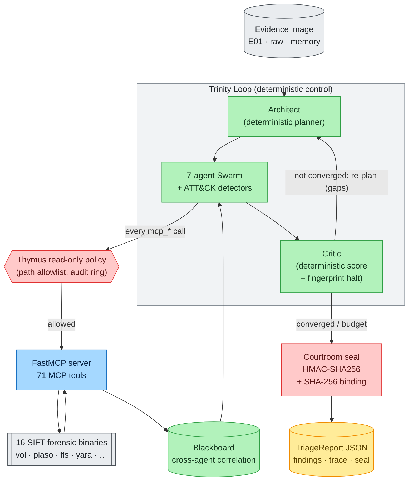

# What is Agentropix-SIFT?

> **Autonomous DFIR triage on the SANS SIFT Workstation.** You point it at a
> Windows disk or memory image; it drives **16 real SIFT forensic tools** through a
> single MCP server, correlates findings across a **7-agent swarm**, and emits a
> cryptographically sealed, schema-validated JSON `TriageReport` — in minutes,
> entirely on the local host, with **no LLM ever rating its own findings**.

Agentropix-SIFT is a **local, CLI-driven, bio-agentic Digital Forensics & Incident
Response (DFIR) triage engine** built for the [SANS SIFT
Workstation](https://www.sans.org/tools/sift-workstation/). *Bio-agentic* means its
safety and orchestration design is mapped to biological metaphors — most importantly
the **Thymus** (the immune system's self/non-self gate, here a read-only evidence
policy); each such mapping is recorded in an Architecture Decision Record (ADR). It
runs the forensic
binaries that examiners and courts already trust (`volatility3`, `log2timeline`,
The Sleuth Kit, RegRipper, YARA, `bulk_extractor`, …) and orchestrates them with an
agentic control loop that is **deterministic where it counts**: every fact in the
report originates from a named forensic tool, captured in a tamper-evident trace.

The entrypoint is a single command:

```bash
agentropix-sift run evidence.E01 -o report.json
```

See the [Quickstart](quickstart.md) for the full first-run walkthrough and
[What You Get](what-you-get.md) for the capability matrix.

---

## Contents — what's in this page (and what to expect)

> Jump to any section below. Each row tells you what that part gives you, so you can go straight to your point.

| Section | What you'll get |
|---|---|
| [The DFIR problem it solves](#the-dfir-problem-it-solves) | Why manual triage is the bottleneck, and the four forensic requirements (no evidence mutation, tool-attributable findings, reproducibility, verifiable chain of custody) Agentropix-SIFT meets. |
| [The pipeline at a glance](#the-pipeline-at-a-glance) | The Trinity Loop diagram and walkthrough — deterministic Architect → 7-agent Swarm + ATT&CK detectors → deterministic Critic — and how a run is sealed into three on-disk files. |
| [Who it is for](#who-it-is-for) | The four target audiences (DFIR analysts, forensic examiners, Wazuh SOC teams, agentic-systems engineers) and why the local-first, offline-by-default design fits each. |
| [Positioning](#positioning) | How Agentropix-SIFT compares against manual triage and against LLM-only assistants, with the side-by-side architecture table (facts, scoring, stop condition, safety, reproducibility, defensibility). |
| [Where to go next](#where-to-go-next) | The two follow-on reads — What You Get (capability matrix) and Quickstart (first end-to-end run). |

---

## The DFIR problem it solves

Incident response begins with **triage**: given a freshly acquired image, an analyst
must answer *"what happened on this host, and is it bad?"* fast enough to scope the
incident. Done by hand, triage is a slow, error-prone sequence of context switches:

- Run `mmls`/`fls` to understand the volume; `icat` to pull files of interest.
- Run `volatility3` plugins (`pslist`, `malfind`, `netscan`, `svcscan`) on a memory
  capture and read the output by eye.
- Run `log2timeline`/`plaso` to build a super-timeline, then `psort` to filter it.
- Parse registry hives with RegRipper, execution evidence with Amcache/Shimcache/Prefetch
  parsers, `.lnk`/Jump List/ShellBag artifacts with the EZ-Tools.
- Scan with YARA, carve with `foremost`/`bulk_extractor`, hash with `hashdeep`.
- Hold every intermediate result in your head, manually correlate a process name in
  memory against a registry persistence key against a timeline event, and write it up.

Each of those tools has a different invocation, a different output format, and a
different failure mode. The analyst is the integration layer — and the bottleneck.
Worse, the moment evidence is touched with a non-read-only tool, chain-of-custody is at
risk.

**Agentropix-SIFT collapses that loop into one command** while preserving the
properties a forensic result needs to be defensible:

| DFIR requirement | How Agentropix-SIFT meets it |
|------------------|------------------------------|
| **Evidence must not be mutated** | The **Thymus** read-only policy (`mcp_server/thymus_policy.py`) gates every tool call at the MCP boundary against a path allowlist *before* a subprocess spawns. No agent is given a write tool. |
| **Findings must be attributable to a tool, not a guess** | Every `Finding` carries a `_source` field naming the deterministic MCP tool that produced it (`agents/_base.py`); `inference_constraint = high` declares that the LLM only orchestrates (ADR-016). |
| **Results must be reproducible** | Agents are pure async coroutines over the MCP boundary with idempotent investigations (same seed → identical trace); the Critic halts on a **deterministic convergence fingerprint**, not a model self-rating (`trinity/critic.py`). |
| **Chain of custody must be verifiable** | A pre/post **SHA-256 evidence invariant** binds the report to the bytes (`evidence_image_sha256`), and a **Courtroom HMAC-SHA256 seal** (`courtroom.py`) makes the report and its audit log tamper-evident and judge-verifiable. |

---

## The pipeline at a glance



The flow is a **Trinity Loop**:

1. **Architect** (`trinity/architect.py`) — a *deterministic* planner (no LLM). It
   returns the canonical ordered `SWARM` tuple, optionally pruning agents the Critic
   already marked stable, and preserves run order so `HuntAgent` runs last.
2. **Swarm** (`agents/`) — the **7 core DFIR specialists** (Memory, Timeline,
   Filesystem, Artifact, Discovery, Mail, Hunt) interleaved with six deterministic
   **ATT&CK detector agents** (YARA hunt, process injection, null-session baseline,
   IFEO/accessibility hijack, IEX loopback C2, svchost outbound HTTP). Each agent
   investigates one dimension by calling MCP tools and publishes `Finding`s to a
   shared **Blackboard** (`agents/_blackboard.py`). The `HuntAgent` consumes everyone
   else's findings to emit high-confidence **cross-source correlations** (≥3-agent
   agreement).
3. **Critic** (`trinity/critic.py`) — a *deterministic* scorer (no LLM self-rating).
   Score = max finding confidence + 0.25·(number of correlations), capped at 1.0. It
   halts when the score reaches the threshold (default **0.85**,
   `AGENTROPIX_CRITIC_HALT_THRESHOLD`) **or** when the per-pass output fingerprint
   reaches a fixed point — gated by a minimum-iterations guard and a refusal to halt
   while any planned agent produced zero findings.

Every agent tool call crosses the **Thymus** policy first, and every call is captured
in the report `trace` with a `duration_ms`, an `args_hash`, and a bounded pre-LLM raw
output snapshot. When the loop halts, the CLI seals the document: it computes the
evidence SHA-256 binding, seals the Thymus audit log, cross-binds that seal into the
report, and writes an HMAC-SHA256 `report_seal` plus a mode-0600 session key. The
result is three files on disk — `report.json`, `<stem>.audit-log.json`, and
`<stem>.session-key` — any of which a judge can independently verify.

> The canonical numbers used above — **71 MCP tools**, **16 SIFT forensic wrappers**,
> the **0.85** halt threshold, the **7-agent** core swarm — are tracked in
> [`.crew/facts.md`](../../.crew/facts.md) (mirroring upstream `CANONICAL_FACTS.md`).
> When a count is load-bearing in your own work, re-query the live `tools/list`.

---

## Who it is for

| Audience | Why it fits |
|----------|-------------|
| **DFIR analysts / incident responders** running SIFT | Drives the tools already in the SIFT distribution; `agentropix-sift doctor` pre-flights the toolchain. Triage that took an analyst hours collapses to a single command and a signed report. |
| **Forensic examiners who must defend findings** | Read-only evidence handling, SHA-256 byte binding, HMAC-sealed reports, and a deterministic (non-LLM-rated) scoring loop produce a result that survives scrutiny — with an optional human-in-the-loop **approval sidecar** (`approval_sidecar/`) for examiner sign-off. |
| **SOC / threat-hunting teams with Wazuh** | Findings and IOCs can be promoted into a Wazuh SIEM (CDB lists, alert indices) through the dedicated Wazuh integration (`wazuh/`), behind default-deny kill switches. |
| **Engineers building agentic systems on untrusted tool output** | A worked reference for *grounding* an agent: deterministic planning/scoring, a policy boundary, evidence invariants, and provenance-chain validation (`provenance/`) instead of trusting model self-assessment. |

It is **local-first and offline by default** — network egress (e.g. threat-intel
lookups) is gated off unless explicitly enabled (`AGENTROPIX_ALLOW_EGRESS`), and the
HTTP surface is tailnet-only with bearer-token auth (ADR-017).

---

## Positioning

### vs. manual triage

Manual triage is the baseline Agentropix-SIFT replaces. The engine does not invent a
new forensic capability — it **runs the same trusted binaries** an analyst would, but
removes the analyst as the integration layer. The gains are *speed* (one command vs.
dozens of context switches), *consistency* (idempotent, reproducible runs vs. an
analyst's working memory), and *defensibility* (automatic SHA-256 binding, HMAC
sealing, and a complete per-tool trace vs. hand-kept notes). The cross-agent
**Blackboard** performs the correlation step — joining a memory process to a registry
persistence key to a timeline event by shared token — that is the most error-prone part
of doing it by hand.

### vs. LLM-only approaches

> *"Every other AI-forensics pitch is an LLM summarising JSON. That hallucinates
> artefacts and trusts bad tool output."* — project README

The defining design choice is that **the LLM never authors or rates a finding**.
Contrast the two architectures:

| | LLM-only DFIR assistant | Agentropix-SIFT |
|--|--------------------------|-----------------|
| **Source of facts** | The model summarises/interprets tool JSON — can hallucinate artifacts | Every `Finding._source` names a deterministic MCP tool; `inference_constraint = high` |
| **Scoring / "confidence"** | Model self-rates ("I'm 90% sure") | Deterministic Critic: max-confidence + 0.25·#correlations; **no self-rating** |
| **Stop condition** | Model decides it's "done" | Deterministic convergence **fingerprint** + min-iterations + zero-finding guard |
| **Evidence safety** | Depends on whatever tools the model can call | Thymus read-only policy enforced at the MCP boundary; no write tool exists |
| **Reproducibility** | Stochastic | Idempotent agents (same seed → identical trace) |
| **Defensibility** | Prose | SHA-256 byte binding + HMAC-SHA256 report/audit seal + provenance chain |

Agentropix-SIFT still uses agentic orchestration — the Architect proposes, the Swarm
explores, the loop re-plans on gaps — but it **constrains the non-deterministic parts to
orchestration only** and pushes every factual claim down to a trusted, traced,
read-only forensic tool. That is what makes its output suitable for a courtroom rather
than just a summary.

---

## Where to go next

- **[What You Get](what-you-get.md)** — the full capability matrix (Trinity Loop, 71
  MCP tools, 16 forensic wrappers, Thymus, Courtroom seal, provenance, approval
  sidecar, Wazuh, chaos-tested resilience).
- **[Quickstart](quickstart.md)** — install, pre-flight (`doctor`), and a first
  end-to-end triage run with example output.
