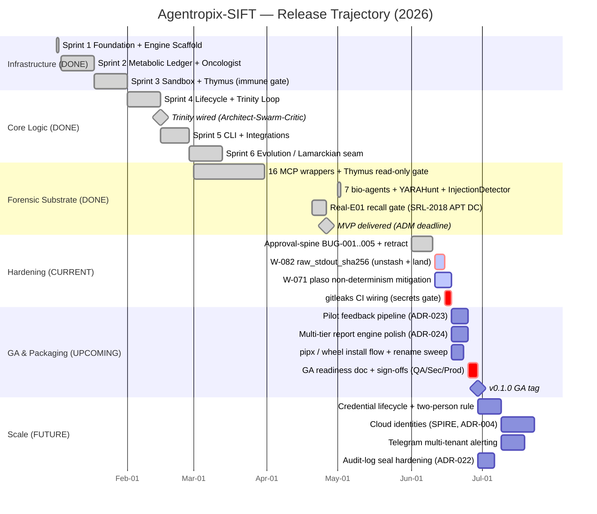
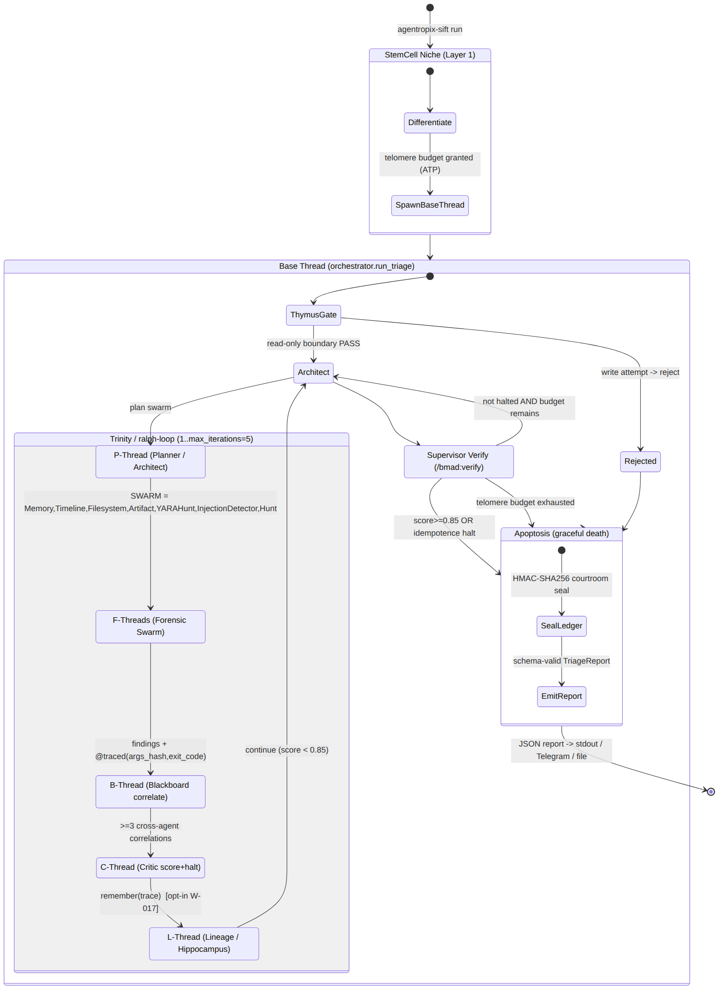
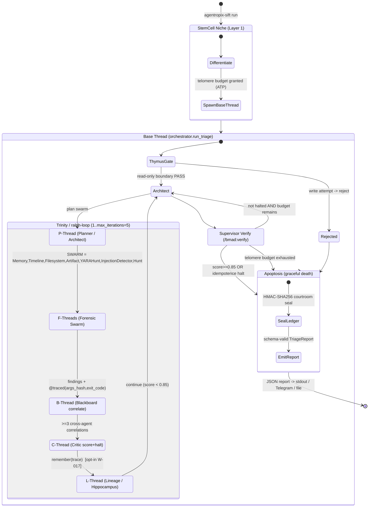

# Agentropix-SIFT — Strategic Project Roadmap

> **Document ID:** ROADMAP-2026-06-11 · **Author:** BMad Master (forge-orchestrator) · **Owner:** victor.galvan@idemia.com
> **Branch baseline:** `feat/sift-mvp` @ `88844e98` · **Version:** `0.1.0-rc1` · **Test baseline:** 4,339 test functions / 1,129+ passing
> **Grounding:** `docs/MASTER-PLAN.md`, `docs/ARCHITECTURE-LAYERS.md`, `CLAUDE.md`, `docs/adr/ADR-001..024`, `scripts/orchestrator/EXECUTION-GUIDE.md`
> **Provenance note:** The `Base/P/C/F/B/L` thread taxonomy is a roadmap-layer overlay mapped onto real runtime constructs (Trinity Loop, swarm agents, Blackboard, Hippocampus). It is **not** a literal code symbol today — formalizing it is a tracked deliverable (see §Technical Specifications).

---

## Part 1 — Visual Roadmaps

### 1.1 Development Gantt — Release Trajectory & Critical Path

Mermaid source (rendered above as PNG for guaranteed display)

**Critical path (red):** `W-082 raw_stdout_sha256 → gitleaks CI → GA readiness/sign-off → v0.1.0 GA`. Everything that gates court-defensibility (evidence hashing, secret leakage, sign-off) sits on this chain; detector depth and cloud identity are parallelizable off it.

---

### 1.2 System Lifecycle — Orchestration, Thread Taxonomy & Apoptosis

Mermaid source (rendered above as PNG for guaranteed display)

**Reading the diagram:** the **StemCell Niche** differentiates a worker and grants a **Telomere Budget** (ATP ceiling). The **Base Thread** clears the **Thymus** read-only gate, then runs the **Trinity / ralph-loop**: **P-Thread** (Architect plan) → **F-Threads** (7 forensic swarm agents) → **B-Thread** (Blackboard correlation) → **C-Thread** (Critic scoring) → **L-Thread** (Hippocampus lineage). The supervisor `/bmad:verify` step is the deterministic halt gate; **Apoptosis** fires on convergence (`score ≥ 0.85`), idempotence, or budget exhaustion, then seals the audit ledger and emits the report.

---

## Part 2 — Strategic Roadmap

### Executive Summary

**Agentropix-SIFT** is a competition-grade, bio-agentic **Digital Forensics & Incident Response (DFIR)** platform that wraps classical forensic binaries (Sleuth Kit, Plaso, Volatility3, RegRipper, YARA, bulk_extractor) in a biological governance layer. Its defining architectural commitment — documented in `ARCHITECTURE-LAYERS.md` — is that **the stochastic LLM boundary is pushed all the way up to Layer 1 (the consumer)**; from Layer 2 down the system is pure deterministic Python and pinned forensic tools. The court-defensibility argument follows directly: *trust the trace ledger and the HMAC-sealed report, because the LLM never touched them.* The system has delivered its MVP (Autonomous Delivery Mode, 2026-04-26), validated against the real 12 GB SRL-2018 APT domain-controller E01 with sub-45-minute wall-clock and read-only evidence guarantees intact. Current state is **`0.1.0-rc1`** with a green suite (1,129+ passing, 0 failures) and a single LOW open weakness (W-071, plaso non-determinism, recall above gate by a 50% margin). The work ahead is **GA hardening, not feature invention**: close the evidence-hashing and secret-leakage gates, formalize packaging, and earn the QA/Security/Product sign-offs.

---

### Milestones & Deliverables

#### Phase 1 — Foundation *(Complete)*
- Bio-Agentic Stack (Layers 0–4 + Genesis math foundation): RalphEngine substrate, StemCell lifecycle, Thymus immune gate, Metabolic Ledger (ATP), Oncologist safety monitor.
- 16 MCP forensic wrappers, each with timeout + memory ceiling + retry + stderr capture (FR-06).
- Python `Protocol`-based strategy interfaces (`ISandbox`, `IMemoryStore`) for backend swap without code change.

#### Phase 2 — Orchestration *(Complete)*
- **Trinity Loop** (`engine/ralph.py` / `trinity/{architect,critic}.py`): Architect → Swarm → Critic → Router with `continue | complete | apoptosis` routing.
- **7 forensic bio-agents**: Memory, Timeline, Filesystem, Artifact, YARAHunt, InjectionDetector, Hunt (YARAHunt + InjectionDetector landed 2026-05-01, closing W-052-T2/T6).
- **Blackboard** shared-state correlation engine (≥3 cross-agent correlations per run, FR-05).
- **Hippocampus bridge** for opt-in Lamarckian inheritance of reasoning traces (W-017).
- Deterministic **Critic** halt gate: `score = max_confidence + 0.25 × correlations`, halt at `≥ 0.85` or idempotence.

#### Phase 3 — Scale & GA *(Current → Upcoming)*
- **Evidence integrity:** land W-082 `raw_stdout_sha256` from stash (Layer-3 adapter hardening) — *critical path*.
- **Secret hygiene:** wire `gitleaks` into CI (binary not yet installed locally) — *critical path*.
- **Determinism:** mitigate W-071 plaso non-determinism (timeline ordering jitter).
- **Packaging:** `pipx`/wheel install flow, rename sweep, multi-tier report engine polish (ADR-024), pilot feedback pipeline (ADR-023).
- **GA gate:** author `GA-READINESS-2026-Q3.md`, collect outstanding QA / Security / Product sign-offs, tag `v0.1.0`.
- **Future scale:** credential lifecycle + two-person rule (ADR-019/020/021), cloud SPIRE identities (ADR-004), Telegram multi-tenant alerting, audit-log seal hardening (ADR-022).

---

### Technical Specifications & Refactoring

| Area | Current state (verified in tree) | Required update | Source |
|------|----------------------------------|-----------------|--------|
| **Layer-3 trace** | `mcp_server/_trace.py` records `args_hash`, `exit_code`, duration | Land `raw_stdout_sha256` (W-082, in stash) so raw tool output is tamper-evident, not just hashed args | `ARCHITECTURE-LAYERS.md` L3 |
| **Critic coverage** | W-083 coverage guard committed (`cf53f22`) | Re-baseline determinism map post-guard; document new floor | `ARCHITECTURE-LAYERS.md` L2 |
| **Thread taxonomy** | Implicit in `orchestrator.py` + `trinity/` + `agents/_blackboard.py` | **Formalize the Base/P/C/F/B/L overlay as named runtime spans** (currently a documentation abstraction) for traceability and the §1.2 lifecycle model | this doc |
| **Secret pipeline** | W-007 precedence chain (file > env > legacy) + SecretFilter | Add `gitleaks` CI stage; the public `agentropix-mcp` OSS sync still has gitleaks as an open TODO | `MASTER-PLAN.md` §10 |
| **Plaso wrapper** | Autoscaled timeout, real-E01 validated | Stabilize ordering (W-071) — sort key on timeline emit to remove non-determinism | `MASTER-PLAN.md` baseline |
| **Report engine** | `reports/` pkg, `report_export` MCP tool (ADR-024 Phase 5) | Multi-tier polish for judge/analyst/reviewer personas (UC-1/UC-2/UC-3) | `ADR-024` |

**Refactoring discipline (binding):** smallest-diff Best-Recommended-Path; destructive changes land in dedicated auditable commits; the read-only evidence guarantee (Thymus) and the 0-failure / ≥90 % coverage gates are never traded for speed (`MASTER-PLAN.md` §0.1).

---

### Risk Mitigation

| # | Risk / Bottleneck | Likelihood | Impact | Concrete mitigation |
|---|-------------------|------------|--------|---------------------|
| R1 | **Trinity loop non-convergence** — Critic never reaches `0.85`, burns full `max_iterations` | Med | Med | Idempotence halt already implemented (`stable_agents` fingerprint); add early-exit when swarm fingerprint is unchanged 2 iterations running — caps wasted ATP |
| R2 | **Telomere/ATP exhaustion mid-triage** on a 12 GB E01 | Med | High | Apoptosis path seals partial ledger + emits a degraded-but-valid `TriageReport`; autoscale plaso timeout (NFR-06) and surface budget pressure as a finding, not a crash |
| R3 | **Plaso non-determinism (W-071)** poisons recall reproducibility (UC-3) | High (open) | Low | Deterministic sort key on timeline emit; pin plaso version in `EXTERNAL-TOOL-PINS.md`; recall already 50 % above gate so non-blocking |
| R4 | **Evidence mutation** (any write to E01) | Low | Critical | Thymus read-only gate rejects writes before execution; SHA-256 of first 1 MiB asserted pre/post (FR-02, NFR-05); W-082 extends to raw-output hashing |
| R5 | **Secret leakage into logs/traces/report** | Low | Critical | SecretFilter + W-007 precedence; **wire gitleaks CI** (open) to catch regressions at commit time |
| R6 | **Multi-agent context bleed** across ralph-loop sessions | Med | Med | Fresh-session-per-story isolation (full 200K budget each); `CLAUDE.md` documents the stale `ralph-loop.local.md` state-leak bug + cleanup at session start |
| R7 | **Doc/code drift** outliving a sprint | Med | Med | Single-source MASTER-PLAN supersedes all predecessors; correlation sweep across `docs/`, `src/`, `tests/`, ADRs at every inflection; dual-gate artifact verification (`stat` + grep counts vs. live command output) |

---

*Generated by BMad Master under Autonomous Delivery Mode. All architectural claims trace to the `feat/sift-mvp` tree at `88844e98`. The thread-taxonomy overlay (§1.2 / Tech-Spec row 3) is the one element proposed rather than extant — flagged so no reader mistakes it for a shipped symbol.*
