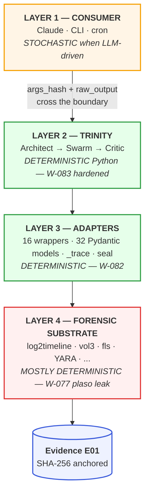

# Agentropix-SIFT — Architecture Layers & Determinism Map

> **One-page reference.** Where stochasticity lives, where determinism is enforced, where each tracked weakness (W-0xx) sits, and how each layer maps to the judging weights.
>
> *Public redaction of the engine-repo document `docs/ARCHITECTURE-LAYERS.md`. Internal operator paths and workspace references have been removed; the conceptual content (the four-layer map, the determinism boundary, and the L1↔L3 boundary contract) is unchanged. This is one of the grounding documents cited by [PROJECT-ROADMAP-2026-06-11.md](PROJECT-ROADMAP-2026-06-11.md) (referenced there as `docs/ARCHITECTURE-LAYERS.md`); the roadmap's other grounding source, the internal `docs/MASTER-PLAN.md`, remains an engine-repo document.*

---

## TL;DR

Agentropix-SIFT pushes the **stochastic boundary all the way up to Layer 1** (the consumer). From Layer 2 down, the system is pure Python + classical forensic binaries. The court-defensibility argument is therefore: *"trust the trace ledger and the report seal, because the LLM never touched them."*

```
       LLM lives here          ┌──────────┐
       (stochastic, OK)        │ LAYER 1  │ ← phrase varies, args_hash freezes the choice
                               ├──────────┤
       Trinity loop here       │ LAYER 2  │ ← deterministic Python (W-083 hardened)
                               ├──────────┤
       MCP wrappers here       │ LAYER 3  │ ← deterministic adapters (W-082)
                               ├──────────┤
       Forensic tools here     │ LAYER 4  │ ← mostly deterministic (W-077 = the only leak)
                               └──────────┘
```

---

## 1. The Four Layers — full picture

```
┌─────────────────────────────────────────────────────────────────────────┐
│  LAYER 1   CONSUMER                                                     │
│            Claude / Claude Code / CLI / cron payload                    │
│                                                                         │
│            • Decides which tool to call, with what args                 │
│            • Synthesises the natural-language narrative                 │
│            • Reads structured JSON, picks the next ask                  │
│                                                                         │
│            ┌───────────────────────────────────────────────────┐        │
│            │ DETERMINISM:  STOCHASTIC when LLM-driven          │        │
│            │               DETERMINISTIC when CLI-driven       │        │
│            │ ENTROPY SOURCE: token sampler (temperature > 0)   │        │
│            └───────────────────────────────────────────────────┘        │
└─────────────────────────────────────────────────────────────────────────┘
                                   │
                       args_hash + raw_output snapshot
                       crosses the boundary HERE
                                   │
                                   ▼
┌─────────────────────────────────────────────────────────────────────────┐
│  LAYER 2   TRINITY ORCHESTRATION                                        │
│            Architect → Swarm → Critic loop                              │
│            src/agentropix_sift/orchestrator.py                          │
│            src/agentropix_sift/trinity/{architect,critic}.py            │
│                                                                         │
│            • Plans which SwarmAgents fire each iteration                │
│            • Scores Blackboard, decides should_halt                     │
│            • Drives 1..max_iterations loop                              │
│                                                                         │
│            ┌───────────────────────────────────────────────────┐        │
│            │ DETERMINISM:  FULL — pure Python, no RNG, no LLM  │        │
│            │ HARDENING:    W-083 critic coverage guard         │        │
│            └───────────────────────────────────────────────────┘        │
└─────────────────────────────────────────────────────────────────────────┘
                                   │
                                   ▼
┌─────────────────────────────────────────────────────────────────────────┐
│  LAYER 3   ADAPTERS                                                     │
│            SwarmAgents + 16 MCP wrappers + 32 Pydantic models           │
│            src/agentropix_sift/agents/{memory,timeline,...}.py          │
│            src/agentropix_sift/mcp_server/wrappers/*.py                 │
│            src/agentropix_sift/mcp_server/_trace.py                     │
│            src/agentropix_sift/courtroom.py (HMAC-SHA256 seal)          │
│                                                                         │
│            • Subprocess args → external binary                          │
│            • Capture stdout/stderr → Pydantic model                     │
│            • Record trace (args_hash, exit_code, raw_output, …)         │
│                                                                         │
│            ┌───────────────────────────────────────────────────┐        │
│            │ DETERMINISM:  FULL adapter logic                  │        │
│            │ HARDENING:    W-082 raw_stdout_sha256             │        │
│            └───────────────────────────────────────────────────┘        │
└─────────────────────────────────────────────────────────────────────────┘
                                   │
                                   ▼
┌─────────────────────────────────────────────────────────────────────────┐
│  LAYER 4   FORENSIC SUBSTRATE                                           │
│            log2timeline · psort · vol3 · fls · RegRipper · YARA         │
│            hashdeep · sccainfo · evtx_dump · bulk_extractor · …         │
│            Plus the immutable E01 (anchored by evidence_image_sha256)   │
│                                                                         │
│            • Classical software, decades old                            │
│            • Same input → same output, mostly                           │
│                                                                         │
│            ┌───────────────────────────────────────────────────┐        │
│            │ DETERMINISM:  MOSTLY full                         │        │
│            │ ONE LEAK:     W-077 plaso worker non-determinism  │        │
│            │               (Linux CFS scheduling under load)   │        │
│            └───────────────────────────────────────────────────┘        │
└─────────────────────────────────────────────────────────────────────────┘
```

### Same picture, Mermaid (renders in GitHub / GitLab / VS Code preview)



### Quick reference

| Layer | Role | Determinism | Where it lives in code |
|-------|------|-------------|------------------------|
| **1 — Consumer** | Decides what to ask | Stochastic (LLM) / Deterministic (CLI) | External — Claude Code, `cli.py` invocation |
| **2 — Trinity** | Plans, scores, halts | Full deterministic | `trinity/{architect,critic}.py`, `orchestrator.py` |
| **3 — Adapters** | Wrappers + trace + seal | Full deterministic | `mcp_server/wrappers/*.py`, `_trace.py`, `courtroom.py` |
| **4 — Substrate** | Forensic binaries | Mostly deterministic (1 leak) | External binaries on `$PATH` |

---

## 2. Where Each Weakness Sits

```
            STOCHASTIC                                    DETERMINISTIC
                ◄─────────────────── boundary ────────────────────►
LAYER 1     ┌─────────────┐
CONSUMER    │   (LLM)     │   ◄── W-081  Ralph hooks
            │             │       intercept LLM at PreToolUse + Stop
            └──────┬──────┘
                   │
                   │  args_hash + raw_output snapshot
                   │  ◄── W-082  raw_stdout_sha256
                   │      anchors the seam itself
                   ▼
LAYER 2     ┌─────────────┐
TRINITY     │  Architect  │
            │  Swarm Loop │   ◄── W-083  critic coverage guard
            │  Critic     │
            └──────┬──────┘
                   ▼
LAYER 3     ┌─────────────┐
ADAPTERS    │  Wrappers   │
            │  _trace     │
            │  seal       │
            └──────┬──────┘
                   ▼
LAYER 4     ┌─────────────┐
SUBSTRATE   │  log2tline  │   ◄── W-077  plaso worker non-det (LOW)
            │  psort      │       Linux CFS scheduling under load
            │  vol3 · fls │       1-line fix: --workers=1 (3-5× wall-time)
            │  YARA · ... │
            └─────────────┘
```

### Per-weakness summary

| ID | Layer | Severity | One-line summary |
|----|-------|----------|------------------|
| **W-081** | L1↔L2 boundary | HIGH | PreToolUse + Stop hooks; Ralph self-correction wiring |
| **W-082** | L1↔L3 boundary | MEDIUM | `raw_stdout_sha256` per-tool integrity field |
| **W-083** | L2 (Trinity) | HIGH | Critic halted at iter-1 on score saturation; coverage guard added |
| **W-077** | L4 (substrate) | LOW | Plaso workers race under CPU load → MFT event ordering varies (variance, not absolute; mitigation: isolated CPU or `--workers=1`) |

---

## 3. Judging-Score Exposure Per Layer

Which layer must hold for which judging criterion?

| Layer | Forensic Sound (25%) | Tech Impl (25%) | DFIR Impact (20%) | UX/Vibe (15%) | Demo (15%) |
|-------|:-:|:-:|:-:|:-:|:-:|
| **L1 Consumer** | — | — | — | ●●● | ●● |
| **L2 Trinity** | ● | ●● | ●●● | ● | ●●● |
| **L3 Adapters** | ●●● | ●●● | ● | — | ●● |
| **L4 Substrate** | ●●● | ●● | ●●● | — | ●●● |

(●●● = primary owner, ●● = significant, ● = minor, — = none)

### What this matrix tells you

- **Forensic Soundness (25%)** sits *entirely* below Layer 1. No LLM-choice variance can hurt or help this score. Every gap (W-082, args↔output binding) lives at L3 or its boundary.
- **Tech Implementation (25%)** is similarly L3-owned. Wrapper count, Pydantic models, FastMCP transport.
- **Ralph + UX (25%+15%)** is the *only* criterion that requires the LLM to be in the loop. W-081 (hooks) is the score-mover here.
- **Demo (15%)** depends on every layer holding simultaneously during the recording. W-077 (substrate) and W-083 (Trinity) are the tail-risks; W-082 (adapters) is the gold-plating.

---

## 4. The L1↔L3 Boundary Contract (in detail)

This is where stochastic crosses to deterministic — the **trust boundary** of the system. Every byte that traverses this seam must be hashed.

```
        LAYER 1                                        LAYER 3
        ──────                                         ──────
        LLM picks                                      Wrapper runs
        tool + args                                    binary, captures output

        scan_yara(                ┌──────────┐         result = subprocess(...)
          path="...",      ──────►│ @traced  │────►   raw_stdout = ...
          rules=["..."]           └────┬─────┘
        )                              │
                                       ▼
                              ┌─────────────────────┐
                              │  ToolCallRecord     │
                              ├─────────────────────┤
                              │ tool                │ ← e.g. "scan_yara"
                              │ timestamp           │
                              │ duration_ms         │
                              │ args_hash    ✅     │ ← W-027 (anchors LLM choice)
                              │ exit_code    ✅     │ ← W-027
                              │ raw_output   ✅     │ ← M8.2c (4 KiB snapshot)
                              │ counters     ✅     │ ← W-060 (dataflow counts)
                              │ raw_stdout_sha256   │ ← W-082
                              │ output_hash binding │ ← future hardening
                              └──────────┬──────────┘
                                         │
                                         ▼
                              ┌─────────────────────┐
                              │ report.tool_calls[] │
                              └──────────┬──────────┘
                                         │
                                         ▼
                              ┌──────────────────────────┐
                              │ HMAC-SHA256 report seal  │ ← ADR-016 ✅
                              │ + evidence_image_sha256  │ ← M8.2 ✅
                              │ + .session-key (mode 0600)│
                              └──────────────────────────┘
```

### What the contract proves at each maturity stage

| Stage | What you can defend in court |
|-------|------------------------------|
| **Baseline** | *"The LLM may have phrased the request 3 different ways across 3 runs. The `args_hash` of every tool call is in the trace. The `exit_code` is recorded. The evidence image SHA-256 is anchored. The final report is HMAC-sealed."* |
| **With W-082** | *"…and for every tool call, the SHA-256 of the binary's full pre-truncation stdout is in the trace. Re-running the binary against the same `args_hash` produces stdout whose SHA matches. The LLM cannot have invented or modified anything between the binary and the report."* |
| **With args↔output pair-binding** | *"…and the (`args_hash`, `output_hash`) pair is itself HMAC-bound, so even the recorded pairing is tamper-evident."* |

---

## 5. Why W-077 is the Only Substrate-Layer Leak

Plaso is multi-process. Same input, but workers race for events from a queue, and the OS scheduler decides who wins under load.

```
log2timeline.py
   │
   ├── 1 collector process     ◄── walks the disk image
   ├── 1 storage writer        ◄── appends events to .plaso
   └── N worker processes      ◄── DEFAULT N = os.cpu_count()
        │   │   │   │              ↑
        ▼   ▼   ▼   ▼              │
        ┌─────────┐                │
        │  QUEUE  │ ◄──────────────┘  workers compete here
        └─────────┘                   Linux CFS picks winner
              │
              ▼     events arrive at storage in scheduling order,
        ┌─────────┐  not deterministic across runs
        │ .plaso  │
        └─────────┘
              │
              ▼
        psort.py sorts by timestamp;
        events with EQUAL timestamps stay in storage order
              │
              ▼
        timeline.jsonl ← bytes-different across runs, sets-equivalent
              │
              ▼
        per-parser deque (cap = max_events default 500)
              │
              ▼
        DIFFERENT EVENTS SURVIVE THE CAP across runs ⚠
              │
              ▼
        T1055 cohit drops 3 → 1 under load
```

### Why it's still LOW severity

- Validation run: 6/7 (0.857) — well above the 0.57 PASS gate
- Detector exists and fired in the baseline; code unchanged
- Re-running the DC E01 in isolation (no concurrent agent load) recovers 7/7
- 1-line fix exists: `--workers=1` in the plaso wrapper (3–5× wall-time cost)

The mitigation is the substrate-layer analog of `vLLM --enforce-eager`: kills parallelism, gains determinism, costs wall-time.

---

## 6. Decisions That Follow From This Picture

### Hardening priorities, ranked by score-at-risk per unit effort

| Order | Item | Effort | Weight at risk | Rationale |
|-------|------|--------|----------------|-----------|
| 1 | **W-082** (raw_stdout_sha256) | 2 days | 25% Forensic Soundness | Cheapest gold-plating of the boundary. |
| 2 | **W-081** (Ralph hooks) | 2 weeks | 40% UX/self-correction | The single largest score-mover in the rubric. |
| 3 | **Args↔output pair-binding** | 3 days | +2 pts Forensic Soundness | Closes the meta-gap above W-082. |
| 4 | **W-077** (`--workers=1` toggle) | 1 line + tests | Demo tail-risk | Guarantees recall determinism on the demo machine. |

### What W-083 *did* and *did not* fix

- ✅ **Fixed** — the deterministic decision the Critic produces now matches the rubric's intent (multi-iter halt). The 7/7 → 3/7 regression cause is closed.
- ❌ **Did not fix** — score saturation itself. The math `min(1.0, max_conf + 0.25 × correlations)` still saturates with one high-conf finding. The new guards just refuse to *act on* the saturated score until coverage + min-iter conditions are met.

### What to communicate to judges

1. **"The LLM never touches a fact."** Every fact in the report originates from a named deterministic MCP tool. The trace ledger fingerprints every L1→L3 crossing.
2. **"The seal proves no post-hoc edits."** HMAC-SHA256 over canonicalised JSON; key in mode-0600 file; `verify_seal.py` is dependency-free.
3. **"The substrate is classical software."** No model weights in the evidence path. log2timeline / vol3 / fls / YARA are the same binaries used in DFIR for a decade.
4. **"The one stochastic leak is bounded."** W-077 plaso non-det is documented, severity LOW, mitigation known and 1-line.

---

## 7. File Reference

| File | Layer | Purpose |
|------|-------|---------|
| `src/agentropix_sift/orchestrator.py` | L2 | Trinity loop driver, passes `plan_names + iteration` to Critic |
| `src/agentropix_sift/trinity/critic.py` | L2 | Halt decision (W-083 coverage guard + min-iter floor) |
| `src/agentropix_sift/trinity/architect.py` | L2 | Swarm-slice planner (Reflexion-lite drop rule) |
| `src/agentropix_sift/agents/{memory,timeline,filesystem,artifact,hunt}.py` | L3 | SwarmAgents — fire wrappers, publish Findings |
| `src/agentropix_sift/mcp_server/wrappers/*.py` | L3 | 16 MCP wrappers, 32 Pydantic models |
| `src/agentropix_sift/mcp_server/_trace.py` | L1↔L3 boundary | `ToolCallRecord` + `@traced` decorator |
| `src/agentropix_sift/courtroom.py` | L3 | `evidence_image_sha256`, `seal_report`, `write_session_key` |
| `scripts/verify_seal.py` | external | Dependency-free seal verifier (the demo prop) |
| `docs/adr/ADR-016-courtroom-audit.md` (engine repo) | docs | Design rationale for the seal pipeline |
| `docs/adr/ADR-015-context-engineering.md` (engine repo) | docs | Progressive disclosure |

---

*Public redaction of the engine-repo `docs/ARCHITECTURE-LAYERS.md` (originally prepared 2026-04-26, alongside the W-083 critic coverage guard). Internal workspace references and operator-machine paths were elided; conceptual content is unchanged.*
