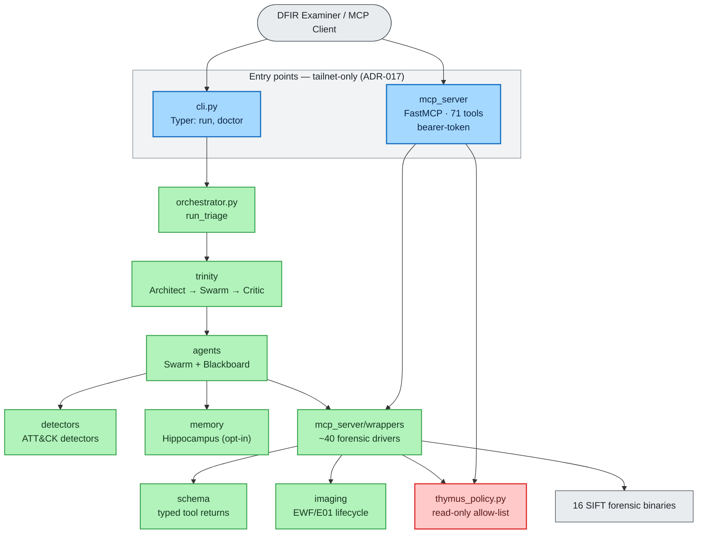
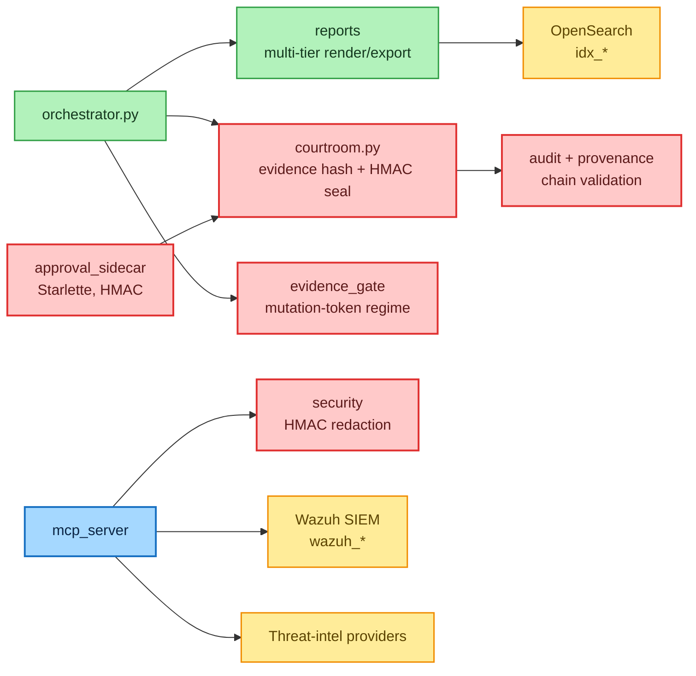
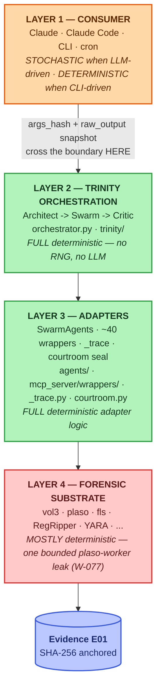

# Component Architecture & Layer Map

> **Section 02 · Architecture** — the internal decomposition. This chapter zooms in from
> the [container view](system-context-c4.md) to the Python packages that make up the
> runtime, and maps them onto the four-layer determinism model that underpins the
> court-defensibility argument.

The package census is authoritative-by-`ls`: `ls -d src/agentropix_sift/*/` yields **17
packages** (two asset/stub-only: `chromosomes`, `benchmarks`) plus **4 top-level modules**
(`orchestrator.py`, `courtroom.py`, `cli.py`, `secrets.py`) — see
`docs/architecture/_C4-COMPONENT.md` and [module-map.md](module-map.md).

**Key terms used on this page (defined here on first mention).** The diagrams below name a
handful of architectural concepts; each is defined once here and detailed on its own page:

- **Trinity Loop** — the deterministic orchestration engine: **Architect** (plans which tools
  to run) → **Swarm** (runs them) → **Critic** (scores findings and decides whether to halt).
  Pure Python, no RNG, no LLM. Code: `trinity/`, `orchestrator.py` →
  [trinity-loop.md](trinity-loop.md).
- **Swarm** — the set of `SwarmAgent` specialists (Memory, Timeline, Filesystem, Artifact,
  Discovery, Mail, Hunt — the 7 core specialists) plus the deterministic ATT&CK detector
  agents. Code: `agents/`, `detectors/` → [swarm-agents.md](swarm-agents.md).
- **Blackboard** — the shared in-memory store where every Swarm agent publishes its `Finding`s
  and reads others', with a **quorum threshold** (default 2) for correlation. Code:
  `agents/_blackboard.py`.
- **Thymus** — the read-only evidence-access policy: a path allow-list plus
  symlink/traversal screen that gates every code path which reads an evidence path. Code:
  `mcp_server/thymus_policy.py` → [mcp-server.md](mcp-server.md#4-thymus--the-read-only-evidence-boundary).
- **Critic** — the deterministic scorer inside the Trinity Loop; halts iteration once the
  confidence score crosses the halt threshold (default `0.85`). Code: `trinity/critic.py`.
- **FastMCP** — the single Model Context Protocol (MCP) server process that exposes the
  **71** forensic tools to MCP clients over a bearer token. Code: `mcp_server/` →
  [mcp-server.md](mcp-server.md).

---

## Contents — what's in this page (and what to expect)

> Jump to any section below. Each row tells you what that part gives you, so you can go straight to your point.

| Section | What you'll get |
|---|---|
| [1. Component diagram (C4 — Level 3)](#1-component-diagram-c4--level-3) | The Level-3 C4 component map split into two narrow views (entry points → engine → tools, then safety spine → outputs → sinks), with the four colour bands and the two key edges to internalise. |
| [2. The four-layer determinism map](#2-the-four-layer-determinism-map) | How the stochastic boundary is pushed up to Layer 1, what each of the four layers does, where it lives in code, and the one bounded substrate leak (W-077). |
| [3. The safety spine, layered](#3-the-safety-spine-layered) | The safety invariants (read-only evidence, evidence binding, tamper-evident seal/audit, mutation gating, human sign-off) mapped to their mechanism, layer, and source. |
| [4. Package inventory (the 17 + 4)](#4-package-inventory-the-17--4) | A table of all 17 packages plus 4 top-level modules — responsibility and a deeper-detail link for each, including the two distinct `wrappers/` packages. |
| [5. Where to go next](#5-where-to-go-next) | Pointers onward to the Trinity loop, Swarm agents, MCP server, and request-level sequence diagrams. |

---

## 1. Component diagram (C4 — Level 3)

C4 has no native Mermaid type; per the upstream convention
(`docs/architecture/_C4-COMPONENT.md`) it is rendered as a styled `flowchart`.

Because a single 17-package graph is too wide to stay legible in a Markdown column,
the component map is shown as **two narrow views**: **(A)** the entry points and the runtime
engine down to the forensic tools, and **(B)** the safety spine, the supporting outputs, and
the external sinks. Both share the same palette (blue = API, green = runtime, red = safety,
amber = sinks, grey = external).

**View A — entry points → runtime engine → forensic tools:**

> 🔍 **[Open as SVG — full size, zoomable](assets/component-architecture-1.svg)** (renders larger than the page column; the SVG zooms losslessly in a browser tab).

**View B — safety spine, supporting outputs, and external sinks:**

**Reading the components.** The diagram groups the 17 packages into four bands:

- **API surface** (blue) — the two ways in (`cli.py`, `mcp_server`) plus the optional
  `approval_sidecar`. Both live inside the tailnet boundary (ADR-017).
- **Runtime** (green) — the deterministic engine: the orchestrator and Trinity Loop, the
  Swarm agents and ATT&CK detectors, the forensic wrappers, plus the supporting `imaging`,
  `memory`, `schema`, and `reports` packages.
- **Safety spine** (red) — `thymus_policy` (read-only boundary), `courtroom`
  (evidence hash + HMAC seal), `evidence_gate` (mutation tokens), `audit` + `provenance`
  (chain validation), and `security` (HMAC redaction). Every state-mutating path crosses
  one of these.
- **External sinks** (yellow/grey) — the 16 SIFT binaries, OpenSearch, Wazuh, threat-intel.

The two key edges to internalise: **the wrappers are the only code that touches the SIFT
binaries**, and **everything that reads a path goes through Thymus** — both `mcp_server`
(at dispatch) and the wrappers (before subprocess). See
[mcp-server.md](mcp-server.md#4-thymus--the-read-only-evidence-boundary) for why the check
runs in both places.

---

## 2. The four-layer determinism map

The defensibility argument rests on pushing the **stochastic boundary all the way up to
Layer 1** (`docs/ARCHITECTURE-LAYERS.md`). From Layer 2 down, the system is pure Python +
classical forensic binaries.

**Reading the layers.** Each layer has a determinism property and a clear code home:

| Layer | Role | Determinism | Where it lives |
|-------|------|-------------|----------------|
| **1 — Consumer** | Decides *what* to ask, synthesises narrative | Stochastic (LLM) / Deterministic (CLI) | External — Claude Code, `cli.py` invocation |
| **2 — Trinity** | Plans, scores, halts | **Full** — pure Python, no RNG, no LLM | `trinity/{architect,critic}.py`, `orchestrator.py` |
| **3 — Adapters** | Wrappers + trace + seal | **Full** adapter logic | `agents/*.py`, `mcp_server/wrappers/*.py`, `_trace.py`, `courtroom.py` |
| **4 — Substrate** | Forensic binaries | Mostly deterministic (one bounded leak) | External binaries on `$PATH` |

The boundary that matters is **L1↔L3**: when an LLM (Layer 1) picks a tool and arguments,
the choice is frozen by an `args_hash`, and the binary's output is snapshotted
(`raw_output`, default 4 KiB) into a `ToolCallRecord` before any LLM-side summarisation
(`mcp_server/_trace.py`). Those records become `report.trace.tool_calls[]`, and the whole
report is HMAC-sealed (`courtroom.py`). The court-defensibility claim is therefore
*"the LLM never touches a fact — every fact originates from a named deterministic MCP tool,
and the trace ledger fingerprints every L1→L3 crossing."*

> **The one substrate leak (W-077).** Plaso (`log2timeline.py`) is multi-process; its
> workers race for events under the Linux CFS scheduler, so equal-timestamp events can
> survive a per-parser cap in different order across runs. Severity is **LOW** and bounded:
> the validated recall stayed at 6/7 (above the PASS gate), and a one-line `--workers=1`
> mitigation trades 3–5× wall-time for full determinism
> (`docs/ARCHITECTURE-LAYERS.md` §5). This is the substrate analog of running an LLM in
> deterministic-eager mode.

---

## 3. The safety spine, layered

The safety spine is not a single module — it is a set of invariants enforced at the layer
where they are cheapest to guarantee:

| Invariant | Mechanism | Layer | Source |
|-----------|-----------|-------|--------|
| **Read-only evidence** | No write tool exists; Thymus allow-list + symlink/traversal screen | L3 boundary | `mcp_server/thymus_policy.py` |
| **Evidence binding** | `evidence_image_sha256` hashed at session start | L3 | `courtroom.py:89` |
| **Deterministic findings** | Findings come only from named tools; Critic does not use an LLM | L2/L3 | `trinity/critic.py`, `agents/_base.py` |
| **Tamper-evident report** | HMAC-SHA256 `report_seal` over canonicalised JSON; key in 0600 file | L3 | `courtroom.py:161` |
| **Tamper-evident audit** | Independent HMAC over the Thymus access trail, cross-bound into the report seal | L3 | `courtroom.py:269` (ADR-022) |
| **Provenance chain** | Per-row HMAC verification of IOC provenance sidecars | L3 | `provenance/validate.py` |
| **Mutation gating** | One-shot, TTL-bound `mutation_token` for every write/promote/ingest tool | L3 | `evidence_gate/registry.py` |
| **Human sign-off** | Optional out-of-process HMAC challenge/approve | external | `approval_sidecar/` |

Each row is detailed in [05-safety-forensics](../05-safety-forensics/) and traced
end-to-end in [sequence-diagrams.md](sequence-diagrams.md). The crucial design choice is
that **evidence read-only-ness is architectural, not advisory** — there is no write tool to
disable (`docs/MCP-REQUEST-FLOW.md`, "Security model in one sentence").

### Three architectural surprises (the judge-facing summary)

The spine rests on three deliberately *unfashionable* choices
(`docs/ARCHITECTURE-LAYERS.md` §4, §6; `docs/MCP-REQUEST-FLOW.md`):

1. **Capability-absence, not permission.** Read-only-ness is enforced by *not building a write
   tool*, not by a togglable permission — you cannot disable a capability that does not exist.
   Thymus `check_write()` is a defence-in-depth audit stub that always REJECTs (`thymus_policy.py`).
2. **LLM-proposes, Trinity-disposes — the wall is the layer boundary.** The LLM is confined to
   Layer 1; the `args_hash` + `raw_output` snapshot is captured at the L1↔L3 seam, so the report can
   prove the model never touched a fact (see [the determinism map](#2-the-four-layer-determinism-map)).
3. **Per-run HMAC + sealed session key, not a long-lived KMS cert.** The seal key is per-run, in a
   mode-0600 `.session-key` file — by design, not a long-lived KMS certificate
   (`courtroom.py`; [audit-courtroom.md](../05-safety-forensics/audit-courtroom.md)).

> **One open seam (honest gap).** The Ralph **PreToolUse** validation hook (W-081) is **partially
> implemented / OPEN** (`docs/ARCHITECTURE-LAYERS.md` §2, HIGH/P0). Until it lands, the first
> deterministic gate that rejects a malformed LLM call is the **wrapper's own Pydantic + Thymus +
> rate-limit check** — there is no PreToolUse interception layer in front of the wrapper yet. The
> full reasoning is in [fastmcp-execution.md](../10-agents/fastmcp-execution.md) §"The open seam".

For the per-call execution model that exercises this spine station by station, see
[fastmcp-execution.md](../10-agents/fastmcp-execution.md).

---

## 4. Package inventory (the 17 + 4)

| Package / module | Responsibility | Detail |
|------------------|----------------|--------|
| `mcp_server/` | FastMCP server, 71 tools, Thymus, trace, config | [mcp-server.md](mcp-server.md) |
| `mcp_server/wrappers/` | ~40 forensic drivers over the 16 SIFT binaries + EZ-Tools | [module-map.md](module-map.md) |
| `agents/` | DFIR Swarm + Blackboard | [swarm-agents.md](swarm-agents.md) |
| `detectors/` | Deterministic ATT&CK detector agents | [swarm-agents.md](swarm-agents.md#3-attck-detector-agents) |
| `trinity/` | Architect + Critic | [trinity-loop.md](trinity-loop.md) |
| `orchestrator.py` | `run_triage()` — drives the Swarm under Trinity | [trinity-loop.md](trinity-loop.md) |
| `courtroom.py` | Evidence hash + HMAC seal | `courtroom.py` |
| `provenance/` | Provenance-chain validation | `provenance/validate.py` |
| `evidence_gate/` | Mutation-token registry | `evidence_gate/registry.py` |
| `approval_sidecar/` | HMAC human-in-the-loop service | `approval_sidecar/` |
| `security/` | HMAC-keyed finding redaction | `security/redact.py` |
| `audit/` | Standalone seal verifier | `audit/verify_seal.py` |
| `memory/` | Hippocampus recall bridge (opt-in) | `memory/hippocampus_bridge.py` |
| `wazuh/` | SIEM integration (optional sink) | `wazuh/` |
| `imaging/` | EWF/E01 mount lifecycle | `imaging/ewf_lifecycle.py` |
| `reports/` | Multi-tier report render/export | `reports/render.py` |
| `schema/` | Typed tool-return models + JSON Schemas | [03-data](../03-data/) |
| `wrappers/` (top-level) | Email-header parser, MASTER-IOCS aggregator, memory mail carve | [module-map.md](module-map.md) |
| `chromosomes/`, `benchmarks/` | Asset/stub-only | — |
| `cli.py`, `secrets.py` | Typer CLI; secret resolution | `cli.py`, `secrets.py` |

> The `wrappers/` package (top-level) is **distinct** from `mcp_server/wrappers/`. The
> top-level one holds the canonical email-header parser, the MASTER-IOCS aggregator, and
> the memory mail-carve helper; the `mcp_server/wrappers/` one holds the ~40 forensic
> drivers ([module-map.md](module-map.md) §wrappers).

---

## 5. Where to go next

- The deterministic halt logic of the engine → [trinity-loop.md](trinity-loop.md)
- The agents that fill the Blackboard → [swarm-agents.md](swarm-agents.md)
- The MCP protocol surface and Thymus → [mcp-server.md](mcp-server.md)
- How the EZ-Tools / ZimmermanTools wrappers sit in `mcp_server/wrappers/` (genuine `.NET` binaries
  vs the three Linux substitutes) → [ez-tools-integration.md](ez-tools-integration.md)
- One agent tool call, station by station → [fastmcp-execution.md](../10-agents/fastmcp-execution.md)
- The runtime/build-time "agent" disambiguation → [10-agents](../10-agents/agentic-architecture.md)
- Request-level flows through this component graph → [sequence-diagrams.md](sequence-diagrams.md)
