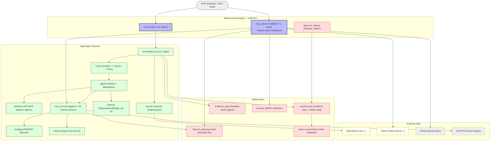
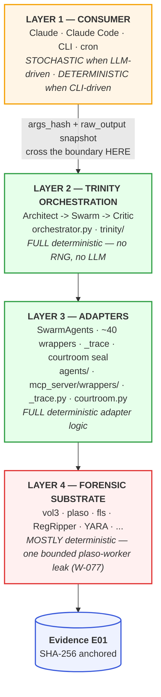

# Component Architecture & Layer Map

> **Section 02 · Architecture** — the internal decomposition. This chapter zooms in from
> the [container view](system-context-c4.md) to the Python packages that make up the
> runtime, and maps them onto the four-layer determinism model that underpins the
> court-defensibility argument.

The package census is authoritative-by-`ls`: `ls -d src/agentropix_sift/*/` yields **17
packages** (two asset/stub-only: `chromosomes`, `benchmarks`) plus **4 top-level modules**
(`orchestrator.py`, `courtroom.py`, `cli.py`, `secrets.py`) — see
`docs/architecture/_C4-COMPONENT.md` and [module-map.md](../../.crew/module-map.md).

---

## 1. Component diagram (C4 — Level 3)

C4 has no native Mermaid type; per the upstream convention
(`docs/architecture/_C4-COMPONENT.md`) it is rendered as a styled `flowchart`.

**Reading the components.** The diagram groups the 17 packages into four bands:

- **API surface** (blue) — the two ways in (`cli.py`, `mcp_server`) plus the optional
  `approval_sidecar`. Both live inside the tailnet boundary (ADR-017).
- **Runtime** (green) — the deterministic engine: the orchestrator and Trinity loop, the
  Swarm agents and ATT&CK detectors, the forensic wrappers, plus the supporting `imaging`,
  `memory`, `schema`, and `reports` packages.
- **Safety spine** (red) — `thymus_policy` (read-only boundary), `courtroom`
  (evidence hash + HMAC seal), `evidence_gate` (mutation tokens), `audit` + `provenance`
  (chain validation), and `security` (HMAC redaction). Every state-mutating path crosses
  one of these.
- **External sinks** (yellow/grey) — the 16 SIFT binaries, OpenSearch, Wazuh, threat-intel.

The two key edges to internalise: **the wrappers are the only code that touches the SIFT
binaries**, and **everything that reads a path goes through Thymus** — both `mcp_server`
(at dispatch) and the wrappers (before subprocess). See
[mcp-server.md](mcp-server.md#thymus-the-read-only-evidence-boundary) for why the check
runs in both places.

---

## 2. The four-layer determinism map

The defensibility argument rests on pushing the **stochastic boundary all the way up to
Layer 1** (`docs/ARCHITECTURE-LAYERS.md`). From Layer 2 down, the system is pure Python +
classical forensic binaries.

**Reading the layers.** Each layer has a determinism property and a clear code home:

| Layer | Role | Determinism | Where it lives |
|-------|------|-------------|----------------|
| **1 — Consumer** | Decides *what* to ask, synthesises narrative | Stochastic (LLM) / Deterministic (CLI) | External — Claude Code, `cli.py` invocation |
| **2 — Trinity** | Plans, scores, halts | **Full** — pure Python, no RNG, no LLM | `trinity/{architect,critic}.py`, `orchestrator.py` |
| **3 — Adapters** | Wrappers + trace + seal | **Full** adapter logic | `agents/*.py`, `mcp_server/wrappers/*.py`, `_trace.py`, `courtroom.py` |
| **4 — Substrate** | Forensic binaries | Mostly deterministic (one bounded leak) | External binaries on `$PATH` |

The boundary that matters is **L1↔L3**: when an LLM (Layer 1) picks a tool and arguments,
the choice is frozen by an `args_hash`, and the binary's output is snapshotted
(`raw_output`, default 4 KiB) into a `ToolCallRecord` before any LLM-side summarisation
(`mcp_server/_trace.py`). Those records become `report.trace.tool_calls[]`, and the whole
report is HMAC-sealed (`courtroom.py`). The court-defensibility claim is therefore
*"the LLM never touches a fact — every fact originates from a named deterministic MCP tool,
and the trace ledger fingerprints every L1→L3 crossing."*

> **The one substrate leak (W-077).** Plaso (`log2timeline.py`) is multi-process; its
> workers race for events under the Linux CFS scheduler, so equal-timestamp events can
> survive a per-parser cap in different order across runs. Severity is **LOW** and bounded:
> the validated recall stayed at 6/7 (above the PASS gate), and a one-line `--workers=1`
> mitigation trades 3–5× wall-time for full determinism
> (`docs/ARCHITECTURE-LAYERS.md` §5). This is the substrate analog of running an LLM in
> deterministic-eager mode.

---

## 3. The safety spine, layered

The safety spine is not a single module — it is a set of invariants enforced at the layer
where they are cheapest to guarantee:

| Invariant | Mechanism | Layer | Source |
|-----------|-----------|-------|--------|
| **Read-only evidence** | No write tool exists; Thymus allow-list + symlink/traversal screen | L3 boundary | `mcp_server/thymus_policy.py` |
| **Evidence binding** | `evidence_image_sha256` hashed at session start | L3 | `courtroom.py:89` |
| **Deterministic findings** | Findings come only from named tools; Critic does not use an LLM | L2/L3 | `trinity/critic.py`, `agents/_base.py` |
| **Tamper-evident report** | HMAC-SHA256 `report_seal` over canonicalised JSON; key in 0600 file | L3 | `courtroom.py:161` |
| **Tamper-evident audit** | Independent HMAC over the Thymus access trail, cross-bound into the report seal | L3 | `courtroom.py:269` (ADR-022) |
| **Provenance chain** | Per-row HMAC verification of IOC provenance sidecars | L3 | `provenance/validate.py` |
| **Mutation gating** | One-shot, TTL-bound `mutation_token` for every write/promote/ingest tool | L3 | `evidence_gate/registry.py` |
| **Human sign-off** | Optional out-of-process HMAC challenge/approve | external | `approval_sidecar/` |

Each row is detailed in [05-safety-forensics](../05-safety-forensics/) and traced
end-to-end in [sequence-diagrams.md](sequence-diagrams.md). The crucial design choice is
that **evidence read-only-ness is architectural, not advisory** — there is no write tool to
disable (`docs/MCP-REQUEST-FLOW.md`, "Security model in one sentence").

---

## 4. Package inventory (the 17 + 4)

| Package / module | Responsibility | Detail |
|------------------|----------------|--------|
| `mcp_server/` | FastMCP server, 71 tools, Thymus, trace, config | [mcp-server.md](mcp-server.md) |
| `mcp_server/wrappers/` | ~40 forensic drivers over the 16 SIFT binaries + EZ-Tools | [module-map.md](../../.crew/module-map.md) |
| `agents/` | DFIR Swarm + Blackboard | [swarm-agents.md](swarm-agents.md) |
| `detectors/` | Deterministic ATT&CK detector agents | [swarm-agents.md](swarm-agents.md#attck-detector-agents) |
| `trinity/` | Architect + Critic | [trinity-loop.md](trinity-loop.md) |
| `orchestrator.py` | `run_triage()` — drives the Swarm under Trinity | [trinity-loop.md](trinity-loop.md) |
| `courtroom.py` | Evidence hash + HMAC seal | `courtroom.py` |
| `provenance/` | Provenance-chain validation | `provenance/validate.py` |
| `evidence_gate/` | Mutation-token registry | `evidence_gate/registry.py` |
| `approval_sidecar/` | HMAC human-in-the-loop service | `approval_sidecar/` |
| `security/` | HMAC-keyed finding redaction | `security/redact.py` |
| `audit/` | Standalone seal verifier | `audit/verify_seal.py` |
| `memory/` | Hippocampus recall bridge (opt-in) | `memory/hippocampus_bridge.py` |
| `wazuh/` | SIEM integration (optional sink) | `wazuh/` |
| `imaging/` | EWF/E01 mount lifecycle | `imaging/ewf_lifecycle.py` |
| `reports/` | Multi-tier report render/export | `reports/render.py` |
| `schema/` | Typed tool-return models + JSON Schemas | [03-data](../03-data/) |
| `wrappers/` (top-level) | Email-header parser, MASTER-IOCS aggregator, memory mail carve | [module-map.md](../../.crew/module-map.md) |
| `chromosomes/`, `benchmarks/` | Asset/stub-only | — |
| `cli.py`, `secrets.py` | Typer CLI; secret resolution | `cli.py`, `secrets.py` |

> The `wrappers/` package (top-level) is **distinct** from `mcp_server/wrappers/`. The
> top-level one holds the canonical email-header parser, the MASTER-IOCS aggregator, and
> the memory mail-carve helper; the `mcp_server/wrappers/` one holds the ~40 forensic
> drivers ([module-map.md](../../.crew/module-map.md) §wrappers).

---

## 5. Where to go next

- The deterministic halt logic of the engine → [trinity-loop.md](trinity-loop.md)
- The agents that fill the Blackboard → [swarm-agents.md](swarm-agents.md)
- The MCP protocol surface and Thymus → [mcp-server.md](mcp-server.md)
- Request-level flows through this component graph → [sequence-diagrams.md](sequence-diagrams.md)
