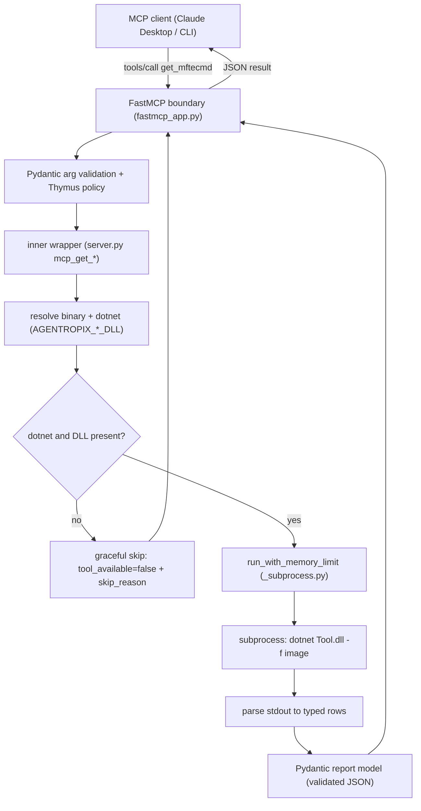
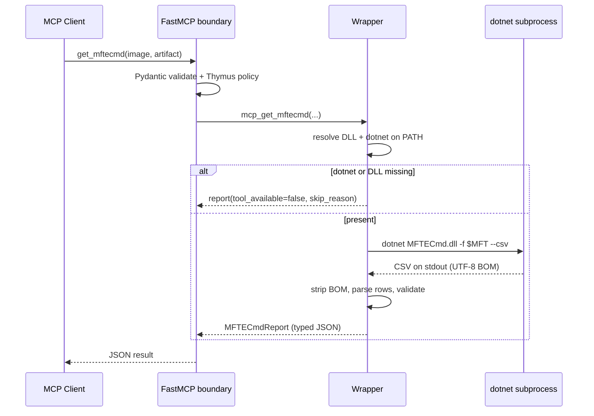
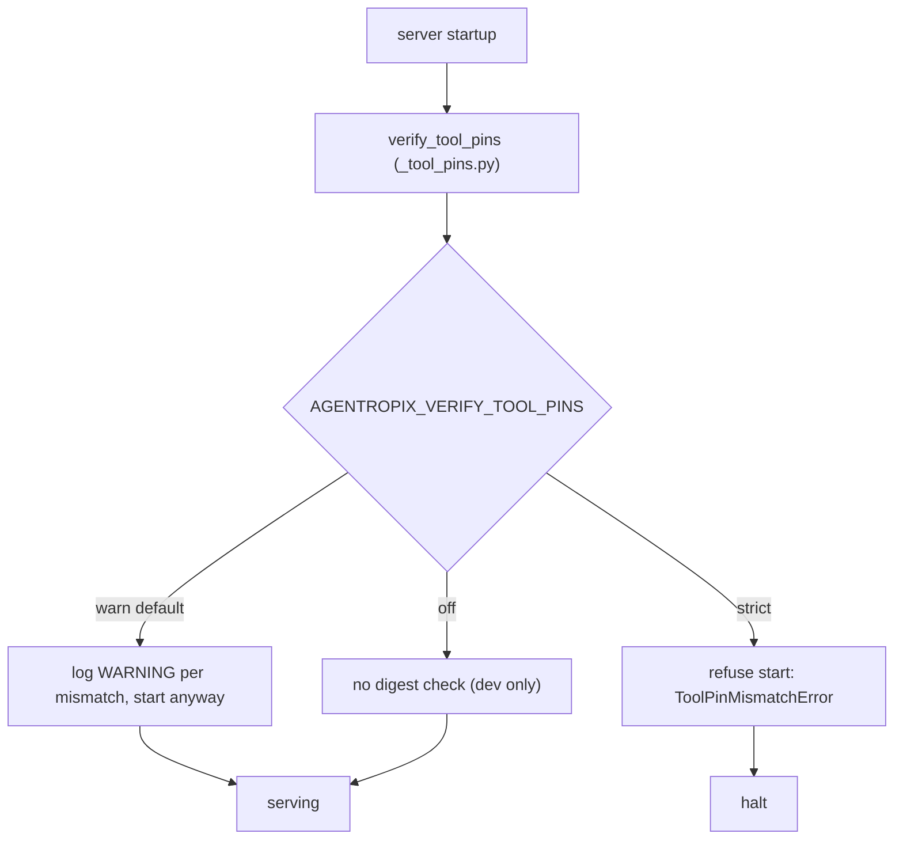

# EZ Tools / ZimmermanTools Integration

> **Section 02 · Architecture** — how Agentropix-SIFT wraps Eric Zimmerman's **EZ Tools**
> (Windows-native `.NET 9` CLI forensic parsers) as governed MCP tools. These wrappers are
> part of the **16 SIFT forensic tools** the engine drives ([canonical-facts.md](../08-reference/canonical-facts.md))
> and surface as ten of the **73 MCP tools** ([tool-list.md](../04-mcp-tools/tool-list.md)); for
> the protocol surface that registers them see [The FastMCP Server](mcp-server.md), and for
> the per-tool catalogue see [04-mcp-tools](../04-mcp-tools/).
>
> **Ground-truth note.** Every claim below is cited to `file:line` in the oracle repo
> `src/agentropix_sift/`. Where this contradicts a narrative doc, **source wins** and the
> discrepancy is called out in [§7](#7-known-gaps-drift-and-risks-source-vs-docs).
>
> **Cross-references.**
> - **Architecture:** [Component Architecture & Layer Map](component-architecture.md) (where these
>   wrappers sit in `mcp_server/wrappers/`) · [The FastMCP Server](mcp-server.md) (the protocol
>   surface that registers them) · [FastMCP Execution](../10-agents/fastmcp-execution.md) (how one
>   wrapper call runs).
> - **MCP tools:** [MCP Tool Reference](../04-mcp-tools/tool-reference.md) ·
>   [Tool List](../04-mcp-tools/tool-list.md) (the 73-tool catalogue, EZ wrappers flagged).
> - **Reference:** [Design Decisions](../08-reference/design-decisions.md) (the hybrid
>   genuine-binary-vs-substitute rationale).
> - **ADRs (decision rationale):** [ADR-013 · `mcp_get_evtx`
>   wrapper](../11-ADR/ADR-013-evtx-wrapper.md) (Accepted) — the dual-format event-log wrapper
>   and the `evtx_dump 0.11.2` digest pin that §5 governs · [ADR-012 ·
>   `mcp_extract_files`](../11-ADR/ADR-012-extract-files.md) (Accepted) — the typed
>   extraction tool many EZ wrappers consume before parsing.
> - **Oracle source of truth:** `docs/EZ-TOOLS-MAPPING.md` (the SANS Find-Evil mapping of each EZ
>   Tool category to its SIFT/Linux or genuine-`.NET` driver), plus the wrapper modules under
>   `src/agentropix_sift/mcp_server/wrappers/` — these are authoritative; the narrative
>   `EZ-TOOLS-MAPPING.md` / `EXTERNAL-TOOL-PINS.md` are secondary (verify before trusting, per §7).

---

## 1. Overview & scope

Agentropix-SIFT wraps Eric Zimmerman's **EZ Tools** as governed MCP tools. The runtime
shells out to each tool as a subprocess, parses its output, and returns
**Pydantic-validated JSON** — never raw passthrough. The integration is a **hybrid**: most
tools invoke the genuine EZ `.NET` binaries via `dotnet`, but three artifact classes
(Amcache, ShimCache, SRUM) are served by **Linux substitutes** instead of the EZ binary.

Coverage spans: NTFS (`$MFT`/`$J`), registry hives, LNK, Jump Lists, ShellBags, SQLite
(map-driven), and binary strings — plus Amcache, ShimCache, and SRUM via substitutes.

---

## 2. Tool inventory (verified against source)

| Artifact | EZ tool | MCP tool | What is actually invoked | Real EZ binary or Linux substitute | Wrapper (`wrappers/`) |
|----------|---------|----------|---------------------------|-------------------------------------|------------------------|
| NTFS `$MFT`/`$J`/`$Boot` | MFTECmd | `get_mftecmd` | `dotnet /opt/ezt/net9/MFTECmd/MFTECmd.dll` | **real** | `mftecmd.py:44,190` |
| Registry hives (batch) | RECmd | `get_recmd` | `dotnet …/RECmd/RECmd.dll` + `.reb` batch | **real** | `recmd.py:46,184` |
| LNK shortcuts | LECmd | `get_lecmd` | `dotnet …/LECmd/LECmd.dll` | **real** | `lecmd.py:41,195` |
| Jump Lists | JLECmd | `get_jlecmd` | `dotnet …/JLECmd/JLECmd.dll` | **real** | `jlecmd.py:45,192` |
| ShellBags | SBECmd | `get_sbecmd` | `dotnet …/SBECmd/SBECmd.dll` | **real** | `sbecmd.py:39,141` |
| SQLite (maps) | SQLECmd | `get_sqlecmd` | `dotnet …/SQLECmd/SQLECmd.dll` + `Maps/` | **real** | `sqlecmd.py:41,116` |
| Binary strings | bstrings | `get_bstrings` | `dotnet …/bstrings/bstrings.dll` (via stdin) | **real** | `bstrings.py:50,155` |
| Amcache | AmcacheParser | `get_amcache` | `AGENTROPIX_AMCACHE_TOOL` (SANS SIFT Python parser) | **substitute** | `amcache.py:37,176` |
| ShimCache (AppCompat) | AppCompatCacheParser | `get_shimcache` | `AGENTROPIX_SHIMCACHE_TOOL` (SIFT parser) | **substitute** | `shimcache.py:40,154` |
| SRUM `SRUDB.dat` | SrumECmd | `srum_extract` | `esedbexport` (libesedb) | **substitute** | `srum.py:44,73` |
| Windows Timeline | WxTCmd | — | *(unwrapped — see [§7](#7-known-gaps-drift-and-risks-source-vs-docs))* | n/a | — |

**Path note.** Wrappers default to `/opt/ezt/net9/<Tool>/<Tool>.dll` (`mftecmd.py:44`
et al), overridable per tool via `AGENTROPIX_<TOOL>_DLL` and the runtime via
`AGENTROPIX_DOTNET_TOOL`. A **second, parallel** copy exists at `/opt/zimmermantools/` —
it is *not* the path the wrappers use by default.

---

## 3. How Agentropix invokes a tool (call path)

Key properties:
- **No raw passthrough** — output is always a Pydantic report model (e.g. `MFTECmdReport`
  `mftecmd.py:105`, `SrumExtractResult` `srum.py:151`).
- **Graceful skip is the M6.4 contract** — a missing `dotnet`, DLL, or batch file yields
  `tool_available=false` / `skip_reason`, never a crash (`recmd.py:208`).
- **Memory-governed subprocess** — `run_with_memory_limit` (`_subprocess.py:207`) monitors
  RSS via psutil and **kills the process tree** if it exceeds the cap (`_subprocess.py:174`);
  the cap scales to evidence size (W-162, `_subprocess.py:69`).

---

## 4. One invocation, end to end

> 🔍 **[Open as SVG — full size, zoomable](assets/ez-tools-integration-2.svg)** (renders larger than the page column; the SVG zooms losslessly in a browser tab).

> **Gotcha encoded in the wrappers:** EZ CSV output begins with a UTF-8 BOM; it must be
> stripped before `csv.DictReader` or first-column lookups silently miss every row.

---

## 5. Governance & safety

> 🔍 **[Open as SVG — full size, zoomable](assets/ez-tools-integration-3.svg)** (renders larger than the page column; the SVG zooms losslessly in a browser tab).

- **Digest pinning** (`_tool_pins.py`): trust mode via `AGENTROPIX_VERIFY_TOOL_PINS` =
  `off` / `warn` (default, `_tool_pins.py:103`) / `strict`. **Important:** the pinned set is
  **`evtx_dump` `0.11.2`, `yara`, `bulk_extractor`** (`_tool_pins.py:42,47,52`) — the EZ
  `.NET` DLLs are **not** digest-pinned.
- **Thymus policy + Pydantic** validate every call at the boundary (`fastmcp_app.py:6`);
  profile-style args are charset-guarded `[A-Za-z0-9_]+` against argv injection
  (`fastmcp_app.py:467`). See [The FastMCP Server §4](mcp-server.md) for the read-only
  Thymus boundary in full.
- **EvidenceGate** gates writes (findings) behind a mutation token (`fastmcp_app.py:1201`) —
  orthogonal to the read-only EZ parsers.

---

## 6. Use cases

1. **NTFS execution timeline.** `get_mftecmd(image=<$MFT>, artifact="mft")` →
   `MFTECmdEntry` rows → feed `record_timeline_event` / findings for the active case.
2. **Registry persistence sweep.** `get_recmd` with the Kroll batch surfaces
   `T1547`/`T1053`/`T1078` keys (`PHASE-EZ-TOOLS-INTEGRATION-COMPLETE.md`), staged as DRAFT
   findings.
3. **SRUM network attribution.** `srum_extract(srudb=<SRUDB.dat>)` via `esedbexport` →
   `SrumNetworkDataRow` (`srum.py:80`) to attribute bytes-out to a process.

---

## 7. Known gaps, drift, and risks (source vs docs)

- **WxTCmd unwrapped.** No `get_wxtcmd` MCP tool exists, even though
  `/opt/zimmermantools/WxTCmd.dll` is installed. `EZ-TOOLS-MAPPING.md` already flags this as
  the one remaining EZ gap. **Confirmed true.**
- **EZ DLLs are not digest-pinned.** `EXTERNAL-TOOL-PINS.md` reads as if every shelled binary
  is pinned, but `_tool_pins.py` pins only `evtx_dump`/`yara`/`bulk_extractor`. The EZ `.NET`
  tools rely on path + graceful-skip, **not** digest verification. **Drift — doc overstates
  coverage.**
- **"Linux equivalents" framing undersells the hybrid.** `EZ-TOOLS-MAPPING.md` frames
  coverage as SIFT-Linux equivalents, but MFTECmd/RECmd/LECmd/JLECmd/SBECmd/SQLECmd/bstrings
  invoke the **genuine EZ binaries**. Only Amcache/ShimCache/SRUM are true substitutes
  (`amcache.py:37`, `shimcache.py:40`, `srum.py:44`).
- **Two install paths.** `/opt/ezt/net9` (wrappers' default) vs `/opt/zimmermantools`
  (parallel copy). Drift risk if an operator updates one and not the other.

---

## 8. References (source of truth)

- Wrappers: `src/agentropix_sift/mcp_server/wrappers/{mftecmd,recmd,lecmd,jlecmd,sbecmd,sqlecmd,bstrings,amcache,shimcache,srum}.py`
- MCP registration: `src/agentropix_sift/mcp_server/fastmcp_app.py:692-909`
- Subprocess governance: `src/agentropix_sift/mcp_server/wrappers/_subprocess.py`
- Digest pins: `src/agentropix_sift/mcp_server/_tool_pins.py`
- Secondary (narrative, verify before trusting): `docs/EZ-TOOLS-MAPPING.md`,
  `docs/EXTERNAL-TOOL-PINS.md`, `docs/PHASE-EZ-TOOLS-INTEGRATION-{PLAN,COMPLETE}.md`

**Related portal pages:** [The FastMCP Server](mcp-server.md) ·
[Component Architecture & Layer Map](component-architecture.md) ·
[MCP Tool Reference](../04-mcp-tools/tool-reference.md) ·
[Canonical Facts](../08-reference/canonical-facts.md)
