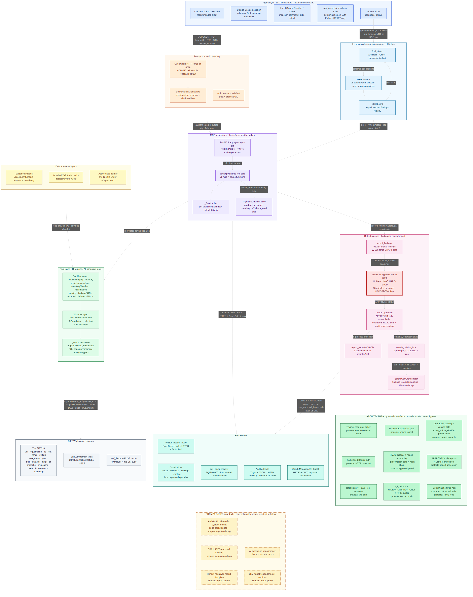

# Agentropix-SIFT — Main Architectural Design

> **Audience:** architects, examiners, and reviewers who need a single verified picture of the runtime.
> **Question this page answers:** *what are the moving parts of Agentropix-SIFT, how do LLM clients reach the deterministic tools, and which guardrails are enforced in code versus by convention?*

## How to read this page

This page presents one validated architecture diagram of the Agentropix-SIFT runtime, derived from the oracle repository (`/home/admin2/agentropix-sift`, `src/` + docs) and reconciled against [`canonical-facts.md`](../08-reference/canonical-facts.md). Every component, connection, and guardrail shown below is grounded in a named source file (see the [Component-to-source map](#component-to-source-map)); claims that did not survive source verification are recorded as honest negatives rather than silently dropped.

Reading order:

1. **The diagram** — top-to-bottom: agent layer → transport/auth boundary → MCP server core → tool families → wrappers → SIFT Workstation binaries, with data sources feeding in, persistence at the side, and the findings → approval → sealed-report → Wazuh output pipeline.
2. **[The components in detail](#the-components-in-detail--documentation-first-then-source-contrast)** — a narrative walk through each diagram layer: what the portal documentation says, then what the source code shows, with every disagreement called out (the source wins).
3. **Two guardrail columns** flank the flow: **ARCHITECTURAL** (green, solid border — enforced in code, the model cannot bypass them) and **PROMPT-BASED** (amber, dashed border — conventions an LLM is instructed to honor). Each guardrail box names the point it protects (e.g. “protects: approval portal”); the full enforcement-file mapping is in the table below.
4. The **red, thick-bordered node** is the Examiner Approval Portal — the human HMAC hard-stop. No code path promotes a DRAFT finding to APPROVED without a valid challenge-response signature from the examiner.

The diagram is committed as a PNG (rendered from Mermaid source via `mmdc`) so it displays for every reader regardless of client-side Mermaid support.

🔍 [Open as SVG — full size, zoomable](assets/architecture-diagram/architecture-diagram.svg) · 📕 [**This document as high-quality PDF**](assets/architecture-diagram/main-architectural-agentropix-design.pdf) · 📄 [Diagram-only HD PDF (vector)](assets/architecture-diagram/architecture-diagram-hd.pdf) · 📄 [Raster PDF](assets/architecture-diagram/architecture-diagram.pdf) · [Mermaid source](assets/architecture-diagram/architecture-diagram.mmd)

---

## The components in detail — documentation first, then source contrast

Each subsection follows the validation discipline used to build the diagram: **what the portal
documentation says** (docs/02-architecture, 04-mcp-tools, 05-safety-forensics, 09-integrations,
10-agents, plus the oracle `README`/`CANONICAL_FACTS.md`) is stated first, then **what the source code
under `src/agentropix_sift/` actually shows**, with every disagreement called out. Where the two
conflict, the source is authoritative.

### 1. The agent

**Documentation** ([client-setup.md](../09-integrations/client-setup.md), [agentic-architecture.md](../10-agents/agentic-architecture.md), [user-guide.md](../01-overview/user-guide.md)): the "agent" is not a bundled LLM — it is whatever MCP client the operator attaches. Three consumer shapes are documented: **Claude Code CLI** (recommended; `claude mcp add --transport http` with a Bearer header), **Claude Desktop** (stdio-only GUI, bridged to the HTTP endpoint via an `npx mcp-remote` shim, 1 MB inline-result cap), and a **local stdio launch** via an `mcp.json` `command` entry. The dual-audience model means a non-technical user types a plain-language prompt and the session routes it to a real MCP tool.

**Source contrast — confirmed, with two sharpenings:**

- The literal `mcp.json` snippet is shipped *inside the module docstring* of the server package itself — the product is explicitly built to be mounted into a general-purpose Claude session.
- There are also **non-LLM agents**. `agx_gearb.py` is a deterministic headless Python driver (one persistent `Mcp-Session-Id` HTTP session, per-step `SUMMARY.json` checkpoints, launched detached); it lives on the workstation **outside the product repo** and by design stages findings as DRAFT only, stopping at the approval gate. Inside the package, the **Trinity Loop + DFIR Swarm** (`trinity/`, `agents/`, `detectors/`) coordinates 13 SwarmAgent classes (7 core specialists + 6 ATT&CK detectors) over an asyncio-locked Blackboard — and the source is explicit that this is **LLM-free** ("no LLM coupling — pure async coroutines"). The *only* in-runtime LLM touchpoint in the entire package is the optional Architect reorder pass (`AGENTROPIX_ARCHITECT_LLM_REORDER`, default **off**, fail-open, Claude haiku), whose output is code-validated (see the guardrail table).
- The BMAD/forge personas and OpenClaw crews that appear in the docs are **build-time and documentation-production roles only**; the source contains no runtime trace of them. A reader could misread the docs as implying a runtime multi-agent product — the code says otherwise.

### 2. The SIFT Workstation tools

**Documentation** ([tool-list.md](../04-mcp-tools/tool-list.md), [canonical-facts.md](../08-reference/canonical-facts.md)): 16 SIFT forensic binaries driven by wrapper modules, surfaced as 72 MCP tools grouped into families.

**Source contrast — the concrete inventory:**

- **The SIFT-16** (verified in the `doctor` preflight dict, `cli.py:176-196`): `vol` (Volatility 3), `log2timeline.py` (Plaso, 6 workers), `fls`/`icat`/`mmls` (Sleuth Kit), `ewfinfo` (libewf), `evtx_dump.py` (python-evtx; the Rust `evtx_dump` preferred when present), `yara`, `bulk_extractor`, `rip.pl` (RegRipper), `pf`, `amcache_parser`, `shimcache_parser`, `exiftool`, `foremost`, `hashdeep`.
- **Eric Zimmerman tools** run as genuine .NET binaries — `dotnet /opt/ezt/net9/Tool/Tool.dll` — for MFTECmd, RECmd, LECmd, JLECmd, SBECmd, SQLECmd, and `bstrings` (stdin-piped, W-130).
- **Auxiliary binaries** outside the 16: `esedbexport` (SRUM parsing — *libesedb*, not SrumECmd), `evtexport`, `strings`, `rabin2`, `capa`, `xxd`, `sgdisk`, `qemu-img`, `7z`/`tar`. Maldoc analysis (`olevba`/`oleid`/`rtfobj`) is an **in-process Python library** (oletools, W-221), not a shelled binary.
- **Invocation discipline** (`mcp_server/wrappers/_subprocess.py`): everything runs via `asyncio.create_subprocess_exec` with an argv list — **never a shell**. Exactly **7 memory-heavy wrappers** (volatility, plaso, bstrings, jlecmd, sbecmd, sqlecmd, pdf_extract_text) get an RSS memory cap (`max(4096 MB, image_GB×730)`, W-162); the rest are timeout-kill only.
- **Documentation corrections found:** env-name overrides (`AGENTROPIX_*_TOOL`) exist for only **11** tools — `vol`, `fls`/`mmls`, `ewfinfo`, `rip.pl` resolve via bare `shutil.which`, contrary to an "every wrapper" phrasing in earlier drafts. The wrapper directory is `mcp_server/wrappers/` with **59 `.py` files** (~52 wrapper modules + 7 support) — the canonical-facts "~40 files" row is stale, and the top-level `wrappers/` package (3 modules) is *not* the tool layer.

### 3. The MCP server

**Documentation** ([mcp-server.md](mcp-server.md), [fastmcp-execution.md](../10-agents/fastmcp-execution.md)): a single FastMCP server, two transports, the Thymus boundary, 72 tools.

**Source contrast — confirmed with precision added:**

- One **FastMCP 3.2.4** app named `agentropix-sift` (`mcp_server/fastmcp_app.py:_build_app`), decorator-registered: 67 `@app.tool()` in `fastmcp_app.py` + 5 via the Wazuh registrars = **72 live registrations** at HEAD, matching the canonical **72** (the historical off-by-one was resolved 2026-06-11 when the canonical figure was re-derived against source + live `tools/list`). (A portal note claiming `wazuh_hunt_ioc` is "registered twice" is **wrong** — the source shows exactly one registration; the surplus grep hits are docstrings in `_safe_tool.py`.)
- **Transports:** stdio is the default (`app.run()`, trust = process UID); streamable HTTP is opt-in on **:8765 at `/mcp`**, loopback unless explicitly exposed (ADR-017 tailnet-only). Stale `/sse` strings in the source are comments only.
- **Auth:** `BearerTokenMiddleware` with `secrets.compare_digest` (constant-time, SIFT-W-281), injected by wrapping `app.http_app()` — FastMCP 3.x removed the `.app` shim, so it is NOT `app.run(middleware=[...])`. Boot is **fail-closed**: `_build_app()` raises without `AGENTROPIX_MCP_AUTH_TOKEN` unless `AGENTROPIX_MCP_DEV_MODE=1` — even a stdio launch refuses to start.
- **The enforcement spine:** the shared tool core `server.py` (61 `mcp_*` async functions) carries the in-code statement *"The MCP server is the enforcement boundary — Thymus policy runs here, not in the agent."* A per-tool sliding-window `_RateLimiter` (default 60/min) and **47 `ThymusEvidencePolicy.check_read` call sites** sit in front of every wrapper execution.
- On the plural "MCP servers": there is **one** MCP server. The Examiner Approval Portal (:8800) and the Wazuh services are companion HTTP services, not MCP servers.

### 4. The data sources

**Documentation** ([persisted-artifacts.md](../03-data/persisted-artifacts.md), [data-models.md](../03-data/data-models.md)): evidence under `/cases/`, YARA rules, case state, indexer persistence.

**Source contrast:**

- **Evidence (read-only inputs):** disk images (E01/raw/GPT), memory dumps, triage archives, PST/email — readable only under the Thymus-allowlisted prefixes `/cases/`, `/mnt/`, `/media/`, `/evidence/`, `/tmp/agentropix-sift-*`. `check_write()` on evidence **unconditionally rejects** — the agent literally has no tool to write evidence.
- **YARA rule packs:** bundled under `detectors/yara_rules/` (e.g. `cobalt_strike_loader.yar`) plus the system rule directories.
- **Case state:** a one-line active-case pointer at `~/.agentropix/active_case` (`AGENTROPIX_ACTIVE_CASE_DIR` overridable) resolves the default `case_id` for case-scoped tools.
- **Persistence** (outputs that later become inputs): the **Wazuh Indexer** (OpenSearch fork, :9200; `IndexerClient` over httpx HTTPS + Basic Auth + tenacity retry) holding `agentropix-cases` (single doc, `_id=case_id`), `-evidence-*`, `-findings-*`, `-timeline-*`, `-iocs-*`, and per-day `-approvals-YYYY.MM.DD` indices with shipped index templates and ISM policies; the `egt_` token registry in SQLite (`~/.agentropix/evidence-gate.sqlite`, mode 0600, tokens stored as SHA-256 hashes, atomic verify-and-spend, 7-day TTL cap); and the audit artifacts (Thymus JSONL + in-memory ring, `/var/log/agentropix/http_audit.log`, batch-push audit JSONL + 180-day dedup cache).
- **Documentation correction:** the Hippocampus "memory" module is opt-in (default OFF) and holds **in-memory-only** reasoning traces for Trinity recall — it is *not* a persistence indexer, despite how the docs could read.

### 5. The output pipeline

**Documentation** ([human-in-the-loop.md](../05-safety-forensics/human-in-the-loop.md), [audit-courtroom.md](../05-safety-forensics/audit-courtroom.md), ADR-016/022/024) and source agree on the shape; the source pins the mechanics:

1. **`record_finding` / `wazuh_index_findings`** — every ingest is **force-stamped DRAFT** (the W-286 gate strips any caller-supplied `approval.*`), idempotent on `(case_id, finding_id)`; live writes additionally require a single-use `egt_` token. Writes go to `agentropix-findings-*`, *not* the Wazuh alerts index.
2. **Examiner Approval Portal** (Starlette, :8800, W-288) — the human hard-stop: `POST /challenge` issues a 60-second single-use nonce; `POST /approve` requires an HMAC-SHA256 signature with a PBKDF2-600k-derived key from the examiner's password, plus the BUG-001 precondition gate (the target must exist and currently hold the asserted `from_status`). **Source correction:** the per-case `prev_approval_hash` chain (Phase 2) **has shipped** — `approval_sidecar/writer.py:141-328` backfills it before every bulk write and `verify_approval_chain` walks it; portal prose still calling it "deferred" is stale.
3. **`report_generate`** — 6 query profiles (full/executive/timeline/ioc/findings/status); reconciles **APPROVED-only** findings and warns when 0 APPROVED but DRAFTs exist. **`report_export`** (ADR-024) projects the result into 3 audience tiers × md/html/pdf — presentation-only ("adds no new evidence"); the pdf path is capability-gated and never auto-installs.
4. **Courtroom sealing** — HMAC-SHA256 with a per-run 32-byte session key (mode 0600); the audit-log seal is cross-bound into the report *before* the report seal (ADR-022), and `evidence_image_sha256` binds the report to the image bytes (1 MiB chunks, 50 GB cap with an honest skip). `verify_seal.py` / `provenance/validate.py` are exit-code hard gates.
5. **Optional SIEM egress** — `wazuh_publish_iocs` to the Wazuh **Manager** API (:55000, HTTPS+JWT — a separate auth chain from the Indexer's Basic Auth) pushing `agentropix_*` CDB lists + rules with one coalesced restart; gated by `egt_` token, false-positive denylists, and the `WAZUH_DRY_RUN_ONLY` kill switch (checked *before* token verification). **Source correction:** the routing table (`wazuh/orchestrator.py`) defines **8** CDB list kinds, not the "6" some pages state. A separate `BatchPushOrchestrator` maps findings→alerts (`wazuh-alerts-dfir-STAGING-*` on dry-run, live via the Manager) with a 180-day dedup cache; shipped dashboards (`agentropix-findings.ndjson`) provide the Findings/Timeline views.

---

## Architectural pattern

**Verdict: Custom MCP Server.**

Agentropix-SIFT is a purpose-built FastMCP 3.2.4 server (`FastMCP("agentropix-sift")`, entry point `agentropix-sift-mcp`) exposing 71 canonical / 72 live-registered forensic tools to general-purpose MCP clients. Claude Desktop and Claude Code attach via a literal `mcp.json` snippet shipped in the module docstring, over stdio (the default transport) or Bearer-protected streamable HTTP at `http://TAILNET-HOST:8765/mcp`. The server itself is the enforcement boundary: the Thymus read-only path policy, the rate limiter, the W-286 DRAFT gate, and the fail-closed Bearer auth all run server-side — *the agent literally has no tool to write evidence* — and the package ships no LLM client of its own in the MCP path. It is **not** a Direct Agent Extension (no Claude-internal plugin code) and **not** an Alternative Agentic IDE (no editing environment).

The verdict *"LLM at the edge, determinism inside"* is verified end-to-end: every fact originates from a named deterministic tool wrapping one of 16 SIFT Workstation binaries via no-shell subprocess execution, and the only in-runtime LLM call in the entire package is the optional, default-off, fail-open Architect reorder pass (`AGENTROPIX_ARCHITECT_LLM_REORDER`).

**Hybrid note — secondary elements that must not be mislabeled.** The same package ships an in-process Trinity-Loop/Blackboard swarm: 13 SwarmAgent classes (7 core specialists + 6 ATT&CK detectors), explicitly LLM-free, invoked by the local `agentropix-sift run` CLI and calling the tool core via **direct Python import, not network MCP** — a deterministic multi-agent runtime, not an LLM Multi-Agent Framework. The `agx_gearb.py` headless driver (non-LLM, workstation-side, outside the repo, DRAFT-only — it stops at the approval gate) and the BMAD/OpenClaw forge crews (build-time and documentation-production roles only) sit **outside** the product runtime diagram.

---

## Guardrails: prompt-based vs architectural

The distinction matters in court: an **ARCHITECTURAL** guardrail is enforced by code the model cannot reach around; a **PROMPT-BASED** guardrail is an instruction the model is expected — but not forced — to honor. Agentropix-SIFT pairs every load-bearing prompt-based control with a code-side backstop.

| Name | Type | Enforced by | What it does |
|---|---|---|---|
| Thymus read-only evidence policy | ARCHITECTURAL | `mcp_server/thymus_policy.py` + `server.py` (47 `check_read` sites) | Allowlist prefixes + forbidden patterns (`..`, `~`, `/dev`, `/proc`, `/sys`), URL-decode/symlink/PATH_MAX defenses; `check_write()` unconditionally rejects — read-only scoped to EVIDENCE (derived output still written to allowlisted out_dirs). |
| Fail-closed Bearer auth (HTTP) | ARCHITECTURAL | `mcp_server/fastmcp_app.py:173-306` | `AGENTROPIX_MCP_AUTH_TOKEN` required on every `/mcp` request, constant-time compare (SIFT-W-281); `_build_app()` refuses to start without a token unless `AGENTROPIX_MCP_DEV_MODE=1` (even stdio launches). |
| HTTP request audit log | ARCHITECTURAL | `fastmcp_app.py:310-335` | JSON-lines audit of every `/mcp` request to `/var/log/agentropix/http_audit.log` (dir env-overridable); the token is never logged, only `sha256[:16]`. |
| Per-tool rate limiter | ARCHITECTURAL | `mcp_server/server.py:194-254` | Sliding-window per-tool limit (default 60/min, per-tool env override) under `threading.Lock` for the HTTP worker pool. |
| `_safe_tool` error envelope (WZ-021) | ARCHITECTURAL | `mcp_server/wrappers/_safe_tool.py` | Every tool exception becomes a flat `{error, details}` envelope — failures never crash the FastMCP boundary (KeyboardInterrupt/SystemExit/CancelledError propagate). |
| W-286 DRAFT gate | ARCHITECTURAL | `mcp_server/wrappers/wazuh_tools.py:40-127` (+ `case_records.py`, `server.py:1273`) | `_apply_draft_gate` strips caller-supplied `approval.*` and forces `status=DRAFT` on every indexed finding — the LLM cannot self-approve via any write surface. |
| HMAC approval sidecar (human hard-stop) | ARCHITECTURAL | `approval_sidecar/app.py` + `auth.py` + `nonce.py` | DRAFT→APPROVED requires challenge-response: 60 s single-use nonce + HMAC-SHA256 with a PBKDF2(600k, env-tunable)-derived key from the examiner password; no code path writes an approval without a valid signature. |
| Nonce anti-replay store | ARCHITECTURAL | `approval_sidecar/nonce.py:49-113` | Single-use, TTL-bound, (examiner, target)-bound nonces; consumed even on failure so replay and cross-target approval are rejected in code. |
| Approval precondition gate (BUG-001) | ARCHITECTURAL | `approval_sidecar/app.py:225-260, 379-384` | The target must exist in the case AND currently hold the asserted `from_status` before an approval is written (409 on phantom/double/stale approvals). |
| Approval hash chain (Phase 2 live) | ARCHITECTURAL | `approval_sidecar/writer.py:141-328` | Per-CASE `prev_approval_hash` backfilled before every bulk write (BUG-002 fix); `verify_approval_chain` walks the chain; the deterministic `approval_id` includes the nonce (but is NOT wired as the OpenSearch `_id` — `bulk_index` auto-generates). |
| `dry_run=True` defaults + `egt_` mutation tokens | ARCHITECTURAL | `wazuh/evidence_gate.py` + `evidence_gate/registry.py` | Live mutation needs a single-use, scoped, TTL-capped (7 d) `egt_` token, hash-stored and atomically verify+spent in SQLite, fail-closed if the verifier is unimportable. NOT universal: `record_timeline_event` has no dry_run/token; the `AGENTROPIX_EVIDENCE_GATE_STEP1_STUB` hatch degrades verification to format-only. |
| `WAZUH_DRY_RUN_ONLY` kill switch | ARCHITECTURAL | `wazuh/config.py:236` + `wazuh_tools.py:200-208, 786-794` | Env-level boolean (default True) checked BEFORE token verification — rejects any live write regardless of token; the model cannot toggle it. |
| FP denylists + RFC1918 gating | ARCHITECTURAL | `wazuh/denylists.py` | Regex/provenance-aware false-positive gate before any IOC reaches Wazuh; internal IPs gated by `accept_internal_ips` + `WAZUH_OPERATOR_TRUSTED_CIDRS`. |
| Courtroom HMAC sealing + cross-binding | ARCHITECTURAL | `courtroom.py` (ADR-016/ADR-022) | HMAC-SHA256 with a per-run 32-byte session key (0600); audit-log seal embedded into the report before the report seal; `evidence_image_sha256` binds the report to image bytes (honest skip over the 50 GB cap). |
| Seal re-verification CLIs (hard gates) | ARCHITECTURAL | `audit/verify_seal.py` + `provenance/validate.py` | Row-by-row HMAC re-verification; exits non-zero iff forged/malformed (`schema_failed` for provenance) — used as run preflight/teardown gates. |
| `raw_stdout_sha256` provenance envelope | ARCHITECTURAL | `wrappers/tsk.py`, `evt.py`, `schema/pdf_extract_text.py` et al. | Wrapper response models carry the SHA-256 of the actual subprocess stdout, grounding every parsed result to the deterministic tool's raw bytes. |
| `report_generate` APPROVED-only filter | ARCHITECTURAL | `mcp_server/wrappers/case_records.py:1056-1180` | Findings/timeline/executive/full profiles include only APPROVED findings (code-side query filter); explicit warning when 0 APPROVED but DRAFTs exist. |
| `delete_finding` DRAFT-only | ARCHITECTURAL | `case_records.py:336-454` | Refuses in code to delete APPROVED/REJECTED/REVOKED findings; the live delete query is additionally scoped to `approval.status=DRAFT`; `dry_run` default. |
| Deterministic Critic halt + completion proofs | ARCHITECTURAL | `trinity/critic.py` + `orchestrator.py` | The Trinity stop decision is a pure function of Blackboard state (findings fingerprint, 0.85 threshold, coverage guard); completion-promise tokens issued only when an agent completed AND published ≥1 finding — no LLM in the loop. |
| Architect LLM-reorder output validation | ARCHITECTURAL | `trinity/architect.py:~407-424` | Code-side backstop on the one prompt-based runtime feature: the reordered agent set must exactly equal the deterministic set (duplicates rejected, falls through to deterministic order). |
| Credential redaction (fail-closed) | ARCHITECTURAL | `security/redact.py` | Credential patterns → `[REDACTED-hmac-tag]`; any uncaught exception raises `RedactionError` so aggregation aborts rather than emitting unredacted output. |
| Canonical-facts CI drift gate | ARCHITECTURAL | `scripts/check_canonical_facts.py` (oracle CI) | The build fails on backward/forward numeric drift in tracked docs — documentation numbers are machine-checked (the portal-side "never contradict" rule is the prompt-based companion). |
| Architect LLM reorder system prompt | PROMPT-BASED | `trinity/architect.py:~64-79` | "Output JSON order, do not add or remove agents" instruction to Claude haiku — violable by the model; harm prevented by the code-side set validation above. |
| SIMULATED-examiner-approval labeling | PROMPT-BASED | `docu_agentro/CLAUDE.md:116-118` | Recording convention: demo auto-approvals must be labelled "SIMULATED examiner approval (demo only)" — no code enforces the label. |
| Honest-negatives report discipline | PROMPT-BASED | `docu_agentro/CLAUDE.md` (case-reports section) | Refuted hypotheses stay in reports as honest negatives; synthesis grounded strictly in `confirmed-findings.json` — an instruction to drafting/critic agents, not code. |
| AI-disclosure transparency | PROMPT-BASED | [`docs/05-safety-forensics/ai-disclosure.md`](../05-safety-forensics/ai-disclosure.md) | Documents the three honest sources of non-determinism and AI-vs-deterministic-tool attribution — a transparency convention. |
| LLM narrative rendering of reports | PROMPT-BASED | `case_records.py:1071-1073` (docstring) | `report_generate` returns grounded APPROVED-only sections; the narrative prose layer is rendered by the calling LLM and relies on it honoring those sections. |

### Known gaps (honest negatives)

Recorded so the guardrail story is not overstated:

- `record_timeline_event` mutates the timeline index with **no** `dry_run`/token gate (rate-limit only; rows are still DRAFT-stamped).
- The `AGENTROPIX_EVIDENCE_GATE_STEP1_STUB` env hatch degrades `egt_` token verification to format-only.
- Thymus on-disk JSONL audit is conditional on `AGENTROPIX_AUDIT_LOG` being set (the in-memory ring always runs).
- The deterministic `approval_id`-as-OpenSearch-`_id` is design intent only — live `bulk_index` auto-generates `_id`, so retry idempotency via deterministic `_id` is not wired.

---

## Component-to-source map

Every box in the diagram traces to oracle source under `/home/admin2/agentropix-sift/src/agentropix_sift/` (paths relative to that package unless noted).

| Diagram component | Oracle source | Notes |
|---|---|---|
| FastMCP app, stdio + HTTP transports, fail-closed boot | `mcp_server/fastmcp_app.py` (`_build_app`) | FastMCP 3.2.4; 67 `@app.tool()` registrations here + 5 via Wazuh registrars = 72 live; the `health` tool's `len(await app.list_tools())` is the designated live tool-count source of truth. |
| BearerTokenMiddleware + HTTP audit | `mcp_server/fastmcp_app.py:173-306, 310-335` | Injected by wrapping `app.http_app()` — FastMCP 3.x removed the `.app` shim; NOT `app.run(middleware=[...])`. |
| Shared tool core (61 `mcp_*` async functions) | `mcp_server/server.py` | "The MCP server is the enforcement boundary — Thymus policy runs here, not in the agent." |
| `_RateLimiter` | `mcp_server/server.py:194-254` | `AGENTROPIX_RATE_LIMIT` default 60 + per-tool override. |
| ThymusEvidencePolicy | `mcp_server/thymus_policy.py` | 47 `check_read` call sites in `server.py`, including out_dir checks. |
| Wrapper layer (~52 modules, 59 `.py` files) | `mcp_server/wrappers/` | NOT the top-level `wrappers/` dir (3 standalone modules); the canonical-facts "~40 files" row is stale. |
| Subprocess discipline | `mcp_server/wrappers/_subprocess.py` | `asyncio.create_subprocess_exec` (argv list, never shell); `run_with_memory_limit` (RSS cap `max(4096 MB, GB×730)`, W-162) on exactly 7 memory-heavy wrappers; env-name `AGENTROPIX_*_TOOL` overrides exist for 11 tools, the rest resolve via bare `shutil.which`. |
| Error envelope | `mcp_server/wrappers/_safe_tool.py` | WZ-021. |
| Wazuh tool registrars | `mcp_server/wrappers/wazuh_tools.py` | `register_wazuh_tools` (4) + `register_wazuh_intel_tools` (1), try/except graceful degradation; `wazuh_hunt_ioc` is registered exactly once. |
| E01 FUSE lifecycle | `imaging/ewf_lifecycle.py` | Synchronous sudo'd `subprocess.run` (`ewfmount` → `ntfs-3g`); tool names validated against sudo-argv[0] injection. |
| ATT&CK detectors + YARA packs | `detectors/` + `detectors/yara_rules/` | 6 deterministic detector SwarmAgents. |
| Trinity Loop (Architect/Critic/orchestrator) | `trinity/architect.py`, `trinity/critic.py`, `trinity/orchestrator.py` | `run_triage` is a typer CLI path, NOT an MCP tool; the Swarm calls the tool core by direct Python import. |
| Findings/case/report tools | `mcp_server/wrappers/case_records.py` | DRAFT gate, APPROVED-only reports, DRAFT-only delete. |
| Approval sidecar (port 8800) | `approval_sidecar/app.py`, `auth.py`, `nonce.py`, `writer.py` | Starlette; W-288; Phase-2 hash chain lives in `writer.py:141-328`. |
| Evidence-gate tokens | `wazuh/evidence_gate.py` + `evidence_gate/registry.py` | SQLite registry at `~/.agentropix/evidence-gate.sqlite` (0600). |
| Wazuh publishing + kill switch + denylists | `wazuh/config.py`, `wazuh/denylists.py`, `mcp_server/wrappers/wazuh_tools.py` | Manager API on `https://TAILNET-HOST:55000` (JWT); Indexer on `https://TAILNET-HOST:9200` (Basic Auth) — two separate auth chains. |
| Courtroom sealing + verifiers | `courtroom.py`, `audit/verify_seal.py`, `provenance/validate.py` | ADR-016 / ADR-022. |
| Credential redaction | `security/redact.py` | Fail-closed (`RedactionError`). |
| CI drift gate | `scripts/check_canonical_facts.py` | Oracle CI. |

---

## Key canonical facts

Governing numeric authority: [`docs/08-reference/canonical-facts.md`](../08-reference/canonical-facts.md).

- **72 MCP tools** (canonical). The live `@app.tool` surface at HEAD is **72** (67 in `fastmcp_app.py` + 4 `wazuh_tools` + 1 `wazuh_intel`, no duplicates); the canonical lineage carries a persistent off-by-one and the `health` tool's live `len(list_tools())` is the designated source of truth — an explicit reconciliation, not a contradiction.
- **16 SIFT forensic binaries** driven by the wrappers: `vol`, `log2timeline.py`, `fls`, `icat`, `mmls`, `ewfinfo`, `evtx_dump.py`, `yara`, `bulk_extractor`, `rip.pl`, `pf`, `amcache_parser`, `shimcache_parser`, `exiftool`, `foremost`, `hashdeep` — plus Eric Zimmerman tools via `dotnet` and auxiliary binaries outside the 16.
- **4464 tests** (canonical).
- **72/72 (100%) disk recall** and **108/118 (91.5%) memory recall** (canonical).
- **Python 3.12+** (`pyproject` `requires-python >=3.12`); **FastMCP 3.2.4** (an earlier portal "2.x pin" note is stale; canonical is 3.2.4).
- **Transports:** stdio (default) and streamable HTTP on port 8765 at `/mcp` (`http://TAILNET-HOST:8765/mcp`), Bearer-protected, fail-closed boot, ADR-017 tailnet-only exposure.
- **11 tool families:** 4 + 10 + 7 + 16 + 6 + 4 + 6 + 7 + 2 + 5 + 5.
- **13 SwarmAgent classes** (7 core specialists + 6 ATT&CK detectors), deterministic and LLM-free; the only in-runtime LLM call is the optional fail-open Architect reorder (default OFF).
- **Approval crypto:** PBKDF2 600k iterations, 60 s single-use nonce, HMAC-SHA256; finding lifecycle DRAFT → APPROVED → REJECTED → REVOKED, every ingest force-stamped DRAFT (W-286).
- **8 routed `agentropix_*` CDB list kinds** (6 self-tested, 5 confirmed live — a bare "6" understates the routing surface).
- **Subprocess discipline:** argv-only, never shell; RSS cap `max(4096 MB, image_GB×730)` on the 7 memory-heavy wrappers, timeout-kill on the rest.
