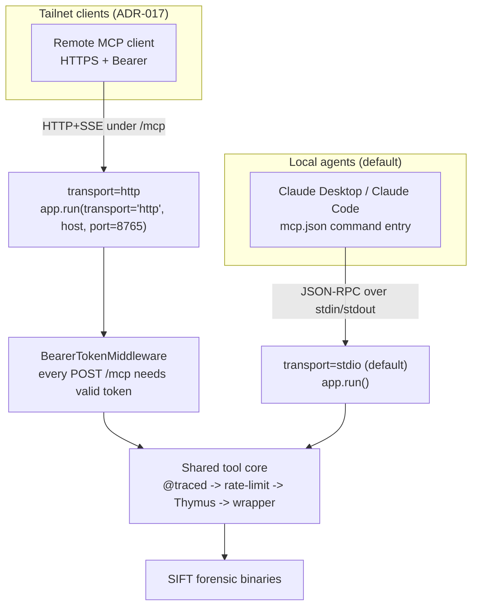
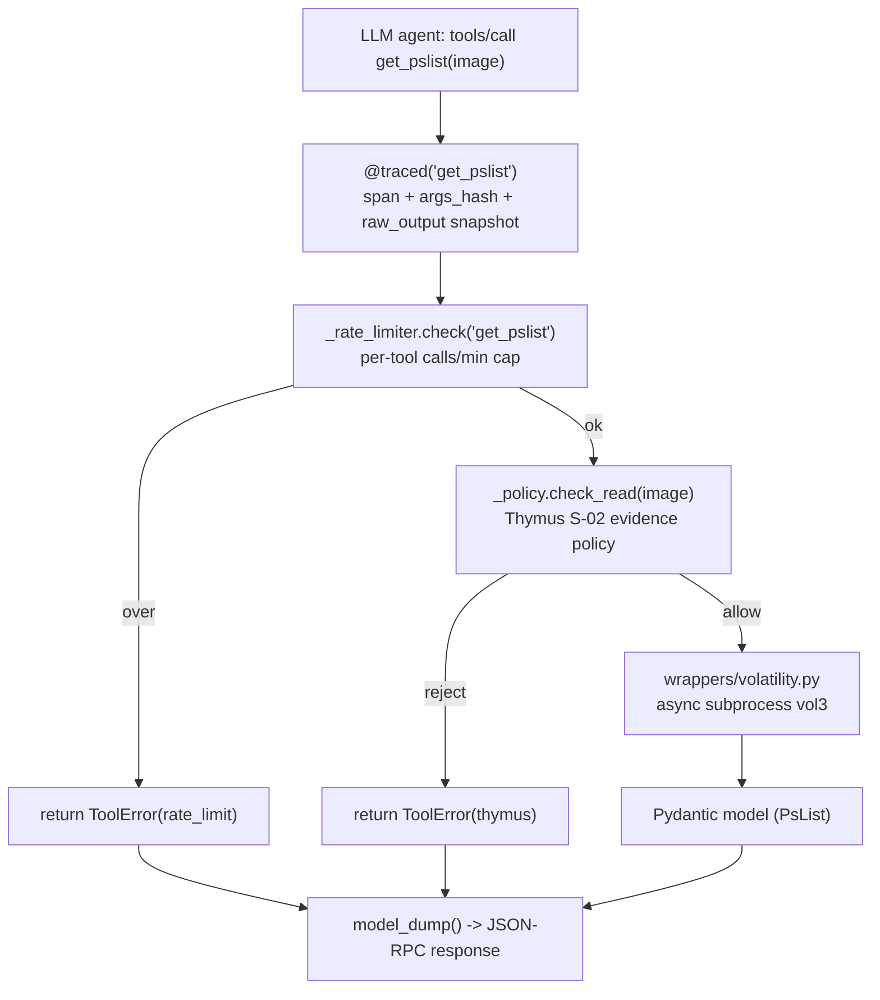

# The FastMCP Server

> **Section 02 · Architecture** — the protocol surface. Agentropix-SIFT exposes **71 MCP
> tools** (`mcp_tool_count = 71`, [facts.md](../../.crew/facts.md)) over a **single
> FastMCP server**. Every tool is a typed wrapper around an external SIFT binary or an
> in-process analysis function, and every tool inherits the same hardening stack: tracing,
> rate-limiting, the [Thymus](#4-thymus--the-read-only-evidence-boundary) read-only boundary,
> and structured errors. **There is no opt-out** (`docs/MCP-REQUEST-FLOW.md`).

The server module is `src/agentropix_sift/mcp_server/fastmcp_app.py` (the protocol surface
and `main()` entry point); the inner `mcp_*` dispatch functions live in
`mcp_server/server.py`. FastMCP is an **optional dependency** imported lazily, so SIFT's
test suite never spins up the protocol (`fastmcp_app.py` docstring). For the full per-tool
catalogue see [04-mcp-tools](../04-mcp-tools/) and
[tool-list.md](../../.crew/tool-list.md).

**Three module roles to keep distinct as you read this page:**

| Module | Role |
|--------|------|
| `mcp_server/fastmcp_app.py` | The **protocol surface** — builds the FastMCP app, registers every `@app.tool()`, parses `--transport`/`--public`, owns `main()`. |
| `mcp_server/server.py` | The **dispatch core** — the inner `mcp_*` functions that run the per-tool hardening stack (tracing → rate-limit → Thymus → wrapper) and return typed results. |
| `mcp_server/wrappers/` | The **wrapper layer** — one `.py` per forensic capability that builds the subprocess command line, runs the SIFT binary, and parses stdout into a Pydantic model (see §3.5). |

---

## 1. The FastMCP app

The app is built by `_build_app()` and named `FastMCP("agentropix-sift")`
(`fastmcp_app.py:348`). Tools are registered with the `@app.tool()` decorator; each tool's
signature mirrors the inner `mcp_*` function so the Pydantic schemas and existing tests
still validate the wire format. The catalogue arithmetic is auditable: **74 `@app.tool()`
decorator occurrences → 71 distinct tool functions** (67 in `fastmcp_app.py` + 5 Wazuh
wrappers, with `wazuh_hunt_ioc` registered in two modules;
[tool-list.md](../../.crew/tool-list.md), [facts.md](../../.crew/facts.md)).

A representative tool is `health()` (`fastmcp_app.py:355`): a lightweight probe that
deliberately does **no** subprocess I/O, **no** Thymus check, and **no** rate-limit, so
orchestrators (Trinity, the Critic, `scripts/probe_mcp.py`) can poll it cheaply. It returns
the server name, version, uptime, and the *live* count of registered tools — the
authoritative source for "how many tools are there right now."

---

## 2. Transports: stdio and HTTP+SSE

The server speaks MCP over one of two transports, chosen by `--transport`
(`fastmcp_app.py:2057-2152`):

**Reading the transports.**

- **stdio (default).** `--transport stdio` runs an MCP server over stdin/stdout, paired with
  a Claude Desktop / Claude Code `mcp.json` `"command"` entry (`fastmcp_app.py:2120-2124`).
  No network, no auth middleware — the security boundary is the local process.
- **HTTP+SSE (`--transport http`, default port 8765).** Binds an HTTP+SSE listener under
  `/mcp` (`fastmcp_app.py:2127-2152`, M8.6 / ADR-017). This path is **tailnet-only and
  Bearer-token-protected**: `_add_auth_middleware()` installs a `BearerTokenMiddleware`
  that rejects every POST to `/mcp` without a valid token, returning 401 and auditing the
  attempt by `sha256[:16]` token-hash (never logging the token itself)
  (`fastmcp_app.py:182-306`). The token comes from `AGENTROPIX_MCP_AUTH_TOKEN`
  ([env-vars.md](../../.crew/env-vars.md) §MCP server auth). `--public` (bind `0.0.0.0`)
  exists but emits a loud warning and is strongly discouraged without Bearer auth
  (`fastmcp_app.py:2098-2104, 2127-2131`).

Both transports funnel into the **same tool core** — that uniformity is the technical-depth
claim. The difference is purely the protocol framing and (for HTTP) the auth gate.

---

## 3. The per-tool hardening stack

Every forensic/analysis tool runs the same ordered pipeline inside its `mcp_*` function
(`mcp_server/server.py`; `docs/MCP-REQUEST-FLOW.md`). Using `mcp_get_pslist` as the
worked example (`server.py:355-370`):

**Reading the stack.** The four guarantees, in order:

| Stage | Guarantee | Source |
|-------|-----------|--------|
| **Tracing** | `@traced` records a per-call span: `tool`, `timestamp`, `duration_ms`, `args_hash` (freezes the LLM's argument choice), `exit_code`, and a bounded `raw_output` snapshot taken *before* any LLM summarisation | `mcp_server/_trace.py` |
| **Rate-limit** | `_RateLimiter.check()` enforces a per-tool sliding-window cap (`AGENTROPIX_RATE_LIMIT`, default 60/min; per-tool override `AGENTROPIX_RATE_LIMIT_<TOOL>`) behind a `threading.Lock` so the cap is deterministic under the HTTP worker pool | `server.py:194-254` |
| **Read policy** | `_policy.check_read(path)` — the Thymus allow-list (see §4). Reject → typed error | `server.py:177`, `thymus_policy.py` |
| **Errors** | Every failure mode returns a structured `ToolError(tool=..., error=..., suggestion=...)` — exceptions never bubble into the JSON-RPC response | `server.py:186-191` |

The rate-limiter and the Thymus policy are **module-level singletons** (`_rate_limiter`,
`_policy`; `server.py:177, 254`). `configure_policy(extra_allowed=...)` rebuilds `_policy`
to add the evidence directory to the allow-list at the start of a run
(`server.py:180-183`; called from `orchestrator.py:110`).

---

## 3.5. The wrapper layer and the two error-envelope contracts

### Wrapper layout

The dispatch core never shells out directly. Each forensic capability is isolated in its own
module under `src/agentropix_sift/mcp_server/wrappers/`, so a fragile binary's quirks
(argument format, stderr noise, timeout behaviour) stay contained in one file. A wrapper
module is the unit that:

1. builds the subprocess command line for one SIFT binary (or EZ-Tool / correlation helper),
2. runs it through the shared subprocess harness (`wrappers/_subprocess.py` — timeout,
   memory-ceiling, retry, stderr capture, tracing), and
3. parses the binary's stdout into a typed **Pydantic model** that becomes the tool's
   structured response.

The directory mixes three kinds of file: **public wrappers** (e.g. `volatility.py`,
`plaso.py`, `tsk.py` — one per capability), **shared helpers** prefixed with `_`
(`_subprocess.py`, `_safe_tool.py`, `_versions.py`, the `_*_dsl.py` query parsers), and the
**Wazuh wrappers** (`wazuh_tools.py`, `wazuh_intel.py`) that register their own
`@app.tool()` callables. The canonical **16 SIFT forensic wrappers**
(`mcp_tool_count`-adjacent count of 16, [facts.md](../../.crew/facts.md);
[tool-list.md](../../.crew/tool-list.md)) are the subset that drive the 16 pre-flighted SIFT
binaries; the rest layer EZ-Tools, correlation, mail, and registry helpers on top.

### Two error-envelope contracts

Errors never reach the JSON-RPC wire as raw exceptions, but **which** envelope catches them
depends on the path a tool takes:

| Path | Envelope | What it does | Source |
|------|----------|--------------|--------|
| **Dispatch core** (the `mcp_*` functions in `server.py`) | `ToolError(tool, error, suggestion)` (a Pydantic model) | Each `mcp_*` function returns this structured value for an expected failure (rate-limit hit, Thymus reject, wrapper error) — exceptions are converted at the dispatch boundary | `server.py:186-191` |
| **Decorated `@app.tool()` callables** (the Wazuh tools) | `safe_tool` → `ToolErrorEnvelope` — a flat `{"error": str, "details": dict}` `dict` subclass | The `@safe_tool(tool_name=…)` decorator wraps the async tool so *any* escaped exception (Pydantic `ValidationError`, an `httpx` 5xx, a `WazuhError`) is caught, logged, and returned as the envelope instead of crashing the agent's iteration | `wrappers/_safe_tool.py`; applied e.g. at `wrappers/wazuh_intel.py:55` |

Both contracts have the same goal — **a single, predictable error shape so the agent
recovery loop never dies on a tool failure** — and they compose: where a Wazuh tool also
uses the WZ-002 retry helper (`_wazuh_retry_policy()`), the retry runs *inside* `safe_tool`,
so the envelope captures only the final outcome after retries are exhausted
(`wrappers/_safe_tool.py` docstring). `safe_tool` deliberately does **not** swallow
programming-control exceptions: `KeyboardInterrupt`, `SystemExit`, and
`asyncio.CancelledError` propagate untouched.

For the canonical end-user view of the success/error response shape, see
[response-envelope.md](../04-mcp-tools/response-envelope.md).

---

## 4. Thymus — the read-only evidence boundary

Thymus (`mcp_server/thymus_policy.py`) is the **architectural evidence-integrity layer
(S-02)**. Its premise is simple and absolute: *the agent physically cannot write to
evidence because no MCP tool exposes a write operation* (`thymus_policy.py` docstring).
Thymus adds defence-in-depth by validating that every read path is inside a permitted zone.

`check_read(path)` runs this screen (`thymus_policy.py:236-360`):

1. **Length bound** — reject paths over `PATH_MAX` (4096 bytes) with a typed
   `REJECT_PATH_TOO_LONG` before any further work (SIFT-W-109).
2. **Forbidden-pattern screen on the raw path** — reject `..`, `~`, `/dev/`, `/proc/`,
   `/sys/` *before* canonicalisation, so an explicit traversal like `/cases/../etc/passwd`
   is rejected with the precise reason (canonicalisation would otherwise collapse the `..`
   and hide the intent).
3. **Canonicalisation** — NUL/control-char rejection, URL-decode (`%20` quirks), collapse
   double slashes, strip trailing slash — so equivalent paths produce identical decisions
   (W-097). It only ever *normalises*, never *adds* permission.
4. **Symlink resolution** — reject broken/circular symlinks; resolve the target and
   re-screen forbidden patterns against the resolved path.
5. **Auto-detect** — for recognised image extensions (`.e01`, `.dd`, `.mem`, …) the parent
   directory is auto-added to the allow-list (capped by `AGENTROPIX_MAX_AUTO_PREFIXES`,
   default 50).
6. **Prefix match** — the resolved path must start with one of the allowed prefixes; a
   bare-directory target matches via the `resolved + "/"` equality check (which stays tight
   so siblings like `/a/Net2/` do not match `/a/Net/`).

The default read-only zones are `/cases/`, `/mnt/`, `/media/`, `/evidence/`,
`/tmp/agentropix-sift-*`, plus the standard SIFT YARA rule directories
(`thymus_policy.py:31-44`); operators extend them via `AGENTROPIX_THYMUS_ALLOWED_PREFIXES`.

**Write is structurally impossible.** `check_write()` exists *only* for defence-in-depth
audit — it always returns a REJECT and no MCP tool ever calls it (`thymus_policy.py:362-369`).

Every decision is logged to a bounded in-memory **audit ring**
(`AGENTROPIX_THYMUS_AUDIT_LOG_RING_SIZE`, default 1000) and, when
`AGENTROPIX_AUDIT_LOG` is set, appended to an on-disk JSONL chain-of-custody trail
(`thymus_policy.py:371-394`). The in-memory ring is what becomes `report.thymus_audit[]`
(`orchestrator.py:307`); the on-disk JSONL is the trail-of-record that the
[Courtroom audit seal](sequence-diagrams.md#3-finding--provenance-classification--courtroom-seal) (ADR-022)
binds into the report seal.

> **Why the check runs twice.** Both the MCP dispatch layer (`server.py`) and the wrappers
> call `check_read` before touching a path. The dispatch check rejects bad paths early; the
> wrapper check is belt-and-suspenders for any internal path the wrapper derives (e.g. an
> extraction destination). The cost is one `startswith` scan — negligible against a
> subprocess launch.

---

## 5. Tool tracing

Tracing is contextvar-based (`mcp_server/_trace.py`). The orchestrator installs a **fresh
per-agent trace buffer** with `trace_scope()` before each agent runs, so the MCP tool calls
that agent makes are captured into that buffer and drained into `report.trace.tool_calls[]`
alongside the `agent.<name>` rollup record (`orchestrator.py:183-211`).

Each `ToolCallRecord` carries (`_trace.py` docstring; `schema-dump.md` §trace):

| Field | Meaning |
|-------|---------|
| `tool` | Tool name (e.g. `get_pslist`) |
| `timestamp`, `duration_ms` | When and how long |
| `args_hash` | Stable SHA-256 short-hash of args+kwargs — freezes the LLM's argument choice (W-027) |
| `exit_code` | `0` ok, `1` ToolError return, `2` raised exception |
| `raw_output` | Bounded snapshot (default 4 KiB, `AGENTROPIX_TRACE_RAW_MAX_BYTES`) taken **before** any LLM-side summarisation (M8.2c) |
| `counters` | W-060 dataflow counts |

The `args_hash` + `raw_output` pair is the **L1↔L3 boundary fingerprint** from the
[determinism map](component-architecture.md#2-the-four-layer-determinism-map): it is what
lets the report seal prove *"the LLM may have phrased the request three ways, but the
arguments and the binary's output are recorded and unmodified."*

---

## 6. What the boundary guarantees, in one table

| Layer | Guarantee | Source |
|-------|-----------|--------|
| Transport | Tailnet-only HTTP + Bearer (or local stdio); fail-closed without a token | `fastmcp_app.py` |
| Telemetry | Per-call span: tool, latency, `args_hash`, `exit_code`, `raw_output` | `@traced` / `_trace.py` |
| Rate-limit | Per-tool calls/minute cap; refuses with `ToolError(rate_limit)` | `server.py::_RateLimiter` |
| Read policy | Thymus allow-list; rejects traversal, symlink escapes, `/dev`/`/proc`/`/sys` | `thymus_policy.py` (S-02) |
| Write policy | **No write tool exists** — integrity is architectural, not advisory | absent by design |
| Errors | Every failure → typed `ToolError`; exceptions never reach the wire | `server.py` |

---

## 7. Where to go next

- The deterministic engine that drives these tools → [trinity-loop.md](trinity-loop.md)
- The agents that call them and the Blackboard → [swarm-agents.md](swarm-agents.md)
- A single tool call traced through Thymus →
  [sequence-diagrams.md](sequence-diagrams.md#2-single-mcp-tool-call-through-thymus)
- The full 71-tool catalogue with argument schemas → [04-mcp-tools](../04-mcp-tools/)
