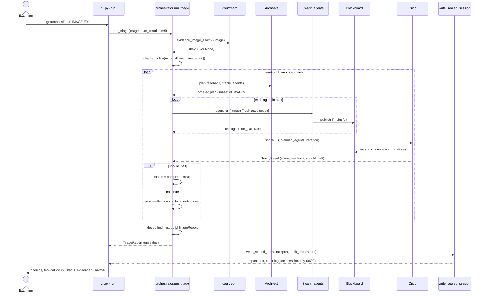
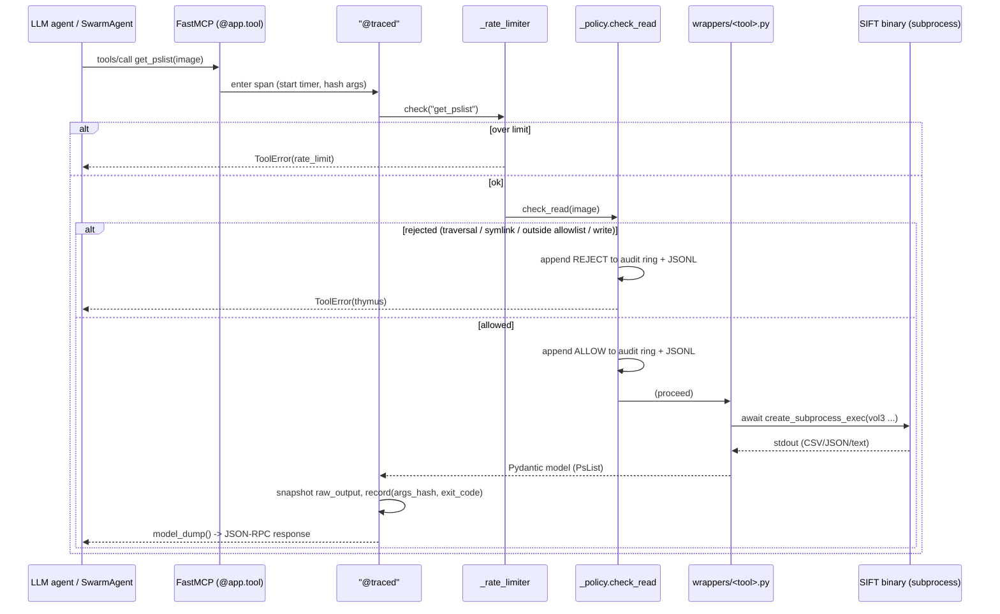
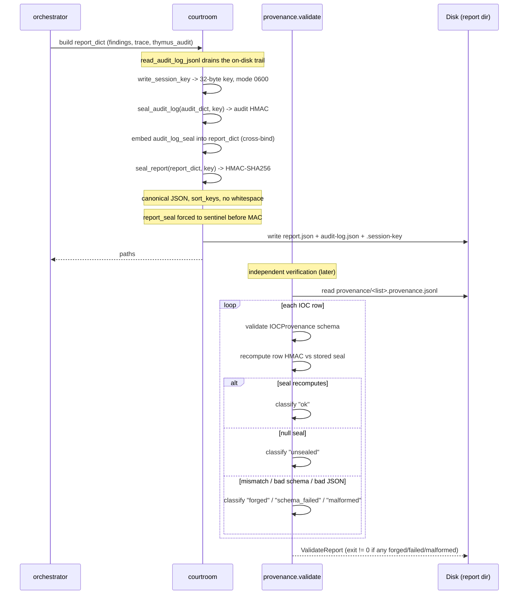
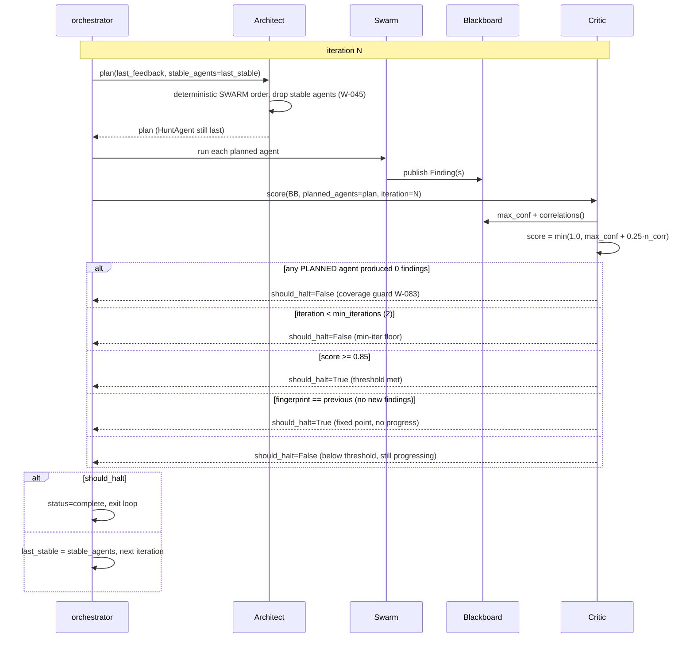
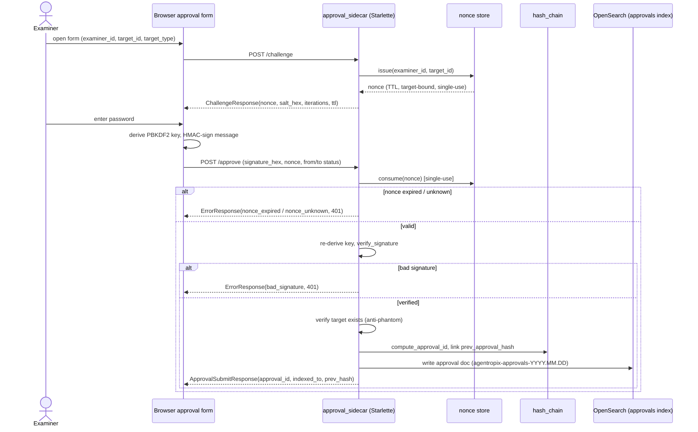
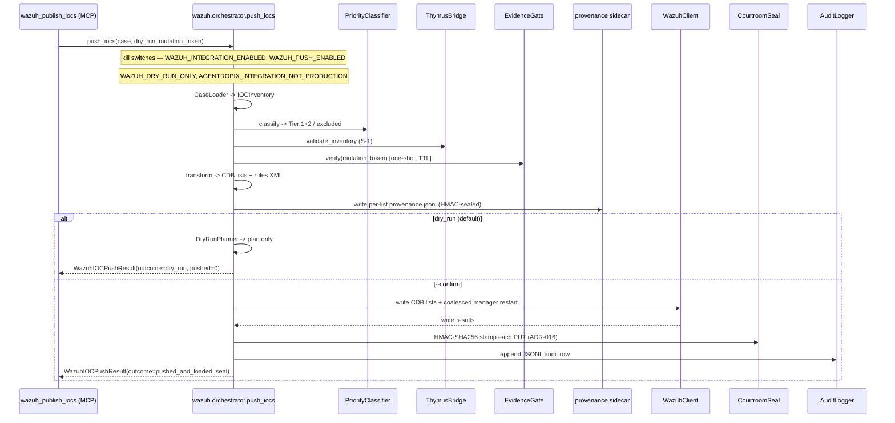

# Sequence Diagrams

> **Section 02 · Architecture** — the dynamic view. The previous chapters describe the
> *structure*; this one shows the *flows*. Each diagram is followed by prose and cites the
> source it was derived from. The six flows: a full triage run, a single MCP tool call
> through Thymus, the finding → provenance → seal pipeline, the Architect↔Swarm↔Critic
> iteration with halt, the approval-sidecar human gate, and the optional Wazuh push.

These tie together the [Trinity Loop](trinity-loop.md), the
[Swarm and Blackboard](swarm-agents.md), the [FastMCP server](mcp-server.md), and the
[safety spine](component-architecture.md#3-the-safety-spine-layered).

---

## 1. Full triage run, end-to-end

**Reading the flow.** The examiner runs the CLI; `run_triage()` hashes the evidence image
(binding the report to the bytes), adds the image directory to the Thymus allow-list, and
enters the [Trinity Loop](trinity-loop.md). Each iteration plans a swarm slice, runs each
agent inside a fresh [trace scope](mcp-server.md#5-tool-tracing) so its MCP calls are
captured, scores the Blackboard, and either halts or carries the Critic's feedback forward.
After the loop, findings are deduplicated and rolled into a `TriageReport`, which the CLI
**seals on write** — three files land on disk: `report.json`, `audit-log.json`, and the
mode-0600 `session-key` (`cli.py:116-152`, `orchestrator.py:82-322`). The inference
constraint is reported as `high` ("LLM is orchestrator; facts from MCP tools").

---

## 2. Single MCP tool call through Thymus

**Reading the flow.** Every forensic tool runs the same ordered pipeline
(`server.py:355-370`, `docs/MCP-REQUEST-FLOW.md`): `@traced` opens a span and hashes the
args; the rate-limiter enforces a per-tool calls/minute cap; **Thymus `check_read` is the
read-only gate** — a rejected path (traversal `..`, broken symlink, outside the allow-list)
returns a typed `ToolError` and logs a REJECT to the
[audit ring + JSONL](mcp-server.md#4-thymus--the-read-only-evidence-boundary). Only on ALLOW
does the wrapper launch the subprocess. The result is typed into a Pydantic model, the
`raw_output` is snapshotted *before* any LLM summarisation, and the
`(args_hash, exit_code, raw_output)` record is pushed to the trace. **No write path exists**
— the worst an agent can do is fail to read.

---

## 3. Finding → provenance classification → Courtroom seal

**Reading the flow.** Sealing happens at write time (`cli.py` → `courtroom.write_sealed_session`).
A single 32-byte per-run session key is minted to a mode-0600 file; the Thymus audit trail
is sealed into `audit-log.json` with its own HMAC, and that audit seal is **cross-bound**
into the report dict *before* the report seal is computed — so tampering with the audit log
breaks both seals (`courtroom.py:230-269`, ADR-022). The report seal is an HMAC-SHA256 over
the canonicalised JSON (`sort_keys=True`, no whitespace, `report_seal` replaced by a fixed
sentinel before MACing, so the verifier is reproducible; `courtroom.py:145-170`).

Separately, IOC **provenance sidecars** (written by the Wazuh push path) are validated
row-by-row by `provenance/validate.py`: each row's `IOCProvenance` schema is checked and its
HMAC seal recomputed. Rows classify as `ok`, `unsealed`, `forged`, `schema_failed`, or
`malformed`; any `forged`/`schema_failed`/`malformed` makes the validator exit non-zero —
this is the tamper-evidence gate (`provenance/validate.py` docstring,
[schema-dump.md](../../.crew/schema-dump.md) §8).

---

## 4. Architect ↔ Swarm ↔ Critic iteration with halt

**Reading the flow.** This is the [deterministic halt logic](trinity-loop.md#4-the-deterministic-halt-logic)
as a sequence. The Architect returns the canonical SWARM order, dropping agents the Critic
flagged *stable* (`architect.py:170-191`). The Critic computes its closed-form score
`min(1.0, max_conf + 0.25·#correlations)` and evaluates a **fixed precedence of guards**
(`critic.py:166-206`): the coverage guard and min-iterations floor *refuse* to halt early
(overriding a saturated score), then `score ≥ 0.85` halts on confidence, and a repeated
Blackboard fingerprint halts on *no progress* (the idempotent fixed point). **No LLM rates
anything** — the same evidence and seed produce the same score, halt, and report
fingerprint. If neither halt fires within `max_iterations`, the run ends
`budget_exhausted`.

---

## 5. Approval-sidecar human gate

**Reading the flow.** The approval sidecar is an **optional, out-of-process** Starlette
service (`approval_sidecar/app.py`) — the human-in-the-loop gate behind the `approve_finding`
/ `retract_approval` MCP tools. It is a two-step HMAC challenge/response: `/challenge`
issues a single-use, target-bound, TTL-bound **nonce**; the examiner's password derives a
PBKDF2 key in the browser (the password never leaves the client) that HMAC-signs the
approval message. `/approve` consumes the nonce, re-derives the key server-side, verifies
the signature, confirms the target actually exists (anti-phantom-approval), then links the
approval into an **append-only hash chain** (`prev_approval_hash`) and writes it to the
daily OpenSearch approvals index (`approval_sidecar/app.py:133-301`,
[schema-dump.md](../../.crew/schema-dump.md) §6). A retraction is a compensating
append-only `approval`-type entry — records are never edited. Bind defaults are loopback
(`AGENTROPIX_APPROVAL_SIDECAR_HOST=127.0.0.1`, port 8800;
[env-vars.md](../../.crew/env-vars.md) §Approval sidecar).

---

## 6. Wazuh push (optional sink)

**Reading the flow.** Wazuh push is **default-off and dry-run by default**, gated by four
kill switches (`WAZUH_INTEGRATION_ENABLED`, `WAZUH_PUSH_ENABLED`, `WAZUH_DRY_RUN_ONLY`,
plus the `AGENTROPIX_INTEGRATION_NOT_PRODUCTION` operator affirmation;
[env-vars.md](../../.crew/env-vars.md) §Wazuh kill switches). The happy path
(`wazuh/orchestrator.py:1-19`, ADR-018/008/016/017) loads the case IOC inventory,
classifies priority tiers, validates through the **Thymus bridge** and the **evidence gate**
(verifying the one-shot, TTL-bound `mutation_token`), transforms to CDB lists + rules XML,
and writes **HMAC-sealed provenance sidecars** (the rows
[§3](#3-finding--provenance-classification--courtroom-seal) later validates). With `dry_run` (the default)
the orchestrator only *plans* and returns `outcome=dry_run`; only `--confirm` actually
writes to the Wazuh manager and restarts it, stamping each PUT with a Courtroom HMAC and
appending a JSONL audit row. The Wazuh stack itself runs on a separate Docker host reachable
only over the tailnet ([system-context-c4.md](system-context-c4.md#3-deployment--exposure-the-tailnet-boundary)).

---

## 7. Where to go next

- The structural counterparts to these flows → [system-context-c4.md](system-context-c4.md),
  [component-architecture.md](component-architecture.md)
- The halt logic in detail → [trinity-loop.md](trinity-loop.md)
- The Thymus boundary and tool stack → [mcp-server.md](mcp-server.md)
- The data contracts each flow moves (`TriageReport`, `Finding`, `IOCProvenance`,
  approval models) → [03-data](../03-data/)
