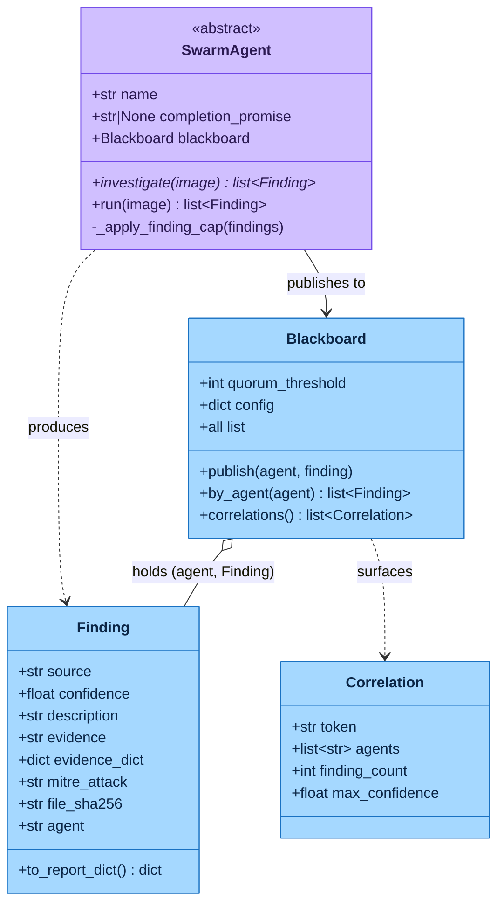
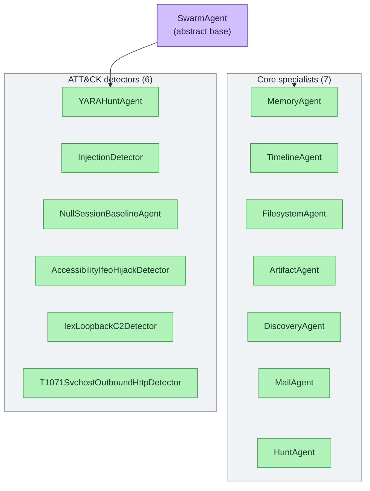
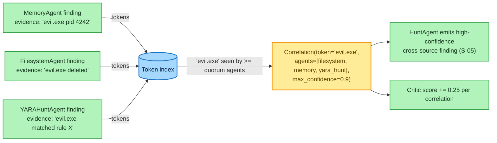

# The Swarm Agents & Blackboard

> **Section 02 · Architecture** — the DFIR specialists. The [Trinity Loop](trinity-loop.md)
> plans and scores, but it is the **Swarm** that does the forensic work: each agent
> investigates one dimension of the evidence and publishes `Finding`s to a shared
> **Blackboard**, where cross-agent agreement becomes correlation. Every agent is a **pure
> async coroutine over the MCP boundary — no LLM coupling** (`agents/_base.py` docstring).

The project prose describes a **7-agent Swarm** — the seven first-class DFIR specialists.
The runnable `SWARM` tuple (`agents/__init__.py`) additionally interleaves **six
deterministic ATT&CK detector agents** (also `SwarmAgent` subclasses), for **13 classes**
total. Both statements are true; when a count is needed, prefer *"7 core specialists +
ATT&CK detectors"* and cite `agents/__init__.py` ([agents-list.md](../../.crew/agents-list.md),
[facts.md](../../.crew/facts.md)).

### The Trinity roles, in one paragraph

The Swarm does not run itself — it is driven by the **Trinity Loop**, three deterministic
(no-LLM) roles defined in full in [trinity-loop.md](trinity-loop.md). You will see them
named throughout this page, so here is the one-line definition of each:

- **Architect** (`trinity/architect.py`) — the **planner**. Each iteration it returns the
  ordered tuple of agent classes to run (the canonical `SWARM` order, optionally pruning
  agents the Critic has marked *stable*). It preserves run order so `HuntAgent` stays last.
- **Swarm** (`SWARM` tuple, `agents/__init__.py`) — the **doers**. The 13 agent classes
  described on this page; each investigates one evidence dimension and publishes `Finding`s
  to the Blackboard.
- **Critic** (`trinity/critic.py`) — the **scorer and halt authority**. It assigns the run
  a deterministic score (max finding confidence + `0.25` per correlation, capped at `1.0`)
  and decides when to stop — when the score crosses the halt threshold (default `0.85`,
  `AGENTROPIX_CRITIC_HALT_THRESHOLD`) or the per-agent fingerprint reaches a fixed point.

The shared **Blackboard** (§5) is the substrate all three operate over: the Swarm writes to
it, the Critic reads it to score, and the Architect reads the Critic's verdict to re-plan.

---

## Contents — what's in this page (and what to expect)

> Jump to any section below. Each row tells you what that part gives you, so you can go straight to your point.

| Section | What you'll get |
|---|---|
| [1. The agent class hierarchy](#1-the-agent-class-hierarchy) | The `SwarmAgent`/`Finding`/`Blackboard`/`Correlation` contracts, the 13-subclass tree, and what the base `run()` does for every agent (cap, stamp, publish). |
| [2. The seven core specialists](#2-the-seven-core-specialists) | A table of the 7 DFIR specialists — each agent's `name`, completion promise, the wrappers/MCP tools it drives, and what it produces. |
| [3. ATT&CK detector agents](#3-attck-detector-agents) | The 6 deterministic ATT&CK detectors — their `name`, ATT&CK technique, source file, and findings, as same-contract `SwarmAgent` subclasses. |
| [4. Run order — why HuntAgent is last](#4-run-order--why-huntagent-is-last) | The fixed `SWARM` order and why it's load-bearing — which agents consume earlier agents' findings, ending with HuntAgent. |
| [5. The Blackboard](#5-the-blackboard) | The only shared mutable state — how `correlations()` surfaces tokens seen by ≥ quorum agents and feeds HuntAgent and the Critic's score. |
| [6. The agent contract, summarised](#6-the-agent-contract-summarised) | The three-point contract every agent honours — extend `SwarmAgent`, stay idempotent, stay a pure MCP-boundary coroutine. |
| [7. Per-agent responsibility map](#7-per-agent-responsibility-map) | The judge's view: exactly which tool call each agent fires and what that surfaces, plus a pointer to the inverse tool→agent map. |
| [8. Cross-run learning & agent self-correction](#8-cross-run-learning--agent-self-correction) | The four mechanics that carry state across runs — Hippocampus traces, Ralph hooks, the persona chromosome, fingerprinting/promises, and a 9-step end-to-end trace. |
| [9. Where to go next](#9-where-to-go-next) | Onward links — the Trinity loop, the MCP tools and inverse map, the data contracts, and a full triage sequence diagram. |

---

## 1. The agent class hierarchy

The four data contracts and how an agent feeds them:



The 13 `SwarmAgent` subclasses — the 7 core specialists and the 6 ATT&CK detectors:



**Reading the hierarchy.** Every agent extends the abstract `SwarmAgent`
(`agents/_base.py:95`). Subclasses set a class-level `name` and an optional
`completion_promise`, and implement `async investigate(image)`. The base `run()` does three
things every subclass inherits for free (`agents/_base.py:130-149`):

1. Applies the **per-agent finding cap** (`AGENTROPIX_AGENT_FINDING_CAP`, default 500,
   floor 10, ceiling 10000) — lowest-confidence findings are dropped first to protect the
   Critic's fingerprint space.
2. Stamps `Finding.agent = self.name` (W-196) so per-agent recall can be measured — the
   `source` field names the *wrapper*, `agent` names the *agent*.
3. Publishes each finding to the Blackboard.

`investigate()` must be **idempotent** — re-invoking on the same image with the same
Blackboard state must produce the same findings (S-08: *same seed → identical trace*,
`agents/_base.py:121-128`). That idempotence is exactly what lets the
[Critic reach a fixed-point halt](trinity-loop.md#4-the-deterministic-halt-logic).

---

## 2. The seven core specialists

Each declares a `completion_promise` token appended to `report.completion_proofs` when it
publishes ≥1 Finding without a tool error
([agents-list.md](../../.crew/agents-list.md) §Core swarm specialists).

| Agent | `name` | Promise | Drives (wrappers / MCP tools) | Produces |
|-------|--------|---------|-------------------------------|----------|
| **MemoryAgent** | `memory` | `MEMORY_TRIAGED` | `get_pslist` (Volatility), `wrappers/volatility.py`, `correlation.build_process_tree`, `credentials` (secretsdump) | Suspicious/orphan processes, injected/RWX regions, credential-dump evidence; sets `evidence_dict` for cross-modal IOC fusion |
| **TimelineAgent** | `timeline` | `TIMELINE_GENERATED` | `get_timeline` (Plaso), `correlation.detect_sweep` | Execution/LOLBin timeline events, EID 4688 process-creation events, lateral-movement sweeps |
| **FilesystemAgent** | `filesystem` | `FILESYSTEM_WALKED` | `fls` (Sleuth Kit), `tsk._read_inode` | Suspicious filenames, deleted-file artifacts, inode-level evidence (with `file_sha256` payload hashes) |
| **ArtifactAgent** | `artifact` | `ARTIFACTS_PARSED` | `extract_files` → `get_registry` / `get_amcache` / `get_shimcache`; `scheduled_tasks` (T1053.005) | Registry/Amcache/Shimcache execution evidence, scheduled-task persistence; per-source cap of 50 |
| **DiscoveryAgent** | `discovery` | `DISCOVERY_ENUMERATED` | **No re-run** — reads TimelineAgent's EID 4688 findings off the Blackboard; `_discovery_detectors` regex | MITRE Discovery T1018, T1069, T1083, T1087, T1135. Disk-only (early-returns on memory images) |
| **MailAgent** | `mail` | `MAIL_TRIAGED` | `list_files`, top-level `email_headers`, `memory_mail_carve`, `_mail_maldoc_chain` (oletools) | T1566 phishing from carved Outlook/PST artefacts, lookalike-domain headers, maldoc-chain attachments |
| **HuntAgent** | `hunt` | `CROSS_AGENT_CORRELATION_DONE` | **No wrappers** — consumes `blackboard.correlations()` | High-confidence cross-source correlation findings (S-05: ≥3-agent agreement). Runs **last** |

Two agents are special by design: **DiscoveryAgent** issues no fresh forensic call — it
mines `EID 4688` events that `TimelineAgent` already published — and **HuntAgent** issues no
forensic call at all, consuming only the Blackboard's correlations. Both depend on other
agents having run first, which is why run order matters (§4).

---

## 3. ATT&CK detector agents

The six detectors (`detectors/`) are also `SwarmAgent` subclasses — deterministic, no LLM —
that emit ATT&CK-tagged findings ([agents-list.md](../../.crew/agents-list.md) §Detectors):

| Detector | `name` | ATT&CK | Source | Produces |
|----------|--------|--------|--------|----------|
| `YARAHuntAgent` | `yara_hunt` | T1055 family | `detectors/yara_hunt.py:148` | YARA rule matches over memory/files (drives `yara`); promise `YARA_HUNT_COMPLETE` |
| `InjectionDetector` | (injection) | T1055 / .001 / .002 | `detectors/injection_detector.py` | Process-injection indicators (code cave, PE injection) |
| `NullSessionBaselineAgent` | `null_session_baseline` | T1087.002 | `detectors/t1087_002_null_session_baseline.py:441` | Null-session account-discovery anomalies vs baseline (z-threshold) |
| `AccessibilityIfeoHijackDetector` | (ifeo) | T1546.008 | `detectors/t1546_008_accessibility_ifeo_hijack.py` | IFEO / accessibility-feature debugger hijack persistence |
| `IexLoopbackC2Detector` | `t1059_001_iex_loopback_c2` | T1059.001 | `detectors/t1059_001_iex_loopback_c2.py:429` | PowerShell IEX loopback C2 (script-block hashing) |
| `T1071SvchostOutboundHttpDetector` | `t1071_001_svchost_outbound_http` | T1071.001 | `detectors/t1071_001_svchost_outbound_http.py:215` | svchost outbound HTTP beaconing |

These are detailed further in [05-safety-forensics](../05-safety-forensics/) and the
detector design notes. From the architecture's perspective the key point is that they are
*"agents"* in exactly the same sense as the specialists — same base class, same Blackboard
contract, same idempotence requirement.

---

## 4. Run order — why HuntAgent is last

The `SWARM` tuple fixes the order (`agents/__init__.py:45-59`), and **order is load-bearing**
because three agents consume what earlier agents published:

```
MemoryAgent -> TimelineAgent -> FilesystemAgent -> ArtifactAgent -> DiscoveryAgent ->
NullSessionBaselineAgent -> MailAgent -> YARAHuntAgent -> InjectionDetector ->
AccessibilityIfeoHijackDetector -> IexLoopbackC2Detector ->
T1071SvchostOutboundHttpDetector -> HuntAgent
```

- **DiscoveryAgent** sits after `TimelineAgent` so the EID 4688 events it mines are already
  on the Blackboard.
- The **detectors** sit between the specialists and `HuntAgent` so their findings are
  present when correlations are computed.
- **HuntAgent runs last** because it consumes everyone else's findings via
  `blackboard.correlations()` (`agents/__init__.py` docstring). The
  [Architect preserves this order](trinity-loop.md#2-the-architect--deterministic-planner)
  when it prunes stable agents, so HuntAgent stays last for free.

---

## 5. The Blackboard

The Blackboard (`agents/_blackboard.py:74`) is the **only mutable state shared between
agents.** It is an asyncio-locked registry of `(agent, Finding)` entries — agents publish
under the lock, so individual agents can be lock-free
(`_blackboard.py:97-103`).

Its key job is **correlation**: surfacing tokens (filenames, PIDs, hashes, IPs) that appear
in the evidence/description strings of findings from **≥ `quorum_threshold` distinct agents**
(default 2, must be ≥2; `_blackboard.py:84-91`, [facts.md](../../.crew/facts.md)):



> 🔍 **[Open as SVG — full size, zoomable](assets/swarm-agents-3.svg)** (renders larger than the page column; the SVG zooms losslessly in a browser tab).

**Reading the Blackboard.** `correlations()` (`_blackboard.py:108-131`) builds a
token → agent → findings index, keeps only tokens seen by ≥ quorum agents, and returns a
`Correlation` per surviving token carrying the agreeing agents, the backing finding count,
and the max confidence. Tokens are extracted by a length-floored regex
(`AGENTROPIX_TOKEN_MIN_LENGTH`, default 3) plus an allowlist of short security-relevant
tokens (`pe`, `ps`, `rc4`, …) that would otherwise fall below the floor
(`_blackboard.py:134-146`, W-018).

Those correlations feed two consumers:

1. **HuntAgent** turns ≥3-agent agreement into high-confidence cross-source findings (S-05).
2. **The Critic** adds `0.25` per correlation to its
   [deterministic score](trinity-loop.md#3-the-critic--deterministic-scorer-and-halt-authority).

The `Correlation` and `Finding` data contracts are fully specified in
[03-data](../03-data/) (`schema-dump.md` §2).

---

## 6. The agent contract, summarised

- All agents extend `SwarmAgent`; implement `async investigate(image)`; the base `run()`
  caps, stamps `agent`, and publishes (`agents/_base.py:95-149`).
- Investigations are **idempotent** — required for the Critic's fixed-point halt.
- Agents are **pure async coroutines over the MCP boundary** — the Trinity roles
  (Architect/Critic) orchestrate; they never author findings
  ([agents-list.md](../../.crew/agents-list.md) §contract notes).

---

## 7. Per-agent responsibility map

The §2/§3 tables list each agent's `name`, promise, and wrappers. This view answers a
different question a SANS judge asks: *what tool call does this agent fire, and what does
that surface?* (cross-checked against each agent's `investigate()`). For the inverse
mapping — *which agent owns each of the 71 MCP tools* — and the full per-tool ownership
table, see [tool-by-agent.md](../04-mcp-tools/tool-by-agent.md).

| Agent | Tool call fired | What it surfaces |
|-------|-----------------|------------------|
| **MemoryAgent** | `get_pslist`, `get_malfind`, `get_netscan`, `windows.info` (`wrappers/volatility.py`) | Process listings, injection candidates (RWX/malfind), network sockets, paused-VM snapshot detection; optional offline NTLM/LSA via `impacket-secretsdump` when `AGENTROPIX_IMPACKET_ENABLED=1` |
| **TimelineAgent** | `get_timeline` (plaso `log2timeline.py` + `psort.py`) | LOLBin execution (PowerShell, cmd, wscript, regsvcs, rundll32, certutil, bitsadmin, schtasks); logon events (T1078); Run-key persistence (T1547.001); MFT/prefetch anomalies |
| **FilesystemAgent** | `fls` (Sleuth Kit) + `tsk._read_inode` | Deleted-entry inodes matching known-bad filename patterns; optional SHA-256 of suspicious inodes (`file_sha256`, W-010) |
| **ArtifactAgent** | `get_image_info`, `extract_files` → RegRipper/Amcache/Shimcache | E01 provenance, registry hive parsing, scheduled-task XML (T1053.005); per-source cap of 50 |
| **DiscoveryAgent** | *no MCP call* — reads Blackboard | MITRE Discovery T1018/T1069/T1083/T1087/T1135 via regex over EID 4688 evidence TimelineAgent already published; disk-only |
| **MailAgent** | `memory_mail_carve`, PST/OST/MSG/EML parsers, `_mail_maldoc_chain` (oletools) | T1566 phishing chain end-to-end: attachment → tempdir spill → maldoc analysis → IOC extraction |
| **HuntAgent** | *no MCP call* — reads `blackboard.correlations()` | Cross-modal correlation: any normalized token in ≥2 agents' findings raises a `Correlation`. Runs **last** |

The detectors (§3) follow the same shape: each fires its scoped tool (`scan_yara` for
`YARAHuntAgent`; memory/registry/network artefacts for the ATT&CK detectors) and emits
ATT&CK-tagged findings to the same Blackboard.

---

## 8. Cross-run learning & agent self-correction

The Swarm is not just a static run order — four oracle-verified mechanics let it *carry
state across iterations and runs* and correct its own course. None of these change the
"7 core specialists + 6 ATT&CK detectors = 13 `SwarmAgent` classes" framing
(`agents/__init__.py`, [facts.md](../../.crew/facts.md)); they layer on top of it.

> **Note on agent count.** The upstream deep-dive prose once called the Swarm "11 agents";
> the runnable `SWARM` tuple is **13 classes** (`agents/__init__.py` — `NullSessionBaselineAgent`
> and `T1071SvchostOutboundHttpDetector` were added after that prose). This page uses the
> canonical 13 throughout, per [facts.md](../../.crew/facts.md).

### 8.1 Hippocampus — Lamarckian inheritance of reasoning traces

When `AGENTROPIX_HIPPOCAMPUS_ENABLED=1` (default **off**, MVP-safe), the orchestrator
records every iteration's reasoning trace through the **HippocampusBridge**
(`memory/hippocampus_bridge.py:90`). Each trace is a `ReasoningTrace` carrying the
`goal`, the `plan` (agent class names), the `result` (finding count), the Critic
`critique`, and a clamped `fitness_score` (`orchestrator.py:255` calls
`hippocampus.remember(...)`):

```python
hippocampus.remember(
    ReasoningTrace(
        iteration=iteration,
        goal=goal,
        plan=[cls.__name__ for cls in plan],
        result={"finding_count": len(blackboard.all)},
        critique=last_feedback or "",
        fitness_score=max(0.0, min(1.0, last_result.score)),
    )
)
```

On the next iteration the Architect calls `hippocampus.recall(goal)`
(`orchestrator.py:151`, W-017), which returns up to **K** prior traces — default **3**,
tunable via `AGENTROPIX_HIPPOCAMPUS_TOP_K` (floor 1, ceiling 50;
`hippocampus_bridge.py:156`) — ranked by word-overlap similarity. The traces are passed
to `architect.plan(..., prior_traces=...)`. This is the *Lamarckian inheritance* seam:
iteration N's score↔plan correlation is preserved for iteration N+1 (and, when persisted,
future runs) to consult, with **no model fine-tuning**. The deterministic planner stores
them on `self.last_prior_traces` for introspection but does not yet alter its output from
traces — the documented seam for future LLM-backed reordering.

### 8.2 The three Ralph hooks — the LLM ↔ tools boundary

The Claude Code hook system (internally **Ralph**, `.claude/hooks/ralph_*.py`) enforces
three boundaries at the LLM-tools seam. They are *separate from* the in-process Trinity
loop — they fire at Claude Code's pre/post/stop points, observability + retry-cap only,
never a write-blocker:

- **PreToolUse** (`ralph_pre_tool_use.py`) — logs each Bash call to `.claude/ralph.jsonl`,
  injects a "this command failed before" hint, and enforces a per-fingerprint retry cap
  (`AGENTROPIX_RALPH_MAX_RETRIES`, default 3; `ralph_pre_tool_use.py:51`). On cap it emits
  `{"continue": false, "stopReason": "Ralph-loop cap reached…"}` — but **always approves
  the call** (the cap rides the stop response, not approval refusal). It is the
  courtroom-grade *visible* cap; the Trinity `max_iterations` cap is the primary one.
- **PostToolUse** (`ralph_post_tool_use.py`) — captures the stderr fragment into
  `.claude/ralph_state.json` and pattern-matches it against a DFIR rulebook
  (`HYPOTHESIS_RULES`, `ralph_post_tool_use.py:53`) to propose an *advisory* fix for the
  next attempt:
  - `"unable to validate the plugin requirements"` → *vol3 plugin failed; likely a disk
    image masquerading as memory — check the archive picker.*
  - `"unable to locate symbols"` → *use `windows.netscan` instead of `windows.netstat`
    (W-075 default).*
  - `"PSORT_TIMEOUT_SECONDS exceeded"` → *raise `AGENTROPIX_PLASO_TIMEOUT` or pass
    `--workers=1` (W-077 plaso non-determinism).*
- **Stop** (`ralph_stop.py`) — an **active-triage guard**: if `.claude/active-triage.json`
  exists and is < 24 h old (`SENTINEL_MAX_AGE_HOURS=24`), a run is in progress, so the
  hook prints `"CONTINUE: triage still running for <image>"` and exits 2 to keep the
  session alive. The sentinel is written by `cli.py` before `run_triage()` and deleted
  after `write_sealed_report()`. If any fingerprint exceeded the retry cap it also writes
  `BUDGET_EXHAUSTED.md` (diagnostic, non-blocking).

### 8.3 The chromosome — a persona profile, not a genetic search

`chromosomes/` holds a single file, `senior-analyst.yaml`. Despite the biological
metaphor, the **runnable** specialist agents (MemoryAgent, TimelineAgent, …) are
pure-Python detectors with no LLM coupling — they are **not** parameterised by a
chromosome and there is no genetic search across multiple profiles. The chromosome is a
**static persona profile** for an *external* Claude session that wants to consume SIFT's
MCP output as a "senior analyst": it declares `persona`, a `system_prompt`, named
`instincts` (`memory_first`, `cite_or_refuse`, `hypothesis_driven`, …), a
`triage_sequence`, and an `output_format` (`chromosomes/senior-analyst.yaml`). The Lamarckian-evolution
framing in `docs/architecture/chromosomes.md` (instinct injection from `ReasoningTrace`)
is the *design intent*; today the scope is one reference persona.

### 8.4 Per-agent fingerprinting (W-045) + completion-promise tokens

Two complementary self-correction signals close the loop:

- **Per-agent fingerprints (W-045).** The Critic hashes each agent's contribution as the
  tuple `(agent, source, description, evidence)` and exposes a `stable_agents` set on every
  `TrinityResult` — agents whose fingerprint is non-empty **and** unchanged from the prior
  pass (`critic.py:128-133`). Because `investigate()` is idempotent, a plateaued agent is
  detectable and the Architect prunes it from the next plan — the visible self-correction:
  *"memory and timeline plateaued; drop them; let the rest surface new material."*
- **Completion-promise tokens.** Each `SwarmAgent` declares a `completion_promise` string;
  when it publishes ≥1 Finding without a tool error, the orchestrator adds the token to
  `report.completion_proofs` (`orchestrator.py:194-195`), emitted in sorted/canonical order
  (`orchestrator.py:319`) so the report is diff-stable. A downstream verifier can fail any
  run that delivered findings but is missing a required promise — *"the agent silently
  failed but no error was logged."* Unlike the upstream deep-dive's stale claim that most
  agents emit no token, **all 13 agents now declare one** in code (e.g. `MEMORY_TRIAGED`,
  `TIMELINE_GENERATED`, `ARTIFACTS_PARSED`, `CROSS_AGENT_CORRELATION_DONE`); see §2/§3.

### 8.5 One end-to-end trace — TimelineAgent, 9 steps

How a single agent invocation threads the whole machine (`orchestrator.py`,
`agents/timeline.py`, `mcp_server/server.py`):

1. **Input** — `image = Path("/evidence/base-dc-cdrive.E01")`, `iteration = 1`, a fresh
   `Blackboard(config={…})`.
2. **Architect picks TimelineAgent** — the plan tuple includes it; `agent = agent_cls(blackboard)`
   stores the Blackboard ref.
3. **Invoke** — `findings = await agent.run(image)` → `SwarmAgent.run` → `TimelineAgent.investigate`.
4. **Inside `investigate()`** — preflight `looks_like_memory(image)?` (return `[]` if memory),
   then `events = await mcp_get_timeline(str(image), parsers=…, timeout_seconds=…)`.
5. **Across the MCP boundary** — `mcp_get_timeline` (`@traced`) records `args_hash` + start
   time, passes the rate limiter (60/min) and the Thymus read-policy gate (ALLOW for the
   evidence path), spawns `log2timeline.py` then `psort.py -o json_line`, Pydantic-parses
   `TimelineEvents`, records `exit_code=0` + `duration_ms` + a ≤4 KiB raw-output snapshot,
   returns the typed object.
6. **Process events → Findings** — for each LOLBin-keyword match, build a `Finding(source="timeline.plaso", confidence=0.85, mitre_attack="T1059.003", …)`, dedupe, return `findings[:cap]`.
7. **Back in `run()`** — stamp `finding.agent = "timeline"` (W-196) and
   `await blackboard.publish("timeline", finding)` for each.
8. **Orchestrator appends the promise** — `if findings and agent.completion_promise:`
   adds `TIMELINE_GENERATED` to `completion_proofs`; moves to FilesystemAgent.
9. **After the plan runs, Critic scores** — `critic.score(blackboard, planned_agents=[…], iteration=1)`
   returns a `TrinityResult` (score, feedback, `should_halt`, `stable_agents`, `gaps`); the
   loop halts or re-plans with `prior_traces` from §8.1.

The trace ledger now holds one replayable entry for `mcp_get_timeline` (`args_hash`,
`exit_code`, `duration_ms`, raw-output snapshot) — so *"prove the LOLBin finding"* is
answered by replaying the wrapper with the same arguments (modulo the documented W-077
plaso multi-worker race, mitigated with `--workers=1`).

---

## 9. Where to go next

- How the Architect plans these agents and the Critic scores their output →
  [trinity-loop.md](trinity-loop.md)
- The MCP tools each agent drives → [mcp-server.md](mcp-server.md) and [04-mcp-tools](../04-mcp-tools/)
- The inverse map — which agent owns each MCP tool → [tool-by-agent.md](../04-mcp-tools/tool-by-agent.md)
- The `Finding` / `Correlation` / `Blackboard` data contracts → [03-data](../03-data/)
- A full triage run showing agents filling the Blackboard →
  [sequence-diagrams.md](sequence-diagrams.md#1-full-triage-run-end-to-end)
