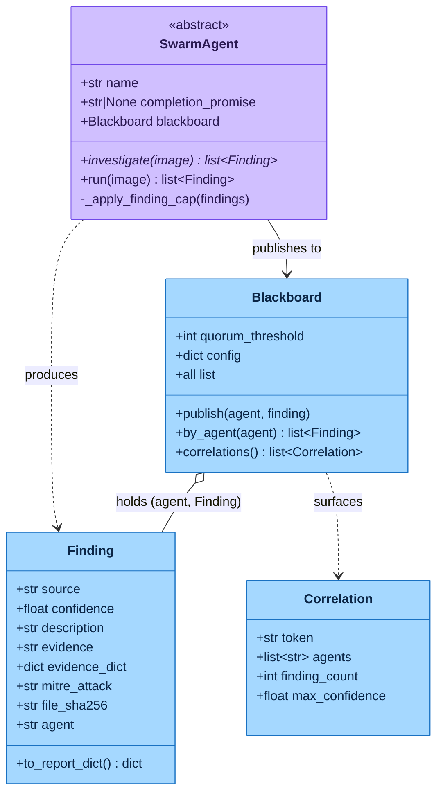
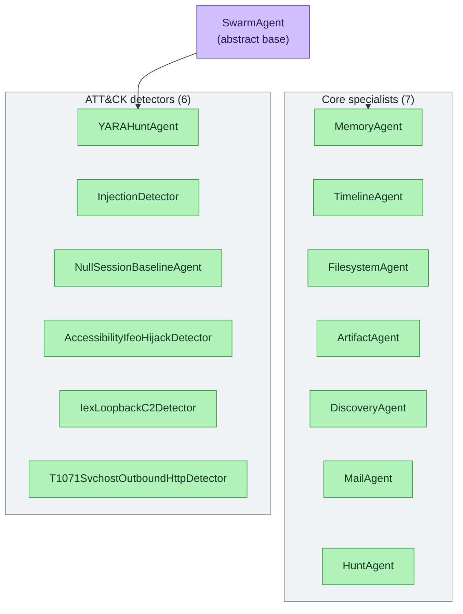
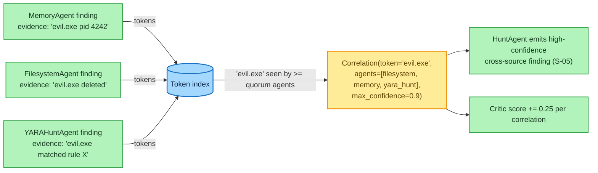

# The Swarm Agents & Blackboard

> **Section 02 · Architecture** — the DFIR specialists. The [Trinity Loop](trinity-loop.md)
> plans and scores, but it is the **Swarm** that does the forensic work: each agent
> investigates one dimension of the evidence and publishes `Finding`s to a shared
> **Blackboard**, where cross-agent agreement becomes correlation. Every agent is a **pure
> async coroutine over the MCP boundary — no LLM coupling** (`agents/_base.py` docstring).

The project prose describes a **7-agent Swarm** — the seven first-class DFIR specialists.
The runnable `SWARM` tuple (`agents/__init__.py`) additionally interleaves **six
deterministic ATT&CK detector agents** (also `SwarmAgent` subclasses), for **13 classes**
total. Both statements are true; when a count is needed, prefer *"7 core specialists +
ATT&CK detectors"* and cite `agents/__init__.py` ([agents-list.md](../../.crew/agents-list.md),
[facts.md](../../.crew/facts.md)).

---

## 1. The agent class hierarchy

The four data contracts and how an agent feeds them:



The 13 `SwarmAgent` subclasses — the 7 core specialists and the 6 ATT&CK detectors:



**Reading the hierarchy.** Every agent extends the abstract `SwarmAgent`
(`agents/_base.py:95`). Subclasses set a class-level `name` and an optional
`completion_promise`, and implement `async investigate(image)`. The base `run()` does three
things every subclass inherits for free (`agents/_base.py:130-149`):

1. Applies the **per-agent finding cap** (`AGENTROPIX_AGENT_FINDING_CAP`, default 500,
   floor 10, ceiling 10000) — lowest-confidence findings are dropped first to protect the
   Critic's fingerprint space.
2. Stamps `Finding.agent = self.name` (W-196) so per-agent recall can be measured — the
   `source` field names the *wrapper*, `agent` names the *agent*.
3. Publishes each finding to the Blackboard.

`investigate()` must be **idempotent** — re-invoking on the same image with the same
Blackboard state must produce the same findings (S-08: *same seed → identical trace*,
`agents/_base.py:121-128`). That idempotence is exactly what lets the
[Critic reach a fixed-point halt](trinity-loop.md#4-the-deterministic-halt-logic).

---

## 2. The seven core specialists

Each declares a `completion_promise` token appended to `report.completion_proofs` when it
publishes ≥1 Finding without a tool error
([agents-list.md](../../.crew/agents-list.md) §Core swarm specialists).

| Agent | `name` | Promise | Drives (wrappers / MCP tools) | Produces |
|-------|--------|---------|-------------------------------|----------|
| **MemoryAgent** | `memory` | `MEMORY_TRIAGED` | `get_pslist` (Volatility), `wrappers/volatility.py`, `correlation.build_process_tree`, `credentials` (secretsdump) | Suspicious/orphan processes, injected/RWX regions, credential-dump evidence; sets `evidence_dict` for cross-modal IOC fusion |
| **TimelineAgent** | `timeline` | `TIMELINE_GENERATED` | `get_timeline` (Plaso), `correlation.detect_sweep` | Execution/LOLBin timeline events, EID 4688 process-creation events, lateral-movement sweeps |
| **FilesystemAgent** | `filesystem` | `FILESYSTEM_WALKED` | `fls` (Sleuth Kit), `tsk._read_inode` | Suspicious filenames, deleted-file artifacts, inode-level evidence (with `file_sha256` payload hashes) |
| **ArtifactAgent** | `artifact` | `ARTIFACTS_PARSED` | `extract_files` → `get_registry` / `get_amcache` / `get_shimcache`; `scheduled_tasks` (T1053.005) | Registry/Amcache/Shimcache execution evidence, scheduled-task persistence; per-source cap of 50 |
| **DiscoveryAgent** | `discovery` | `DISCOVERY_ENUMERATED` | **No re-run** — reads TimelineAgent's EID 4688 findings off the Blackboard; `_discovery_detectors` regex | MITRE Discovery T1018, T1069, T1083, T1087, T1135. Disk-only (early-returns on memory images) |
| **MailAgent** | `mail` | `MAIL_TRIAGED` | `list_files`, top-level `email_headers`, `memory_mail_carve`, `_mail_maldoc_chain` (oletools) | T1566 phishing from carved Outlook/PST artefacts, lookalike-domain headers, maldoc-chain attachments |
| **HuntAgent** | `hunt` | `CROSS_AGENT_CORRELATION_DONE` | **No wrappers** — consumes `blackboard.correlations()` | High-confidence cross-source correlation findings (S-05: ≥3-agent agreement). Runs **last** |

Two agents are special by design: **DiscoveryAgent** issues no fresh forensic call — it
mines `EID 4688` events that `TimelineAgent` already published — and **HuntAgent** issues no
forensic call at all, consuming only the Blackboard's correlations. Both depend on other
agents having run first, which is why run order matters (§4).

---

## 3. ATT&CK detector agents

The six detectors (`detectors/`) are also `SwarmAgent` subclasses — deterministic, no LLM —
that emit ATT&CK-tagged findings ([agents-list.md](../../.crew/agents-list.md) §Detectors):

| Detector | `name` | ATT&CK | Source | Produces |
|----------|--------|--------|--------|----------|
| `YARAHuntAgent` | `yara_hunt` | T1055 family | `detectors/yara_hunt.py:148` | YARA rule matches over memory/files (drives `yara`); promise `YARA_HUNT_COMPLETE` |
| `InjectionDetector` | (injection) | T1055 / .001 / .002 | `detectors/injection_detector.py` | Process-injection indicators (code cave, PE injection) |
| `NullSessionBaselineAgent` | `null_session_baseline` | T1087.002 | `detectors/t1087_002_null_session_baseline.py:441` | Null-session account-discovery anomalies vs baseline (z-threshold) |
| `AccessibilityIfeoHijackDetector` | (ifeo) | T1546.008 | `detectors/t1546_008_accessibility_ifeo_hijack.py` | IFEO / accessibility-feature debugger hijack persistence |
| `IexLoopbackC2Detector` | `t1059_001_iex_loopback_c2` | T1059.001 | `detectors/t1059_001_iex_loopback_c2.py:429` | PowerShell IEX loopback C2 (script-block hashing) |
| `T1071SvchostOutboundHttpDetector` | `t1071_001_svchost_outbound_http` | T1071.001 | `detectors/t1071_001_svchost_outbound_http.py:215` | svchost outbound HTTP beaconing |

These are detailed further in [05-safety-forensics](../05-safety-forensics/) and the
detector design notes. From the architecture's perspective the key point is that they are
*"agents"* in exactly the same sense as the specialists — same base class, same Blackboard
contract, same idempotence requirement.

---

## 4. Run order — why HuntAgent is last

The `SWARM` tuple fixes the order (`agents/__init__.py:45-59`), and **order is load-bearing**
because three agents consume what earlier agents published:

```
MemoryAgent -> TimelineAgent -> FilesystemAgent -> ArtifactAgent -> DiscoveryAgent ->
NullSessionBaselineAgent -> MailAgent -> YARAHuntAgent -> InjectionDetector ->
AccessibilityIfeoHijackDetector -> IexLoopbackC2Detector ->
T1071SvchostOutboundHttpDetector -> HuntAgent
```

- **DiscoveryAgent** sits after `TimelineAgent` so the EID 4688 events it mines are already
  on the Blackboard.
- The **detectors** sit between the specialists and `HuntAgent` so their findings are
  present when correlations are computed.
- **HuntAgent runs last** because it consumes everyone else's findings via
  `blackboard.correlations()` (`agents/__init__.py` docstring). The
  [Architect preserves this order](trinity-loop.md#2-the-architect--deterministic-planner)
  when it prunes stable agents, so HuntAgent stays last for free.

---

## 5. The Blackboard

The Blackboard (`agents/_blackboard.py:74`) is the **only mutable state shared between
agents.** It is an asyncio-locked registry of `(agent, Finding)` entries — agents publish
under the lock, so individual agents can be lock-free
(`_blackboard.py:97-103`).

Its key job is **correlation**: surfacing tokens (filenames, PIDs, hashes, IPs) that appear
in the evidence/description strings of findings from **≥ `quorum_threshold` distinct agents**
(default 2, must be ≥2; `_blackboard.py:84-91`, [facts.md](../../.crew/facts.md)):



> 🔍 **[Open as SVG — full size, zoomable](assets/swarm-agents-3.svg)** (renders larger than the page column; the SVG zooms losslessly in a browser tab).

**Reading the Blackboard.** `correlations()` (`_blackboard.py:108-131`) builds a
token → agent → findings index, keeps only tokens seen by ≥ quorum agents, and returns a
`Correlation` per surviving token carrying the agreeing agents, the backing finding count,
and the max confidence. Tokens are extracted by a length-floored regex
(`AGENTROPIX_TOKEN_MIN_LENGTH`, default 3) plus an allowlist of short security-relevant
tokens (`pe`, `ps`, `rc4`, …) that would otherwise fall below the floor
(`_blackboard.py:134-146`, W-018).

Those correlations feed two consumers:

1. **HuntAgent** turns ≥3-agent agreement into high-confidence cross-source findings (S-05).
2. **The Critic** adds `0.25` per correlation to its
   [deterministic score](trinity-loop.md#3-the-critic--deterministic-scorer-and-halt-authority).

The `Correlation` and `Finding` data contracts are fully specified in
[03-data](../03-data/) (`schema-dump.md` §2).

---

## 6. The agent contract, summarised

- All agents extend `SwarmAgent`; implement `async investigate(image)`; the base `run()`
  caps, stamps `agent`, and publishes (`agents/_base.py:95-149`).
- Investigations are **idempotent** — required for the Critic's fixed-point halt.
- Agents are **pure async coroutines over the MCP boundary** — the Trinity roles
  (Architect/Critic) orchestrate; they never author findings
  ([agents-list.md](../../.crew/agents-list.md) §contract notes).

---

## 7. Where to go next

- How the Architect plans these agents and the Critic scores their output →
  [trinity-loop.md](trinity-loop.md)
- The MCP tools each agent drives → [mcp-server.md](mcp-server.md) and [04-mcp-tools](../04-mcp-tools/)
- The `Finding` / `Correlation` / `Blackboard` data contracts → [03-data](../03-data/)
- A full triage run showing agents filling the Blackboard →
  [sequence-diagrams.md](sequence-diagrams.md#1-full-triage-run-end-to-end)
