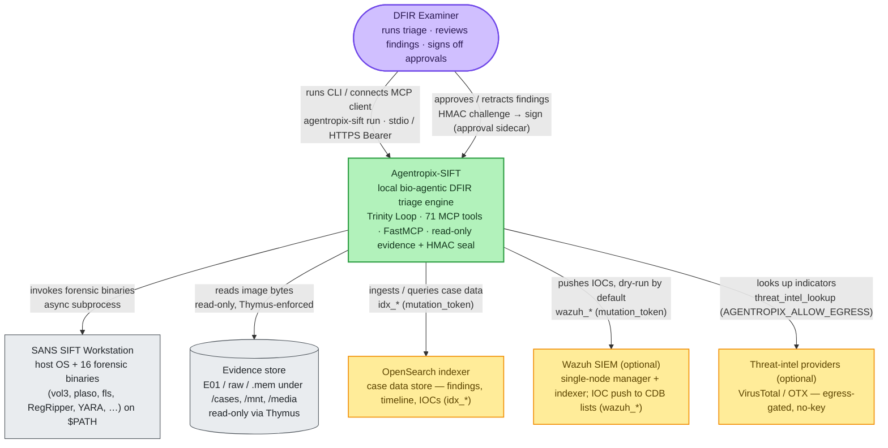
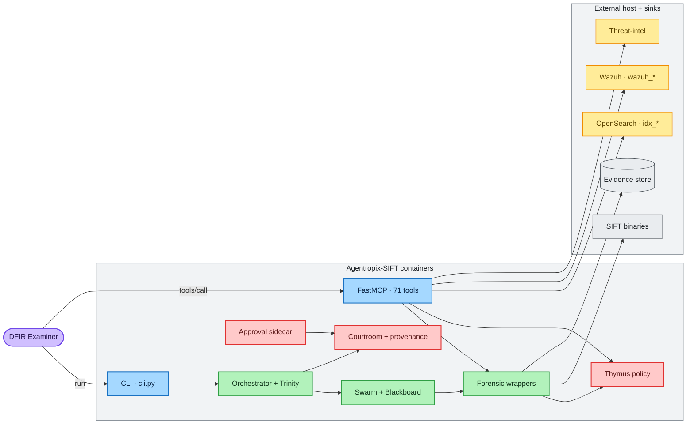
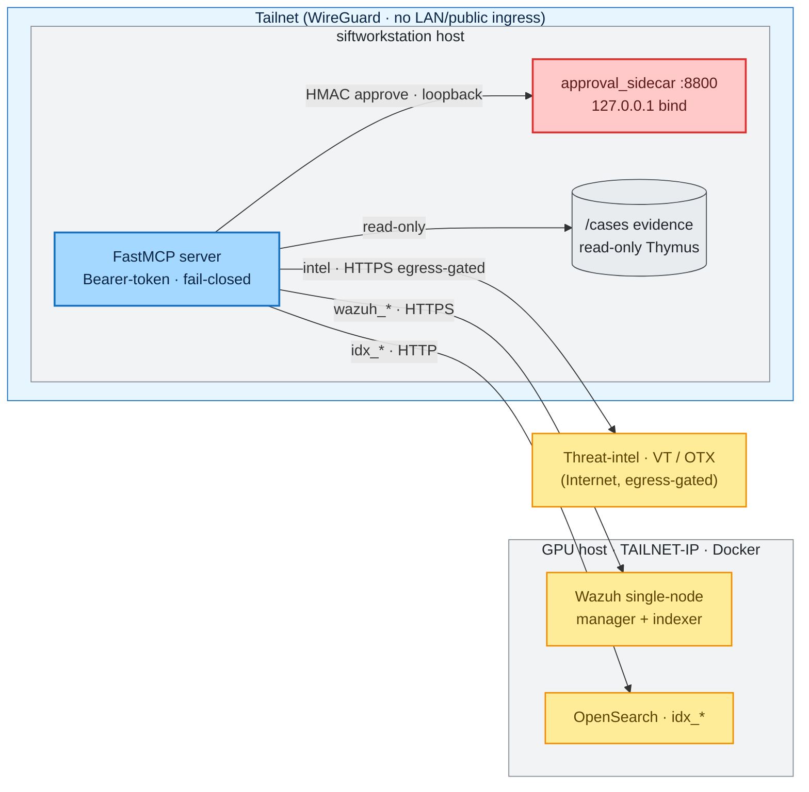

# System Context & Containers

> **Section 02 · Architecture** — the bird's-eye view. Where Agentropix-SIFT sits
> relative to the examiner, the SANS SIFT Workstation it runs on, and the external
> sinks (OpenSearch, Wazuh, threat-intel). Lower-level internals are in
> [component-architecture.md](component-architecture.md); the request-level flows are in
> [sequence-diagrams.md](sequence-diagrams.md).

Agentropix-SIFT is a **local, CLI-driven bio-agentic DFIR triage engine** that runs
*on* the SANS SIFT Workstation. It never re-implements a forensic parser — it drives the
16 classical SIFT forensic binaries (Volatility3, Plaso, Sleuth Kit, RegRipper, YARA, …)
through one [FastMCP](mcp-server.md) server that exposes **71 MCP tools** (`mcp_tool_count = 71`,
[`canonical-facts.md`](../08-reference/canonical-facts.md)). A deterministic [Trinity Loop](trinity-loop.md)
(Architect → Swarm → Critic) drives those tools; the
[Thymus read-only policy](mcp-server.md#4-thymus--the-read-only-evidence-boundary) and the
[Courtroom HMAC-SHA256 seal](sequence-diagrams.md#3-finding--provenance-classification--courtroom-seal)
make every run court-defensible.

> **How to read this page.** It is laid out in the **C4 model** — a simple convention for
> describing software at increasing zoom. **Level 1 (System Context, §1)** shows
> Agentropix-SIFT as one box and who/what it talks to. **Level 2 (Containers, §2)** opens
> that box into its major runnable parts. **§3 (Deployment)** then maps those parts onto the
> real hosts and the tailnet boundary. Because GitLab cannot render native C4 diagrams, the
> diagrams below are plain Mermaid `flowchart`s coloured to the same intent — *they convey C4
> levels without C4 syntax*. A **container** here means a separately-runnable process or unit
> (CLI, server, sidecar), not a Docker container specifically; a **sink** is an external
> system Agentropix-SIFT writes to or queries.

---

## Contents — what's in this page (and what to expect)

> Jump to any section below. Each row tells you what that part gives you, so you can go straight to your point.

| Section | What you'll get |
|---|---|
| [1. System Context (C4 — Level 1)](#1-system-context-c4--level-1) | The Level-1 zoom: Agentropix-SIFT as one box, the DFIR examiner, and the host/evidence/sink systems it uses — plus why no LLM ever authors a finding. |
| [2. Container View (C4 — Level 2)](#2-container-view-c4--level-2) | The box opened up: two entry points (CLI, FastMCP) feeding one shared wrapper + Thymus + Courtroom engine, with a tech/responsibility/source table per container. |
| [3. Deployment & exposure (the tailnet boundary)](#3-deployment--exposure-the-tailnet-boundary) | How the parts map onto real hosts, and the three exposure facts: tailnet-only Bearer-token surface, read-only evidence, and default-off optional sinks. |
| [4. Where to go next](#4-where-to-go-next) | Pointers to the deeper architecture pages — components, Trinity Loop, swarm agents, MCP server, and sequence diagrams. |

---

## 1. System Context (C4 — Level 1)

> 🔍 **[Open as SVG — full size, zoomable](assets/system-context-c4-1.svg)** (renders larger than the page column; the SVG zooms losslessly in a browser tab).

**Reading the context.** The only human in the loop is the **DFIR examiner**, who either
runs the `agentropix-sift` CLI (`src/agentropix_sift/cli.py`) or connects a Model Context
Protocol client (Claude Desktop / Claude Code) to the FastMCP server. Everything to the
right is a system Agentropix-SIFT *uses* but does not own:

- **SANS SIFT Workstation** — the host. Agentropix-SIFT's value-add is "the layer between
  the agent and the binary" (`docs/MCP-REQUEST-FLOW.md`): typed I/O, evidence-policy
  enforcement, defensive subprocess handling, rate-limiting, telemetry. It *never*
  re-implements a parser.
- **Evidence store** — the immutable disk/memory images. Read access is mediated by the
  [Thymus policy](mcp-server.md#4-thymus--the-read-only-evidence-boundary)
  (`src/agentropix_sift/mcp_server/thymus_policy.py`); **there is no write tool**, so
  evidence integrity is architectural rather than advisory.
- **OpenSearch indexer** — the case data store behind the `idx_*` tools.
- **Wazuh SIEM (optional)** and **threat-intel providers (optional)** — both are
  default-off, gated sinks (see §3).

Every fact in a report originates from a named deterministic MCP tool
(`inference_constraint = "high"`, ADR-016; `orchestrator.py:69`). No LLM ever rates or
authors a finding — the court-defensibility argument is *"trust the trace ledger and the
report seal, because the LLM never touched them"* (`docs/ARCHITECTURE-LAYERS.md` §TL;DR).

---

## 2. Container View (C4 — Level 2)

> 🔍 **[Open as SVG — full size, zoomable](assets/system-context-c4-2.svg)** (renders larger than the page column; the SVG zooms losslessly in a browser tab).

**Reading the containers.** There are two entry points and one shared engine:

| Container | Tech | Responsibility | Source |
|-----------|------|----------------|--------|
| **CLI** | Typer | `run` (triage an image), `doctor` (pre-flight the 16 SIFT binaries). Seals the report on write. | `src/agentropix_sift/cli.py` |
| **FastMCP server** | FastMCP | The single MCP protocol surface — 71 tools over **stdio** (local agents) or **HTTP+SSE** (tailnet, Bearer-token). | `mcp_server/fastmcp_app.py` |
| **Orchestrator + Trinity** | asyncio | Drives the [Trinity Loop](trinity-loop.md) over one image; rolls findings + trace into a `TriageReport`. | `orchestrator.py`, `trinity/` |
| **Swarm + Blackboard** | asyncio | The [DFIR agents](swarm-agents.md) and the cross-agent correlation Blackboard. | `agents/`, `detectors/` |
| **Forensic wrappers** | Python | Thin protocol-drivers around the 16 SIFT binaries + EZ-Tools; each ships timeout / memory-ceiling / retry / stderr-capture / tracing. | `mcp_server/wrappers/` |
| **Thymus policy** | Python | Read-only path allow-list + audit ring enforced at the MCP boundary (S-02). | `mcp_server/thymus_policy.py` |
| **Courtroom + provenance** | Python | `evidence_image_sha256`, HMAC-SHA256 report/audit seal, provenance-chain validation. | `courtroom.py`, `provenance/` |
| **Approval sidecar (optional)** | Starlette | Out-of-process HMAC challenge/approve human gate; default-off. | `approval_sidecar/` |

Both the CLI and the MCP server funnel through the **same** wrapper + Thymus + Courtroom
stack — that uniformity *is* the technical-depth claim (`docs/MCP-REQUEST-FLOW.md`,
"every tool flows through the same hardening stack"). The CLI is the deterministic,
LLM-free path; the MCP server is the LLM-driven path. Neither can mutate evidence.

---

## 3. Deployment & exposure (the tailnet boundary)

In its production topology the runtime is containerised (ADR-007, Kubernetes), but the
exposure model is what matters for the threat picture
(`docs/architecture/_C4-DEPLOYMENT.md`):

**Reading the deployment.** Three exposure facts anchor the security story:

1. **Tailnet-only, Bearer-token, fail-closed.** The HTTP MCP surface is reachable only
   over the Tailscale overlay; every POST to `/mcp` requires a valid `Bearer` token
   (`AGENTROPIX_MCP_AUTH_TOKEN`, [env-vars.md](../07-sdlc-ops/env-vars.md) §MCP server auth).
   `--public` exists but emits a loud warning (ADR-017; `fastmcp_app.py::parse_args`). The
   default local transport is **stdio**, which needs no network at all.
2. **Evidence is read-only by construction.** `/cases` (and `/mnt`, `/media`, `/evidence`,
   `/tmp/agentropix-sift-*`) are read-only via Thymus; there is no write tool to disable.
3. **The optional sinks are off by default.** Wazuh push is gated by
   `WAZUH_INTEGRATION_ENABLED=false`, `WAZUH_PUSH_ENABLED=false`, and
   `WAZUH_DRY_RUN_ONLY=true`; threat-intel egress is gated by `AGENTROPIX_ALLOW_EGRESS=0`
   ([env-vars.md](../07-sdlc-ops/env-vars.md) §Wazuh kill switches, §Threat-intel). The Wazuh
   stack itself lives on a *separate* Docker host (the GPU host, shown as `TAILNET-IP`
   above — a placeholder; the real tailnet address is never published here per the
   no-raw-internal-IPs hygiene rule), reachable only over the tailnet.

> The single-host workstation layout above is the dev/demo reality; the ADR-007 Kubernetes
> topology supersedes it in production. Neither contradicts the others — the exposure
> contract (tailnet-only, Bearer, read-only evidence) is identical in both.

---

## 4. Where to go next

- The internal package layout and the four determinism layers →
  [component-architecture.md](component-architecture.md)
- How the Architect/Swarm/Critic loop halts deterministically →
  [trinity-loop.md](trinity-loop.md)
- The agent roster and Blackboard correlation → [swarm-agents.md](swarm-agents.md)
- The FastMCP server, transports, and Thymus boundary in detail → [mcp-server.md](mcp-server.md)
- End-to-end request flows (triage, tool call, seal, approval, Wazuh) →
  [sequence-diagrams.md](sequence-diagrams.md)

## 5. Related ADRs (decision rationale)

The three architecture levels above each rest on a foundational decision record. The ADRs
cited inline are the entry points:

- **The production deployment topology (§3 — Kubernetes)** →
  [ADR-007 · Deployment Model (Kubernetes)](../11-ADR/ADR-007-deployment-model.md)
  (Implemented).
- **The tailnet-only, Bearer-token exposure contract (§1, §3)** →
  [ADR-017 · Tailnet-only HTTP MCP exposure](../11-ADR/ADR-017-tailnet-mcp-exposure.md)
  (Accepted).
- **The court-defensibility seal and `inference_constraint="high"` declaration (§1)** →
  [ADR-016 · Courtroom Audit + Cryptographic Sealing](../11-ADR/ADR-016-courtroom-audit.md)
  (Accepted).
- **The fail-safe "default to stopping" safety posture (§1 — no LLM authors a finding)** →
  [ADR-008 · Safety Architecture (Bio-Agentic)](../11-ADR/ADR-008-safety-architecture.md)
  (Implemented).
- **The optional Wazuh IOC-push sink (§1, §3)** →
  [ADR-018 · Wazuh IOC Push Integration](../11-ADR/ADR-018-wazuh-ioc-push.md) (Accepted).
