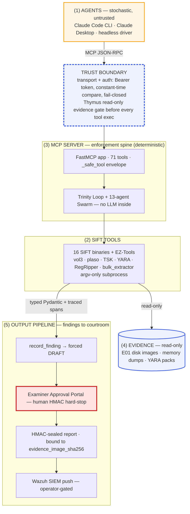

# System Diagram — One Picture, Five Elements, One Trust Boundary

> **Purpose.** This page collects the system-level diagrams already shipped with the repo and
> verifies, in prose, that together they cover the five elements a reviewer should expect of an
> agentic DFIR architecture diagram: **(1) the agent(s)**, **(2) the SIFT forensic tools**,
> **(3) the MCP server**, **(4) the evidence sources**, and **(5) the output pipeline** — with the
> **trust boundary** (Thymus + transport/auth) explicitly marked.
>
> The canonical, source-cited rendering is
> [main-architectural-agentropix-design.md](main-architectural-agentropix-design.md); this page is
> the navigation/verification layer on top of it.

---

## 1. The diagrams and where they live

| Diagram | Format | What it shows |
|---|---|---|
| **Validated architecture diagram** | [`assets/architecture-diagram/architecture-diagram.svg`](assets/architecture-diagram/architecture-diagram.svg) · [PNG](assets/architecture-diagram/architecture-diagram.png) · [PDF](assets/architecture-diagram/architecture-diagram.pdf) · [Mermaid source](assets/architecture-diagram/architecture-diagram.mmd) | The full picture — all five elements plus both guardrail classes (architectural vs prompt-based). Narrated box-by-box in [main-architectural-agentropix-design.md](main-architectural-agentropix-design.md). |
| **README diagram 1** — system overview | [`../../assets/readme-1.svg`](../../assets/readme-1.svg) ([PNG](../../assets/readme-1.png)) | Agent layer → MCP server → SIFT tool families → evidence, as embedded at the top of the repo [README](../../README.md). |
| **README diagram 2** — enforcement spine | [`../../assets/readme-2.svg`](../../assets/readme-2.svg) ([PNG](../../assets/readme-2.png)) | The MCP server core: Thymus gate, Trinity Loop, tool envelope. |
| **README diagram 3** — six guarded stages | [`../../assets/readme-3.svg`](../../assets/readme-3.svg) ([PNG](../../assets/readme-3.png)) | The output pipeline as a workflow: doctor → run → review → **human gate** → approve → seal → escalate (SIEM), with the reject/re-run loop. |
| **C4 context & containers** | [system-context-c4.md](system-context-c4.md) | The same system, outside-in, in C4 notation. |
| **Layer / determinism map** | [architecture-layers.md](architecture-layers.md) | Where stochasticity lives (Layer 1 only) and where determinism is enforced (Layers 2–4). |

> Vector version: [architecture-diagram.svg](assets/architecture-diagram/architecture-diagram.svg) · print: [PDF](assets/architecture-diagram/architecture-diagram-hd.pdf)

---

## 2. Element-by-element verification

Each required element below is present in the validated diagram (the Mermaid source
[`architecture-diagram.mmd`](assets/architecture-diagram/architecture-diagram.mmd) is the
ground truth — node names quoted from it):

1. **Agent(s)** — node `AGENT`: *"Agent layer — the LLM consumers · Claude Code CLI · Claude
   Desktop (mcp-remote shim) + agx_gearb.py headless driver"*. Marked **stochastic** (amber) —
   the only stochastic layer in the system (see [architecture-layers.md](architecture-layers.md)).
2. **SIFT tools** — subgraph `TL` *"Forensic tool layer — SIFT Workstation"*: 11 tool families in
   `mcp_server/wrappers/` driving **16 SIFT binaries + EZ-Tools** (vol3, plaso, TSK fls/mmls/icat,
   libewf, YARA, bulk_extractor, RegRipper, MFTECmd/RECmd/EvtxECmd) — *argv-only subprocess, never
   a shell*.
3. **MCP server** — subgraph `MCP` *"MCP server core — the enforcement spine"*: the FastMCP app
   (`fastmcp_app.py`, 71 canonical tools, per-tool rate limits, `_safe_tool` envelope), the
   **Thymus policy** read-only gate, and the deterministic Trinity Loop + 13-agent DFIR Swarm
   (*no LLM inside*).
4. **Evidence sources** — node `EVID`: *"Evidence — read-only · /cases E01 disk images · memory
   dumps · triage archives · YARA rule packs"*, plus the Wazuh Indexer (`IDX`) as the hash-chained
   case datastore.
5. **Output pipeline** — subgraph `OUT` *"Output pipeline — findings to courtroom"*:
   `record_finding` (force-stamped DRAFT — the model cannot self-approve) → **Examiner Approval
   Portal (HUMAN HMAC HARD-STOP)** → `report_generate`/`report_export` (APPROVED-only, HMAC-sealed,
   bound to `evidence_image_sha256`) → operator-gated Wazuh SIEM push. README diagram 3 renders the
   same pipeline as the six guarded workflow stages.

**Verdict: all five rubric elements are covered by the existing tracked diagrams** — no element is
missing. The condensed Mermaid view below is provided for convenience (renders inline on
GitHub/GitLab without opening the assets), not to patch a gap.

---

## 3. The trust boundary, explicitly

The system has one **trust boundary**, crossed exactly once per tool call, with two enforcement
stations on it:

- **Transport + auth boundary** (node `AUTH` in the diagram): stdio by default, or streamable HTTP
  `:8765 /mcp` with **Bearer token, constant-time compare, fail-closed boot**. Nothing untrusted
  reaches the server core without authenticating here.
- **Thymus policy gate** (node `THY`): a read-only evidence allowlist checked **before every tool
  execution** — the architectural guarantee that no agent request, however phrased, can mutate
  evidence. See [mcp-server.md](mcp-server.md) for where the Thymus boundary sits in code.

Everything **above** the boundary (the agent layer) is stochastic and untrusted; everything
**below** it (MCP server core, SIFT tools, evidence, output pipeline) is deterministic and
governed. The court-defensibility argument follows directly: facts originate below the trust
boundary, and every crossing is fingerprinted (`args_hash`, `exit_code`, `raw_output`) into the
HMAC-sealed trace — see the L1↔L3 boundary contract in
[architecture-layers.md](architecture-layers.md#4-the-l1l3-boundary-contract-in-detail).

### Condensed view (Mermaid, renders inline)

---

## 4. Where to go deeper

- Box-by-box narration with source citations: [main-architectural-agentropix-design.md](main-architectural-agentropix-design.md)
- Determinism / stochasticity per layer: [architecture-layers.md](architecture-layers.md)
- The Thymus boundary in code: [mcp-server.md](mcp-server.md)
- Step-by-step operations across the boundary: [sequence-diagrams.md](sequence-diagrams.md)
