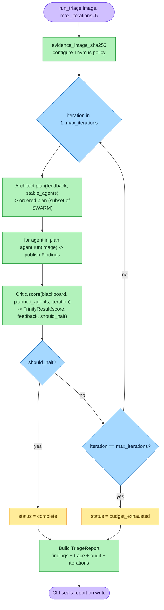
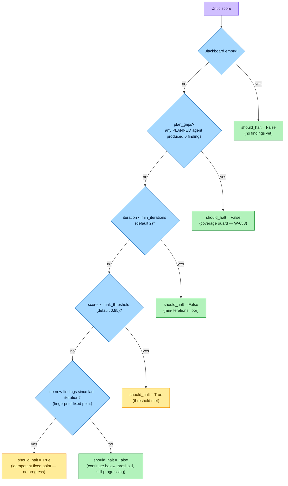

# The Trinity Loop

> **Section 02 · Architecture** — the deterministic engine. The Trinity Loop is the
> control structure that drives every triage: **Architect proposes a plan → the Swarm runs
> deterministic forensic tools → the Critic scores the Blackboard and decides whether to
> halt.** The loop lives entirely in Layer 2 of the
> [determinism map](component-architecture.md#2-the-four-layer-determinism-map): pure
> Python, no RNG, **no LLM self-rating**.

The driver is `run_triage()` in `src/agentropix_sift/orchestrator.py`; the two Trinity
roles are `Architect` (`trinity/architect.py`) and `Critic` (`trinity/critic.py`). The
shared mutable state is the [Blackboard](swarm-agents.md#5-the-blackboard).

---

## 1. The loop, at a glance



**Reading the loop.** `run_triage()` resolves the evidence path, computes
`evidence_image_sha256` (binding the report to the bytes), and calls `configure_policy()`
to add the image directory to the Thymus allow-list (`orchestrator.py:109-110`). It then
iterates from 1 to `max_iterations` (default 5; `orchestrator.py:82`). Each iteration:

1. **Architect plans** the swarm slice for this pass.
2. **Each agent runs** in canonical order, publishing `Finding`s to the Blackboard inside a
   fresh per-agent [trace scope](mcp-server.md#5-tool-tracing) so its MCP tool calls are
   captured (`orchestrator.py:175-222`).
3. **The Critic scores** the Blackboard and returns a `TrinityResult`.
4. If `should_halt`, the loop breaks with `status = "complete"`; otherwise it continues
   until the budget is exhausted (`status = "budget_exhausted"`,
   `orchestrator.py:286`).

After the loop, findings are deduplicated by `(source, description, evidence)` fingerprint
and rolled into a schema-compliant [`TriageReport`](../03-data/) along with the full trace,
the Thymus audit trail, the per-iteration `iterations[]` log, and the
`completion_proofs` tokens. The CLI seals the final document on write
(see [sequence-diagrams.md](sequence-diagrams.md#3-finding--provenance-classification--courtroom-seal)).

---

## 2. The Architect — deterministic planner

The Architect (`trinity/architect.py:146`) is a **deterministic planner, not an LLM call by
default**. Its baseline behaviour is simply *"return the canonical `SWARM` tuple in priority
order"* — and because the canonical order already puts `HuntAgent` last, the run-last
invariant comes for free (`architect.py` docstring; see
[swarm-agents.md](swarm-agents.md#4-run-order--why-huntagent-is-last)).

On top of that baseline sits one default-on optimisation and one default-off escape hatch:

- **Reflexion-lite drop (default ON, `AGENTROPIX_TRINITY_FEEDBACK=1`).** When the Critic
  flags an agent as *stable* — its per-agent finding fingerprint is non-empty and unchanged
  from the previous iteration — the Architect drops that agent from the next plan
  (`architect.py:170-191`). This closes the "Architect is open-loop in practice" finding
  while preserving SWARM order (so `HuntAgent` stays last when it survives the drop). The
  drop is what powers the demo's *"iter-2 skipped MemoryAgent"* beat
  (`orchestrator.py:234-237`).
- **Optional LLM reorder (default OFF, `AGENTROPIX_ARCHITECT_LLM_REORDER=true`).** A purely
  *meta* refinement: a Claude-haiku call may reorder the deterministic plan against the
  Critic's gap feedback. It is failure-resistant by construction — **it is used only if the
  LLM returns the exact same agent set as a strict permutation** (no add, no drop, no
  duplicate); any failure (SDK missing, network, JSON parse, unknown agent, subset) falls
  through silently to the deterministic order (`architect.py:193-244`,
  `_remap_names_to_classes`). Crucially, this reorders *which agents run in which order* —
  it never invents, scores, or rates a finding.

> **No LLM touches a fact, even with the reorder pass on.** The optional LLM only permutes
> a list of agent *names*. The forensic facts still come from the deterministic wrappers,
> and the Critic still scores deterministically. The default-off state preserves the
> existing test baseline structurally (`architect.py` docstring).

---

## 3. The Critic — deterministic scorer and halt authority

The Critic (`trinity/critic.py:67`) is where the loop's most important property lives:
**it never uses an LLM to rate findings.** The score is a closed-form blend of two numbers
already on the Blackboard (`critic.py:120-122`):

```
score = min(1.0, max_confidence + 0.25 * len(correlations))
```

- `max_confidence` — the highest per-finding confidence currently on the Blackboard.
- `len(correlations)` — the number of cross-agent correlations the Blackboard's quorum
  surfaces (see [the Blackboard](swarm-agents.md#5-the-blackboard)); each adds `0.25`
  (`_CORRELATION_WEIGHT`), capped at 1.0.

The score feeds a `TrinityResult` NamedTuple
(`critic.py:47`): `(score, feedback, should_halt, stable_agents, dropped_agents, gaps)`.

---

## 4. The deterministic halt logic

This is the load-bearing part of the chapter. The Critic decides `should_halt` from a
**fixed precedence of guards** — there is no scoring model, no sampling, no LLM
(`critic.py:166-206`). In evaluation order:



> 🔍 **[Open as SVG — full size, zoomable](assets/trinity-loop-2.svg)** (renders larger than the page column; the SVG zooms losslessly in a browser tab).

**Reading the halt cascade.** The three components combine to make halting both *safe* and
*terminating*:

1. **Score threshold** — `score >= AGENTROPIX_CRITIC_HALT_THRESHOLD` (default **0.85**,
   `critic.py:42`). 0.85 was picked deliberately so the loop halts on a single
   high-confidence finding **or** any correlated multi-agent agreement
   (`critic.py` docstring). This is the *"we have enough to report"* exit.
2. **Fingerprint idempotence (fixed point)** — the Critic fingerprints the Blackboard as
   the set of `(agent, source, description, evidence)` tuples
   (`critic.py:128-130`). If the fingerprint is identical to the previous iteration, the
   swarm pass added nothing new, so iterating again is pointless — the loop halts on
   *"no progress."* Because agents are required to be **idempotent** (`agents/_base.py`
   `investigate` docstring: *same seed → identical trace*), a swarm that has converged will
   reproduce the same fingerprint and reliably reach this fixed point. This is the
   *"we've stopped learning"* exit.
3. **Max-iterations budget** — the `for` loop in `run_triage` is bounded by
   `max_iterations` (default 5). If neither halt condition fires, the loop exits with
   `status = "budget_exhausted"` (`orchestrator.py:286`). This is the hard ceiling.

Two **guards refuse to halt early**, sitting *above* the threshold/fixed-point checks so
they can override a saturated score:

- **Coverage guard (W-083).** When the orchestrator passes the iteration's `planned_agents`,
  the Critic refuses to halt while any *planned* agent produced **zero** findings — those
  agents still owe a swing (`critic.py:172-185`). This restores the multi-iteration
  baseline that a single saturating `max_confidence = 1.0` finding would otherwise
  short-circuit at iteration 1.
- **Min-iterations floor (`AGENTROPIX_CRITIC_MIN_ITERATIONS`, default 2).** Defence in
  depth: the loop never halts before iteration 2 even if the score saturates
  (`critic.py:82-88, 176-191`).

> **Why there is no LLM self-rating.** The whole defensibility argument is that the score —
> and therefore the halt decision — is a deterministic function of the Blackboard
> (`min(1.0, max_conf + 0.25·#corr)`), computed in pure Python. Re-running the same
> evidence with the same seed produces the same score, the same halt, and the same report
> fingerprint (`docs/ARCHITECTURE-LAYERS.md` §Layer 2). An LLM that rated its own findings
> would re-introduce exactly the stochasticity the architecture spent four layers pushing
> out. The Critic's docstring states it plainly: *"Deterministic v1 (no LLM)."*

### Configuration knobs

| Variable | Default | Effect | Source |
|----------|---------|--------|--------|
| `AGENTROPIX_CRITIC_HALT_THRESHOLD` | `0.85` | Score at/above which the loop may halt (floor 0.0, ceiling 1.0) | `critic.py:42, 76-81` |
| `AGENTROPIX_CRITIC_MIN_ITERATIONS` | `2` | Minimum iterations before any halt is allowed (floor 1, ceiling 10) | `critic.py:43, 83-88` |
| `AGENTROPIX_TRINITY_FEEDBACK` | `1` (on) | Architect's Reflexion-lite stable-agent drop | `architect.py:62, 81-86` |
| `AGENTROPIX_ARCHITECT_LLM_REORDER` | `false` | Optional Claude-haiku plan reorder (permutation-only) | `architect.py:67, 89-96` |
| `max_iterations` (arg) | `5` | Hard iteration budget | `orchestrator.py:85` |

---

## 5. What each iteration records

Every iteration appends a structured entry to `report.iterations[]`
(`orchestrator.py:240-251`) so the determinism is auditable after the fact:

| Field | Meaning |
|-------|---------|
| `iteration` | 1-based iteration index |
| `plan` | Agent names that actually ran this pass (post-drop) |
| `stable_agents` | Agents the Critic flagged stable (Reflexion-lite) |
| `dropped_agents` | Agents the Architect dropped relative to the baseline plan |
| `gaps` | Canonical-SWARM agents that produced zero findings |
| `critic_score` | The `min(1.0, max_conf + 0.25·#corr)` score |
| `critic_feedback` | Human-readable halt/continue reason string |
| `should_halt` | The deterministic halt decision |

The loop also emits **completion proofs** — verifiable `<promise>` tokens (e.g.
`TIMELINE_GENERATED`) appended whenever an agent both completed without a tool error *and*
published ≥1 Finding (`orchestrator.py:194-195`; `agents/_base.py:102-114`). A populated
report that is missing a required promise is a signal that a wrapper silently failed.

---

## 6. Where to go next

- The agents the Architect plans and the Critic scores → [swarm-agents.md](swarm-agents.md)
- The MCP tools each agent drives, and the Thymus boundary → [mcp-server.md](mcp-server.md)
- The full iteration sequence (with halt) as a sequence diagram →
  [sequence-diagrams.md](sequence-diagrams.md#4-architect--swarm--critic-iteration-with-halt)
- The `TriageReport` / `TrinityResult` / `Finding` data contracts → [03-data](../03-data/)
