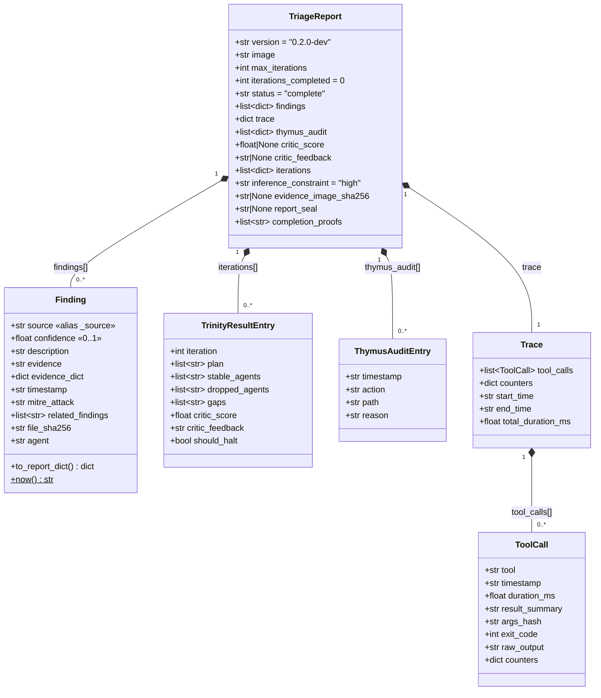
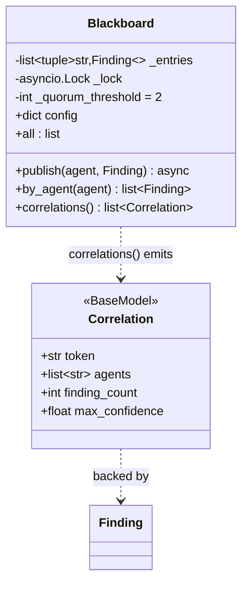
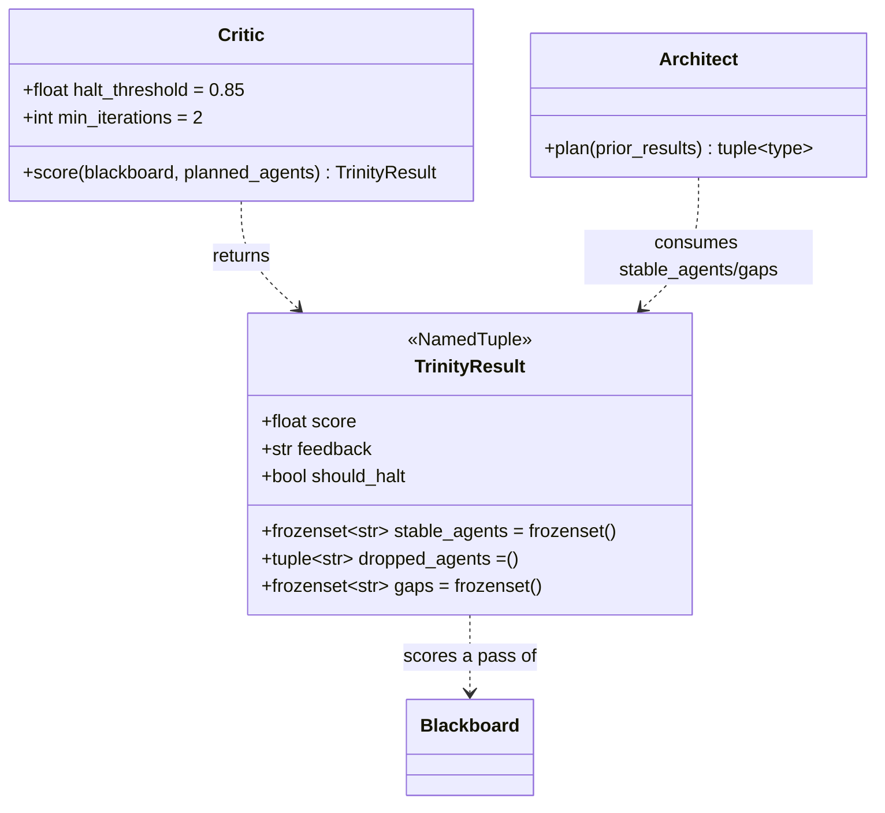
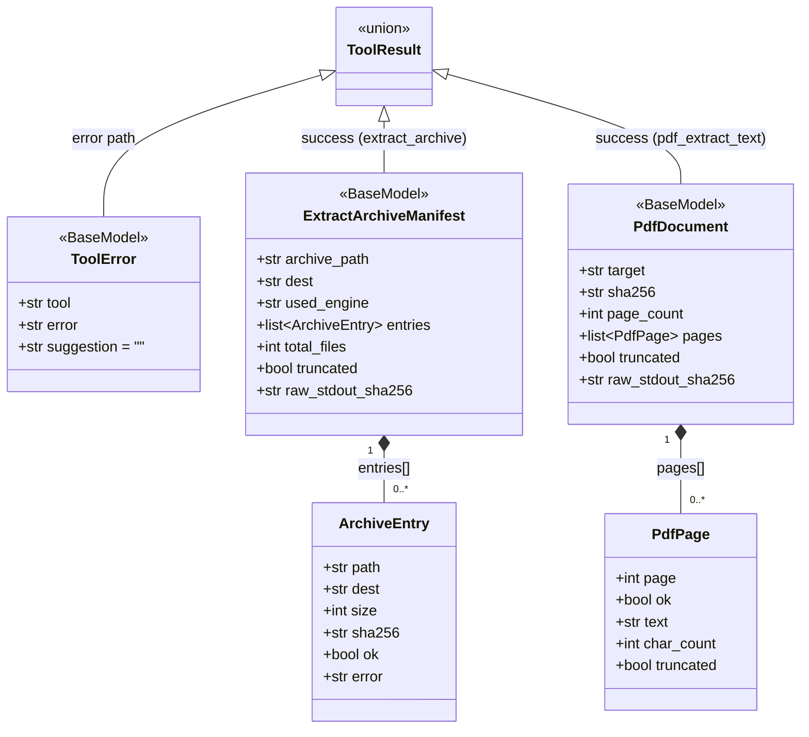
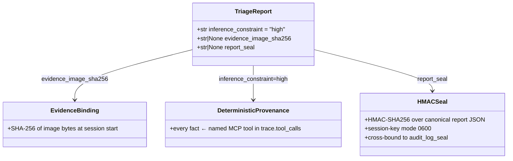

# Data Models

> The structural model of the Agentropix-SIFT data contract — the Pydantic models, `NamedTuple`s, and
> the MCP tool envelope, drawn as Mermaid `classDiagram`s with prose on relationships and invariants.
> Field-level detail lives in the [data-dictionary](data-dictionary.md); this chapter is about *shape
> and law*. Code wins over docs; numbers cite [`CANONICAL_FACTS.md`](../../.crew/facts.md).

The data contract is anchored by one root object — the **`TriageReport`** — that every run produces
and that validates against [`report.schema.json`](data-dictionary.md#1-triagereport--the-top-level-report-contract)
(`src/agentropix_sift/orchestrator.py:34`). Everything else either composes into it (`Finding`,
`trace`, `iterations`) or describes how it is produced (`TrinityResult`, `Correlation`,
`ReasoningTrace`) and proven (`report_seal`, `ToolError`).

---

## 1. The report aggregate



The `TriageReport` is a *composition root*: `findings`, `iterations`, `trace`, and `thymus_audit` are
owned sub-collections, not references — they have no identity outside the report. On the wire they are
plain JSON arrays/objects; in Python, `findings` and `iterations` are stored as `list[dict]`
(`orchestrator.py:56`, `:67`) because they are already serialised by the time the orchestrator rolls
them up, while the producing `Finding` and `TrinityResult` objects live transiently in the agents and
Critic.

**Why `findings` is `list[dict]` not `list[Finding]`.** The orchestrator publishes `Finding` objects
to the `Blackboard` during a pass, then serialises each via `Finding.to_report_dict()`
(`_base.py:73`) into the report. The wire dict drops empty `evidence_dict`, `file_sha256`, and `agent`
keys, so the persisted finding is a clean subset — the `Finding` model is the *producer*, the dict is
the *record*.

---

## 2. `Finding` — the unit of evidence and its alias invariant

`Finding` (`src/agentropix_sift/agents/_base.py:40`) is the single most important model: it is the
only thing the swarm produces and the only thing the Critic scores.

```mermaid
classDiagram
    class Finding {
        <<BaseModel, populate_by_name>>
        +str source  «alias=_source»
        +float confidence  «ge=0.0 le=1.0»
        +str description
        +str evidence = ""
        +dict~str,object~ evidence_dict = {}
        +str timestamp = ""
        +str mitre_attack = ""
        +list~str~ related_findings = []
        +str file_sha256 = ""
        +str agent = ""
        +to_report_dict() dict
    }
    class SwarmAgent {
        <<abstract>>
        +str name
        +str|None completion_promise
        +investigate(image) list~Finding~
        +run(image) list~Finding~
    }
    class Blackboard {
        -list~tuple~ _entries
        -Lock _lock
        +int quorum_threshold = 2
        +dict config
        +publish(agent, Finding)
        +correlations() list~Correlation~
    }
    SwarmAgent ..> Finding : produces
    SwarmAgent --> Blackboard : publishes to
    Blackboard "1" o-- "0..*" Finding : (agent, Finding) entries
```

**Invariants.**

- **Alias invariant.** `source` carries the wire alias `_source` (`_base.py:51`). The model is
  configured `populate_by_name=True` so it accepts either name on construction, but
  `model_dump(by_alias=True)` always emits `_source` — the form `report.schema.json` requires
  (`_base.py:46`). Any code that hand-builds a finding dict for the report MUST use `_source`, not
  `source`.
- **Confidence bound.** `confidence ∈ [0.0, 1.0]` is enforced at construction (`ge=0.0, le=1.0`,
  `_base.py:52`). The Critic's score derives from `max(confidence)` (see [§4](#4-the-critic-and-trinityresult)).
- **Provenance separation.** `source` names the **wrapper/tool** that produced the finding; `agent`
  (W-196, `_base.py:71`) names the **emitting `SwarmAgent`**, stamped by `SwarmAgent.run()` before
  publish. These are deliberately distinct — per-agent recall is impossible from `source` alone.
- **Idempotency.** `SwarmAgent.investigate` must be idempotent: re-invoking on the same image with
  the same Blackboard state must produce the same findings list (S-08: same seed → identical trace,
  `_base.py:124`). This is what makes the Critic's fixed-point halt deterministic.
- **Finding cap.** A single agent may publish at most `AGENTROPIX_AGENT_FINDING_CAP` findings (default
  500, floor 10, ceiling 10000) so row-dumps cannot saturate the Critic's fingerprint space
  (`_base.py:37`).

---

## 3. `Correlation` and the `Blackboard` quorum



The `Blackboard` (`src/agentropix_sift/agents/_blackboard.py:74`) is the only mutable state shared
between agents; it holds `(agent, Finding)` tuples behind an `asyncio.Lock`, so individual agents stay
lock-free. `correlations()` (`_blackboard.py:108`) tokenises each finding's evidence, indexes tokens
by agent, and emits a `Correlation` for every token seen in ≥ `quorum_threshold` distinct agents
(default 2, validated `>= 2`, `_blackboard.py:90`). Results are sorted `(-max_confidence, token)` for
diff-stability.

**Invariant.** `quorum_threshold >= 2` is enforced in `__init__` — a quorum of 1 would mean a single
agent "agreeing with itself," which is meaningless (`_blackboard.py:91`). Correlations are the
substrate for both HuntAgent's cross-source correlation (S-05) and the Critic's score.

---

## 4. The Critic and `TrinityResult`



`TrinityResult` (`src/agentropix_sift/trinity/critic.py:47`) is what one Architect → Swarm → Critic
iteration yields. The Critic is **deterministic — there is no LLM self-rating** (`critic.py:3`):

- **Score formula.** `score = max(finding.confidence) + 0.25·(#correlations)`, capped at 1.0
  (`_CORRELATION_WEIGHT = 0.25`, `critic.py:44`). High-confidence single findings or any correlated
  multi-agent agreement push the score toward the halt threshold.
- **Halt rule.** `should_halt` is True when `score ≥ halt_threshold` (default 0.85,
  `AGENTROPIX_CRITIC_HALT_THRESHOLD`, `critic.py:42`) **OR** the per-pass finding fingerprint reaches a
  fixed point (no new findings since the previous iteration). Both paths are gated by
  `AGENTROPIX_CRITIC_MIN_ITERATIONS` (default 2, `critic.py:43`) and a coverage guard that refuses to
  halt while any *planned* agent produced zero findings (W-083, `critic.py:16`).
- **Reflexion-lite channel.** `stable_agents` (unchanged-fingerprint agents) and `gaps`
  (zero-finding agents) are the forward channel the `Architect` consumes next iteration when
  `AGENTROPIX_TRINITY_FEEDBACK=1` to prune stable agents. `dropped_agents` is filled by the
  orchestrator *after* the Architect picks the next plan — the Critic leaves it empty (`critic.py:52`).

Each iteration's `TrinityResult` is serialised into a `report.iterations[]` entry
([data-dictionary §4](data-dictionary.md#4-iterations-entry--per-iteration-trinityresult-json)); the
final iteration's `score`/`feedback` also surface as the top-level `critic_score`/`critic_feedback`.

---

## 5. The MCP tool envelope

Every one of the [71 MCP tools](../../.crew/tool-list.md) ([`CANONICAL_FACTS.md`](../../.crew/facts.md))
returns one of two shapes: a **typed success payload** or a **`ToolError`**. There is no third
"raised exception" path that reaches the trace — tools catch and convert.



**`ToolError`** (`src/agentropix_sift/mcp_server/server.py:186`) is returned — not raised — for
rate-limit rejections (`server.py:1048`) and caught exceptions (`server.py:1053`), so a failing tool
never breaks the report's `trace` well-formedness. Typed success payloads follow a consistent
per-entry/batch shape: one row per item (`ArchiveEntry`, `PdfPage`) so a single bad item never fails
the whole call, plus a document-level chain-of-custody anchor (`raw_stdout_sha256`,
`sha256`/`raw_stdout_sha256`) for deterministic-replay verification (W-082).

`ExtractArchiveManifest` and `PdfDocument` are shown as representatives — most wrappers colocate
their own typed model (`YaraReport`, `EvtxReport`, …); the two above live in the `schema/` package
because they were promoted as the canonical mirror of the `ExtractedFile` shape (`schema/__init__.py`).

---

## 6. The courtroom invariant chain

The report carries three layered, non-LLM integrity guarantees. These are not separate models so much
as a chain of invariants over the report aggregate.



1. **Evidence binding** — `evidence_image_sha256` is the SHA-256 of the image bytes computed at
   session start (`courtroom.py:89`), binding the report to the exact bytes triaged. Null only when
   the image is unhashable; an operator may supply an offline digest via `AGENTROPIX_EVIDENCE_SHA256`.
2. **Deterministic provenance** — `inference_constraint = "high"` (ADR-016, default `orchestrator.py:69`)
   is the design declaration that the LLM is *orchestrator only*: every fact in the report originates
   from a named deterministic MCP tool whose invocation is captured in `trace.tool_calls`, replayable
   via each call's `raw_output` snapshot.
3. **HMAC seal** — `report_seal` is an HMAC-SHA256 over the canonicalised report JSON
   (`seal_report`, `courtroom.py:161`), cross-bound to the audit-log seal so a swapped audit file
   fails the report seal too (`write_sealed_session`, `courtroom.py:387`). Verified by reading the
   sibling `<report>.session-key` (mode 0600) and recomputing (`verify_seal`, `courtroom.py:173`).

The full on-disk mechanics of this chain — session keys, sealed envelopes, cross-binding — are
documented in [persisted-artifacts.md](persisted-artifacts.md). The entity relationships between the
report, its findings, audit entries, and evidence are diagrammed in [schema-er.md](schema-er.md).

---

## Cross-references

- Field-by-field detail: [data-dictionary.md](data-dictionary.md)
- Persisted-entity relationships: [schema-er.md](schema-er.md)
- On-disk artifacts and lifecycle: [persisted-artifacts.md](persisted-artifacts.md)
