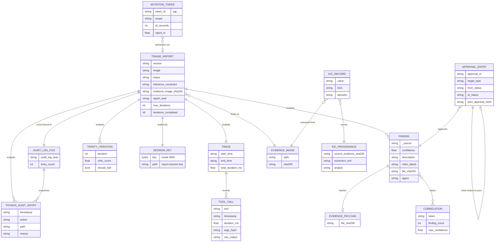

# Schema ER Model

> The persisted entities of Agentropix-SIFT and their relationships, drawn as a Mermaid `erDiagram`.
> Where [data-models.md](data-models.md) shows *object shape* and [data-dictionary.md](data-dictionary.md)
> shows *every field*, this chapter shows *how the records relate* once written to disk and to the
> case index. Numbers cite [`CANONICAL_FACTS.md`](../../.crew/facts.md); records cite their source files.

A triage run produces a small constellation of related records. Some are embedded in a single JSON
document (a `TriageReport` owns its `Finding`s, `ToolCall`s, and `ThymusAuditEntry`s); others are
peer files cross-bound by HMAC (the audit-log and the session key); still others are independent,
durable stores (the evidence-gate SQLite registry, the approval hash-chain, the Wazuh IOC inventory).
The ER diagram below treats each as a logical entity regardless of whether it is an embedded array, a
sidecar file, or a database row — the relationships are what matter for an examiner reconstructing a
case.

---

## The persisted-entity ER diagram

> 🔍 **[Open as SVG — full size, zoomable](assets/schema-er-1.svg)** (renders larger than the page column; the SVG zooms losslessly in a browser tab).

---

## Entity-by-entity

### `TRIAGE_REPORT` — the case root

The aggregate root. One JSON document per run (`src/agentropix_sift/orchestrator.py:33`). It *contains*
its findings, *embeds* its trace / Thymus-audit / Trinity-iteration arrays, is *sealed-by* a session
key, is *cross-bound-to* its audit-log file, and *binds-to* the evidence image by SHA-256. Every other
entity hangs off this root or is referenced by it. Detail:
[data-dictionary §1](data-dictionary.md#1-triagereport--the-top-level-report-contract).

### `FINDING` — contained, never standalone

A finding has no identity outside its report — it is an embedded array element
(`report.findings[]`, `_base.py:40`). Cardinality `||--o{`: a report contains zero-or-more findings.
A finding may *back* one or more `CORRELATION`s (many-to-many — one token can be backed by findings
from several agents, and one finding can contribute several tokens, `_blackboard.py:108`). A finding
optionally *hashes* an `EVIDENCE_PAYLOAD` via `file_sha256` (zero-or-one — present only when a byte
payload was captured, `_base.py:64`).

### `TRACE` and `TOOL_CALL` — the deterministic-provenance record

Exactly one `TRACE` is embedded per report (`||--||`), and it *records* zero-or-more `TOOL_CALL`s
(`report.schema.json:56`). The trace is the heart of the `inference_constraint = "high"` invariant:
every fact in `findings` must trace to a named tool here, replayable via each call's `raw_output`
snapshot (default 4 KiB, `AGENTROPIX_TRACE_RAW_MAX_BYTES`). `args_hash` makes a call reproducible.

### `THYMUS_AUDIT_ENTRY` — the chain-of-custody trail

An access-decision record built by the Thymus read-only policy (`thymus_policy.py:371`). The same
entry is embedded in `report.thymus_audit[]` **and** snapshotted into the sealed `AUDIT_LOG_FILE` —
hence the two relationships in the diagram (`TRIAGE_REPORT ||--o{` and `AUDIT_LOG_FILE ||--o{`). When
`AGENTROPIX_AUDIT_LOG` is set, each entry is also appended live as a JSONL line — the trail of record
(`thymus_policy.py:382`).

### `TRINITY_ITERATION` — the reasoning trail

One embedded entry per Trinity iteration (`report.iterations[]`, serialised `TrinityResult`,
`critic.py:47`). Records the plan, Critic score, and halt decision for each Architect → Swarm → Critic
pass — the durable form of the otherwise-ephemeral Hippocampus `ReasoningTrace`
(see [persisted-artifacts.md §hippocampus](persisted-artifacts.md#hippocampus-reasoning-traces)).

### `SESSION_KEY` and `AUDIT_LOG_FILE` — the seal cross-binding

The report is *sealed-by* exactly one `SESSION_KEY` — a per-run HMAC key written to
`<report>.session-key` at mode 0600 (`courtroom.py:185`). The report is *cross-bound-to* exactly one
`AUDIT_LOG_FILE` (`<report>.audit-log.json`): the audit log's own `audit_log_seal` is copied into the
report dict before the report seal is computed, so a post-hoc swap of either file fails verification
(`write_sealed_session`, `courtroom.py:387`). This is a `||--||` relationship in both cases — exactly
one of each per sealed report.

### `EVIDENCE_IMAGE` — the bytes under examination

The report *binds-to* one evidence image by its SHA-256 (`evidence_image_sha256`, `courtroom.py:89`).
`IOC_RECORD`s are *extracted-from* the same image, carrying its digest in their provenance — this is
how an IOC pushed to a SIEM remains traceable back to the exact evidence bytes.

### `MUTATION_TOKEN` — the optional write authorisation

A one-shot, TTL-bounded token in the SQLite evidence-gate registry (`TokenRow`, `registry.py:113`).
The relationship to a run is sparse (`}o--o|`): most runs are pure read-only triage and spend no
token; a mutating operation *authorises-run* by spending exactly one token, stamping `spent_run_id`.

### `IOC_RECORD` and `IOC_PROVENANCE` — the SIEM-bound intelligence

Each IOC record (the `IPIOCRecord` / `SHA256IOCRecord` / … family, `wazuh/models.py`) *carries*
exactly one `IOC_PROVENANCE` (`||`) — provenance is first-class (WZ-019). Without it, when
`AGENTROPIX_REQUIRE_IOC_PROVENANCE` is set, construction raises `ProvenanceMissingError`
(`wazuh/models.py:178`). Provenance pins `source_evidence_sha256`, `extraction_tool`, and `analyst`,
linking the IOC back to the `EVIDENCE_IMAGE`.

### `APPROVAL_ENTRY` — the human-in-the-loop hash chain

An append-only approval record written by the optional approval sidecar (`approval_sidecar/models.py`).
Each entry *approves* a target `FINDING` (or timeline, or a compensating `approval` retraction) and
*hash-chains-to* the previous approval for the same target via `prev_approval_hash` (self-referential
`||--o|`, empty on the first approval). State transitions are constrained to
`DRAFT → APPROVED → REJECTED → REVOKED` per the `ApprovalStatus` / `TargetType` enums
([data-dictionary §9](data-dictionary.md#9-approval-sidecar-models)).

---

## Relationship invariants summary

| Relationship | Cardinality | Invariant | Source |
|--------------|-------------|-----------|--------|
| report → findings | 1 : 0..* | Findings are embedded; no standalone identity. | `orchestrator.py:56` |
| report → trace | 1 : 1 | Exactly one trace; required wire key. | `report.schema.json:54` |
| report → session-key | 1 : 1 | One per sealed report, mode 0600. | `courtroom.py:185` |
| report ↔ audit-log | 1 : 1 | HMAC cross-bound; swapping either fails the seal. | `courtroom.py:387` |
| report → evidence image | * : 1 | Bound by SHA-256 at session start. | `courtroom.py:89` |
| finding ↔ correlation | 0..* : 0..* | Quorum ≥ 2 distinct agents per correlated token. | `_blackboard.py:90` |
| finding → payload hash | 1 : 0..1 | `file_sha256` present only when a payload was hashed. | `_base.py:64` |
| token → run | 0..* : 0..1 | One-shot spend; most runs spend none. | `registry.py:113` |
| IOC → provenance | * : 1 | Provenance mandatory under `AGENTROPIX_REQUIRE_IOC_PROVENANCE`. | `wazuh/models.py:178` |
| approval → prev approval | 1 : 0..1 | Hash-chained, append-only per target. | `approval_sidecar/models.py` |

---

## Cross-references

- Object shapes and class diagrams: [data-models.md](data-models.md)
- Field-by-field dictionary: [data-dictionary.md](data-dictionary.md)
- How each entity is written/read on disk: [persisted-artifacts.md](persisted-artifacts.md)
