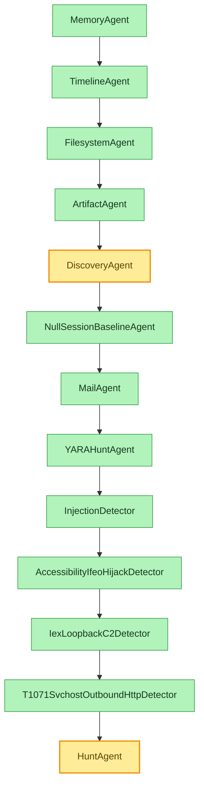

# Tools by Agent

> **Which swarm agent invokes which tools.** The DFIR swarm is the *consumer* of the
> [72 MCP tools](tool-reference.md): each `SwarmAgent` investigates one dimension and drives a specific
> subset of wrappers, publishing `Finding`s to the shared Blackboard. This page maps every agent to the
> tools/wrappers it calls. Derived from `src/agentropix_sift/agents/`, `src/agentropix_sift/detectors/`,
> and the agent contract in [`agents-list.md`](../10-agents/agents-list.md).

Related: [Tool reference](tool-reference.md) · [Response envelope](response-envelope.md) ·
[Trinity Loop](../02-architecture/trinity-loop.md) · [Agents](../02-architecture/swarm-agents.md) ·
[Agentic architecture](../10-agents/agentic-architecture.md) · [Delegation model](../10-agents/delegation-model.md).

---

## Contents — what's in this page (and what to expect)

> Jump to any section below. Each row tells you what that part gives you, so you can go straight to your point.

| Section | What you'll get |
|---|---|
| [The two-layer picture](#the-two-layer-picture) | Why the `SWARM` run order is fixed (Architect → Swarm → Critic), which nodes drive forensic wrappers vs. read the Blackboard, shown as a dependency diagram. |
| [Core swarm specialists (the "7-agent Swarm") → tools](#core-swarm-specialists-the-7-agent-swarm--tools) | The 7-agent table: each specialist's `name`, source, the MCP tools/wrappers it invokes, what it produces, and notes on the producer/consumer pairs. |
| [Deterministic ATT&CK detector agents → tools](#deterministic-attck-detector-agents--tools) | The detector `SwarmAgent` subclasses mapped to their ATT&CK techniques, source, tools driven, and completion-promise tokens. |
| [Tool → invoking agent (reverse index)](#tool--invoking-agent-reverse-index) | The mapping inverted — each forensic tool to the agent(s) that drive it, plus a scope note on orchestrator/CLI/operator-owned tools. |
| [Why this mapping is deterministic](#why-this-mapping-is-deterministic) | How `SwarmAgent` stamps findings, enforces idempotency, and makes the run replayable with a reproducible (non-LLM) Critic score. |

---

## The two-layer picture

The Architect proposes the canonical `SWARM` tuple; the Swarm runs deterministic forensic tools; the
Critic scores and halts on a deterministic convergence fingerprint (no LLM self-rating). The agents are
**pure async coroutines over the MCP boundary** — no LLM coupling. The `SWARM` run order (13 classes,
`agents/__init__.py`) matters because correlation-only agents must run after their inputs are on the
Blackboard:

**Legend:** green nodes drive forensic wrappers (the binaries listed below); the two
yellow/derived nodes (DiscoveryAgent, HuntAgent) run **no wrappers at all** — they read prior
findings/correlations off the Blackboard. Everyone upstream of them must have published first, which is why run order is
fixed and HuntAgent is always last ([`agents-list.md`](../10-agents/agents-list.md)). This is the structural reason the
correlation/derived tools in the [tool reference](tool-reference.md#three-kinds-of-tool) exist as a
distinct class.

---

## Core swarm specialists (the "7-agent Swarm") → tools

Each specialist declares a `name` (its stable identity, stamped onto every `Finding` it
publishes — see [Why this mapping is deterministic](#why-this-mapping-is-deterministic)) and a
`completion_promise` — a fixed string token (e.g. `MEMORY_TRIAGED`) that the agent appends to
`report.completion_proofs` once it has published ≥1 Finding without a tool error. The promise tokens
are the audit trail that proves a planned agent actually ran and produced output (milestone M8.3d);
the Critic refuses to halt while any planned agent's promise is missing. The full token list is in
[`agents-list.md`](../10-agents/agents-list.md).

| Agent (`name`) | Source | MCP tools / wrappers it invokes | Produces |
|----------------|--------|---------------------------------|----------|
| **MemoryAgent** (`memory`) | `agents/memory.py:536` | `get_pslist` (Volatility); `wrappers/volatility.py`; `build_process_tree` (`wrappers/correlation.py`); `wrappers/credentials` (impacket secretsdump) | Suspicious/orphan processes, injected/RWX regions, credential-dump evidence; sets `evidence_dict` for cross-modal IOC fusion |
| **TimelineAgent** (`timeline`) | `agents/timeline.py:252` | `get_timeline` (Plaso / `log2timeline.py`); `detect_sweep` (`wrappers/correlation.py`) | Execution/LOLBin timeline events, EID 4688 process-creation events (consumed by DiscoveryAgent), lateral-movement sweeps |
| **FilesystemAgent** (`filesystem`) | `agents/filesystem.py:65` | `fls` (Sleuth Kit); `wrappers/tsk._read_inode` | Suspicious filenames, deleted-file artifacts, inode-level evidence (with `file_sha256` payload hashes) |
| **ArtifactAgent** (`artifact`) | `agents/artifact.py:86` | `extract_files` → `get_registry` / `get_amcache` / `get_shimcache` chain; `wrappers/scheduled_tasks` (T1053.005) | Registry/Amcache/Shimcache execution evidence, scheduled-task persistence; per-source cap of 50 |
| **DiscoveryAgent** (`discovery`) | `agents/discovery.py:29` | **No re-run** — reads TimelineAgent's EID 4688 findings off the Blackboard; `_discovery_detectors` regex match | MITRE Discovery techniques T1018, T1069, T1083, T1087, T1135. Disk-only (early-returns on memory images) |
| **MailAgent** (`mail`) | `agents/mail.py:165` | `list_files`; top-level `wrappers/email_headers`; `wrappers/memory_mail_carve`; `_mail_maldoc_chain` (oletools) | T1566 phishing findings from carved Outlook/PST artefacts, lookalike-domain headers, maldoc-chain attachment analysis |
| **HuntAgent** (`hunt`) | `agents/hunt.py:68` | **No wrappers** — consumes `blackboard.correlations()` | High-confidence cross-source correlation findings (S-05: ≥3-agent agreement). Runs LAST |

### Notes on the specialist mappings

- **MemoryAgent** is the one swarm agent that touches the credential-dump path
  (`wrappers/credentials`, impacket `secretsdump`, W-072/ADR-014) in addition to the Volatility memory
  tools. Its `build_process_tree` call is a *derived* tool — it correlates the `get_pslist` output it
  already produced (see [response envelope → derived tools](response-envelope.md)).
- **TimelineAgent → DiscoveryAgent** is a producer/consumer pair: TimelineAgent emits EID 4688
  process-creation events; DiscoveryAgent re-reads them off the Blackboard and never re-runs a wrapper.
- **ArtifactAgent** runs a *chain*: `extract_files` pulls hives out of the image, then
  `get_registry`/`get_amcache`/`get_shimcache` parse them — capped at 50 findings per source.
- **HuntAgent** runs last and invokes zero forensic tools; its entire input is the Blackboard's
  `correlations()` (tokens appearing across ≥ quorum agents, default 2).

---

## Deterministic ATT&CK detector agents → tools

Also `SwarmAgent` subclasses (in `detectors/`), interleaved into `SWARM` so their inputs are already on
the Blackboard. Deterministic, no LLM; they emit ATT&CK-tagged findings.

| Detector (`name`) | ATT&CK | Source | Tools / wrappers driven | Produces |
|-------------------|--------|--------|-------------------------|----------|
| **YARAHuntAgent** (`yara_hunt`) | T1055 family | `detectors/yara_hunt.py:148` | `scan_yara` (drives `yara`) over memory/files | YARA rule matches; promise `YARA_HUNT_COMPLETE` |
| **InjectionDetector** | T1055 / .001 / .002 | `detectors/injection_detector.py` | Reads memory findings (`get_malfind`/pslist context) off the Blackboard | Process-injection indicators (code cave, PE injection) |
| **NullSessionBaselineAgent** (`null_session_baseline`) | T1087.002 | `detectors/t1087_002_null_session_baseline.py:441` | Reads account-discovery events; baseline z-threshold | Null-session account-discovery anomalies vs baseline; promise `NULL_SESSION_BASELINE_COMPLETE` |
| **AccessibilityIfeoHijackDetector** | T1546.008 | `detectors/t1546_008_accessibility_ifeo_hijack.py` | Reads registry/IFEO artefacts off the Blackboard | IFEO / accessibility-feature debugger hijack persistence |
| **IexLoopbackC2Detector** (`t1059_001_iex_loopback_c2`) | T1059.001 | `detectors/t1059_001_iex_loopback_c2.py:429` | Script-block hashing over PowerShell evidence | PowerShell IEX loopback C2; promise `T1059_001_IEX_LOOPBACK_SCAN_COMPLETE` |
| **T1071SvchostOutboundHttpDetector** (`t1071_001_svchost_outbound_http`) | T1071.001 | `detectors/t1071_001_svchost_outbound_http.py:215` | Reads `get_netscan` / process context off the Blackboard | svchost outbound HTTP beaconing; promise `T1071_001_SVCHOST_OUTBOUND_HTTP_COMPLETE` |

> The detectors mostly *consume* what the specialists already published (network sockets from
> `get_netscan`, memory regions from `get_malfind`, registry hits from `get_registry`), with
> YARAHuntAgent the exception that drives a binary (`yara`) of its own. That interleave is exactly why
> they sit after the specialists in the `SWARM` run order.

---

## Tool → invoking agent (reverse index)

The same mapping inverted, for the forensic execution tools that an agent drives directly. (Case-state,
reporting, indexer, Wazuh, and approval tools are invoked by the **orchestrator / CLI / operator**, not
by individual swarm agents — see note below.)

| Tool | Binary / kind | Invoking agent(s) |
|------|---------------|-------------------|
| `get_pslist` | Volatility (memory) | MemoryAgent |
| `build_process_tree` | derived | MemoryAgent |
| `get_malfind` | Volatility (memory) | (consumed by) InjectionDetector |
| `get_netscan` | Volatility (memory) | (consumed by) T1071SvchostOutboundHttpDetector |
| `get_timeline` | Plaso | TimelineAgent |
| `detect_sweep` | derived | TimelineAgent |
| `fls` | Sleuth Kit | FilesystemAgent |
| `extract_files` | Sleuth Kit `icat` | ArtifactAgent |
| `get_registry` | RegRipper | ArtifactAgent (+ consumed by IFEO detector) |
| `get_amcache` | EZ-Tools | ArtifactAgent |
| `get_shimcache` | EZ-Tools | ArtifactAgent |
| `list_files` | Sleuth Kit | MailAgent |
| `scan_yara` | `yara` | YARAHuntAgent |
| `blackboard.correlations()` | derived | HuntAgent, DiscoveryAgent |

> **Scope note.** The agent-to-tool mappings above are the forensic-read tools the swarm drives during
> a triage iteration. The remaining tool families — case lifecycle (`case_init`/`case_status`),
> findings/IOC persistence (`record_finding`, `promote_iocs`), reporting (`report_generate`/
> `report_export`), OpenSearch indexer (`idx_*`), Wazuh (`wazuh_*`), and approval
> (`approve_finding`/`retract_approval`) — are driven by the orchestrator, the CLI, or a human examiner
> around the swarm run, not by an individual `SwarmAgent`. Several are state-mutating and gated; see
> [response envelope → mutation & approval gating](response-envelope.md#mutation--approval-gating).

---

## Why this mapping is deterministic

Every agent extends `SwarmAgent` (`agents/_base.py:95`): the base `run()` applies the per-agent finding
cap (`AGENTROPIX_AGENT_FINDING_CAP`, default 500), stamps `Finding.agent = self.name` (W-196, enabling
per-agent recall), and publishes to the Blackboard. Investigations must be idempotent (S-08: same seed
→ identical trace). Because each agent calls a *fixed* set of deterministic MCP tools and every fact
originates from a named tool captured in `trace.tool_calls`, the run is replayable and the Critic's
score (max finding confidence + 0.25·#correlations, capped at 1.0) is reproducible — no LLM rates the
findings. See [Trinity Loop](../02-architecture/trinity-loop.md) and
[response envelope → availability & skip signalling](response-envelope.md#availability--skip-signalling).

---

## Related

**Sibling 04-mcp-tools pages**

- [Tool reference](tool-reference.md) — the full catalogue of the 72 MCP tools this page maps agents onto, incl. the three-kinds-of-tool taxonomy (read / derived / state-mutating).
- [Tool list](tool-list.md) — the flat, name-only index of every tool.
- [Response envelope](response-envelope.md) — the uniform result shape every tool returns, plus mutation/approval gating and availability/skip signalling referenced above.
- [Capability map](capability-map.md) — tools grouped by forensic capability rather than by invoking agent.

**Where the agents and the MCP boundary are specified**

- [MCP server](../02-architecture/mcp-server.md) — how the swarm agents call tools across the MCP boundary they consume.
- [Swarm agents](../02-architecture/swarm-agents.md) — the architectural view of the `SWARM` run order and the Architect → Swarm → Critic trinity.
- [Trinity Loop](../02-architecture/trinity-loop.md) — the deterministic Architect/Swarm/Critic loop that drives the run.
- [Agents overview](../10-agents/README.md) · [Agents list](../10-agents/agents-list.md) — the agent contract, `name`/`completion_promise` tokens, and `SWARM` tuple this page is derived from.
- [Agentic architecture](../10-agents/agentic-architecture.md) · [Delegation model](../10-agents/delegation-model.md) — how the agents are orchestrated.

**Reference & data**

- [Canonical facts](../08-reference/canonical-facts.md) — the authoritative tool/wrapper/test counts cited throughout this page.
- [Data dictionary](../03-data/data-dictionary.md) · [Data models](../03-data/data-models.md) — the `Finding`, `Blackboard`, and `trace.tool_calls` structures the agents read and write.

**Relevant ADRs**

- [ADR-011 — evidence gates](../11-ADR/ADR-011-evidence-gates.md) — the grounding/evidence rules that govern what an agent may publish.
- [ADR-012 — extract-files](../11-ADR/ADR-012-extract-files.md) — the `extract_files` chain ArtifactAgent runs.
- [ADR-013 — EVTX wrapper](../11-ADR/ADR-013-evtx-wrapper.md) — the EID 4688 event source TimelineAgent emits and DiscoveryAgent consumes.
- [ADR-014 — W-072 impacket secretsdump](../11-ADR/ADR-014-W072-impacket-secretsdump.md) — the credential-dump path only MemoryAgent touches.
