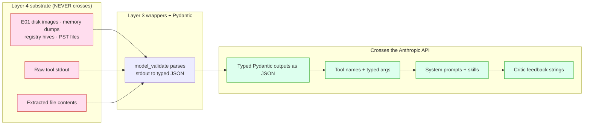

# AI Disclosure & Reproducibility

> **Section 05 · Safety & Forensics** — the AI-transparency view.
> Related: [Anti-Hallucination](anti-hallucination.md) ·
> [Provenance & Grounding](provenance-grounding.md) ·
> [Audit & Courtroom Seal](audit-courtroom.md) ·
> [Human-in-the-Loop](human-in-the-loop.md) ·
> [The Trinity Loop](../02-architecture/trinity-loop.md)

The portal's [anti-hallucination](anti-hallucination.md) and
[trinity-loop](../02-architecture/trinity-loop.md) chapters establish that **no
LLM authors a fact** — every finding is grounded to a deterministic tool call.
This page consolidates the complementary *AI-disclosure* view: which models the
system uses, that nothing is fine-tuned, exactly what the LLM can and cannot
influence, what data does and does not cross the Anthropic API boundary, and
which parts of a run are reproducible versus stochastic. Every claim below is
grounded to a source file in `agentropix-sift`.

**Terms used on this page** (defined where they first appear, collected here for
reference):

- **LLM** — large language model; here, a Claude model. It can be *stochastic*
  (the same input may yield a different choice on different runs).
- **MCP tool** — a deterministic Python function exposed over the Model Context
  Protocol that reads or derives forensic facts. These are the only authors of
  findings.
- **Trinity loop** — the orchestration cycle of two LLM agents: the **Architect**
  (planner — picks which agents/tools to run next) and the **Critic** (reviewer —
  decides when to halt). See [The Trinity Loop](../02-architecture/trinity-loop.md).
- **Blackboard** — the shared in-memory state the Trinity agents read and write
  during a run (findings so far, planned agents, scores).
- **Thymus** — the read-only-zone policy layer that validates every tool's path
  argument before a subprocess runs.
- **Courtroom** — the sealing layer that HMAC-signs the report and audit log.
- **`args_hash`** — the SHA-256 of a tool call's arguments, recorded *before* the
  call runs, so the call can never be silently re-described afterward.
- **`evidence_dict`** — the typed, source-of-truth IOC fields on a finding, taken
  directly from tool output (as opposed to the optional free-text `description`).
- **Layers 1–4** — the four-layer determinism map: Layer 1 is the stochastic LLM
  Consumer, Layers 2–4 are deterministic given the LLM's choices. See
  [the determinism map](../02-architecture/component-architecture.md#2-the-four-layer-determinism-map).

---

## Contents — what's in this page (and what to expect)

> Jump to any section below. Each row tells you what that part gives you, so you can go straight to your point.

| Section | What you'll get |
|---|---|
| [1. Models used](#1-models-used) | Which Claude models the system uses, the single in-code pin (Haiku reorder, default OFF), and confirmation that nothing is fine-tuned (no LoRA/PEFT). |
| [2. What the LLM CAN influence — three bounded surfaces](#2-what-the-llm-can-influence--three-bounded-surfaces) | The exact three surfaces of LLM reach — tool choice, argument values, and free-text `description` — and the non-LLM code that bounds each. |
| [3. What the LLM CANNOT influence — five structural commitments](#3-what-the-llm-cannot-influence--five-structural-commitments) | Five code-level guarantees the LLM can't touch: no write tools, `args_hash` freeze, pure-Python Critic halt, Thymus policy, HMAC seal. |
| [4. The Anthropic API data boundary](#4-the-anthropic-api-data-boundary) | What does and does not cross the Anthropic API, with a flow diagram and the optional Haiku-reorder payload. |
| [5. Reproducibility — the replay formula](#5-reproducibility--the-replay-formula) | The three replay primitives and the five-step recipe to re-verify any finding byte-for-byte. |
| [6. What is NOT deterministic — three honest sources](#6-what-is-not-deterministic--three-honest-sources) | The three honest sources of non-determinism (LLM stochasticity, iteration count, plaso race) and what stays stable in each. |
| [7. Disclosure summary](#7-disclosure-summary) | The whole AI-disclosure position distilled into five bullet takeaways. |

---

## 1. Models used

Agentropix-SIFT does **not** train, fine-tune, or ship model weights. It
orchestrates existing Claude models. There is exactly **one** model identifier
pinned anywhere in the codebase, and it is behind an opt-in gate that defaults
**OFF**.

| Role | Model | Pinned in code? | Default |
|------|-------|-----------------|---------|
| **Layer-1 Consumer** (the agent that picks the next MCP tool + arguments) | Operator's Claude — Opus 4.x or the operator's choice | **No** — selected at the deployment surface (Claude Desktop dropdown, Claude Code `--model`, MCP-client config) | n/a (operator-driven) |
| **Optional Architect reorder pass** | `claude-haiku-4-5-20251001` | **Yes — the only in-code pin** (`trinity/architect.py:71`) | **OFF** — gated by `AGENTROPIX_ARCHITECT_LLM_REORDER`, default `"false"` (`architect.py:66-67`) |

### Layer-1 Consumer — operator's Claude, not version-pinned

When Agentropix-SIFT runs interactively, the operator's Claude instance is the
**Layer-1 Consumer**: the stochastic agent that decides which MCP tool to call
and with what arguments. The codebase does **not** pin a Claude version at
Layer 1 — model selection happens at the deployment surface. New Claude
versions may produce different tool *sequences*; Layers 2–4 are deterministic
*given* those sequences (see [the determinism map](../02-architecture/component-architecture.md#2-the-four-layer-determinism-map)).

### The only in-code pin — optional Haiku reorder (default OFF)

When `AGENTROPIX_ARCHITECT_LLM_REORDER=true` is explicitly opted in (default is
`false`), the planner (codename **Architect** — the LLM agent that decides which
specialist agents to run next) makes one meta-reasoning call per iteration to
Claude Haiku, pinned at `trinity/architect.py:71`:

```python
_LLM_REORDER_MODEL = "claude-haiku-4-5-20251001"
```

The call asks Haiku only to **reorder an already-known agent set** against the
Critic's feedback string — "Do not add or remove agents" (`architect.py:73-77`,
the system prompt). The result is used *only* if Haiku returns the same agent
set in parseable JSON. Any failure (anthropic SDK missing, network error, JSON
parse error, unknown agents) falls through silently to the deterministic order
— the planner **never blocks** on the LLM call (`architect.py:310-360`,
`_call_claude` raises `RuntimeError` on a missing SDK and the caller treats it
as a fall-through signal).

### No fine-tuning, no PEFT, no LoRA

There is no model training, no LoRA, no PEFT adapter, and no embedding
fine-tune anywhere in the project. The system's intelligence lives at the
orchestration layer (Trinity planner/reviewer + the
**7 core Swarm specialists** — memory, timeline, filesystem, artifact,
discovery, mail, hunt — plus the deterministic ATT&CK detector agents), not in
custom-trained weights (`src/agentropix_sift/agents/__init__.py`; see
[`canonical-facts.md`](../08-reference/canonical-facts.md) for the 7-core-vs-13-classes framing;
the runtime swarm is enumerated in [`agents-list.md`](../10-agents/agents-list.md)).

---

## 2. What the LLM CAN influence — three bounded surfaces

The LLM's reach is limited to exactly three surfaces, each bounded by
non-LLM Python.

| Surface | Mechanism | Bound by |
|---------|-----------|----------|
| **Tool choice** — which MCP tool to call next | Stochastic Layer-1 selection | Frozen via `args_hash` (SHA-256 of the call signature) recorded in the trace ledger *before* the subprocess runs (`mcp_server/_trace.py`) |
| **Argument values** — parameters to the chosen tool | LLM proposes; deterministic wrappers apply env-var floor/ceiling guards | `args_hash` freeze + Thymus path validation (`thymus_policy.py:236` `check_read`) + Pydantic argument typing |
| **Natural-language `description`** in finding records | Optional LLM summarization | The `description` is *never* source-of-truth (it is human-readable prose only); the source-of-truth is `evidence_dict` — the typed IOC fields taken directly from tool output |

These three surfaces are the **entirety** of LLM influence. Everything else is
enforced by code the LLM does not control.

---

## 3. What the LLM CANNOT influence — five structural commitments

These are not instruction-tuning promises; they are properties of code paths
that either do not exist or are gated by non-LLM Python checks.

1. **No write tools exist.** All MCP tools are `get_*`, `scan_*`, `run_*`,
   `promote_*`, plus a `health` probe — read/derive only. There is no
   `mcp_write_*` for the LLM to call. The MCP surface is **73 distinct tool
   functions** (73 `@app.tool()` registrations: 68 in `fastmcp_app.py`
   + 5 wazuh wrappers, `wazuh_hunt_ioc` registered twice — see
   [`canonical-facts.md`](../08-reference/canonical-facts.md)). *Capability absence, not policy.*
2. **`args_hash` freeze.** `mcp_server/_trace.py`'s `@traced` decorator records
   the SHA-256 of args+kwargs *before* invoking the subprocess
   (`_trace.py:280-297`). Any post-hoc "I really meant different arguments" is
   contradicted by the recorded hash.
3. **Critic halt is pure-Python.** The Critic (`trinity/critic.py` — the LLM
   agent that reviews each pass) does *not* decide when to stop; a deterministic
   Python rule does. The loop halts when `score >= halt_threshold` (default
   **0.85**, `AGENTROPIX_CRITIC_HALT_THRESHOLD`, `critic.py:42`) **or** when the
   pass added no new findings, subject to the coverage guard
   (W-083: refuse to halt while any planned agent produced zero findings) and a
   `min_iterations` floor (default 2, `AGENTROPIX_CRITIC_MIN_ITERATIONS`). None
   of these are LLM-rated (`critic.py:1-32`).
4. **Thymus read-only-zone policy.** Thymus is the path-policy layer:
   `thymus_policy.py:check_read()` validates every tool's path argument against an
   allowlist + forbidden patterns + symlink resolution + path-length cap *before*
   the subprocess spawns. The LLM has no say.
5. **HMAC seal + audit-log cross-bind.** HMAC (hash-based message authentication
   code) is a keyed integrity tag: tamper with the sealed bytes and verification
   fails. `courtroom.seal_report()` HMAC-SHA256s the canonicalized report under a
   per-run session key
   (`courtroom.py:161-170`); the audit log is independently HMAC-sealed
   (`courtroom.py:270-281`, W-173 / ADR-022) and cross-bound into the report
   *before* the report seal is computed. The LLM cannot alter either
   retroactively.

---

## 4. The Anthropic API data boundary

This is the load-bearing privacy claim and it follows directly from the
no-write / `args_hash` / Pydantic-at-Layer-3 architecture already documented
in [Provenance & Grounding](provenance-grounding.md).



> 🔍 **[Open as SVG — full size, zoomable](assets/ai-disclosure-1.svg)** (renders larger than the page column; the SVG zooms losslessly in a browser tab).

### What does NOT cross

| Class | Why it stops at the boundary |
|-------|------------------------------|
| **Raw evidence bytes** — E01 images, memory dumps, registry hives, PST files | Never sent to Anthropic; evidence lives only in Layer 4 |
| **Raw tool stdout** | Pydantic parses tool output at Layer 3 *before* the LLM sees it; the LLM receives typed JSON, raw stdout never crosses |
| **Extracted file contents** | Extraction writes to a Thymus-allowed tmpdir; only structured extraction results (parsed mail headers, IOC hashes) reach the LLM as JSON |

### What DOES cross

| Class | Example |
|-------|---------|
| **Tool names + structured arguments** | `mcp_get_pslist(image="/cases/dump.001")` |
| **Typed Pydantic outputs serialized as JSON** | `{"processes": [...], "network_connections": [...]}` |
| **System prompts + loaded skills** | per ADR-015 Progressive Disclosure — thin nav hub + on-demand skills |
| **Critic feedback strings** | `"continue: score 0.75 < threshold 0.85"` |

### Optional Haiku reorder exchange (only when the gate is ON)

When `AGENTROPIX_ARCHITECT_LLM_REORDER=true`, the *only* payload sent is agent
names + the Critic feedback string (`architect.py:325-340`,
`{"agents": [...], "gaps": "..."}`); the reply is a reordered list of the same
agent set. **No evidence bytes, no finding details, and no tool output cross**
on this path.

> **Operator responsibility.** Anthropic's API logging and retention are out of
> the project's control. The project's commitment is the boundary above: no
> secrets, no credentials, no raw evidence bytes, and no operator PII cross the
> API.

---

## 5. Reproducibility — the replay formula

The replay chain rests on three primitives, each already part of the
[Courtroom](audit-courtroom.md) track:

1. **`args_hash` freeze** — SHA-256 of a call's arguments recorded *before* the
   subprocess starts (`_trace.py:280-289`).
2. **`raw_output` snapshot** — each call's stdout snapshot (default **4 KiB**,
   floor 256 B / ceiling 1 MiB, tunable via `AGENTROPIX_TRACE_RAW_MAX_BYTES`)
   captured *before* any LLM summarization (`_trace.py:54-61, 290-297`).
3. **HMAC seal + audit-log cross-bind** — re-verifiable on any host with
   Python 3 via the dependency-free `scripts/verify_seal.py`.

**Replay any finding in five steps:**

| # | Step |
|---|------|
| 1 | Extract finding `F` from `report.json` |
| 2 | Locate `F`'s `_source` (tool name) and the matching `tool_calls[]` entry by `args_hash` |
| 3 | Read the `raw_output` snapshot from that trace entry |
| 4 | Re-invoke the tool with the same arguments (derivable from `args_hash` + recorded call signature) |
| 5 | Compare new output to the stored `raw_output` byte-for-byte — a match proves the tool is deterministic given those arguments and that `F`'s evidence is real, not LLM-fabricated |

Given identical `args_hash` + environment + Layer-4 binary versions, the tool
output is byte-identical (modulo the W-077 race below).

---

## 6. What is NOT deterministic — three honest sources

| Source | Effect | What stays stable |
|--------|--------|-------------------|
| **Layer-1 LLM stochasticity** | Two runs on the same evidence may pick different tools/arguments, so the *sequence* of `args_hash` entries can differ | For any call that *did* occur, its `args_hash` is recorded and its output is replayable |
| **Trinity loop iteration count** | The number of planner/reviewer iterations to reach halt depends on which findings emerge early (e.g. 3 vs 5) | The halt rule itself is deterministic given the Blackboard state (`critic.py:7-14`) |
| **W-077 — plaso multi-worker race** (LOW, documented) | `log2timeline` under multi-worker concurrency can emit timeline events in a different *order* across runs | The *set* of events is identical; `--workers=1` forces byte-identical output at a wall-time cost. Status: DEFERRED with a documented re-open trigger (`docs/PHASE-MCP-100-COMPLETE.md:119`) |

---

## 7. Disclosure summary

- **One model is pinned in code** — `claude-haiku-4-5-20251001` at
  `trinity/architect.py:71`, behind a gate that defaults OFF. The Layer-1
  Consumer (operator's Claude, Opus 4.x) is **not** version-pinned.
- **Nothing is fine-tuned** — no training, no LoRA, no PEFT, no embedding
  fine-tune.
- **The LLM influences three bounded surfaces and cannot touch five structural
  commitments** (no write tools, `args_hash` freeze, pure-Python Critic halt,
  Thymus, HMAC seal).
- **No evidence bytes cross the Anthropic API.** Only tool names, typed JSON,
  system prompts, and Critic feedback cross.
- **Every finding is replayable** via `args_hash` + `raw_output` + HMAC seal,
  independent of the LLM that produced it.

---

## Decision records (why this works the way it does)

- [ADR-015 — Context Engineering: Progressive Disclosure](../11-ADR/ADR-015-context-engineering.md)
  — the rationale for the thin-nav-hub + load-on-demand skills model behind the
  "system prompts + loaded skills" that cross the API (§4).
- [ADR-016 — Courtroom Audit: High Inference Constraint + Cryptographic
  Sealing](../11-ADR/ADR-016-courtroom-audit.md) — the genesis of the
  inference-constraint declaration and the HMAC report seal (§3 commitment 5, §5
  replay primitive 3).
- [ADR-022 — Audit-Log Seal](../11-ADR/ADR-022-audit-log-seal.md) — the W-173
  decision behind the independently-sealed, cross-bound audit log cited in §3
  (commitment 5).

---

> **Reconciliation note.** Earlier draft material referenced "46 tools",
> "11 agents", and the package name "agentropix_mcp". Per
> [`canonical-facts.md`](../08-reference/canonical-facts.md) and the live code, the correct
> figures are **73 distinct MCP tools**, the **7 core Swarm specialists + ATT&CK
> detector agents** (13 classes in the `SWARM` tuple,
> `agents/__init__.py`), and the package **`agentropix_sift`**. The numbers in
> this page follow the canonical facts file.
