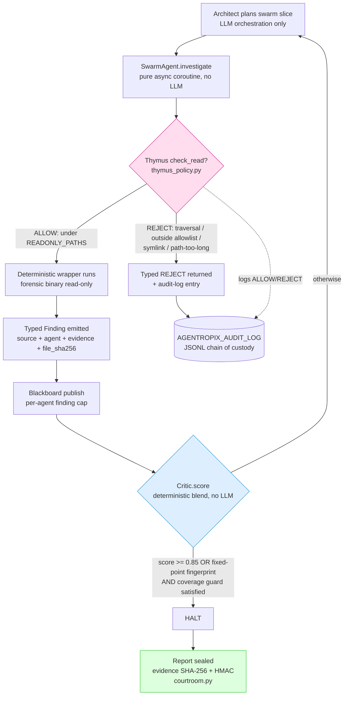

# Anti-Hallucination: How Fabricated Findings Are Prevented

> **Section 05 · Safety & Forensics** — the anti-hallucination story.
> Related: [Provenance & Grounding](provenance-grounding.md) ·
> [Audit & Courtroom Seal](audit-courtroom.md) ·
> [Human-in-the-Loop](human-in-the-loop.md)

A forensic triage engine that an examiner cannot trust is worse than no engine
at all. Agentropix-SIFT is built so that **no fact in a report can originate
from a language model**. The LLM agents (Architect, Critic) *orchestrate*;
every finding is authored by a named, deterministic MCP tool that read bytes
off evidence. This chapter explains the five concrete control points that make
fabrication structurally impossible — not merely discouraged.

This is the **High Inference Constraint** contract (ADR-016, BMAD-M8 Phase
M8.2), documented in the module header of `src/agentropix_sift/courtroom.py:1-10`:

> "the LLM agents (Architect, Critic) only orchestrate; every fact in the
> report originates from a named deterministic MCP tool."

## The five control points

| # | Control | What it guarantees | Source |
|---|---------|--------------------|--------|
| 1 | **Deterministic-tools-only findings** | No LLM-authored content reaches a report; every `Finding` is emitted by a wrapper that ran a forensic binary | `agents/_base.py`, `trinity/critic.py` |
| 2 | **Evidence sovereignty** | A finding carries its own provenance (which agent, which wrapper, which evidence digest) so it can be re-derived | `agents/_base.py:40-92` |
| 3 | **Read-only Thymus boundary** | The agent physically cannot write to evidence — no MCP tool exposes a write op; path allowlist enforced at the boundary | `mcp_server/thymus_policy.py` |
| 4 | **Pre/post SHA-256 evidence invariant** | The report is provably tied to the exact bytes that were triaged; any byte change is detectable | `courtroom.py:89-142` |
| 5 | **Deterministic fingerprint halt** | The loop stops on a reproducible fixed point — the Critic never rates its own confidence with an LLM | `trinity/critic.py:42-213` |

The rest of this chapter walks each control, then shows where they sit along a
single tool call.

## 1 · Deterministic-tools-only findings (no LLM author)

The swarm agents are, by deliberate design, **pure async coroutines over the
MCP boundary with no LLM coupling**. The base-class docstring states it
plainly (`agents/_base.py:6-11`):

> "The base class deliberately exposes no LLM coupling — agents are pure async
> coroutines over the MCP boundary so they can be tested without the Trinity
> Loop wired in."

Every finding is a typed `Finding` Pydantic model (`agents/_base.py:40-92`)
whose `source` field names the **deterministic wrapper** that produced it
(`fls`, `volatility3`, `yara`, …) and whose `agent` field names the swarm agent
that emitted it (`agents/_base.py:64-71`). The `confidence` field is bounded
`0.0–1.0` by the schema (`Field(ge=0.0, le=1.0)`), and — critically — that
confidence is computed deterministically by the wrapper/agent, never asked of
an LLM.

The Critic reinforces this: its scoring is **deterministic v1 (no LLM)**
(`trinity/critic.py:4-6`). The score is a fixed arithmetic blend of the
highest per-finding confidence already on the Blackboard plus a weighted count
of cross-agent correlations (`trinity/critic.py:120-122`):

```python
max_conf = max(f.confidence for _, f in entries)
correlations = blackboard.correlations()
score = min(1.0, max_conf + _CORRELATION_WEIGHT * len(correlations))
```

There is no path by which a model invents a finding, assigns it a confidence,
and has that confidence influence the halt decision — the inputs are the
findings that wrappers already wrote.

## 2 · Evidence sovereignty

Each `Finding` is self-describing. Beyond `source`/`agent`, it can carry
`evidence` (human-readable artifact text), `evidence_dict` (typed cross-modal
keys for IOC fusion), `mitre_attack`, and an optional `file_sha256` — the
SHA-256 of the byte payload behind the finding, e.g. inode bytes for a staged
binary or dumped VAD bytes for a `malfind` RWX hit (`agents/_base.py:59-64`).
The on-the-wire serialization uses the SANS `_source` convention so a finding
dict satisfies `report.schema.json` (`agents/_base.py:43-51`).

Because a finding names its wrapper, its agent, and (where applicable) the
hash of the bytes it rests on, **a reviewer can independently re-run the same
deterministic tool against the same evidence and reproduce it**. Sovereignty
means the finding owns its lineage; it is not a claim that has to be taken on
the model's word.

## 3 · The read-only Thymus boundary

`mcp_server/thymus_policy.py` is the architectural evidence-integrity layer
(labelled **S-02** in its module docstring, lines 1-7). Its first guarantee is
structural, not procedural:

> "The agent physically cannot write to evidence because no MCP tool exposes a
> write operation." (`thymus_policy.py:60-64`)

`check_write()` exists only for defense-in-depth and audit completeness, and it
*always* rejects (`thymus_policy.py:362-369`):

```python
def check_write(self, path: str) -> str:
    """All writes are rejected — evidence integrity is architectural."""
    self._log("REJECT_WRITE", path, "all writes forbidden")
    return f"Thymus REJECT: ALL writes to evidence are forbidden. Path: {path}"
```

On the read side, `check_read()` runs **before any I/O begins** for every
evidence-touching tool. In `mcp_server/server.py` you can see the boundary
enforced uniformly — each tool calls `_policy.check_read(...)` before opening a
file (`server.py:363, 404, 449, …`), and the module header names the server as
"the enforcement boundary — Thymus policy runs here" (`server.py:7`). The
single shared policy instance is `_policy = ThymusEvidencePolicy()`
(`server.py:176-177`).

`check_read()` layers several screens, in order (`thymus_policy.py:236-360`):

| Check | Rejects | Notes |
|-------|---------|-------|
| Path length bound | paths > 4096 bytes (`_PATH_MAX_BYTES`) | typed `REJECT_PATH_TOO_LONG` before any work (SIFT-W-109) |
| Forbidden patterns on **raw** path | `..`, `~`, `/dev/`, `/proc/`, `/sys/` | runs on raw input first so traversal intent can't be hidden by normalization |
| Canonicalize | NUL/control chars, URL-encoding, double slashes, trailing `/` | normalize-only; **never adds permission** (W-097) |
| Forbidden patterns on **resolved** path | traversal that only appears post-resolution | second screen after `Path.resolve()` |
| Symlink validation | broken/circular links, targets outside the allowlist | `REJECT_SYMLINK_TARGET_OUTSIDE_ALLOWLIST` |
| Prefix allowlist | anything not under a `READONLY_PATHS` prefix | `REJECT_OUTSIDE_ALLOWLIST` |

The default read-only zones are `/cases/`, `/mnt/`, `/media/`, `/evidence/`,
`/tmp/agentropix-sift-`, and the SIFT-shipped YARA rule dirs
(`thymus_policy.py:31-44`). Operators add per-case prefixes via
`AGENTROPIX_THYMUS_ALLOWED_PREFIXES`; evidence-image parents are auto-allowed on
first access for recognized forensic extensions
(`thymus_policy.py:122-152`). Every decision — `ALLOW`, `REJECT`, `SYMLINK`,
`AUTO_ALLOW` — is appended to a bounded in-memory ring **and** the on-disk
JSONL audit log when `AGENTROPIX_AUDIT_LOG` is set (`thymus_policy.py:371-394`),
which becomes the chain-of-custody record sealed in
[Audit & Courtroom Seal](audit-courtroom.md).

## 4 · The pre/post SHA-256 evidence invariant

At session start the orchestrator hashes the evidence image with
`evidence_image_sha256(path)` (`courtroom.py:89-142`) so the report is
"provably tied to the bytes-on-disk that were triaged"
(`courtroom.py:9-12`). The hash streams the file in 1 MiB chunks and **never
raises** — it returns `str | None`, degrading gracefully when the path is
missing, is a directory, or exceeds `AGENTROPIX_HASH_MAX_BYTES` (default
50 GB) (`courtroom.py:89-142`). For containers too large to hash inline, an
operator supplies an offline digest via `AGENTROPIX_EVIDENCE_SHA256`, which is
length-validated and embedded verbatim (`courtroom.py:103-109`).

The design note is explicit that a *recorded* skip is preferable to a silent
failure (`courtroom.py:42-44`):

> "A judge values 'we tried; here is the size threshold' over a silent
> failure."

This digest is the *pre* side of the invariant: it pins the report to specific
bytes. Combined with the read-only boundary (control 3), the *post* side is
trivial to establish — because nothing in the pipeline can mutate evidence,
re-hashing the image after a run must reproduce the same digest. A mismatch
means the evidence was altered out-of-band, and the report's embedded digest
makes that detectable.

## 5 · The deterministic fingerprint halt

The Trinity loop must not spin forever, and — just as importantly — it must not
ask an LLM "are you confident enough to stop?". The Critic halts on a
**deterministic convergence fingerprint** (`trinity/critic.py:123-129`):

```python
fingerprint = frozenset(
    (agent, f.source, f.description, f.evidence) for agent, f in entries
)
no_progress = fingerprint == self._last_fingerprint
```

Because swarm agents are idempotent (`agents/_base.py` `SwarmAgent.investigate`
contract), an agent re-publishing the same finding produces an identical
fingerprint — so the loop halts the moment the swarm pass becomes a **fixed
point**. The threshold halt (`score >= halt_threshold`, default `0.85` via
`AGENTROPIX_CRITIC_HALT_THRESHOLD`, `critic.py:42-89`) and the coverage guard
(refuse to halt while any planned agent produced zero findings, W-083,
`critic.py:166-185`) are likewise pure functions of the Blackboard state. No
self-rating, no model in the halt decision. For the loop mechanics see
[the Trinity Loop chapter](../02-architecture/trinity-loop.md).

## Safety control points along one tool call



The diagram traces a single iteration. **Three of the five controls gate a
single call**: the read-only Thymus boundary (the pink decision node) sits
*before* any I/O; the deterministic wrapper is the only thing that can author a
`Finding`; and the Critic (the blue node) decides halt purely from Blackboard
state. The evidence digest (control 4) is captured once at session start and
embedded at seal time (green node), and evidence sovereignty (control 2) is the
property each emitted `Finding` carries. Every Thymus decision — and every
rejection — is written to the JSONL audit log, so even a *blocked* hallucination
attempt leaves a tamper-evident trace. There is no edge in this graph along
which a language model writes a fact, mutates evidence, or rates its own
output.

## Why this is stronger than "prompt the model to be careful"

Each control is enforced by code paths that an agent cannot route around:

- A write tool **does not exist**, so "the agent decided to edit evidence" is
  not a reachable state (`thymus_policy.py:60-64`).
- A finding's author is a wrapper name recorded in the typed model, not a free-
  text attribution the model could fabricate (`agents/_base.py:51-71`).
- The halt condition is a `frozenset` equality and a numeric threshold, not a
  judgment call (`trinity/critic.py:120-129`).
- The evidence digest is computed by `hashlib.sha256` over real bytes, not
  asserted (`courtroom.py:131-142`).

The result is a system whose forensic soundness rests on **structure and
cryptography**, with the LLM confined to choosing *which* deterministic tools
to run — never to authoring, scoring, or sealing what they find.

## See also

- [Provenance & Grounding](provenance-grounding.md) — provenance tiers and how
  well a claim is externally supported.
- [Audit & Courtroom Seal](audit-courtroom.md) — HMAC-SHA256 sealing of the
  report and the Thymus audit log.
- [Human-in-the-Loop](human-in-the-loop.md) — the approval sidecar that gates
  `DRAFT → APPROVED`.
- Canonical numbers cited here (tool count 71, halt threshold 0.85) are pinned
  in [`.crew/facts.md`](../../.crew/facts.md) /
  `CANONICAL_FACTS.md` upstream.
