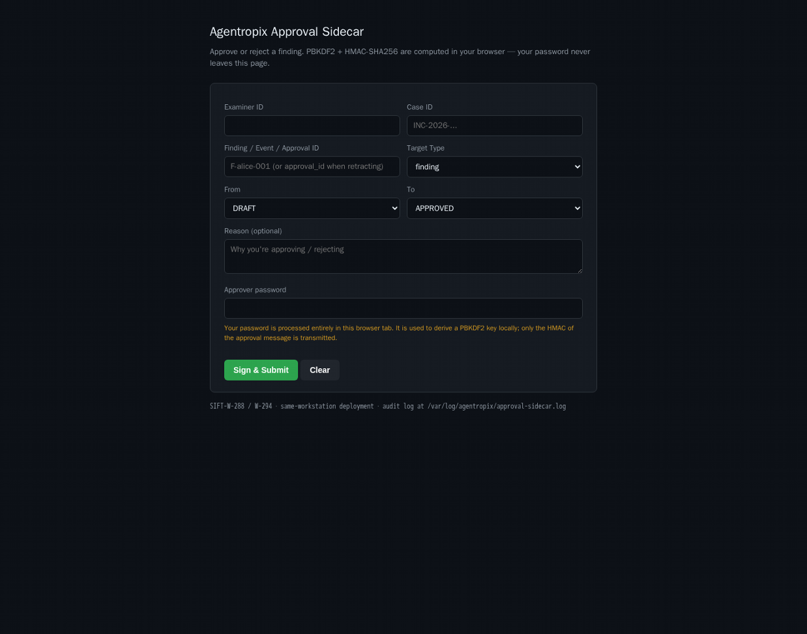
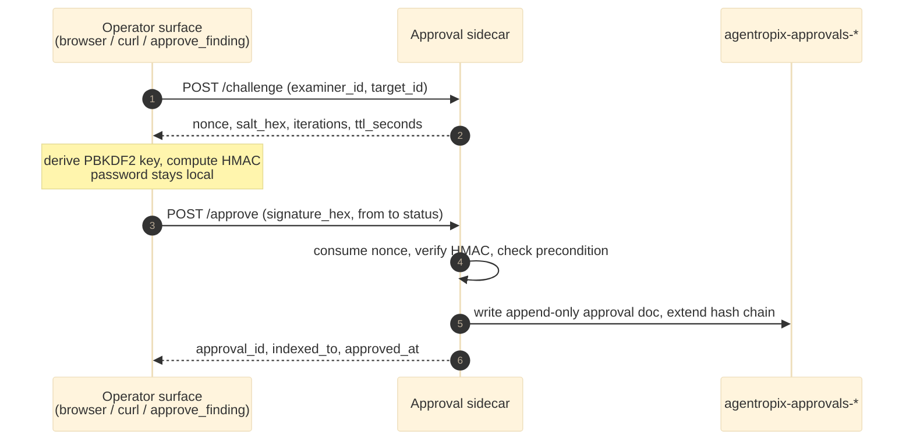

# The Approval Portal — Operator Walkthrough

> **Section 05 · Safety & Forensics** — the human side of the approval gate.
> Related: [Human-in-the-Loop](human-in-the-loop.md) (how the gate works) ·
> [Approval-Gate use case](../06-use-cases/uc-approval-gate.md) ·
> [Audit & Courtroom Seal](audit-courtroom.md)

> **This is the operator's primary touchpoint with the whole platform.** Every
> finding the engine produces is held in `DRAFT` until a human signs off in this
> browser form. The LLM **cannot** self-approve. Read this page before you
> approve anything in a real case.

## How to read this page

This is an **operational / how-to** page, so each approval action is shown **two
ways at once** — pick the lane that fits you and follow it consistently:

> **🖥️ Expert (command):** the exact CLI / HMAC `POST /challenge` → `POST /approve`
> calls (or `curl`) you type in a terminal, with the raw JSON you get back.
> **💬 End-user (prompt):** the plain-language prompt you type into a Claude
> session that has the Agentropix MCP connected. A simple, focused question is
> enough — the session recognises it as an Agentropix capability and routes it to
> the right **real MCP tool** automatically. You never see the raw JSON unless you
> ask for it.

Both lanes hit the **same deterministic approval path** and produce the **same
append-only ledger row** — only the surface differs. The browser form described
below is a third surface (a non-expert GUI) that performs the very same
`/challenge` → `/approve` HMAC handshake **entirely client-side**.

> **The four approval surfaces, one handshake.** The browser form, the
> `curl`/HMAC pair, the `approve_finding` MCP tool, and the `retract_approval` MCP
> tool all converge on the sidecar's `POST /challenge` → `POST /approve`
> two-step. Whatever surface you use, the password is turned into an HMAC and the
> sidecar verifies the signature — **the password itself never reaches the index
> or the ledger.**

> **Example outputs are real-shaped.** The JSON blocks labelled *Output X* below
> use the sidecar's actual response fields (`nonce`, `salt_hex`, `iterations`,
> `approval_id`, `indexed_to`, `approved_at` — defined in the oracle's
> `src/agentropix_sift/approval_sidecar/models.py`).
> Tokens, nonces, salts, signatures and timestamps are shown as **placeholders**
> (`<NONCE>`, `<SALT_HEX>`, `<SIGNATURE_HEX>`, `<APPROVAL_ID>`) — your run yields
> real values of the same shape. Never paste a real secret into a tracked file.

> **Maps to real MCP tools.** The two End-user lanes on this page route to exactly
> two tools from the catalogue ([`.crew/tool-list.md`](../../.crew/tool-list.md),
> *Approval workflow — HMAC sidecar*): **`approve_finding`** (the combined
> challenge+submit happy path, also used for `REJECTED`) and **`retract_approval`**
> (the append-only void). Listing/verifying approvals routes to **`idx_search`** /
> **`idx_case_summary`**, which read the `agentropix-approvals-*` index.

The approval sidecar (`src/agentropix_sift/approval_sidecar/`, SIFT-W-288 / W-294)
serves a self-contained browser form. On this workstation it is published on the
**tailnet only**, behind a valid TLS certificate, at:

**🔗 `https://siftworkstation.taile7c9ca.ts.net:8443/`**

`tailscale serve` fronts that HTTPS address and proxies it to the sidecar's local
bind `http://127.0.0.1:8800` (tailnet-only, device-authenticated — it is **not**
reachable from the LAN or the Internet). On the workstation itself you can also
open `http://127.0.0.1:8800/` directly.



*The Approval Portal as served at `https://siftworkstation.taile7c9ca.ts.net:8443/`.
PBKDF2 + HMAC-SHA256 are computed in your browser tab — the approver password
never leaves the page.*

## Prerequisites

- The approval sidecar process is running (Starlette/uvicorn), bound by default
  to `127.0.0.1:8800` (`AGENTROPIX_APPROVAL_SIDECAR_PORT` / config `port`).
- You can reach the portal (on the tailnet **and** device-approved in Tailscale).
- The approver credential env vars are set **and stable across restarts** — a
  changed password or salt invalidates HMAC verification
  ([`.crew/env-vars.md`](../../.crew/env-vars.md)):

  | Env var | Role |
  |---------|------|
  | `AGENTROPIX_APPROVER_USER` | Examiner identity; must match the form's **Examiner ID** |
  | `AGENTROPIX_APPROVER_PASSWORD` | PBKDF2 source secret; never crosses the wire |
  | `AGENTROPIX_APPROVER_SALT_HEX` | Per-examiner PBKDF2 salt; must stay stable |
  | `AGENTROPIX_APPROVER_INDEXER_USER` / `_PASSWORD` | Separate OpenSearch role that writes `agentropix-approvals-*` (dual-credential split) |

- The finding you intend to approve has been staged to `DRAFT` (via the
  `record_finding` / `approve_finding` MCP path).

## How to complete each field

| Field (UI label) | Form id | What to enter | Notes & failure mode |
|---|---|---|---|
| **Examiner ID** | `examiner_id` | Your approver username | Must equal `AGENTROPIX_APPROVER_USER`. Any other value → **`403 unknown_examiner`** (`app.py:143-152`). |
| **Case ID** | `case_id` | The case the finding belongs to, e.g. `INC-2026-0042` | Folded into the signed message; must match the finding's case or the precondition fails. |
| **Finding / Event / Approval ID** | `target_id` | The `DRAFT` item's ID, e.g. `F-alice-001` — **or** a prior `approval_id` when retracting | Read it from the finding/timeline entry in the report. Wrong id → **`409 target_not_found`**. |
| **Target Type** | `target_type` | `finding`, `timeline`, or `approval (retract / void)` | Pick what you are acting on. Choose `approval` only to **void** a prior approval (append-only, never a delete). |
| **From** | `from_status` | The target's **current** status — normally `DRAFT` (or `APPROVED` when revoking) | Must match the live status or → **`409 precondition_failed`** (BUG-001 gate, `app.py:233-260`). |
| **To** | `to_status` | Your decision: `APPROVED`, `REJECTED`, or `REVOKED` | `DRAFT→APPROVED` promotes; `DRAFT→REJECTED` declines; `APPROVED→REVOKED` voids. |
| **Reason (optional)** | *(textarea)* | Free-text rationale | Recorded with the decision; recommended for auditability. |
| **Approver password** | `password` | The approver password | Used **only** to derive the PBKDF2 key locally; never transmitted. Wrong password → **`401 bad_signature`** (`app.py:202-223`). |

## Submitting a decision — step by step

1. **Open** the portal URL above (you must be on the tailnet and device-approved).
2. **Identify yourself & the case** — fill **Examiner ID** and **Case ID**.
3. **Point at the target** — paste the **Finding / Event / Approval ID** and pick the matching **Target Type**.
4. **Set the transition** — choose **From** (the item's current status) and **To** (your decision). Optionally add a **Reason**.
5. **Enter the Approver password.**
6. Click **Sign & Submit.** The page then, entirely client-side:
   - calls `POST /challenge` to get a single-use **nonce** (TTL ~60 s) plus the PBKDF2 `salt_hex` / `iterations`;
   - derives the PBKDF2 key from your password **in the browser** and computes the **HMAC** of the signed move;
   - calls `POST /approve` with the signature — **only the HMAC is sent, never the password.**
7. **Clear** resets the form without submitting.

## The approval actions, both ways (Execution → Output)

The browser form is the non-expert surface. Below, each underlying sidecar
**action** — **challenge → submit (approve)**, **list/verify**, and the
**approve** one-shot via the MCP tool — is shown side by side as an
**Execution → Output** pair: the 🖥️ Expert command (raw `curl`/HMAC against the
sidecar) and the 💬 End-user prompt (mapped to a real MCP tool). The expert
two-step (`/challenge` then `/approve`) is exactly what the browser does in
JavaScript; the MCP tool collapses both into one call.

### Action 1 — Challenge (get a single-use nonce)

`POST /challenge` issues a nonce bound to `(examiner_id, target_id)`, with a
TTL of **60 s** (`DEFAULT_NONCE_TTL`), and echoes the PBKDF2 `salt_hex` and
**600 000** `iterations` (`DEFAULT_PBKDF2_ITERATIONS`) so the signer derives the
key with identical parameters.

> **🖥️ Expert (command) — Execution A:**
> ```bash
> curl -fsS http://127.0.0.1:8800/challenge \
>   -H 'Content-Type: application/json' \
>   -d '{"examiner_id":"<EXAMINER>","target_id":"F-alice-001","target_type":"finding"}'
> ```
> **💬 End-user (prompt):** *"Start an approval for finding F-alice-001 in case
> INC-2026-0042."* — the assistant calls **`approve_finding`**, which performs
> this `/challenge` step for you as part of one tool call (you do not issue a bare
> challenge by hand).

**Output A** (placeholders for the issued nonce/salt):

```json
{
  "nonce": "<NONCE>",
  "salt_hex": "<SALT_HEX>",
  "iterations": 600000,
  "ttl_seconds": 60.0
}
```

> ⚠️ The nonce is **single-use and target-bound**: it only validates a `/approve`
> for the same `examiner_id` + `target_id`, and only within `ttl_seconds`. A
> challenge for an examiner other than the configured `AGENTROPIX_APPROVER_USER`
> is refused with **`403 unknown_examiner`** (`app.py` `_challenge_handler`).

### Action 2 — Submit (sign the move and record the decision)

`POST /approve` carries the **HMAC-SHA256** of the canonical signed message
(`build_signed_message(nonce, target_id, target_type, from_status, to_status,
case_id)`) keyed by `PBKDF2(password, salt, iterations)`. **Only the
`signature_hex` is sent — never the password.**

> **🖥️ Expert (command) — Execution B:** (compute the key + HMAC locally, then post)
> ```bash
> # SALT_HEX / ITERATIONS / NONCE come from Output A; SIGNATURE_HEX is the
> # 64-char lowercase HMAC of the canonical message (browser/MCP compute this).
> curl -fsS http://127.0.0.1:8800/approve \
>   -H 'Content-Type: application/json' \
>   -d '{"case_id":"INC-2026-0042","target_id":"F-alice-001","target_type":"finding",
>        "from_status":"DRAFT","to_status":"APPROVED","examiner_id":"<EXAMINER>",
>        "nonce":"<NONCE>","signature_hex":"<SIGNATURE_HEX>","reason":"reviewed"}'
> ```
> **💬 End-user (prompt):** *"Approve finding F-alice-001 in case INC-2026-0042 —
> I reviewed it."* → maps to **`approve_finding`** (`finding_id`, `approver_id`,
> `password`, `case_id`, `to_status="APPROVED"`). The tool runs challenge **and**
> submit in one shot and reports back the `approval_id`.

**Output B** (success — placeholders for the deterministic id/timestamp):

```json
{
  "approval_id": "<APPROVAL_ID>",
  "indexed_to": "agentropix-approvals-YYYY.MM.DD",
  "prev_approval_hash": "",
  "approved_at": "2026-06-05T00:00:00Z"
}
```

The same surface declines a finding — set **`to_status":"REJECTED"`** (💬: *"Reject
finding F-alice-001, insufficient evidence."*). For the failure responses
(`401 bad_signature`, `401 nonce_expired`, `409 precondition_failed`, …) see
[What you'll see back](#what-youll-see-back).

### Action 3 — List / verify recorded approvals

There is no bare "list" endpoint on the sidecar; approvals are **read back from
the `agentropix-approvals-*` index** that `/approve` writes to. The expert reads
the index directly; the non-expert asks the assistant, which routes to the real
indexer tools.

> **🖥️ Expert (command) — Execution C:**
> ```bash
> curl -fsS "$AGENTROPIX_OS_URL/agentropix-approvals-*/_search" \
>   -H 'Content-Type: application/json' \
>   -d '{"query":{"term":{"case_id":"INC-2026-0042"}},"sort":[{"@timestamp":"desc"}]}'
> ```
> **💬 End-user (prompt):** *"List the approvals recorded for case INC-2026-0042."*
> → maps to **`idx_search`** (and **`idx_case_summary`** for the rollup count over
> `agentropix-approvals-*`).

**Output C** (one ledger row per decision — placeholders):

```json
{
  "approval_id": "<APPROVAL_ID>",
  "target_id": "F-alice-001",
  "target_type": "finding",
  "from_status": "DRAFT",
  "to_status": "APPROVED",
  "approver": "<EXAMINER>",
  "reason": "reviewed",
  "prev_approval_hash": "",
  "case_id": "INC-2026-0042"
}
```

### Action 4 — Approve (the one-shot MCP happy path)

For most operators the **single MCP call** is the right surface: it performs
Action 1 (challenge) and Action 2 (submit) internally, derives PBKDF2 + HMAC on
the MCP server, and forwards only the signature.

> **🖥️ Expert (command) — Execution D:** (MCP tool call; the server does
> challenge+sign+submit)
> ```json
> {"tool":"approve_finding","arguments":{
>   "finding_id":"F-alice-001","approver_id":"<EXAMINER>","password":"<APPROVER_PASSWORD>",
>   "case_id":"INC-2026-0042","from_status":"DRAFT","to_status":"APPROVED",
>   "target_type":"finding","reason":"reviewed"}}
> ```
> **💬 End-user (prompt):** *"Approve the alice finding for this case, I've reviewed
> it."* → **`approve_finding`** (the active case supplies `case_id`).

**Output D** (the MCP `ApproveFindingResult` envelope — placeholders):

```json
{
  "case_id": "INC-2026-0042",
  "finding_id": "F-alice-001",
  "approval_id": "<APPROVAL_ID>",
  "to_status": "APPROVED",
  "indexed_to": "agentropix-approvals-YYYY.MM.DD",
  "approved_at": "2026-06-05T00:00:00Z",
  "error": "",
  "error_code": ""
}
```

> ⚠️ **Password exposure trade-off.** The `approve_finding` MCP tool takes the
> approver `password` as an argument — convenient for headless/CLI runs, but the
> password sits in the LLM request context for the call duration. Operators who
> want the password to *never* touch the model context use the **browser form**
> instead, where Web Crypto derives the key in the tab. Both produce an identical
> signed ledger row.

### The challenge → submit handshake at a glance



## Retracting / voiding a prior approval

Approvals are **append-only** — there is no delete (BUG-001). To void one:

1. **Target Type** → `approval (retract / void)`.
2. **Finding / Event / Approval ID** → the **`approval_id`** of the approval you are voiding (not the finding id).
3. **From** = `APPROVED`, **To** = `REVOKED`.
4. **Sign & Submit** as above. This appends a compensating `REVOKED` entry that
   references the prior `approval_id`; the original row is never mutated
   (`models.py:16-20`).

Both ways to void — the same `target_type=approval`, `APPROVED → REVOKED` move
signed through the W-288 HMAC flow:

> **🖥️ Expert (command) — Execution E:** (MCP tool call; server does challenge+sign+submit)
> ```json
> {"tool":"retract_approval","arguments":{
>   "approval_id":"<APPROVAL_ID>","approver_id":"<EXAMINER>","password":"<APPROVER_PASSWORD>",
>   "case_id":"INC-2026-0042","reason":"signed against a finding that never existed"}}
> ```
> **💬 End-user (prompt):** *"Retract approval `<APPROVAL_ID>` for this case — it was
> signed against a finding that never existed."* → maps to **`retract_approval`**
> (a non-empty `reason` is **required** for chain-of-custody).

**Output E** (a new compensating ledger row referencing the voided approval —
placeholders):

```json
{
  "approval_id": "<NEW_APPROVAL_ID>",
  "target_id": "<APPROVAL_ID>",
  "target_type": "approval",
  "from_status": "APPROVED",
  "to_status": "REVOKED",
  "indexed_to": "agentropix-approvals-YYYY.MM.DD",
  "approved_at": "2026-06-05T00:00:00Z"
}
```

## What you'll see back

| Outcome | Meaning / next step |
|---|---|
| ✅ **Approval recorded** | A deterministic approval doc is written to the daily `agentropix-approvals-YYYY.MM.DD` index and the append-only hash chain is extended; the finding moves out of `DRAFT`. |
| `403 unknown_examiner` | The **Examiner ID** is not the configured approver — fix it. |
| `401 nonce_expired` / `nonce_unknown` | You waited too long (>TTL) between page-load and submit — just click **Sign & Submit** again to get a fresh nonce. |
| `401 bad_signature` | Wrong **Approver password** (or `AGENTROPIX_APPROVER_PASSWORD` / `_SALT_HEX` changed since the finding was staged). |
| `409 target_not_found` | The **Case ID** / **Target ID** don't match a recorded item. |
| `409 precondition_failed` | **From** doesn't match the target's current status (e.g. it's already `APPROVED`). |
| "This site can't be reached" | Not on the tailnet / device not approved / sidecar down — connect to Tailscale, approve the device, confirm the process is up. |

## Verifying the decision landed

- **In the portal:** a success response (approval recorded).
- **In the index:** a deterministic approval doc in `agentropix-approvals-YYYY.MM.DD`, extending the append-only hash chain (`app.py:262-310`, `hash_chain.py:48-101`).
- **In the audit log:** the decision appended to **`/var/log/agentropix/approval-sidecar.log`**.
- **Liveness:** `curl -fsS http://127.0.0.1:8800/healthz` → `200` (`app.py:99-100`).

> **🖥️ Expert (command) — Execution F:**
> ```bash
> curl -fsS http://127.0.0.1:8800/healthz
> ```
> **💬 End-user (prompt):** *"Show me the approvals recorded for this case so I can
> confirm my decision landed."* → maps to **`idx_search`** / **`idx_case_summary`**
> over `agentropix-approvals-*` (Action 3 above).

**Output F** (sidecar liveness):

```json
{"status": "ok", "service": "approval-sidecar"}
```

## Operational & safety notes

- Your password is processed **entirely in this browser tab** (Web Crypto PBKDF2);
  only the HMAC of the approval message is transmitted.
- Approval is **single-examiner** in Phase 1 — only `AGENTROPIX_APPROVER_USER` is accepted.
- There is **no destructive action** here: every decision is an append-only ledger
  entry. A mistaken approval is corrected with a `REVOKED` retraction, not a delete.
- The deeper guarantees behind each step — nonce replay defence, signature
  verification, the precondition gate, and the tamper-evident hash chain — are in
  [Human-in-the-Loop](human-in-the-loop.md).
