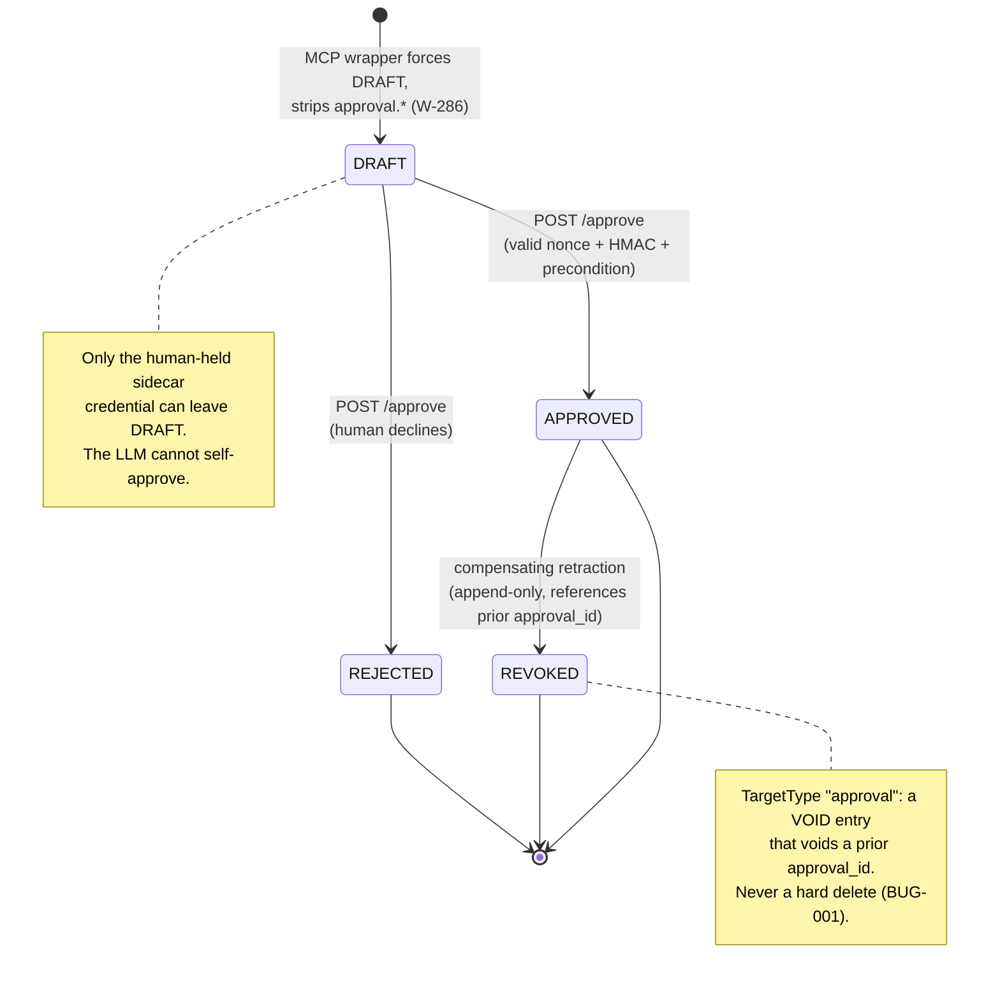

# Human-in-the-Loop: The Approval Sidecar Gate

> **Section 05 · Safety & Forensics**.
> Related: [Anti-Hallucination](anti-hallucination.md) ·
> [Provenance & Grounding](provenance-grounding.md) ·
> [Audit & Courtroom Seal](audit-courtroom.md)

The anti-hallucination controls in [chapter 1](anti-hallucination.md) keep an
LLM from *authoring* findings. The approval sidecar enforces the complementary
guarantee on the *promotion* path: **the LLM cannot approve its own work.**
Only a human holding the approver credential can move a finding from `DRAFT` to
`APPROVED`. This chapter explains the state machine, who can approve, what it
blocks, and the cryptography that makes self-approval impossible.

The gate is a separate process — `src/agentropix_sift/approval_sidecar/` — a
small Starlette app (SIFT-W-288) bound by default to port 8800
(`AGENTROPIX_APPROVAL_SIDECAR_PORT` / config `port`) holding the approver
credential (`approval_sidecar/__init__.py:1-8`).

---

## Using the Approval Portal (browser walkthrough)

The examiner does the sign-off in a self-contained browser form served (tailnet-only,
valid TLS) at **`https://siftworkstation.taile7c9ca.ts.net:8443/`**.

**➡️ The full operator walkthrough — screenshot, every field, how to submit, how to
retract/void, and the error/troubleshooting matrix — is its own page:
[The Approval Portal — Operator Walkthrough](approval-portal.md).**

The rest of *this* chapter explains the guarantees **behind** that form: the core
invariant, the state machine, the HMAC challenge-response, and the tamper-evident
hash chain.

## The core invariant

The sidecar's reason for existing is one sentence
(`approval_sidecar/__init__.py:22-28`):

> "the LLM cannot self-approve — only a human with the approver password can
> move a finding to APPROVED."

This is enforced by a **two-process split**. The agentropix MCP wrapper
(W-286) forces every finding it touches to `DRAFT` and strips any caller-
supplied `approval.*` fields; only the sidecar — a different process that holds
the approver credential — can promote it (`approval_sidecar/__init__.py:4-8`).
An LLM driving the MCP tools has no path to the approver password, so it cannot
issue the HMAC that the sidecar demands.

## The status state machine

Approval status is a strict `Literal` (`approval_sidecar/models.py:15`):

```python
ApprovalStatus = Literal["DRAFT", "APPROVED", "REJECTED", "REVOKED"]
```



Every finding starts in `DRAFT` because the MCP wrapper stamps it there
(`approval_sidecar/__init__.py:4-6`). A human transition is a signed
`from_status → to_status` move submitted to `POST /approve`
(`models.py:53-68`). Promotion to `APPROVED` requires a valid nonce, a verifying
HMAC, and — when a reader is wired — that the target actually exists and is
*currently* in the asserted `from_status` (the BUG-001 precondition,
`app.py:225-260`). `REVOKED` is reached only by a **compensating** entry: an
append-only retraction that references a prior `approval_id`, never a hard
delete (`models.py:16-20`). The `approval` `TargetType` is precisely that
retraction target (`models.py:20`).

## Who can approve

Approval is single-examiner in Phase 1. Both `/challenge` and `/approve` refuse
any `examiner_id` other than the configured approver, returning `403
unknown_examiner` (`app.py:143-152, 182-188`). The examiner identity and the
PBKDF2 secret come from environment, distinct from the indexer-writer
credentials (Crew #3 dual-credential split, `approval_sidecar/__init__.py:39-43`):

| Env var | Role |
|---------|------|
| `AGENTROPIX_APPROVER_USER` | Examiner identity; must match the browser form's `examiner_id` |
| `AGENTROPIX_APPROVER_PASSWORD` | PBKDF2 source secret; never crosses the wire; must stay stable across restarts |
| `AGENTROPIX_APPROVER_SALT_HEX` | Per-examiner PBKDF2 salt; must stay stable |
| `AGENTROPIX_APPROVER_INDEXER_USER` / `_PASSWORD` | Separate approvals-write OpenSearch role |

## What it blocks — the HMAC challenge-response

A human approves by typing the approver password into the browser; the browser
derives the PBKDF2 key **client-side** and sends only an HMAC. The password
never leaves the tab (`approval_sidecar/__init__.py:24-31`). The flow is a
two-step challenge-response:

1. **`POST /challenge`** issues a server-side, single-use nonce bound to
   `(examiner_id, target_id)`, echoing the PBKDF2 `salt_hex` and `iterations`
   so the browser derives the key with exactly the parameters the server will
   use to verify (`app.py:129-163`; `models.py:23-51`). The nonce expires after
   a TTL (default 60 s) — "defeating replay attacks across the
   challenge-response" (`approval_sidecar/__init__.py:30-31`).
2. **`POST /approve`** carries the signed move. The server (`app.py:166-310`):
   - **consumes the nonce** — single-use, target-bound, TTL-bound; expired or
     unknown nonces return `401` (`app.py:190-200`);
   - **re-derives the HMAC key** from the *server-held* password + salt and
     verifies `signature_hex`; a mismatch returns `401 bad_signature`
     (`app.py:202-223`);
   - **checks the BUG-001 precondition** (when a reader is wired): the target
     must exist (`409 target_not_found`) and be in the asserted `from_status`
     (`409 precondition_failed`), so the ledger cannot attest transitions for
     records that were never recorded or are stale (`app.py:225-260`);
   - **writes a deterministic approval doc** to the daily
     `agentropix-approvals-YYYY.MM.DD` index (`app.py:262-310`).

The signed message binds nonce, target, target-type, `from_status`,
`to_status`, and `case_id` (`build_signed_message`, called at `app.py:214-221`),
and `signature_hex` is constrained to exactly 64 lowercase-hex chars so
`compare_digest` never sees a case mismatch (`models.py:68-78`).

### What an attacker (or a hallucinating agent) cannot do

| Attack | Blocked by |
|--------|------------|
| LLM self-approves via MCP | MCP wrapper forces `DRAFT`, strips `approval.*`; LLM has no approver password (`__init__.py:4-8`) |
| Steal the password off the wire | Password never transmitted — only the HMAC is (`__init__.py:24-31`) |
| Replay a captured `/approve` | Nonce is single-use + TTL-bound + target-bound (`app.py:190-200`) |
| Forge a signature | Server re-derives the key from its own secret and `compare_digest`-verifies (`app.py:202-223`) |
| Approve a finding that doesn't exist / is stale | BUG-001 precondition gate (`app.py:233-260`) |
| Double-submit the same approval | `approval_id` includes the nonce → identical replays get distinct IDs but the OpenSearch `_id` dedupes (`hash_chain.py:48-71`) |
| Silently delete/mutate a ledger row | Append-only hash chain; `prev_approval_hash` mismatch = tamper (`hash_chain.py:73-101`) |

## The append-only approval hash chain

Each approval document carries a deterministic `approval_id` — a SHA-256 over
its immutable fields *including the nonce* — which doubles as the OpenSearch
`_id` so the same approval cannot be indexed twice
(`hash_chain.py:1-11, 48-71`):

```python
return _sha256_hex(
    [case_id, target_id, target_type, from_status, to_status, approver, nonce]
)
```

Including the nonce means "even an identical approval … submitted twice
produces a different ID — so an LLM cannot smuggle a second approval through by
repeating the first's signed message" (`hash_chain.py:57-64`). Each row also
stores `prev_approval_hash`, the hash of the previous approval touching the same
target (`compute_prev_approval_hash`, `hash_chain.py:73-101`):

> "Walking backwards: the reconciliation routine computes this same hash from
> the row before the current one. If it doesn't match the `prev_approval_hash`
> stored on the current row, the chain is broken — either a row was deleted,
> mutated, or inserted out-of-order. Any of these is treated as tampering."

Because the chain hash folds in the previous row's HMAC signature, a forger with
only read access to the approvals index still cannot fabricate a new approval
(`hash_chain.py:84-94`). This is the human-in-the-loop counterpart to the
report/audit cross-binding in [Audit & Courtroom Seal](audit-courtroom.md).

## API surface (Phase 1)

| Route | Method | Auth | Purpose |
|-------|--------|------|---------|
| `/healthz` | GET | none | liveness probe (`app.py:99-100`) |
| `/` | GET | none | serves the browser approval UI; Web Crypto does PBKDF2+HMAC locally (`app.py:106-126`) |
| `/challenge` | POST | examiner gate | issue a nonce for `(examiner, target)` (`app.py:129-163`) |
| `/approve` | POST | nonce + HMAC + precondition | submit the signed `DRAFT → APPROVED/REJECTED` move (`app.py:166-310`) |

The writer and the precondition reader are dependency-injected
(`ApprovalWriter` / `ApprovalReader`, `app.py:53-61`), so tests drop in stubs;
production wires both through `IndexerClient` (`app.py:359-385`). The request/
response models are `dynamic: strict`-shaped to the
`agentropix-approvals-*` index template — "every additional field would be
rejected at index time — these models are the only safe surface"
(`models.py:1-7`).

## See also

- [Anti-Hallucination](anti-hallucination.md) — why findings arrive at the gate
  already authored by deterministic tools and stamped `DRAFT`.
- [Audit & Courtroom Seal](audit-courtroom.md) — the HMAC/cross-binding pattern
  the approval hash chain mirrors.
- [Provenance & Grounding](provenance-grounding.md) — provenance tiers stamped
  on the same DRAFT-gate path (`wazuh_tools._apply_draft_gate`).
