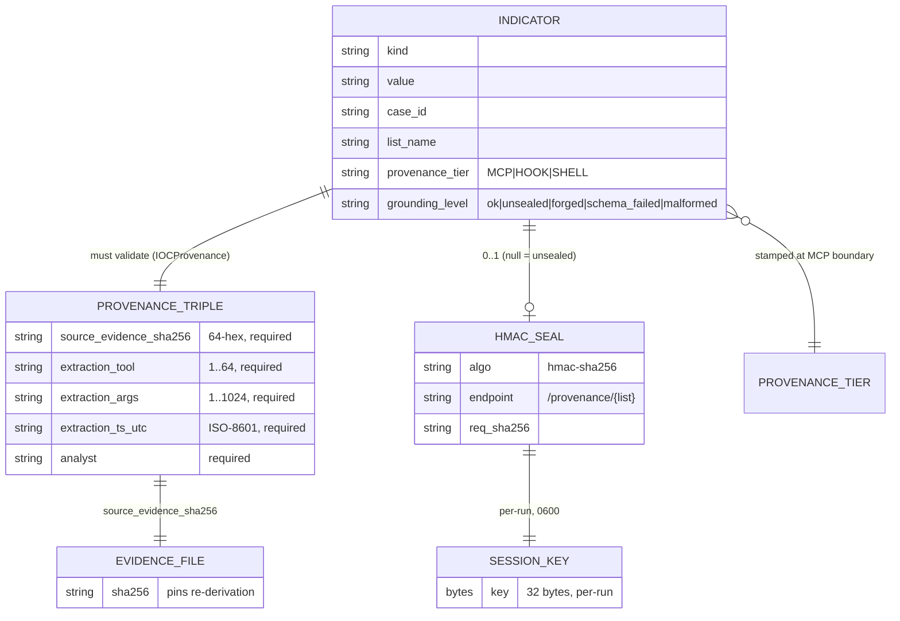

# Provenance & Grounding

> **Section 05 · Safety & Forensics**.
> Related: [Anti-Hallucination](anti-hallucination.md) ·
> [Audit & Courtroom Seal](audit-courtroom.md) ·
> [Human-in-the-Loop](human-in-the-loop.md)

[Anti-Hallucination](anti-hallucination.md) establishes that every finding is
authored by a deterministic tool. This chapter answers the next two questions a
courtroom asks:

1. **Provenance tier** — *how strong is the channel an indicator was witnessed
   through?* (Did the MCP boundary itself produce it, or a looser hook/shell
   path?)
2. **Grounding level** — *how well can the indicator be re-derived from primary
   evidence?* (Is there a court-defensible provenance triple, an HMAC seal, or
   nothing?)

Both are derived from the `provenance/` validation code, the Wazuh provenance
models, and the DRAFT-gate that stamps tiers at the MCP boundary.

## Provenance tiers — where an indicator was witnessed

When a finding/IOC is pushed toward the SIEM, the wrapper stamps a
**provenance tier** describing the trust of the channel that witnessed it. The
ranked vocabulary (borrowed from the Valhuntir architecture model) lives in
`mcp_server/wrappers/wazuh_tools.py:32-37`:

```python
_PROVENANCE_TIERS_RANKED: tuple[str, ...] = ("MCP", "HOOK", "SHELL", "NONE")
```

| Tier | Rank | Meaning | Stamped how |
|------|------|---------|-------------|
| `MCP` | strongest | The MCP wrapper **is** the boundary — the indicator passed through the deterministic, Thymus-guarded tool layer | Default; also where any upgrade or garbage value collapses to |
| `HOOK` | downgrade | Witnessed via a hook integration rather than the MCP tool directly | Accepted only as an explicit `_provenance_hint` downgrade |
| `SHELL` | downgrade | Witnessed via a looser shell path | Accepted only as an explicit `_provenance_hint` downgrade |
| `NONE` | rejected | No provenance channel | Silently upgraded to `MCP` here, because the wrapper itself is the MCP boundary |

The stamping rule is **downgrade-only**, enforced in `_apply_draft_gate`
(`wazuh_tools.py:40-117`). The caller may *lower* the tier via a top-level
`_provenance_hint` key, but upgrades and garbage values fall back to `MCP`, and
`NONE` collapses to `MCP` because — at this code path — the wrapper genuinely
*is* the MCP boundary (`wazuh_tools.py:109-117`):

```python
hint = f.pop("_provenance_hint", "MCP")
if not isinstance(hint, str) or hint not in valid_tiers:
    hint = "MCP"
elif hint == "NONE":
    hint = "MCP"
f["provenance"] = hint
```

This is intentional: a malicious or buggy caller can never *claim* a stronger
provenance than the channel actually provides, but an integration that knows it
came in through a weaker path can honestly downgrade itself. The strip events
(removed `approval.*`, downgraded hints) are logged at WARNING through the
wrapper logger so the attempt is audit-visible regardless of outcome
(`wazuh_tools.py`, gate ordering note in `docs/SIFT-WEAKNESSES.md:141`).

> **Tier vs. priority.** Provenance tier (`MCP > HOOK > SHELL > NONE`) is about
> *how an indicator was witnessed*. It is distinct from the **IOC priority
> tier** (`tier1 / tier2 / tier3_excluded`) computed by
> `wazuh/prioritise.py:42-48`, which scores *collision risk / actionability*
> (e.g. a SHA-256 is `tier1` "zero collision risk", an MD5 is `tier2`,
> self-block CIDRs are `tier3_excluded`). The two axes are orthogonal: a
> high-priority `tier1` SHA-256 still carries a provenance tier describing the
> channel it came through.

## Grounding levels — how well a claim is externally supported

Provenance tier says *how* an indicator arrived; **grounding level** says how
firmly it can be re-derived and verified from primary evidence. The grounding
ladder is the row-classification taxonomy implemented by the provenance
validator (`provenance/validate.py:25-43`) and mirrored by the audit-seal
verifier (`audit/verify_seal.py:8-26`). Each indicator row, when validated,
falls into exactly one bucket:

| Grounding level | Validator category | What it proves | Treated as |
|-----------------|--------------------|----------------|------------|
| **Strongest — sealed & verified** | `ok` | Schema-valid provenance triple **and** the HMAC-SHA256 seal recomputes correctly | Court-defensible |
| **Schema-grounded, unsealed** | `unsealed` | Schema-valid provenance triple, but `seal` is `null` (seal-bind crashed at write, or schema-only validation mode) | Legitimate but un-attested |
| **Forged** | `forged` | Schema-valid, but the seal does **not** recompute | **TAMPER** |
| **Schema-failed** | `schema_failed` | Violates the `IOCProvenance` schema or the outer row shape | Forgery-equivalent |
| **Malformed** | `malformed` | The JSON line could not be parsed | Forgery-equivalent |

The validator exits **non-zero iff `forged + schema_failed + malformed > 0`**
(`validate.py:42`, `validate.py:90`). In other words, the bar for a clean run is
that every row is at least *schema-grounded*; any row that fails to ground at
that floor halts the pipeline.

### What "schema-grounded" requires — the provenance triple

A row only reaches the `ok`/`unsealed` levels if its `provenance` sub-object
validates against the `IOCProvenance` Pydantic model
(`wazuh/models.py:188-228`). That model is the **court-defensible provenance
triple** (WZ-019), and all five fields are **required**
(`models.py:203-205`) — a missing field is a `ValidationError` at load time,
not a silent gap discovered later:

| Field | Constraint | Why it matters |
|-------|-----------|----------------|
| `source_evidence_sha256` | 64-char lowercase hex (`^[0-9a-f]{64}$`) | Pins the indicator to the exact evidence file it was extracted from |
| `extraction_tool` | 1–64 chars | Names the deterministic tool (`volatility3`, `fls`, `yara`, …) |
| `extraction_args` | 1–1024 chars | The canonical command line — re-runnable; operators redact secrets first |
| `extraction_ts_utc` | ISO-8601 UTC string | When the extraction ran |
| `analyst` | required | Who/what ran it |

The model is `frozen=True, extra="forbid"` (`models.py:207`), so a row cannot be
mutated post-validation and cannot smuggle extra fields. This triple is "the
minimum needed to re-derive the indicator from primary evidence"
(`models.py:198-201`) — exactly what a grounding claim must support.

### What "sealed & verified" adds — the HMAC envelope

Reaching the strongest grounding level (`ok`) additionally requires the per-row
HMAC seal to recompute. The validator reconstructs the canonical bytes the
orchestrator hashed (`_row_canonical_sans_seal`, stripping the `seal` field
before re-canonicalising, `validate.py:103-110`) and re-verifies the seal
envelope, which binds (`validate.py:35-41`, `validate.py:176-188`):

```text
endpoint   = f"/provenance/{list_name}"
req_sha256 = sha256(canonical_json(row sans `seal`))
resp_sha256 = sha256(b"")
status     = 0
+ operator, case_id, evidence_token_id, run_id
```

Verification is over `wazuh.seal.verify_seal`, which recomputes
`HMAC-SHA256(session_key, canonical_json(envelope))` and compares in constant
time (`wazuh/seal.py:1-32, 187+`). A row whose seal does not recompute is
classified `forged` — the **only** grounding state that signals tampering
(`validate.py:138-192`).

> **Schema-only mode.** When the operator runs the validator *without* the
> session key (`--key` omitted), every sealed row is deliberately reclassified
> to `unsealed` (`validate.py:234-247`) — you can validate a sidecar archive's
> *schema grounding* without holding the per-run key, you just can't assert the
> top `ok` level.

## How tier and grounding compose



The ER diagram shows the two axes meeting on a single indicator. **Provenance
tier** (`PROVENANCE_TIER`) is stamped once at the MCP boundary and is
downgrade-only. **Grounding level** is *derived at validation time* from two
relationships: whether the indicator carries a schema-valid `PROVENANCE_TRIPLE`
(which itself points at the `EVIDENCE_FILE` via `source_evidence_sha256`), and
whether its optional `HMAC_SEAL` recomputes against the per-run `SESSION_KEY`.
An indicator that has both — a valid triple and a verifying seal — sits at the
strongest grounding level (`ok`) with the strongest provenance tier (`MCP`);
that is the combination an examiner can defend in court. An indicator missing
the triple cannot ground at all (`schema_failed`), and one whose seal fails to
recompute is flagged as tampering (`forged`).

## Operator workflow

```bash
# Validate every *.provenance.jsonl under a case's provenance/ dir,
# re-verifying HMAC seals against the per-run session key.
python -m agentropix_sift.provenance.validate \
  --in <case_dir>/provenance/ \
  --key <case_dir>/<run>.session-key \
  --operator victor \
  --emit human
# Exit code: 0 only if forged + schema_failed + malformed == 0.
```

The aggregate report (`ValidateReport`, `validate.py:67-91`) prints per-category
counts (`ok / unsealed / forged / schema_failed / malformed`) plus up to ten
broken-row samples with file, line number, and reason — so an examiner can jump
straight to any row that failed to ground. Run it at preflight, daily review,
and teardown (`validate.py:1-9`; the audit-seal sibling `audit/verify_seal.py`
runs the same discipline over the Wazuh audit JSONL).

## See also

- [Anti-Hallucination](anti-hallucination.md) — why every grounded indicator
  came from a deterministic tool in the first place.
- [Audit & Courtroom Seal](audit-courtroom.md) — the HMAC-SHA256 sealing flow
  that makes the top grounding level (`ok`) possible.
- Numeric/structural facts are pinned in
  [`.crew/facts.md`](../../.crew/facts.md).
