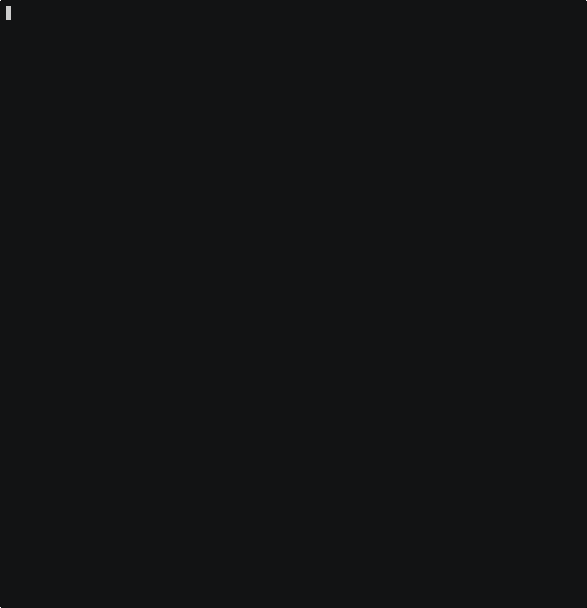
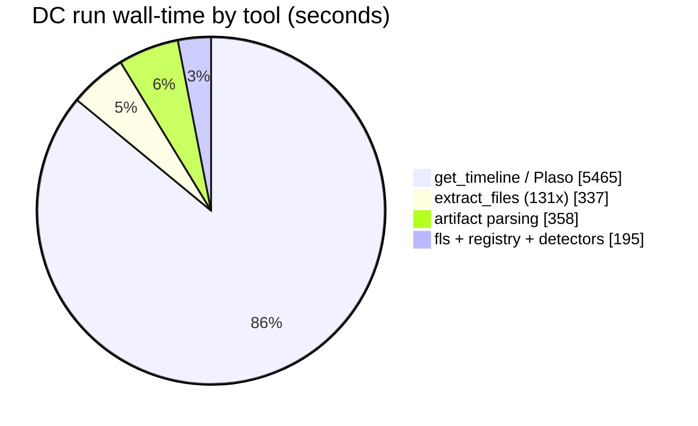
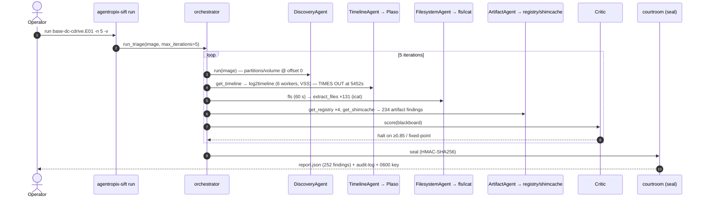

# SRL-2018 — Full DC E01 Autonomous Execution Report

> **What this is.** The **full disk** counterpart to the memory-image
> [execution report](../srl-2018-execution/execution-report-srl-2018.md): a complete autonomous
> `agentropix-sift run` against the **33 GiB Domain-Controller E01** (`base-dc-cdrive.E01`), run live
> to completion, with every command and response captured and a **video regenerated from the sealed
> report**. Demonstrates the runbook's disk-triage path at full scale.
>
> **Agents/model:** Opus 4.8 (`claude-opus-4-8`). **Host:** `agentropix-sift` v0.1.0.dev0.
> **Run wall-time:** ~100 min (1 h 40 m). **Date:** 2026-06-07.

## Watch the execution

- **MP4:** [`dc-execution.mp4`](dc-execution.mp4) · **GIF preview:**



- **Replay source:** `asciinema play dc-execution.cast` · **Transcript:**
  [`dc-execution.transcript.txt`](dc-execution.transcript.txt)

> **This video was *regenerated from the sealed report*** — see [§5](#5-recreating-the-video-from-the-captured-data).
> The generator [`regen-execution-video.py`](regen-execution-video.py) reads `dc-cdrive.report.json`
> and emits the narration; asciinema + ffmpeg turn it into the MP4. So the answer to *"can I rebuild a
> video of all commands+outputs from the captured data?"* is **yes** — this file is the proof.

---

## 1. Run result (real, from `dc-cdrive.report.json`)

| Field | Value |
|---|---|
| image | `/cases/SRL-2018/base-dc-cdrive.E01` (33 GiB media) |
| iterations | **5 / 5** · status `budget_exhausted` |
| **findings** | **252** |
| **critic_score** | **1.0** · `inference_constraint: high` |
| tool calls traced | **317** · total run **6,000,104 ms (~100 min)** |
| evidence SHA-256 | `e2b9cf0cb6759fd079f45fa903d80bde602160ff969c969c6f0cd704965b31b1` |
| **report seal** (HMAC-SHA256) | `be21e123b3326df916496b89c344dd629147411dedd2da0205cef794ef05d270` |
| audit-log seal | `6a192248346ab36c3f882ab8245180852e32d880ec6c850684bffaeafb42d9f4` |

**Findings by producing agent** (the report's `agent` field): `artifact` **234** · `hunt` **8** ·
`t1059_001_iex_loopback_c2` **2** · then `memory` / `timeline` / `filesystem` /
`null_session_baseline` / `yara_hunt` / `injection_detector` /
`t1546_008_accessibility_ifeo_hijack` / `t1071_001_svchost_outbound_http` **1 each** = **252**. The
`artifact` agent dominates because it parsed the extracted registry/execution hives (shimcache,
amcache, prefetch).

**Completion proofs (10) — the disk-path token set** (contrast the memory run's set):
`ARTIFACTS_PARSED`, `CROSS_AGENT_CORRELATION_DONE`, **`FILESYSTEM_WALKED`**,
`INJECTION_DETECTION_COMPLETE`, `NULL_SESSION_BASELINE_COMPLETE`,
`T1059_001_IEX_LOOPBACK_SCAN_COMPLETE`, `T1071_001_SVCHOST_OUTBOUND_HTTP_COMPLETE`,
`T1546_008_ACCESSIBILITY_IFEO_HIJACK_COMPLETE`, **`TIMELINE_GENERATED`**, `YARA_HUNT_COMPLETE`.
The `FILESYSTEM_WALKED` + `ARTIFACTS_PARSED` + `TIMELINE_GENERATED` trio is exactly the disk path the
runbook documents — a pure memory run does not emit them. **Note the nuance:** `TIMELINE_GENERATED`
fired even though Plaso *timed out* (see §2) — the completion promise means "the timeline agent ran
and published ≥1 finding", and here that finding is the timeout notice itself, not a super-timeline.

---

## 2. Where the 100 minutes went (the Plaso bottleneck, quantified)

| Tool / agent | calls | total s | share |
|---|--:|--:|--:|
| `mcp.get_timeline` (Plaso `log2timeline.py`) — **TIMED OUT** | 1 | **5,465** | **91 %** |
| `mcp.extract_files` (+ `icat`) | 131 (+135) | 337 | 5.6 % |
| `agent.artifact` (registry/execution parsing) | 1 | 358 | 6.0 % |
| `mcp.fls` (filesystem walk) | 1 | 60 | 1.0 % |
| `agent.t1059_001_iex_loopback_c2` | 1 | 56 | — |
| `agent.null_session_baseline` | 1 | 56 | — |
| `mcp.get_registry` | 4 | 20 | — |
| `mcp.get_shimcache` | 1 | 1 | — |



**The headline operational finding — Plaso *timed out*, it did not complete.** `log2timeline.py`
(6 workers, `--vss_stores=1`, parsers `winevtx,winreg,prefetch,winjob,mft`) ran on the 33 GiB Windows
Server image for **5,452 s (~91 min)** and then hit the wrapper cap:

```
plaso WRAPPER_TIMEOUT: log2timeline timed out after 5452s for image=.../base-dc-cdrive.E01
      — increase AGENTROPIX_PLASO_TIMEOUT or AGENTROPIX_PLASO_TIMEOUT_CAP
```

So the timeline stage burned 91 % of the run and yielded **0 parsed events** — the lone `timeline`
finding is the timeout notice itself (`timeline.plaso: WRAPPER_TIMEOUT`). The 252 findings come from
the **other** agents (filesystem walk, registry/execution artifacts, the ATT&CK detectors), which is
why the run still scored `critic_score 1.0` despite the timeline miss. **Actionable takeaway:** a full
autonomous DC-disk run needs `AGENTROPIX_PLASO_TIMEOUT_CAP` raised (or VSS disabled / parsers
narrowed) before Plaso can contribute a super-timeline; at the default cap the disk run is both
long *and* timeline-less. This is the concrete reason the runbook flags the DC E01 run as heavy.

---

## 3. Autonomous run — sequence



---

## 4. Tamper-evident seal (executed)

```text
$ python /home/admin2/agentropix-sift/scripts/verify_seal.py dc-cdrive.report.json
OK Report seal verified.
OK Audit-log internal seal verified.
OK Cross-bind verified - report and audit log are paired.            (exit 0)

# tamper test (inject a fabricated finding, re-verify):
X Report seal MISMATCH - report has been altered.
   embedded:   be21e123b3326df916496b89c344dd629147411dedd2da0205cef794ef05d270
   recomputed: 8029e4eff44b4b1e538e23b79eb91a2a19b37b22d1640acc524e6fb7b34473b1
   Reject this report as evidence.                                   (exit 1)
```

The 252-finding report is sealed and tamper-evident — one fabricated finding breaks the HMAC.

---

## 5. Recreating the video from the captured data

Per the standing question — *"if I capture all commands + outputs in a file, can I recreate a video
with all of them?"* — **yes, and this report's MP4 is the demonstration.** It was not screen-recorded
from the 100-minute run (which is a quiet Python process, not a shell stream). Instead:

```mermaid
flowchart LR
    RUN["agentropix-sift run<br/>(100 min)"] --> REP["dc-cdrive.report.json<br/>317 traced tool calls + seal"]
    REP --> GEN["regen-execution-video.py<br/>(reads the report)"]
    GEN --> CAST["asciinema .cast"] --> MP4["dc-execution.mp4"]
    classDef a fill:#b2f2bb,stroke:#2f9e44; classDef b fill:#a5d8ff,stroke:#1971c2; classDef c fill:#ffec99,stroke:#f08c00
    class RUN a
    class REP,GEN b
    class CAST,MP4 c
```

- **Faithful regen** comes from the **`.cast`** (exact timing). **Content regen** comes from the
  **report/transcript** (synthetic pacing, all commands+outputs intact).
- Rebuild any time:
  `asciinema rec --command "python3 regen-execution-video.py dc-cdrive.report.json" out.cast` →
  `agg --font-size 28 out.cast out.gif && ffmpeg -i out.gif … out.mp4`.

This is the key point for archival: keep `dc-cdrive.report.json` (+ the `.cast`) and the video is
reproducible forever; the MP4 itself is a derived convenience artifact.

---

## See also
- [`../srl-2018-execution/execution-report-srl-2018.md`](../srl-2018-execution/execution-report-srl-2018.md) — the memory-image execution (6 min, 12 findings).
- [`../../case-runbook-srl-2018.md`](../../case-runbook-srl-2018.md) — the runbook executed here.
- [`../../command-cheatsheet.md`](../../command-cheatsheet.md) — the generic template.
