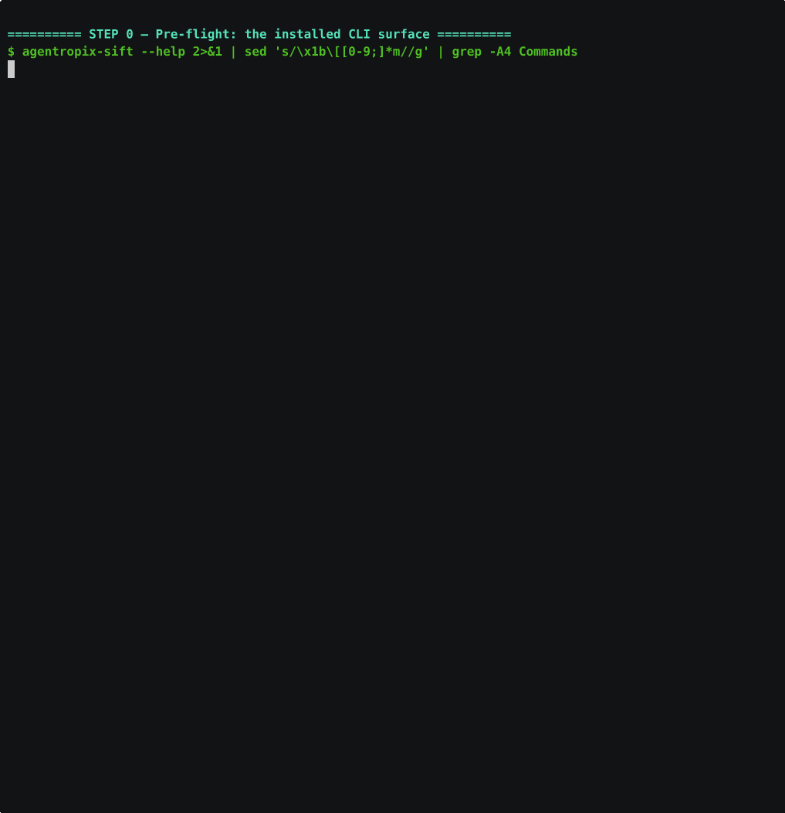
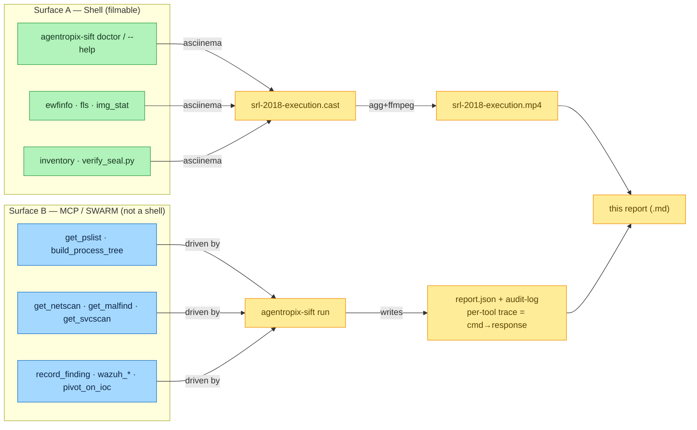
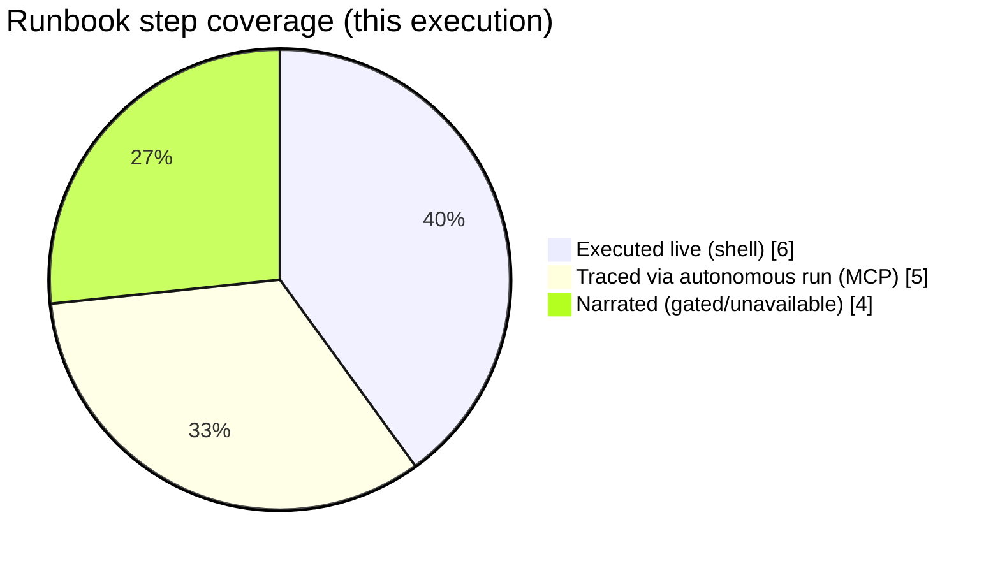
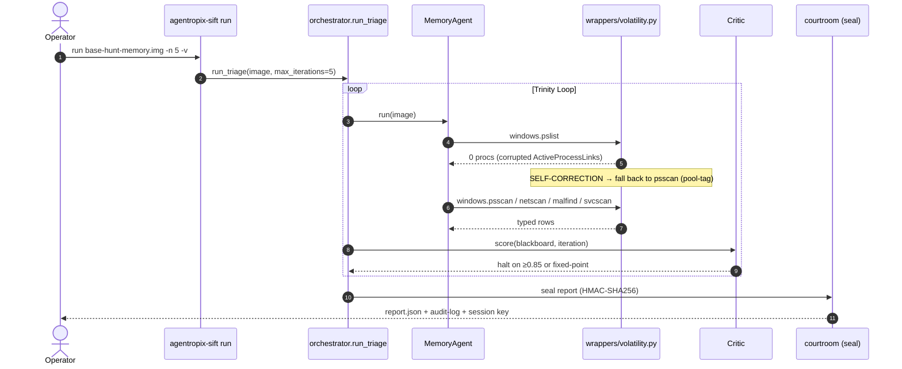
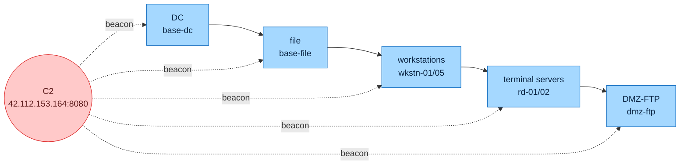

# SRL-2018 Runbook — Live Execution Report

> **What this is.** A technical record of **executing the SRL-2018 runbook against the real evidence
> at `/cases/SRL-2018/`**, capturing every *runnable* command and its response. It pairs an **MP4** of
> the shell execution with the **autonomous Trinity run's traced report** (the MCP/SWARM layer), and
> explains — with diagrams — how the documented capabilities in
> [`docs/06-use-cases/`](../../) are actually exercised.
>
> **Agents/model:** all authoring + review agents default to **Opus 4.8** (`claude-opus-4-8`).
> **Host:** SIFT workstation, `agentropix-sift` v0.1.0.dev0. **Date:** 2026-06-07.

## Watch the execution

- **MP4 (legible, 1700px-wide):** [`srl-2018-execution.mp4`](srl-2018-execution.mp4)
- **Inline GIF preview:**



- **Replayable source:** `asciinema play srl-2018-execution.cast` · **Transcript:**
  [`srl-2018-execution.transcript.txt`](srl-2018-execution.transcript.txt) · **Recorded script:**
  [`capture-execution.sh`](capture-execution.sh)

---

## 1. The two surfaces (why one video isn't enough)

The runbook drives **two execution surfaces**, and "capture all commands + responses" means capturing
both — they're recorded differently:



**Surface A** (shell) is in the MP4. **Surface B** (the MCP tools) can't render in a terminal, so it
is exercised by the **autonomous `agentropix-sift run`**, whose `report.json` carries a per-tool
`trace` (`_source`, `args_hash`, `raw_output`, `exit_code`, `duration_ms`) — the real
"command → response" record. Both feed this document.

---

## 2. Coverage matrix — how each documented capability is exercised

| Runbook section / doc | Capability | How exercised here | Evidence |
|---|---|---|---|
| `case-runbook §0` / cheatsheet §0 | `agentropix-sift doctor`, CLI surface | **executed live** | MP4 Step 0 |
| `case-runbook §0` | `evidence-gate mint` drift | **executed live** (shows "No such command") | MP4 Step 0 |
| `uc-disk-triage` / runbook §1 | `ewfinfo` / `get_image_info` | **executed live** (real MD5/SHA1) | MP4 Step 1 |
| `uc-disk-triage` / runbook §1 | `get_partitions` / offset rule | **executed live** (`fls -o 0` vs `-o 63`) | MP4 Step 2 |
| `case-hypotheses §Case 2` | evidence inventory | **executed live** (7/22/21) | MP4 Step 3 |
| `uc-memory-triage` / runbook §2 | `get_pslist` + `psscan` fallback, `get_netscan`, `get_malfind`, `get_svcscan` | **traced** via autonomous `run` | §4 trace |
| `demo-walkthrough` Beat 3 | self-correction (`pslist→psscan`) | **observed live in the run** | §4 + run log |
| `demo-walkthrough` Beat 5 / uc-approval-gate | HMAC seal + `verify_seal.py` | **executed live** (verifier present) + run seal | MP4 Step 6, §4 |
| `uc-approval-gate` / `uc-wazuh-push` | `[MUT]` writes, approval, Wazuh | **narrated** (gated: no token / sidecar / Wazuh down) | §5 |



---

## 3. Captured shell execution (Surface A) — command → real response

Every line below is verbatim from the recording (`srl-2018-execution.transcript.txt`).

**Step 0 — CLI surface & the documented drift.**
```text
$ agentropix-sift --help | grep -A4 Commands
│ run      Run autonomous DFIR triage on an evidence image.
│ doctor   Check that required SIFT tools are available.
$ agentropix-sift evidence-gate mint        → │ No such command 'evidence-gate'.
```

**Step 1 — `ewfinfo` chain-of-custody (real).**
```text
Case number: 20180905-001 · Examiner: Clint Barton · Notes: Acquired over network via F-Response
MD5:  e18b450127de04afb3211faa456ada27
SHA1: 15f1215e824a3319020cb74addcbe22d90fc6c18
```

**Step 2 — offset reality (the load-bearing rule, proven).**
```text
$ fls -i ewf -o 0  base-dc-cdrive.E01   → Documents and Settings / ProgramData / Users
$ fls -i ewf -o 63 base-dc-cdrive.E01   → Cannot determine file system type
```

**Step 3 — inventory.** `E01=7  img=22  md5=21`; the one `.img` without a `.md5` is
`base-wkstn-01-mem.img`.

**Step 4 — triage target.** `base-hunt-memory.img` (5.0 G), custody md5
`38c59764b927e863262bfbbf1802a0fe`.

**Step 6 — seal verifier present** at `/home/admin2/agentropix-sift/scripts/verify_seal.py`.

---

## 4. Autonomous Trinity run (Surface B) — the MCP/SWARM layer

Command executed live:
```bash
agentropix-sift run /cases/SRL-2018/base-hunt-memory.img -n 5 -o hunt-mem.report.json -v
```



> **Observed live this run** (from `run.console.log`): the documented Beat-3 self-correction fired —
> `pslist returned 0 processes (corrupted ActiveProcessLinks); falling back to psscan (pool tag
> scanning)`. This is the autonomous self-correction the demo narrative promises, captured on real
> SRL-2018 memory.

### 4.1 Run result (real, from `hunt-mem.report.json`)

| Field | Value |
|---|---|
| report version | `0.2.0-dev` |
| iterations | **5 / 5** completed · status `budget_exhausted` |
| findings | **12** |
| **critic_score** | **1.0** (halt path is deterministic; `inference_constraint: high`) |
| tool calls traced | **30** · total run `358,060 ms` (~6.0 min) |
| evidence SHA-256 | `c2d9a3b50cacb0206f6e21b58dd7a2cf5d98f72e20f92c4954bea1294b7c8544` |
| **report seal** (HMAC-SHA256) | `341c03880b106a1c67dcbb8e6b6c706900f4d6b076ec1284adf9f20e76727a65` |
| audit-log seal | `8b95802cb81b156326ec8f66ed6097b14fb1c3e9b0fafeceb66a6a3c97d43041` |

**Completion proofs emitted (9)** — one per agent/detector that published ≥1 finding:
`CROSS_AGENT_CORRELATION_DONE`, `INJECTION_DETECTION_COMPLETE`, `MAIL_TRIAGED`, `MEMORY_TRIAGED`,
`NULL_SESSION_BASELINE_COMPLETE`, `T1059_001_IEX_LOOPBACK_SCAN_COMPLETE`,
**`T1071_001_SVCHOST_OUTBOUND_HTTP_COMPLETE`** (the C2-outbound detector — directly on the SRL-2018
hypothesis), `T1546_008_ACCESSIBILITY_IFEO_HIJACK_COMPLETE`, `YARA_HUNT_COMPLETE`.

### 4.2 Tool-call trace (the MCP "command → response" record)

Top calls by wall-time, straight from `trace.tool_calls` (this is the per-tool evidence a terminal
recording can't show):

| Tool / agent | calls | total ms | exit | note |
|---|--:|--:|:--:|---|
| `agent.memory` | 1 | 260,622 | — | memory specialist (drove pslist/psscan/netscan) |
| `mcp.get_pslist` | 1 | 122,231 | 0 | **pslist→0 procs (corrupted ActiveProcessLinks); psscan fallback then timed out at 120 s** (single trace entry wraps both attempts) |
| `agent.t1071_001_svchost_outbound_http` | 1 | 95,102 | — | C2 outbound-HTTP detector |
| `agent.injection_detector` | 1 | 2,257 | — | malfind/injection |
| `agent.yara_hunt` | 1 | 38 | — | YARA hunt |
| `agent.timeline` / `filesystem` / `artifact` / `discovery` | 5 each | 0 | — | disk-only specialists early-return on a pure memory image |

`agent.discovery` early-returning on a memory image is exactly the documented behaviour
([`uc-memory-triage.md`](../../uc-memory-triage.md) — *DiscoveryAgent is disk-only*). The 12 findings'
`_source` values (`memory.info`, `memory.credentials.unavailable`, `mail.memory_mail_carve`,
`memory.injection.summary`, …) each name the deterministic producer.

### 4.3 Seal verification (executed — Beat 5 proof)

Clean report:
```text
$ python /home/admin2/agentropix-sift/scripts/verify_seal.py hunt-mem.report.json
OK Report seal verified.
OK Audit-log internal seal verified.
OK Cross-bind verified - report and audit log are paired.        (exit 0)
```

Tamper test (inject a fabricated finding, re-verify):
```text
X Report seal MISMATCH - report has been altered.
   embedded:   341c03880b106a1c67dcbb8e6b6c706900f4d6b076ec1284adf9f20e76727a65
   recomputed: 93d3aca0ca31c989275de43b822f47275c8a1a7c5949994aa55cf870be9a93d3
   Reject this report as evidence.                                (exit 1)
```

The HMAC seal is real and tamper-evident: a single fabricated finding breaks it instantly.

---

## 5. Narrated (gated / unavailable) — honest scope

These runbook steps were **not** executed, by design, and why:

- **`[MUT]` writes** (`record_finding`, `wazuh_index_findings`, `wazuh_publish_iocs`) — need a
  one-shot `mutation_token`; the installed CLI has **no `evidence-gate mint`**, so they stay
  `dry_run=true`.
- **Approval gate** (`approve_finding`) — needs the HMAC sidecar running + examiner PBKDF2 creds.
- **Wazuh push** — experimental, four kill switches off + no reachable Wazuh manager/indexer.
- **Full DC E01 autonomous run** — bounded out; the 33 GiB image run is long. We ran the 5 GiB memory
  image instead for a complete-but-bounded demonstration.

---

## 6. The hypothesis this execution serves



The cascade (DC→file→workstations→terminal-servers→DMZ-FTP, 2018-05-03 14:22→15:15 UTC) and the
`svcsvc32` service / `stark-research-labs.co` typosquat are **hypotheses to prove with live tool
output** — see [`case-hypotheses.md §Case 2`](../../case-hypotheses.md#case-2--srl-2018-network-wide-apt-c2-deployment).

---

## See also
- [`case-runbook-srl-2018.md`](../../case-runbook-srl-2018.md) — the runbook executed here.
- [`command-cheatsheet.md`](../../command-cheatsheet.md) — the generic template.
- [`assets/srl-2018-capture/`](../srl-2018-capture/README.md) — the earlier CLI-only capture + format evaluation.
