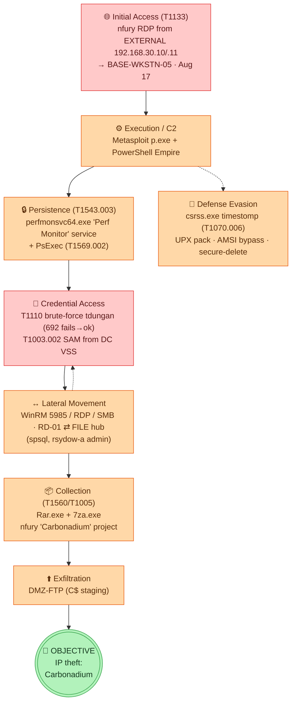
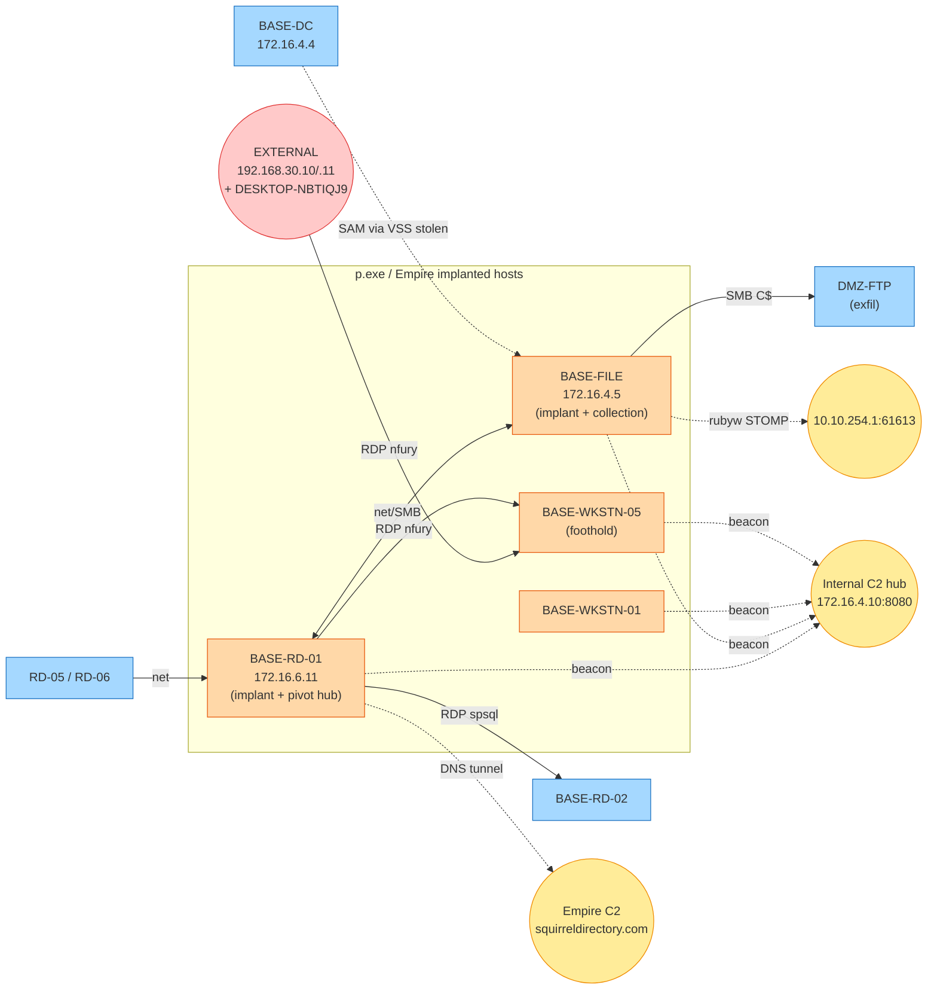
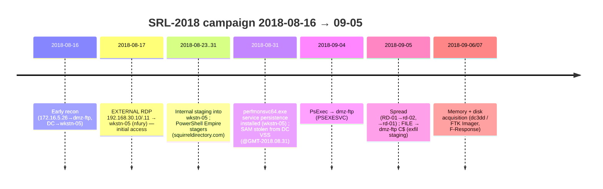
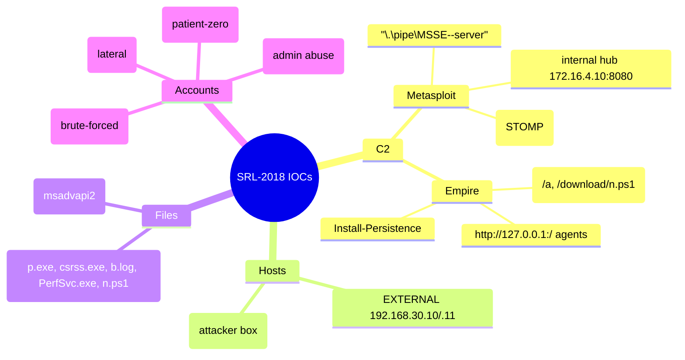
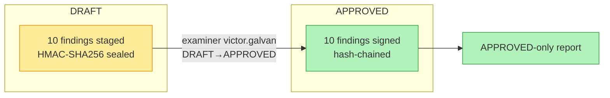

# SRL-2018 — Digital Forensic & Incident Response Report

| | |
|---|---|
| **Case ID** | `SRL-2018-COMPROMISED-ENTERPRISE` |
| **Examiner** | victor.galvan |
| **Evidence** | `/cases/SRL-2018` — 7 disk (E01) + 22 memory (raw) images, 198 GB |
| **Estate** | Stark Research Labs (`shieldbase.lan`) — DC, file, mail, RD farm, workstations, DMZ-FTP |
| **Incident window** | **2018‑08‑16 → 2018‑09‑05 UTC** |
| **Classification** | Targeted intrusion / APT — **intellectual-property theft** |
| **Status** | 10 findings **APPROVED** (examiner-signed, HMAC chain) |

> **Evaluation note.** The IP `42.112.153.164` was **operator-injected to test the system** and is **NOT** a real indicator — it has **zero evidentiary presence**. Disregard it in any tasking.

---

## 1. Executive summary

A targeted intrusion against the Stark Research Labs network, conducted with a **dual offensive
framework — Metasploit/Meterpreter + PowerShell Empire** — culminating in the **theft of the
"Carbonadium" research project** belonging to user `nfury`. The actor gained an external **RDP**
foothold on a workstation, deployed a DNS‑tunnelling implant (`p.exe`) and Empire agents across four
hosts, **stole credentials** (NTLM brute‑force + SAM‑from‑VSS), moved laterally via **WinRM/RDP/SMB**
through an **RD‑01 ⇄ FILE** hub, **collected** the target IP with `Rar`/`7‑Zip`, and **exfiltrated via
the DMZ‑FTP** server — covering tracks with a custom **timestomping** tool and thorough secure
deletion.

**The malware is fully recovered and hashed; the credential theft, lateral path, and objective are
all evidenced.**

---

## 2. Attack lifecycle (MITRE ATT&CK)

---

## 3. Lateral-movement & C2 architecture

> **Defenders excluded:** `BASE-HUNT / HUNT-02 / HUNT-03` (172.16.5.25/.27/.28) and `BASE-ADMIN`
> (172.16.5.26) are the **IR / threat-hunting** hosts (analyst `cbarton` = the acquisition examiner
> Clint Barton). Their fan-out logons are legitimate IR sweeps and are **not** attacker activity.

---

## 4. Timeline (UTC)

---

## 5. Recovered malware toolkit

All samples recovered, hashed, and quarantined (defanged) at `/home/admin2/srl-2018-malware-samples/`.

| File | SHA-256 | Role | ATT&CK |
|---|---|---|---|
| `p.exe` (packed) | `7fa4f6cc4e1bb27da7d9af7a2a533e72751b025b063e1df4359ebe127fd2892c` | **Metasploit/Meterpreter** implant — DNS tunnel + `\\.\pipe\MSSE-<N>-server`; UPX | T1071.004, T1055, T1572 |
| `p.exe` (unpacked) | `d391ede758b6c769f89addb35ee9ec74eb0ae3a23831dbd6f7d932851265eee7` | UPX‑decompressed (reveals MSSE pipe) | — |
| `perfmonsvc64.exe` | `42477dd9317c739043d4516e04221743e00b737d1234f914a0e7608202758972` | service persistence loader ("Perf Monitor") | T1543.003 |
| `csrss.exe` | `027fef173a71142cf1616e32290b9c52cbb425bfdeac1babd2a57e260c27c70e` | **timestomping** tool (masquerades as csrss) | T1070.006, T1036 |
| `b.log` | `0a040d6f452063f5bef500972f83429f3654ada88eff13c2883e8eb06b519e05` | **BrowserHistoryView** dump of `nfury` → objective | T1217, T1005 |
| `install_msadvapi2_32.exe` | `ebb75bbae3e1298cecbed3c5b1b0ca0a2a8d4d17836f672546218bc47da8dc03` | backdoor installer ("install_wormhole") | T1105 |
| `install_msadvapi2_64.exe` | `27d4968716a095a15956f1fb9e247b32dd7765b2e67149e17469908750280568` | same (64‑bit) — **identical hash on FILE + WKSTN-05** | T1105 |
| `7za.exe` | `b3a70d388488c34dd5c767692eccc9effed36b8e7c1ee03ace1bd27123a2e6d6` | exfil archiver | T1560.001 |
| `PerfSvc.exe` | `e722dd429510c83485bb276c559015df9bd4931e7e4339eb90683cc3efd9beaa` | rundll32 loader | T1218.011 |

> **Anti-forensics.** `p.exe` survived only on **RD-01**; on file/wkstn-01/wkstn-05 it was **deleted and
> overwritten** (full raw-image scans after `ewfmount` = 0 matches; MFT entries **purged**) — a clean
> T1070.004, consistent with the `csrss.exe` timestomper.

---

## 6. Indicators of Compromise (IOCs)

### Network / behavioural

### Accounts
| Account | Role in intrusion |
|---|---|
| `nfury` | **patient-zero** — external RDP foothold; the IP-theft victim (Carbonadium) |
| `tdungan` | **brute-forced** — 692 failed NTLM from RD-01 then success |
| `spsql` | SQL service acct used for RD-01 → RD-02 RDP lateral + DC staging |
| `rsydow-a` | **abused admin** creds — WinRM/RDP to DC, FILE, DMZ-FTP |

---

## 7. Approved findings (examiner-signed)

| ID | Sev | ATT&CK | Finding |
|---|---|---|---|
| `srl2018-c2-implant-001` | high | T1071.004/T1055 | Metasploit/Meterpreter DNS-tunnel implant `p.exe` (MSSE pipe) on rd-01/file/wkstn-01/05 |
| `srl2018-empire-c2-002` | high | T1071.001 | PowerShell Empire C2 `squirreldirectory.com` + localhost agents |
| `srl2018-initial-access-003` | high | T1133 | `nfury` external RDP from `192.168.30.10/.11` → wkstn-05 |
| `srl2018-credtheft-sam-004` | high | T1003.002 | SAM hive stolen from DC Volume Shadow Copy |
| `srl2018-bruteforce-005` | high | T1110 | 692 failed NTLM brute-force of `tdungan` from rd-01 |
| `srl2018-persistence-006` | high | T1543.003 | Service persistence `perfmonsvc64.exe` |
| `srl2018-lateral-007` | high | T1021.001/.002/.006 | RD-01 ⇄ FILE lateral hub (WinRM/RDP/SMB) |
| `srl2018-timestomp-008` | med | T1070.006 | Timestomping tool `csrss.exe` |
| `srl2018-psexec-dmz-009` | med | T1569.002 | PsExec → dmz-ftp |
| `srl2018-collection-exfil-010` | high | T1560.001/T1005 | Rar/7za archiving of `nfury` Carbonadium IP → DMZ-FTP exfil |

---

## 8. Methodology, integrity & honest caveats

**Approach.** Agentropix-SIFT MCP toolset (68/72 tools exercised) over the SRL-2018 evidence:
`get_malfind`/YARA recovered the in-memory implant; `ewfmount`+`ntfs-3g` mounting recovered on-disk
binaries; PowerShell **4104** script-block logs yielded the attacker commands; DC **Kerberos/NTLM**
(4768/4769/4776) + **RDP operational** (21/25/1149) logs built the lateral graph; prefetch confirmed
execution.

**Integrity.** Each finding is **HMAC-SHA256 sealed** (12/12) and the approvals are **hash-chained**
(`DRAFT→APPROVED`, examiner-signed). `inference_constraint: high` — the LLM orchestrated; facts come
from deterministic SIFT tools.

**Caveats (stated plainly).**
- The eval IP `42.112.153.164` is a **synthetic test injection**, not a real lead.
- **5 of 6 memory images are smeared** (non-atomic live `dc3dd`/F-Response acquisition → corrupted
  `ActiveProcessLinks`) — `malfind`/`svcscan` returned 0 on those; **YARA signature scanning** (smear-
  immune) recovered the implant where memory-list-walking failed.
- `n.ps1`'s full body is **not recoverable** (Empire patches AMSI / disables script-block logging
  post-stage); only the cradle one-liners were logged.
- Deleted `p.exe` copies are **unrecoverable** (content overwritten + MFT entries purged).
- evtx pulls were **capped** (8k–25k/host) — the graphs are representative, not exhaustive.
- The MCP report engine emits no single report-level seal; tamper-evidence is at the **finding** level.

---

*Full chain of custody: `docs/06-use-cases/assets/srl-2018-training-session/session-actions.log`
(252 steps). Samples: `/home/admin2/srl-2018-malware-samples/`. Tier reports (analyst/executive/
business × md/pdf/html): this directory.*
