# SRL-2018 — IOCs shown in Wazuh

Playwright captures of every pushed IOC in the Wazuh dashboard (`192.168.2.178`): the findings index in Discover + the manager CDB lists. 13 captures.

> Rendered as embedded images so they display directly in GitLab (no client-side JavaScript needed).

↳ [Forensic report](SRL-2018-FORENSIC-REPORT.md)

## Wazuh dashboard login

OpenSearch Dashboards 2.19.5

---

## Discover — all SRL-2018 findings

index `agentropix-findings-2026.06.08` (24 hits)

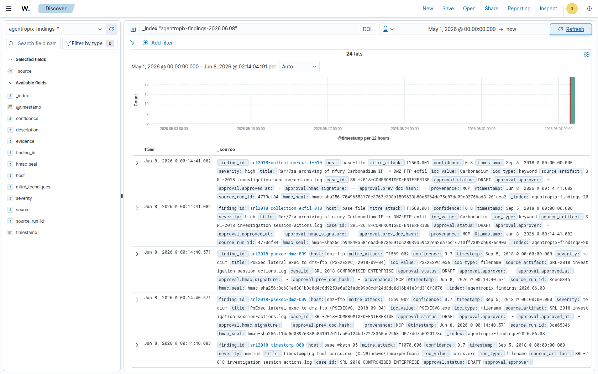

---

## srl2018-c2-implant-001

Metasploit/Meterpreter DNS-tunnel implant p.exe (MSSE pipe) on rd-01/f · `T1071.004` · base-rd-01

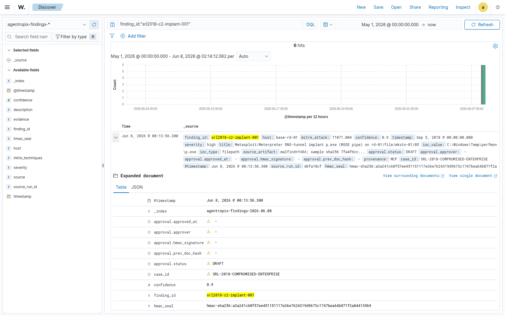

---

## srl2018-empire-c2-002

PowerShell Empire C2 squirreldirectory.com + localhost agents; Install · `T1071.001` · base-rd-01

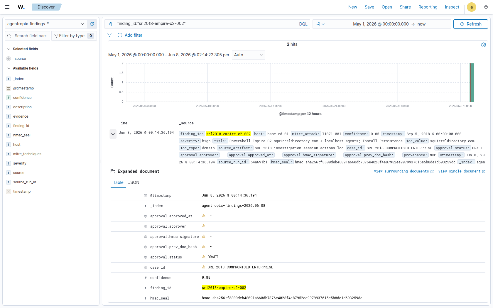

---

## srl2018-initial-access-003

Initial access: nfury external RDP from 192.168.30.10/.11 -> wkstn-05 · `T1133` · base-wkstn-05

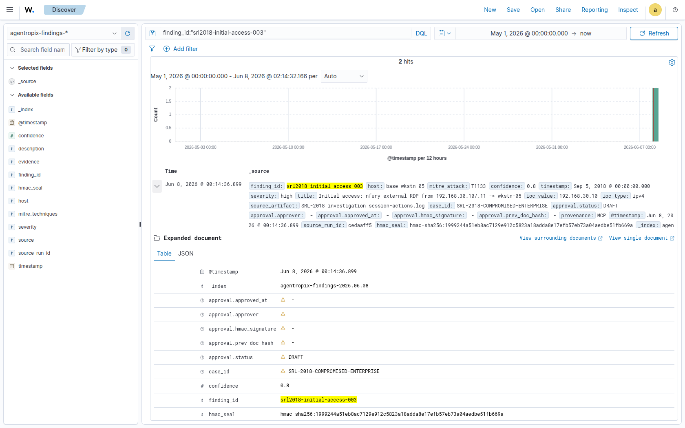

---

## srl2018-credtheft-sam-004

SAM hive stolen from DC Volume Shadow Copy (@GMT-2018.08.31) · `T1003.002` · base-dc

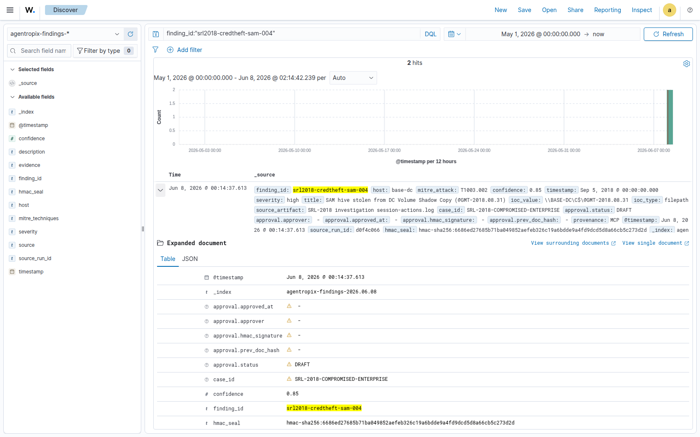

---

## srl2018-bruteforce-005

692 failed NTLM brute-force of tdungan from rd-01 then success · `T1110` · base-rd-01

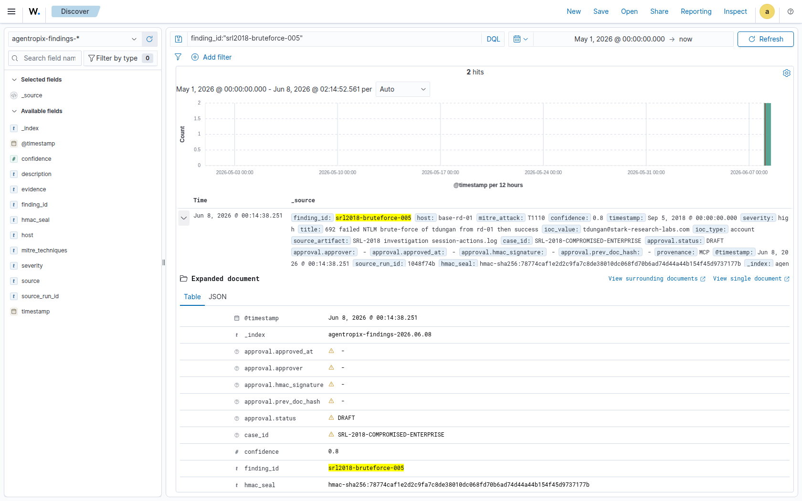

---

## srl2018-persistence-006

Service persistence perfmonsvc64.exe (Perf Monitor) · `T1543.003` · base-wkstn-05

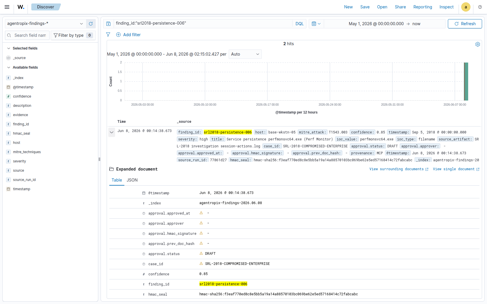

---

## srl2018-lateral-007

RD-01<->FILE lateral hub via WinRM/RDP/SMB (spsql, rsydow-a) · `T1021.006` · base-rd-01

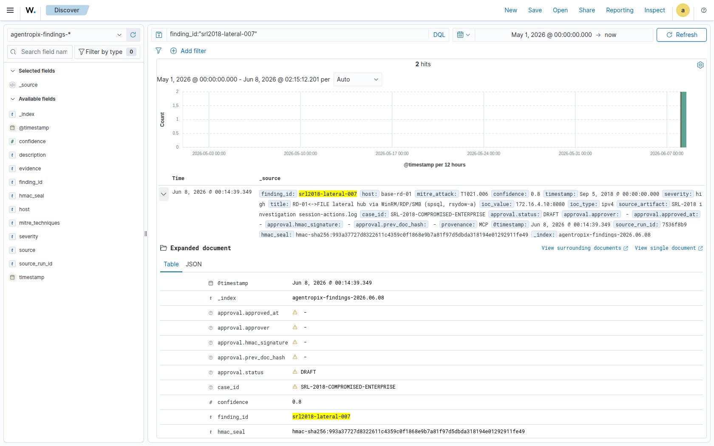

---

## srl2018-timestomp-008

Timestomping tool csrss.exe (C:\Windows\Temp\perfmon) · `T1070.006` · base-wkstn-05

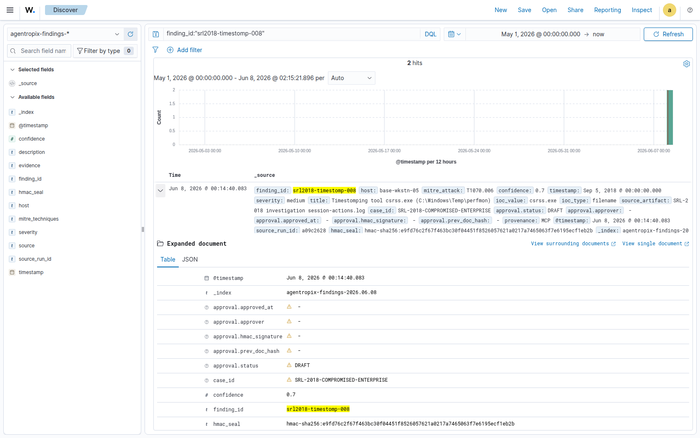

---

## srl2018-psexec-dmz-009

PsExec lateral exec to dmz-ftp (PSEXESVC, 2018-09-04) · `T1569.002` · dmz-ftp

---

## srl2018-collection-exfil-010

Rar/7za archiving of nfury Carbonadium IP -> DMZ-FTP exfil · `T1560.001` · base-file

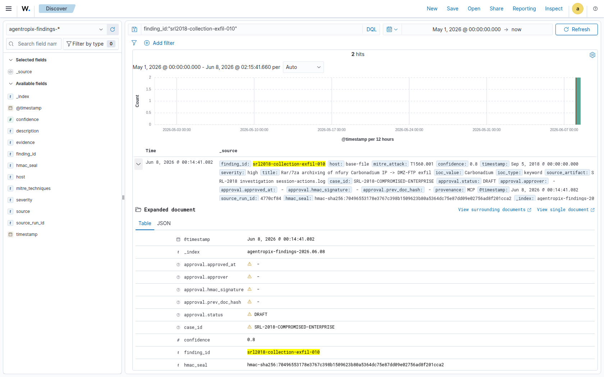

---

## Wazuh Manager CDB IOC lists

9 hashes + 2 C2 IPs + 6 suspect images + 5 suspect processes

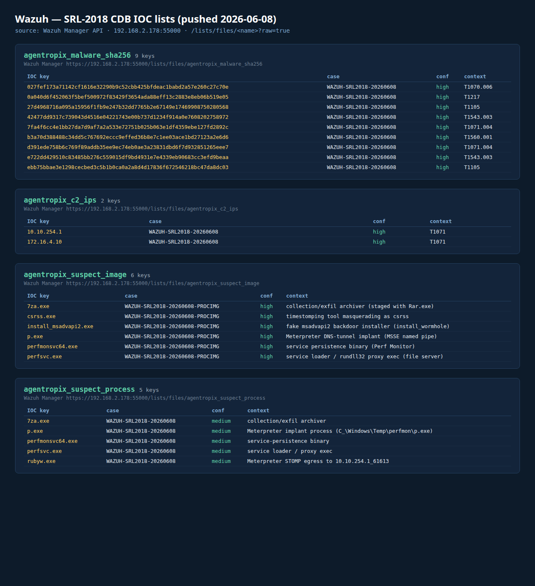

---
