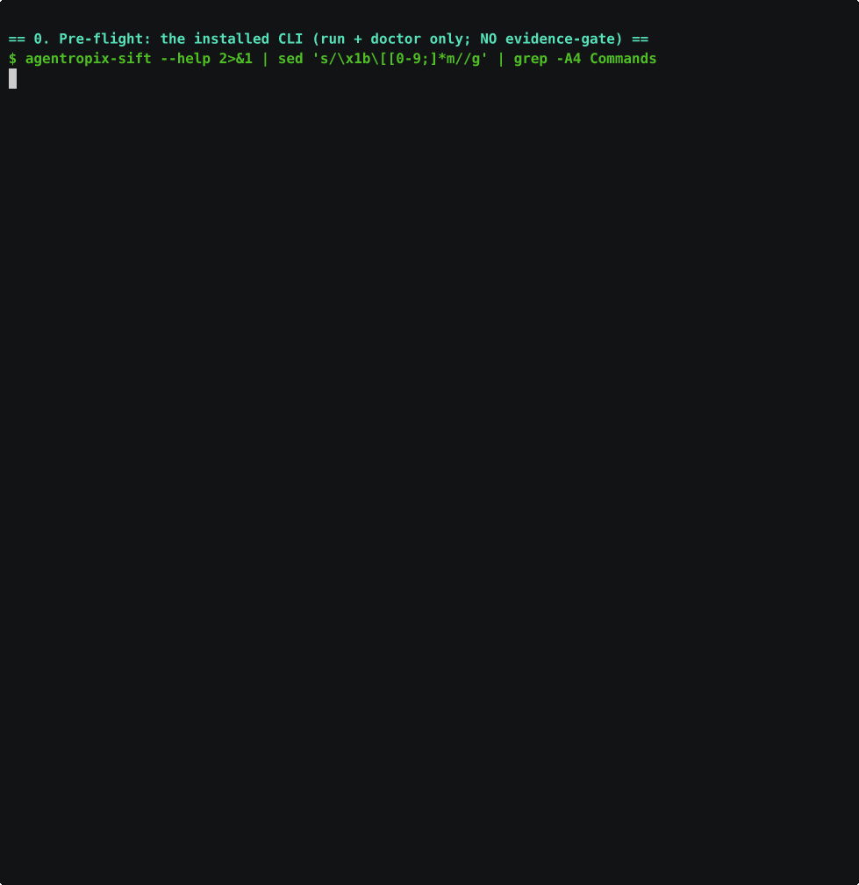

# Case Runbook — SRL-2018 (Network-Wide APT C2 Deployment)

> **Section 06 · Use Cases** — a command runbook for the **SRL-2018** case, modelled on the
> [command-cheatsheet.md](command-cheatsheet.md) template but filled with this case's **real**
> evidence paths, hashes, and the C2-backbone hypothesis from
> [case-hypotheses.md §Case 2](case-hypotheses.md#case-2--srl-2018-network-wide-apt-c2-deployment).
> Every command is in execution order and split into the two surfaces (CLI shell vs MCP tool call).
>
> **Evidence root:** `/cases/SRL-2018/` (canonical path uses a hyphen — `SRL-2018`, not `SRL2018`).

---

## Reachability & command-correctness notes (verified on this host, 2026-06-07)

These were checked live before publishing — read them before running anything:

- **`agentropix-sift` (v0.1.0.dev0) exposes only two subcommands: `run` and `doctor`.** There is
  **no `evidence-gate` subcommand** in this build (`agentropix-sift evidence-gate mint` → *"No such
  command"*). The `[MUT]` MCP write tools still read a one-shot `mutation_token` from
  `AGENTROPIX_MUTATION_TOKEN`, but **minting one via the CLI is not available here** — provision it
  out-of-band or skip the live writes and stay on `dry_run=true`. The template's `evidence-gate mint`
  line is flagged below rather than presented as runnable.
- **`agentropix-sift run` flags (verified):** `-n/--max-iterations` (default `5`), `-o/--out`
  (default `report.json`), `-v/--verbose`.
- **`verify_seal.py` is at** `/home/admin2/agentropix-sift/scripts/verify_seal.py` (not on `PATH`;
  call it by absolute path or `cd` to the source tree first).
- **The SRL-2018 E01s are single-volume NTFS images — filesystem is at `offset 0`, not `63`.**
  Verified on `base-dc-cdrive.E01`: `fls -i ewf -o 0` lists `Documents and Settings` / `ProgramData`
  / `Users`; `mmls` finds no partition table (these are volume images, not full-disk images). Always
  confirm per image with `get_partitions` — but for this case the answer is `0`.
- **The E01 disk images have no `.md5` siblings** — verify them with `get_image_info` / `ewfverify`,
  not a `.md5` file. The **memory `.img` files each DO ship a `.md5`** (see hashes below).
- MCP tool **names** below are reconciled against [`tool-list.md`](../04-mcp-tools/tool-list.md);
  argument names are doc-derived (confirm against the live `tools/list`).

---

## Evidence inventory (`/cases/SRL-2018/`)

**Disk images — EWF/E01 (7), single-volume NTFS, filesystem `offset 0`:**

| Image | Size | Role in the cascade |
|---|---|---|
| `base-dc-cdrive.E01` | 33 GiB | Domain Controller — **cascade origin** |
| `base-file-cdrive.E01` | ~16 GB | File server |
| `base-rd-01-cdrive.E01` | ~18 GB | Terminal / RD server 01 |
| `base-rd-02-cdrive.E01` | ~17 GB | Terminal / RD server 02 |
| `base-wkstn-01-c-drive.E01` | ~17 GB | Workstation 01 |
| `base-wkstn-05-cdrive.E01` | ~15 GB | Workstation 05 |
| `dmz-ftp-cdrive.E01` | ~13 GB | DMZ FTP — **cascade tail** |

**Memory images — raw `.img` (22; 21 carry a sibling `.md5`):** `base-dc-memory.img`,
`base-file-memory.img`, `base-hunt-memory.img`, `base-mail-memory.img`, `base-av-memory.img`,
`base-admin-memory.img`, `base-sp-memory.img`, `base-elf-memory.img`, `base-file-snapshot5.img`;
workstations `base-wkstn-01-memory.img` … `base-wkstn-06-memory.img`; RD servers
`base-rd01-memory.img` and `base-rd-02-memory.img` … `base-rd-06-memory.img`.

> ⚠️ **Naming quirk — copy the exact names.** RD server 01's memory image is **`base-rd01-memory.img`**
> (no second hyphen) — there is **no** `base-rd-01-memory.img`; the rest are `base-rd-0N-memory.img`.
> Likewise workstation 01's disk is **`base-wkstn-01-c-drive.E01`** (`-c-drive`), while the other
> disks use `-cdrive`. Use `get_image_info` to confirm a path before triaging it.
> *(The 22 `.img` count includes a duplicate variant of wkstn-01's capture, `base-wkstn-01-mem.img`,
> alongside `base-wkstn-01-memory.img` — 21 distinct hosts/snapshots + 1 dupe. That dupe is also the
> one `.img` with **no** `.md5` sibling, so 22 images / 21 `.md5` files.)*

**Real acquisition metadata — `base-dc-cdrive.E01`** (`ewfinfo`):

| Field | Value |
|---|---|
| Case number | `20180905-001` |
| Description | `base-dc C-Drive` |
| Examiner (acquisition) | `Clint Barton` |
| Notes | `Acquired over network via F-Response` |
| Acquisition date | `Fri Sep  7 21:13:10 2018` |
| OS / format | `Win 201x` / FTK Imager (ADI4.2.0.13) |
| Media | 33 GiB (`36110860288` bytes), `70529024` sectors, 512 B/sector |
| **MD5** | `e18b450127de04afb3211faa456ada27` |
| **SHA1** | `15f1215e824a3319020cb74addcbe22d90fc6c18` |

**Real memory hashes (`.md5` siblings):** `base-dc-memory.img` →
`9ab3a3e2842bc9caf164837668c155aa` · `base-hunt-memory.img` →
`38c59764b927e863262bfbbf1802a0fe`.

---

## The hypothesis this runbook is testing

From [case-hypotheses.md §Case 2](case-hypotheses.md#case-2--srl-2018-network-wide-apt-c2-deployment)
(**bias-check, not a finding — prove each link live**):

- **C2 backbone (MEDIUM-HIGH):** C2 IP **`42.112.153.164:8080`** (VT/OTX MALICIOUS); deployment
  window **2018-05-03 14:22:15 → 15:15:45 UTC (~53 min)** cascading
  **DC → file → workstations → terminal servers → DMZ-FTP**.
- Concrete malware lead: the **`svcsvc32`-class service binary** across DC / file / rd-01 / wkstn-01;
  typosquat delivery domain **`stark-research-labs.co`**.
- ⚠️ **Re-derive live (PLACEHOLDERS):** `svchost.exe PID 1234 / parent System PID 4`, service
  `"SuspiciousService"`, task `\Microsoft\Windows\Update Check` — **do not quote without confirming.**
- *Confidence: MEDIUM-HIGH on C2 + cascade; LOW on exact process / service names.*

---

## 0. Pre-flight & gate provisioning (CLI — shell)

```bash
# Pre-flight all 16 SIFT binaries (vol, log2timeline.py, fls, icat, mmls, ewfinfo, evtx_dump.py,
# yara, bulk_extractor, rip.pl, pf, amcache_parser, shimcache_parser, exiftool, foremost, hashdeep)
agentropix-sift doctor

# Verify a courtroom seal — run this AFTER §1 produces base-dc.report.json
# (absolute path — verify_seal.py is NOT on PATH)
python /home/admin2/agentropix-sift/scripts/verify_seal.py /cases/SRL-2018/reports/base-dc.report.json
```

> ⚠️ **`evidence-gate mint` is NOT in this build.** The template lists
> `agentropix-sift evidence-gate mint` → `AGENTROPIX_MUTATION_TOKEN`; the installed CLI (v0.1.0.dev0)
> has only `run` + `doctor`. Until a build with the gate subcommand is installed, treat the `[MUT]`
> live-write steps (§3, §4) as **`dry_run=true` only** unless a `mutation_token` is provisioned
> out-of-band into `AGENTROPIX_MUTATION_TOKEN`.

---

## 1. Disk triage — the DC, cascade origin → [uc-disk-triage.md](uc-disk-triage.md)

**Autonomous (CLI):**

```bash
mkdir -p /cases/SRL-2018/reports
agentropix-sift run /cases/SRL-2018/base-dc-cdrive.E01 \
    --max-iterations 5 \
    --out /cases/SRL-2018/reports/base-dc.report.json \
    --verbose
```

**Granular MCP chain (in order — `offset 0` for these volume images):**

```text
get_image_info    { "image":"/cases/SRL-2018/base-dc-cdrive.E01" }                 # ewfinfo: MD5 e18b4501…, examiner Clint Barton
get_partitions    { "image":"/cases/SRL-2018/base-dc-cdrive.E01" }                 # volume image -> NTFS at offset 0
case_init         { "case_name":"SRL-2018", "examiner_id":"<EXAMINER>", "scope":"/cases/SRL-2018" }
evidence_register { "path":"/cases/SRL-2018/base-dc-cdrive.E01", "description":"Windows DC C-drive (EWF/E01)", "examiner_id":"<EXAMINER>" }
fls               { "image":"/cases/SRL-2018/base-dc-cdrive.E01", "offset":0, "recursive":true, "summary_only":true }
fls               { "image":"/cases/SRL-2018/base-dc-cdrive.E01", "offset":0, "recursive":true, "deleted_only":true }   # T1070.004 surface
extract_files     { "image":"/cases/SRL-2018/base-dc-cdrive.E01", "offset":0,
                    "paths":["/Windows/System32/config/SYSTEM","/Windows/System32/config/SOFTWARE","/Windows/Prefetch"],
                    "dest":"/cases/SRL-2018/_extract/base-dc" }
get_shimcache     { "hive":"/cases/SRL-2018/_extract/base-dc/SYSTEM" }             # AppCompatCache — hunt svcsvc32
get_amcache       { "hive":"/cases/SRL-2018/_extract/base-dc/Amcache.hve" }        # Win 201x has Amcache
get_prefetch      { "target":"/cases/SRL-2018/_extract/base-dc/Prefetch" }
run_hashdeep      { "target":"/cases/SRL-2018/_extract/base-dc" }                  # IOC-candidate hashes
scan_yara         { "target":"/cases/SRL-2018/_extract/base-dc", "rule":"svcsvc32" }  # the concrete malware lead
```

> ⚠️ **Gotchas.** Use `offset 0` (verified — these are NTFS volume images, not MBR disks; `offset 63`
> returns `Cannot determine file system type`). `dest` is under the Thymus-allowlisted `/cases/`
> prefix. Repeat this chain per host (`base-file`, `base-rd-01`, `base-wkstn-01`, `dmz-ftp`) to chase
> the `svcsvc32` service across the cascade.

---

## 2. Memory triage — DC + hunt images → [uc-memory-triage.md](uc-memory-triage.md)

**Autonomous (CLI):**

```bash
agentropix-sift run /cases/SRL-2018/base-dc-memory.img \
    --max-iterations 5 \
    --out /cases/SRL-2018/reports/base-dc-mem.report.json
```

**Granular MCP C2-hunt chain (in order):**

```text
get_pslist          { "image":"/cases/SRL-2018/base-dc-memory.img" }                       # baseline PIDs (windows.pslist)
build_process_tree  { "image":"/cases/SRL-2018/base-dc-memory.img" }                       # PPID links; flag svchost/services anomalies
get_netscan         { "image":"/cases/SRL-2018/base-dc-memory.img" }                       # look for 42.112.153.164:8080 sockets
get_malfind         { "image":"/cases/SRL-2018/base-dc-memory.img" }                       # RWX / injected code
get_svcscan         { "image":"/cases/SRL-2018/base-dc-memory.img" }                       # the svcsvc32-class service persistence
run_volatility      { "target":"/cases/SRL-2018/base-dc-memory.img", "plugin":"windows.cmdline", "args":[] }   # escape hatch
pivot_on_ioc        { "ioc":"42.112.153.164",
                      "images":["/cases/SRL-2018/base-dc-memory.img","/cases/SRL-2018/base-file-memory.img","/cases/SRL-2018/base-wkstn-01-memory.img","/cases/SRL-2018/base-rd-02-memory.img"],
                      "ioc_type":"ip" }                                                     # campaign view across hosts
threat_intel_lookup { "indicator":"42.112.153.164", "indicator_type":"ip", "providers":["virustotal","otx"] }  # egress-gated
```

> ⚠️ **Gotchas.** `threat_intel_lookup` no-ops (`egress_allowed=False`) unless
> `AGENTROPIX_ALLOW_EGRESS=1` + a provider key. `base-hunt-memory.img`
> (md5 `38c59764b927e863262bfbbf1802a0fe`) is the dedicated hunt image — run the same chain over it.
> Prefer the typed renderers over `run_volatility` for structured rows.

---

## 3. Approval gate — DRAFT → APPROVED → sealed → [uc-approval-gate.md](uc-approval-gate.md)

**MCP tool calls** (`[MUT]` = needs `mutation_token`; `[APPR]` = needs `password`):

```text
record_finding   (finding={...}, dry_run=true)                                # [MUT] preview (no token spent)
record_finding   (finding={...}, dry_run=false, mutation_token="egt_<ULID>")  # [MUT] commit DRAFT (token must exist — see §0 caveat)
delete_finding   (finding_id, dry_run=false)                                  # DRAFT-only self-correct (no token; dry_run-gated)
case_status      ()                                                           # {DRAFT, APPROVED, REJECTED}
approve_finding  (finding_id, approver_id, password,
                  from_status="DRAFT", to_status="APPROVED", reason="...")     # [APPR] examiner only, HMAC-signed
retract_approval (approval_id, approver_id, password, reason="...")            # [APPR] compensating REVOKED entry
report_generate  (profile="full")                                             # APPROVED-only
report_export    (tier="analyst", fmt="md")                                   # -> courtroom.seal_report
```

**Raw two-leg sidecar handshake (keeps the password out of LLM context) — `curl`:**

```bash
curl -fsS http://127.0.0.1:8800/challenge -H 'content-type: application/json' \
  -d '{"examiner_id":"<examiner>","target_id":"F-srl2018-c2-001","target_type":"finding"}'

curl -fsS http://127.0.0.1:8800/approve -H 'content-type: application/json' \
  -d '{"case_id":"<case-id>","target_id":"F-srl2018-c2-001","target_type":"finding",
       "from_status":"DRAFT","to_status":"APPROVED","examiner_id":"<examiner>",
       "nonce":"<nonce>","signature_hex":"<signature-hex>","reason":"C2 42.112.153.164 confirmed in netscan + svcscan"}'
```

> ⚠️ The **W-286 draft-gate** strips any caller-supplied `approval.*` — the LLM cannot self-approve.
> `report_generate` against a case with zero APPROVED findings returns the executive/empty shell.

---

## 4. Wazuh push — escalate the confirmed C2 → [uc-wazuh-push.md](uc-wazuh-push.md)

**Gate provisioning (CLI, once per session — never against prod):**

```bash
# NOTE: `agentropix-sift evidence-gate mint` is NOT in this build (see §0). Provision
# AGENTROPIX_MUTATION_TOKEN out-of-band, then flip the four experimental kill switches:
export WAZUH_INTEGRATION_ENABLED=true
export WAZUH_PUSH_ENABLED=true
export WAZUH_DRY_RUN_ONLY=false
export AGENTROPIX_INTEGRATION_NOT_PRODUCTION=true   # W-188 affirmation: target is NOT prod
```

**MCP tool calls (in order):**

```text
build_executable_registry (case_id="SRL-2018", executables=[{"sha256":"<svcsvc32-sha256>","path":"/Windows/System32/svcsvc32.exe"}], dry_run=false, case_dir="/cases/SRL-2018")  # writes MASTER-IOCS.json (NOT [MUT] — dry_run only, no token)
wazuh_index_findings      (case_id="SRL-2018", findings=[...], dry_run=true)                              # preview
wazuh_index_findings      (case_id="SRL-2018", findings=[...], dry_run=false, mutation_token="egt_...")   # [MUT] live index as sealed alerts
wazuh_publish_iocs        (case_dir="/cases/SRL-2018", dry_run=true)                                      # push plan (Tier-1/2/3)
wazuh_publish_iocs        (case_dir="/cases/SRL-2018", dry_run=false, mutation_token="egt_...")           # [MUT] live push: CDB lists + rules + restart + seal
wazuh_hunt_ioc            (ioc_value="42.112.153.164", ioc_type="ip", time_range_hours=2160)             # read-only, retro-hunt 90d
wazuh_check_intel         (ioc_value="stark-research-labs.co", ioc_type="domain")                        # read-only — the typosquat
wazuh_vuln_query          (cve="CVE-2024-3094", time_range_hours=720)                                     # read-only (example CVE)
```

> ⚠️ Every `dry_run=false` call **fails closed** with a structured `error` naming the switch to flip
> until **all four** kill switches are on AND a valid one-shot token is supplied. Publish is
> **idempotent** — pass the whole `case_dir` once; do **not** loop per-IOC. Tier-3 denylist hits land
> in `skipped_tier3`, not `pushed`.

---

## 5. Cross-host cascade — the SRL-2018-specific step

This is where the network-wide hypothesis is proven. After per-host disk/memory triage, correlate the
cascade and fan the C2 indicator across **every** image.

**MCP tool calls:**

```text
get_evtx          { "target":"/cases/SRL-2018/_extract/base-dc/Security.evtx" }            # service-install 7045 / task 4697,4698
correlate_timeline{ "images":["/cases/SRL-2018/base-dc-cdrive.E01","/cases/SRL-2018/base-file-cdrive.E01","/cases/SRL-2018/base-rd-01-cdrive.E01","/cases/SRL-2018/base-wkstn-01-c-drive.E01","/cases/SRL-2018/dmz-ftp-cdrive.E01"] }   # reconstruct the 14:22 -> 15:15 window
detect_sweep      { "images":[...], "ioc":"42.112.153.164" }                               # lateral-movement sweep DC->file->wkstn->rd->dmz
pivot_on_ioc      { "ioc":"42.112.153.164", "images":[...all 22 memory + 7 disk...], "ioc_type":"ip" }   # full campaign view
threat_intel_lookup { "indicator":"stark-research-labs.co", "indicator_type":"domain", "providers":["virustotal","otx"] }
```

> The deployment window (**2018-05-03 14:22:15 → 15:15:45 UTC**) and the DC→…→DMZ-FTP ordering are the
> hypothesis to confirm with `correlate_timeline` + `detect_sweep`; the `svcsvc32` service and
> `42.112.153.164` are the indicators that should appear on each compromised host. Confidence is
> MEDIUM-HIGH on the cascade, LOW on exact process/service names — **prove each link against live tool
> output.**

---

## Live capture

A hybrid terminal capture of the **runnable shell subset** of this runbook (asciinema `.cast` + GIF +
transcript, all run live against `/cases/SRL-2018/`) lives in
[`assets/srl-2018-capture/`](assets/srl-2018-capture/README.md) — including a format evaluation
(asciinema vs GIF vs MP4) with measured sizes and the rationale for not using MP4.



---

## See also

- [command-cheatsheet.md](command-cheatsheet.md) — the generic template this runbook is built from.
- [uc-disk-triage.md](uc-disk-triage.md) · [uc-memory-triage.md](uc-memory-triage.md) ·
  [uc-approval-gate.md](uc-approval-gate.md) · [uc-wazuh-push.md](uc-wazuh-push.md) — the narrated
  walkthroughs (with 💬 end-user prompts and validated outputs).
- [case-hypotheses.md](case-hypotheses.md#case-2--srl-2018-network-wide-apt-c2-deployment) — the full
  Case 2 attack-chain bias-check.
- [`tool-list.md`](../04-mcp-tools/tool-list.md) — the 71-tool catalogue and exact arg schemas.
- [`capability-map.md`](../04-mcp-tools/capability-map.md) — pick tools by DFIR function.
- [`canonical-facts.md`](../08-reference/canonical-facts.md) — canonical numbers and case inventory.
