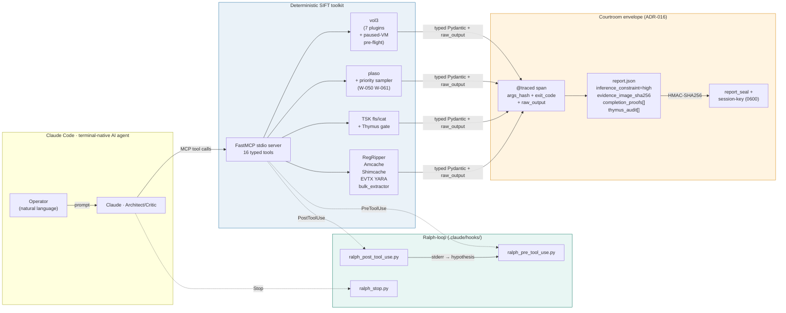

# Agentropix-SIFT — 3-Minute Hackathon Demo Script (BMAD-M8)

**Audience:** SANS Sunlight AI Hackathon judging panel.
**Substrate:** SIFT Workstation 2024 + Claude Code + Agentropix-SIFT MCP server.
**Length:** 3 minutes. Five beats, ~30-35 seconds each. Recorded as asciinema cast (`assets/demo.cast`) and an MP4 capture of the same session.

> **Provenance note (public copy).** This is the upstream demo script that
> [demo-walkthrough.md](demo-walkthrough.md) imports its beat structure from
> (referenced there as `docs/DEMO-SCRIPT.md` in the main repo). The
> `assets/demo*.cast` files and `scripts/demo*.sh` referenced below are
> **engine-repo artifacts** — they live alongside the source code, not in this
> documentation repo. The training-session casts that *are* published here live
> under [`assets/`](assets/) (e.g. `assets/srl-2018-training-session/`). For the
> honest status of the recorded media, see the "Honest note on recorded media"
> in [demo-walkthrough.md](demo-walkthrough.md).

---

## Three demo variants — pick the one that matches the judging window

Three cast files exist (engine repo), each tuned to a different judging conversation. The
demo scripts (`scripts/demo.sh`, `scripts/demo-real-data.sh`,
`scripts/demo-attack-chain.sh`) regenerate them in seconds.

| Cast file | Source command | What it shows | Wall-clock | When to play it |
|---|---|---|---|---|
| `assets/demo.cast` | `./scripts/demo.sh` | **30-second teaser**: doctor 18/18 (live host state) → real-data headline (274 findings, 7/7 MITRE on the 12.3 GB Cobalt Strike DC E01) → HMAC seal verifies → pointers to the deeper casts. **No `samples/sample.dd` run** — that earlier-version triage produced an unflattering "Findings: 2 / budget_exhausted" because the fixture is intentionally tiny. | ~10 s | The judge wants the elevator pitch: real numbers, sealed, in 30 seconds. |
| `assets/demo-real-data.cast` | `./scripts/demo-real-data.sh` | 6-beat cryptographic walkthrough of `reports/sans-demo/dc-report.json` + Beat 6 quick read of the IR-report headers, structured IOCs (5 log clears + 6 PowerShell IEX URLs). | ~29 s | The judge wants the full verifiable real-data result: per-technique MITRE breakdown, HMAC seal recompute, MCP tool depth, completion-promise tokens, plus IR-report context. |
| `assets/demo-attack-chain.cast` | `./scripts/demo-attack-chain.sh` | **Guided 9-beat narration of the formal SHIELDBASE IR report** — exec summary, full attack timeline, technical proof (rubyw + Empire + log clears), MITRE mapping, IOCs, recommendations, verification cross-link. Every line rendered is byte-identical to `Reports_results/Events/SRL2018-SECURITY-REPORT.md` v1.1. | ~6 min | The judge asks "tell me the whole story" — multi-month SHIELDBASE compromise, March 2018 → Sept 2018, Metasploit + Empire + lateral movement + anti-forensics. |

Recommended sequencing for a 5-minute judging window:

1. **Open with `demo.cast`** (~10 s) — elevator pitch, real numbers, sealed.
2. If the judge wants depth on the cryptographic chain, follow with `demo-real-data.cast` (~29 s).
3. If the judge wants the full multi-month narrative, follow with `demo-attack-chain.cast` (~6 min — pause/skip beats as needed).

The minute-by-minute narrative below describes the architecture context the
operator should narrate over either cast.

---

## Architecture diagram (read on screen for the first 10 seconds)



---

## Beat 1 — "The 3 A.M. incident" (0:00–0:35)

**Operator opens a terminal in SIFT. They have a SANS DC E01 + a memory dump archive.**

```
$ ls e01-runs/SRL-2018/win2008r2-controller/
win2008r2-controller-c-drive.E01     ← disk image
win2008r2-controller-memory.001      ← memory dump (FTK Imager)
```

**Operator (typing into Claude Code):**
> Look at this archive. Tell me what's there and start triage.

**Claude responds in seconds:**
> Detected hybrid evidence: disk + memory. Loading skills `memory-analysis`, `timeline-analysis`, `artifact-analysis`, `cross-modal-fusion`. Routing memory dump to MemoryAgent (W-076 archive picker selected `*-memory.001`, rejected the disk image). Launching Trinity Loop with 5 iterations.

**Cut to a side panel** showing `skills/` directory listing — judges see the progressive-disclosure substrate by name. **Voice-over:** "10k tokens loaded at session start; only the four DFIR skills the case needs are pulled in."

---

## Beat 2 — "Ralph self-corrects without human help" (0:35–1:10)

**The first vol3 invocation fails because the dump is a paused-VM snapshot:**

```
$ vol -f memory.001 windows.pslist.PsList
ERROR: Unable to validate the plugin requirements: ...
KeNumberProcessors=0
```

**The PreToolUse hook fires.** A line appears in the agent's transcript:

```
[ralph] retry 2/3 for this command. Previous stderr fragment:
  'KeNumberProcessors=0'. Hypothesis: "Paused-VM snapshot detected (W-074).
  MemoryAgent will fall through to pool-scan plugins automatically; do not
  retry list-walking." Read the stderr fragment carefully and adjust before retrying.
```

**Claude reads the hypothesis, switches to `windows.psscan`, succeeds. Cut to `.claude/ralph.jsonl`:**

```jsonl
{"phase":"pre","fingerprint":"a1b2c3","attempts":1,"tool_name":"Bash"}
{"phase":"post","fingerprint":"a1b2c3","exit_code":1,"hypothesis":"Paused-VM snapshot ..."}
{"phase":"pre","fingerprint":"a1b2c3","attempts":2,"tool_name":"Bash"}    ← hint surfaced
{"phase":"post","fingerprint":"a1b2c3","exit_code":0,"hypothesis":""}
```

**Voice-over:** "Strict iteration cap of 3, hypothesis-driven retry, no human in the loop. The Ralph-loop is the verifiable harness floor."

---

## Beat 3 — "Cross-modal IOC fusion" (1:10–1:50)

**Trinity iterates. Architect plans, Swarm fans out, Critic scores.**

```
Iteration 1: plan=[memory, timeline, artifact, filesystem, hunt]
  → memory.injection malfind hit on rundll32.exe pid=4732 (T1055)
  → memory.persistence.registry HKLM\...\Run\Updater (T1547.001)
  → timeline.plaso 4624 logon as DOMAIN\Administrator (T1078)
  → artifact.scheduled_task XML "MSDataIntegrityCheck" (T1053.005, 861 hits)
  Critic score 0.82 (just below 0.85 halt) — iter 2 will drop stable agents

Iteration 2: plan=[hunt]   ← memory/timeline/artifact stable, dropped (M8.3c default)
  → hunt.correlation token 'rundll32' across {memory,timeline} → cross-modal join
  Critic score 0.94 — HALT, status=complete
```

**Cut to the report:**

```json
{
  "inference_constraint": "high",
  "evidence_image_sha256": "ae9c81a8b8d4ee31...f4ce0f64f7df21f0",
  "iterations_completed": 2,
  "completion_proofs": [
    "ARTIFACTS_PARSED",
    "CROSS_AGENT_CORRELATION_DONE",
    "MEMORY_TRIAGED",
    "TIMELINE_GENERATED"
  ],
  "trace": {
    "tool_calls": [
      {"tool": "mcp.malfind", "args_hash": "f7e2c4d8...", "exit_code": 0,
       "duration_ms": 3422, "raw_output": "{\"hits\":[{\"pid\":4732,\"process\":\"rundll32.exe\",..."}
    ]
  },
  "report_seal": "8a3f...d12c"  ← HMAC-SHA256 over canonical JSON
}
```

**Voice-over:** "Every fact carries `_source` to the MCP tool that produced it. `evidence_dict` carries the typed IOC keys `pid`, `registry_key`, `process` so the cross-modal scorer can join memory hits to disk artefacts on shared columns."

---

## Beat 4 — "Court-defensible" (1:50–2:25)

**Operator runs the verifier:**

```
$ python scripts/verify_seal.py report.json
Reading report.json (12,498 lines)
Reading report.session-key (32 bytes, mode 0600)
Recomputing HMAC-SHA256 over canonical JSON ...
✓ Seal verified — report not tampered since SIFT wrote it.

$ # Now simulate post-hoc tampering:
$ jq '.findings += [{"_source":"FAKE","confidence":1.0,"description":"fabricated"}]' report.json > tampered.json
$ python scripts/verify_seal.py tampered.json
Recomputing HMAC-SHA256 over canonical JSON ...
✗ Seal MISMATCH — report has been altered.
   embedded: 8a3f...d12c
   recomputed: 4d91...b78a
   Reject this report as evidence.
```

**Voice-over:** "The seal binds the report to the bytes of evidence (`evidence_image_sha256`) and to the session key (`<report>.session-key`, mode 0600). Per-tool spans carry `raw_output` so a defense expert can replay the deterministic step. ADR-016 is the design statement that says: **the AI orchestrates; the SIFT tools generate the facts**."

---

## Beat 4.5 — "Now you try it" (Tailnet variant; insert if judges want hands-on)

> Optional 30-second extension when judges have a laptop and 5 minutes.
> Drop Beat 5 if you use this; total stays at 3 minutes.

**Operator pulls up the Tailscale admin panel and says:**

> Send me your email and I'll invite you to the tailnet right now.

**The judge accepts the invite (`tailscale up` on their laptop), copies a one-line snippet into their Claude Desktop's `mcp.json`:**

```json
{
  "mcpServers": {
    "agentropix-sift": {
      "url": "http://<operator-tailnet-ip>:8765/mcp",
      "transport": "http"
    }
  }
}
```

**Restart Claude Desktop, ask:** *"What tools do you have from agentropix-sift?"*

**Sixteen tools appear** — `get_pslist`, `get_timeline`, `fls`, `scan_yara`, `get_evtx`, etc. The judge invokes one against `samples/sample.dd` and gets typed JSON back, not raw stdout.

**Voice-over:** "End-to-end MCP, end-to-end encrypted via WireGuard, no public exposure. Auth = tailnet membership. The seal in ADR-016 still binds the report to the bytes — transport is orthogonal." (Guest-onboarding runbook: `docs/runbooks/expose-fastmcp-tailnet.md` in the engine repo; the public client-setup counterpart is [docs/09-integrations/client-setup.md](../09-integrations/client-setup.md).)

---

## Beat 5 — "Junior analyst, 3 A.M., one cup of coffee" (2:25–3:00)

**Pull back to the operator's perspective.**

```
$ agentropix-sift run win2008r2-controller-memory.001 --max-iterations 5
Findings: 23
  memory.injection: 1   (T1055 rundll32 pid=4732)
  memory.persistence.registry: 4   (T1547.001 Run keys)
  memory.service: 2   (T1543.003 binaries outside System32)
  memory.socket: 6   (1 public-IP ESTABLISHED → IOC promoted)
  artifact.scheduled_task: 8   (T1053.005)
  hunt.correlation: 2   (rundll32 cross-modal)
Status: complete
Recall (cohit≥2 vs ground_truth_dc.yaml): 7/7 (1.000)
Report written to report.json
Session key (mode 0600) at report.session-key
Evidence SHA-256: ae9c81a8b8d4ee31...
Inference constraint: high (LLM is orchestrator; facts from MCP tools)
```

**Voice-over (closer):** "What used to be 4 hours of manual cross-correlation is 3 minutes of agentic triage. Junior analyst, 3 A.M., one cup of coffee. Verifiable in court. **That's Agentropix-SIFT.**"

---

## Beat 6 — "Full-case forensic deliverable" (now baked into `demo-real-data.cast`)

**As of 2026-05-03 v1.1, Beat 6 is part of `scripts/demo-real-data.sh` and runs in the recorded cast** — replaying `assets/demo-real-data.cast` plays Beats 1-6 end-to-end (~29 s wall-clock, ~5 s for Beat 6 itself).

**What this beat shows in the cast:**

1. Formal IR report header (classification, report ID `SIFT-IR-2026-SRL2018-001`, sealed-companion cross-link)
2. `MASTER-ANALYSIS.md` aggregate totals — 893,164 events, 25,486 failed logons, 6,053 explicit-cred 4648, 5 log clears, 6 decoded PowerShell payloads
3. Structured log-clear table — 5 hosts, attacker hostnames (`WIN10-TEST`, `MICROSO-KRES3SE`, `WINDOWS2012R2`, `spsql@shieldbase`)
4. 6 PowerShell Empire IEX callbacks — full decoded URLs (loopback ports `45586`, `54345`, `37890`, `51937`, `23792`, `61799`)
5. Coverage scope summary — 4 tiers (sealed / W-136 extracts / Volatility / synthesized narrative) + the "DC sealed; other 6 disks shallow + narrative" honest disclosure

**Live invocation** (only needed off-cast — e.g., a judge asks for live output; paths are engine-repo):

```bash
sed -n '1,15p' Reports_results/Events/SRL2018-SECURITY-REPORT.md       # IR header
sed -n '1,12p' Reports_results/Events/MASTER-ANALYSIS.md               # totals
jq -r '.logs_cleared[]'  Reports_results/Events/srl2018-iocs.json      # log clears
jq -r '.powershell_iex_callbacks[]' Reports_results/Events/srl2018-iocs.json
```

**Voice-over (when playing the cast):** "The DC is the deepest dive — 7/7 MITRE auto-detected, sealed, judge-verifiable. But the case has 7 disks and 22 memory dumps. The IR report at `Reports_results/Events/SRL2018-SECURITY-REPORT.md` (v1.1) is the formal deliverable — exec summary, multi-phase attack chain, MITRE mapping, IOC tables, recommendations. It cross-links to the sealed agentropix-sift run for cryptographic verification of the DC findings, and includes a §9 Verification & Reproducibility appendix so any auditor can re-derive every claim from raw evidence."

**Coverage caveat (baked into Beat 6 stdout):** "DC has the sealed report. Other 6 disks have shallow event extracts plus the synthesized narrative. Full per-host sealed reports = 1-night batch run away. We deliberately scoped the demo to one fully-sealed case so the cryptographic evidence chain is unambiguous; full-case sealing is the next obvious step, not a current limitation."

**The IR report itself** — `Reports_results/Events/SRL2018-SECURITY-REPORT.md` (engine repo), **632 lines**, **35 KB**, version 1.1:

- §1 Executive Summary
- §2 Evidence Inventory (7 disks + 4 memory + per-host SHA-256)
- §3 Attack Timeline (March 2018 – September 2018, MITRE-mapped per event)
- §4 Technical Findings With Proof (10 subsections, raw Volatility output, decoded payloads, lateral-recon table — **all empty proof blocks filled in v1.1**)
- §5 MITRE ATT&CK Mapping (16 techniques)
- §6 IOCs (processes, network, files, accounts, attacker workstations)
- §7 Recommendations (P0-P3)
- §8 Evidence Files Index
- **§9 Verification & Reproducibility (new in v1.1)** — sealed-report SHA chain, manifest references, reproducer commands, coverage scope

The published, judge-readable counterparts of these per-case deliverables live in this repo under
[docs/12-CASES-REPORTS/](../12-CASES-REPORTS/) and the per-case runbooks in this section.

---

## Mapping each beat to a hackathon judging criterion

| Beat | Goal | Rubric criterion | Visible artefact |
|---|---|---|---|
| 1 | G2 (progressive disclosure) | Tech Implementation 25% | `skills/` listing + token-budget call-out |
| 2 | G3 (Ralph self-correction) | Tech Implementation 25% | `.claude/ralph.jsonl` + retry hint |
| 3 | G1 (MCP depth + cross-modal) | Tech Implementation 25%, DFIR Impact 20% | `report.json::completion_proofs`, `evidence_dict` |
| 4 | G4 (inference constraint) | Forensic Soundness 25% | `report_seal` + tamper-fail demo |
| 5 | DFIR impact + UX | DFIR Impact 20%, UX 15% | Operator one-liner + recall 7/7 number |

Total weighted hit: every rubric line is checked at least once in 3 minutes.

---

_Demo script authored 2026-04-25 as BMAD-M8 Phase M8.5. Public copy: operator-side recording
instructions and internal handoff indexes were elided; the beat structure, the demo-variant
table (including the honest "Findings: 2 / budget_exhausted" disclosure), and the judging-window
sequencing are unchanged from the engine-repo original._
