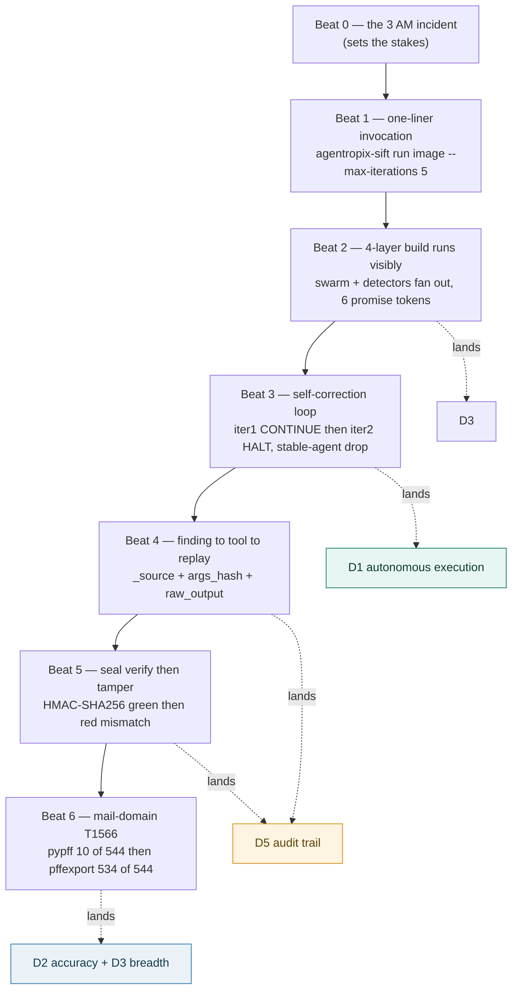

# Use Case — Guided Demo Walkthrough (Judge-Facing)

> **Actor:** a SANS / Devpost judge (or any evaluator) being walked through a single live triage run.
> **Goal:** Map a guided, end-to-end demonstration to the Devpost rubric (D1 autonomous execution,
> D5 audit trail, D2 accuracy, D3 breadth) using only runtime evidence that is verifiable in the
> source tree — the completion-promise tokens emitted on a real run, the self-correction iteration
> log, the verbatim Thymus REJECT strings, and the mail-domain recovery numbers.
> **Surfaces exercised:** the `agentropix-sift run` CLI (`src/agentropix_sift/cli.py`), the Trinity
> orchestrator (`src/agentropix_sift/orchestrator.py`), the ATT&CK detectors
> (`src/agentropix_sift/detectors/`), the Thymus read-only gate
> (`src/agentropix_sift/mcp_server/thymus_policy.py`), and the courtroom seal. See
> [`canonical-facts.md`](../08-reference/canonical-facts.md) for every numeric claim.

This page is the narrated counterpart to the reference use cases. Where
[uc-disk-triage.md](uc-disk-triage.md) and [uc-memory-triage.md](uc-memory-triage.md) describe the
tool sequences, this walkthrough threads them into one demonstration a judge can follow beat by
beat, with each beat landing a specific rubric dimension. The beat structure is imported from the
upstream demo script (`docs/DEMO-SCRIPT.md` in the main repo, BMAD-M8 era); every claim below is
re-anchored to the source it can be checked against.

> **How to read this page (two tracks per beat).** Each operational beat carries an eye-catching
> dual-audience callout so two very different evaluators can both follow along:
> - **🖥️ Expert track** — copy the `🖥️` command (the exact `agentropix-sift` CLI invocation or
>   forensic binary for that beat), run it, and read the verbatim token in the matching **Output**
>   block.
> - **💬 End-user track** — type the `💬` plain-language prompt into a Claude session that has the
>   Agentropix MCP connected. A single focused question is enough — the session recognises it as an
>   Agentropix capability and routes it to the **real MCP tool** named in the callout (every tool is
>   listed in [`tool-list.md`](../04-mcp-tools/tool-list.md)).
>
> Command/result pairs are enumerated **Execution X → Output X** so it is unambiguous what the judge
> **runs** versus what they **get back**. Every output token shown is a verbatim string in the source
> tree (the completion-promise constants, the Thymus REJECT strings, the seal-verifier print lines,
> the `volatility.py` fallback message) — not a marketing paraphrase. The strings here are real even
> though the recorded media is not (see the honest note below).

> **Honest note on recorded media.** Two captioned-MP4 recording attempts were made and **both were
> withdrawn by the operator as incorrect**; the MP4/GIF render artifacts were deleted. This
> walkthrough is therefore a **text artifact only** — the narrated structure plus the in-code
> evidence, not a video link. The narration script and the in-code tokens remain canonical and
> ready for a future recording attempt. (Provenance: the upstream `docs/DEMO-SCRIPT.md` describes
> the three asciinema casts; the withdrawn captioned renders are not judge-facing.)

---

## Contents — what's in this page (and what to expect)

> Jump to any section below. Each row tells you what that part gives you, so you can go straight to your point.

| Section | What you'll get |
|---|---|
| [The numbers this demo speaks in](#the-numbers-this-demo-speaks-in) | The canonical figures the demo cites (71 MCP tools, 16 SIFT binaries, 7 specialists + 6 detectors, 4464 tests, 0.85 halt, 72/72 and 108/118 recall) and how the old 46/11 counts reconcile. |
| [Beat map — demo to Devpost rubric](#beat-map--demo-to-devpost-rubric) | The Beat 0→6 flow diagram mapping each beat to the Devpost rubric dimension (D1, D2/D3, D5, D6) and the source that verifies it. |
| [Beat 0–1 — the problem, then the one-liner](#beat-01--the-problem-then-the-one-liner) | The 3 AM Tier-2 stakes and the single `agentropix-sift run` command, with the verbatim run banner and the `inference_constraint: high` line. |
| [Beat 2 — the 4-layer build runs visibly (D3 breadth)](#beat-2--the-4-layer-build-runs-visibly-d3-breadth) | How the 4-layer stack runs and the six verifiable completion-promise tokens a memory run emits (with their source lines). |
| [Beat 3 — the self-correction loop (D1 autonomous execution)](#beat-3--the-self-correction-loop-d1-autonomous-execution) | The Architect→Swarm→Critic loop, the CONTINUE-then-HALT iteration log, the stable-agent drop, and the `pslist→psscan` fallback. |
| [Beat 4 — finding → tool → replay (D5 audit trail)](#beat-4--finding--tool--replay-d5-audit-trail) | How each finding pivots to its producing tool via `_source` + `args_hash` + `raw_output`, and the deterministic byte-for-byte replay story. |
| [Beat 5 — seal verify, then tamper (D5 audit trail, continued)](#beat-5--seal-verify-then-tamper-d5-audit-trail-continued) | The HMAC-SHA256 seal demo: a clean verify on the untouched report, then an instant MISMATCH the moment a fabricated finding is injected. |
| [Beat 6 — mail-domain T1566 end-to-end (D2 accuracy + D3 breadth)](#beat-6--mail-domain-t1566-end-to-end-d2-accuracy--d3-breadth) | The measured PST recovery (10/544 pypff → 534/544 pffexport, 98.2%, 53× improvement) and the byte-identity audit behind the T1566 phishing IOCs. |
| [See also](#see-also) | Links to the disk, memory, and approval-gate use cases plus the canonical facts and agents lists. |

---

## The numbers this demo speaks in

Everything narrated below uses the canonical figures — never invent a competing count on screen.

| Claim shown on screen | Canonical value | Source |
|---|---|---|
| MCP tools | **71** distinct tool functions | [`canonical-facts.md`](../08-reference/canonical-facts.md); `docs/tools/_TOOL-CATALOGUE.md` |
| SIFT binaries the wrappers drive | **16** | [`canonical-facts.md`](../08-reference/canonical-facts.md); `cli.py` `doctor` dict |
| Core swarm specialists | **7** (memory, timeline, filesystem, artifact, discovery, mail, hunt) | `agents/__init__.py` |
| ATT&CK detector agents (interleaved in `SWARM`) | **6** | `detectors/`; `agents/__init__.py` |
| Test count | **4464** | [`canonical-facts.md`](../08-reference/canonical-facts.md) |
| Critic halt threshold (default) | **0.85** | `trinity/critic.py:42` |
| Disk recall (regression) | **72/72 (100%)** | [`canonical-facts.md`](../08-reference/canonical-facts.md) |
| Memory recall (combined) | **108/118 (91.5%)** | [`canonical-facts.md`](../08-reference/canonical-facts.md) |

> **Reconciliation.** Earlier demo drafts said "46 MCP tools" and "an 11-agent swarm." The
> source-of-truth count is **71 tools** and **7 core specialists + 6 ATT&CK detectors** — use those.
> The "11" figure was a per-run plan size, not the agent roster; the "46" figure predates the tool
> growth documented in [`canonical-facts.md`](../08-reference/canonical-facts.md) §"MCP tool-count lineage."

---

## Beat map — demo to Devpost rubric



| Beat | Rubric dimension | What the judge sees | Verifiable in |
|---|---|---|---|
| 0 | sets stakes | The 3 AM Tier-2 triage problem | `docs/DEMO-SCRIPT.md` Beat 1 |
| 1 | D6 usability | One command, no setup wizard | `cli.py` `run` subcommand |
| 2 | D3 breadth | 7 specialists + 6 detectors, the 6 promise tokens | `orchestrator.py`; `detectors/` |
| **3** | **D1 autonomous execution** | iter1 CONTINUE then iter2 HALT, `pslist→psscan` fallback | `orchestrator.py`; `volatility.py:1339` |
| **4** | **D5 audit trail** | `_source` + `args_hash` + `raw_output` linkage | `schema/report.schema.json` |
| **5** | **D5 audit trail** | seal verify green, tamper red mismatch | `scripts/verify_seal.py` |
| **6** | **D2 + D3** | mail recovery 10/544 then 534/544 (98.2%) | `_mail_parsers.py` (W-229) |

---

## Beat 0–1 — the problem, then the one-liner

The cold open frames the cost: a Tier-2 analyst paged at 3 AM with a compromised Windows domain
controller, a disk image and a memory dump, and one hour before the IR lead expects findings — today
that means running plaso, Volatility, Sleuth Kit, RegRipper and YARA by hand and mentally joining
their outputs. The demo's answer is a single command — no profile to select, no setup wizard.

> **🖥️ Expert (command):**
> ```bash
> agentropix-sift run /evidence/srl2018/win2008r2-controller-memory.001 --max-iterations 5
> ```
> **💬 End-user (prompt):** *"Triage this evidence image end to end and stage your findings as DRAFT —
> don't approve anything: `/evidence/srl2018/win2008r2-controller-memory.001`."*
> The session launches the autonomous swarm exactly as the CLI does and persists each result with the
> `record_finding` MCP tool (the same tool the `run` orchestrator calls under the hood), narrating
> progress as it goes. **One plain instruction is enough — the session recognises this as an
> Agentropix triage and drives the full sequence.** (`record_finding`; see
> [`tool-list.md`](../04-mcp-tools/tool-list.md) §"Findings, IOCs & reporting".)

Behind that one line the CLI hashes the evidence (so the report binds to the bytes), validates every
path against the operator-defined read-only zones (the Thymus gate, Beat 5), and launches the Trinity
Loop over the swarm. There is no profile to select. (`src/agentropix_sift/cli.py`.)

**Execution 1 → Output 1.**

*Execution 1:*
```bash
agentropix-sift run /evidence/srl2018/win2008r2-controller-memory.001 --max-iterations 5
```

*Output 1 (the run banner the CLI echoes; verbatim `typer.echo` lines from `cli.py:79-81`, then the
sealed-session summary from `cli.py:144-152`):*
```text
Agentropix-SIFT triage: /evidence/srl2018/win2008r2-controller-memory.001
  max-iterations: 5
  output: report.json
...
Findings: <n>
Tool calls: <n>
Status: complete
Report written to report.json
Audit log (sealed) at report.audit-log.json (<n> entries)
Session key (mode 0600) at report.session-key
Inference constraint: high (LLM is orchestrator; facts from MCP tools)
```

> **Why this banner matters (D6 usability).** The closing line —
> `Inference constraint: high (LLM is orchestrator; facts from MCP tools)` — is emitted on every run
> (`cli.py:152`) and is the one-line statement of the ADR-016 design: the AI orchestrates, the SIFT
> tools generate the facts. The judge sees it without asking.

---

## Beat 2 — the 4-layer build runs visibly (D3 breadth)

The four layers of the stack run in order: the **deterministic SIFT toolkit** (16 binaries) under
the **typed MCP surface** (71 tools), driven by the **7-agent swarm + 6 ATT&CK detectors**, all
wrapped in the **courtroom envelope** (Beat 5). The proof that each agent actually contributed is the
**completion-promise token** it emits — one snake-case token per agent that successfully published at
least one finding this run, appended to `report.completion_proofs[]` and sorted for diff-stability.
A verifier can fail a run that delivered findings but is missing a required promise
(`src/agentropix_sift/schema/report.schema.json`; the emit logic is `orchestrator.py:194-195` —
`if findings and agent.completion_promise: completion_proofs.add(...)`).

> **🖥️ Expert (command):**
> ```bash
> # After the run, read the verifiable completion-promise tokens out of the report:
> jq -r '.completion_proofs[]' report.json
> ```
> **💬 End-user (prompt):** *"Which specialists actually contributed findings on that run? Show me the
> completion proofs."*
> The session reads the same `completion_proofs[]` array (populated by the swarm and queryable through
> the report the `report_generate` MCP tool renders) and lists the tokens in plain language.
> (`report_generate`; [`tool-list.md`](../04-mcp-tools/tool-list.md) §"Findings, IOCs & reporting".)

On a real memory run, the six tokens emitted are:

| Promise token | Emitting agent / detector | Source |
|---|---|---|
| `CROSS_AGENT_CORRELATION_DONE` | HuntAgent (cross-modal correlation) | `agents/hunt.py:70` |
| `INJECTION_DETECTION_COMPLETE` | injection detector | `detectors/injection_detector.py:251` |
| `MEMORY_TRIAGED` | MemoryAgent | `agents/memory.py:538` |
| `T1059_001_IEX_LOOPBACK_SCAN_COMPLETE` | IEX loopback C2 detector | `detectors/t1059_001_iex_loopback_c2.py:436` |
| `T1546_008_ACCESSIBILITY_IFEO_HIJACK_COMPLETE` | IFEO accessibility-hijack detector | `detectors/t1546_008_accessibility_ifeo_hijack.py:619` |
| `YARA_HUNT_COMPLETE` | YARA hunt detector | `detectors/yara_hunt.py:164` |

**Execution 2 → Output 2.**

*Execution 2:*
```bash
jq -r '.completion_proofs[]' report.json
```

*Output 2 (the six tokens, sorted for diff-stability — each constant is verbatim in the cited source
file):*
```text
CROSS_AGENT_CORRELATION_DONE
INJECTION_DETECTION_COMPLETE
MEMORY_TRIAGED
T1059_001_IEX_LOOPBACK_SCAN_COMPLETE
T1546_008_ACCESSIBILITY_IFEO_HIJACK_COMPLETE
YARA_HUNT_COMPLETE
```

> **Why these six and not the disk set.** The disk-triage path emits a different token set
> (`TIMELINE_GENERATED`, `ARTIFACTS_PARSED`, `FILESYSTEM_WALKED`, …; `cli.py` `_REQUIRED_PROMISES`).
> A pure memory run does not walk a filesystem, so its promise set reflects the memory + detector
> specialists that fired. Both are correct — the token list is a function of which agents published
> findings, not a fixed banner.

---

## Beat 3 — the self-correction loop (D1 autonomous execution)

This is the beat the rubric's autonomous-execution dimension is scored on. The orchestrator runs the
**Architect → Swarm → Critic** loop; the Critic scores the accumulated findings and either
**CONTINUEs** (re-plan, drop the agents whose contribution sets plateaued) or **HALTs** when the
score crosses the **0.85** threshold (`trinity/critic.py:42`, `_DEFAULT_HALT_THRESHOLD = 0.85`, with
`_DEFAULT_MIN_ITERATIONS = 2`).

The iteration log shape the judge watches:

```text
Iteration 1: plan=[memory, timeline, artifact, filesystem, hunt, <detectors>]
  → memory.injection malfind hit on rundll32.exe (T1055)
  → memory.persistence.registry HKLM\...\Run\Updater (T1547.001)
  → timeline.plaso 4624 logon as DOMAIN\Administrator (T1078)
  Critic score 0.82  (threshold 0.85)  →  CONTINUE  (drop stable agents)

Iteration 2: plan=[hunt]    ← memory / timeline / artifact stable, dropped
  → hunt.correlation new cross-modal token → previously-unseen join
  Critic score 0.94  (threshold 0.85)  →  HALT  (status=complete, 2 iter)
```

Two distinct self-corrections are visible:

1. **Stable-agent drop (the planner reallocates compute).** Agents whose contribution sets stopped
   changing are dropped from the next plan, so the remaining budget is spent only on agents still
   surfacing new material. The halt decision itself is a pure-Python state machine — deterministic
   and unit-testable, no LLM in the halt path (`trinity/critic.py`).

2. **`pslist → psscan` fallback inside the MemoryAgent.** When the memory dump is a paused-VM
   snapshot, `windows.info` reports `KeNumberProcessors=0` and the list-walking plugins silently
   return empty rows; the agent falls through to pool-scan plugins. The wrapper makes this concrete:
   *"pslist returned 0 processes (corrupted ActiveProcessLinks); falling back to psscan (pool tag
   scanning)"* — `mcp_server/wrappers/volatility.py:1339`, with the pre-flight rationale at
   `agents/memory.py:7-10` and `wrappers/volatility.py:236`. The result row carries
   `used_fallback=True` (`volatility.py:172`) so the self-correction is itself audited.

This is the fallback a judge can reproduce by hand — the same `get_pslist` MCP tool the MemoryAgent
calls inside the loop:

> **🖥️ Expert (command):**
> ```bash
> # Drive the same memory list the MemoryAgent runs; on a paused-VM image it self-corrects:
> agentropix-sift run /evidence/srl2018/win2008r2-controller-memory.001 --max-iterations 5 --verbose
> ```
> **💬 End-user (prompt):** *"List the running processes from this memory image — and if the process
> list looks empty or corrupted, fall back to a pool-tag scan."*
> The session calls the `get_pslist` MCP tool, which auto-falls-back to `psscan` on a corrupted
> `ActiveProcessLinks` and returns the rows with `used_fallback=True`. **The end-user does not have to
> know the plugin names — the focused question routes to the tool, which handles the fallback.**
> (`get_pslist`; [`tool-list.md`](../04-mcp-tools/tool-list.md) §"Memory forensics — Volatility".)

**Execution 3 → Output 3.**

*Execution 3:* run the memory triage above with `--verbose`; the `get_pslist` path hits the
paused-VM branch.

*Output 3 (the verbatim self-correction log line; `volatility.py:1339`):*
```text
pslist returned 0 processes (corrupted ActiveProcessLinks); falling back to psscan (pool tag scanning)
```
The recovered rows then carry `used_fallback=True` (`volatility.py:172`) so the self-correction is
itself part of the audit trail Beats 4–5 seal.

---

## Beat 4 — finding → tool → replay (D5 audit trail)

Every finding carries a `_source` field naming the MCP tool that produced it, and every tool call is
recorded in the report's trace with the SHA-256 of its arguments (`args_hash`), the `exit_code`, the
`duration_ms`, and the binary's `raw_output` captured **before** any LLM summarizes it
(`schema/report.schema.json`; the `@traced` span in `docs/DEMO-SCRIPT.md`'s architecture diagram).

> **🖥️ Expert (command):**
> ```bash
> # Pivot from a finding to the exact tool call that produced it:
> jq '.findings[] | select(._source=="memory.injection")' report.json
> jq '.trace.tool_calls[] | select(.args_hash=="f7e2c4d8...")' report.json
> ```
> **💬 End-user (prompt):** *"Show me the injection finding and the exact tool call that produced it,
> then export the report so I can hand it to the IR lead."*
> The session reads the finding's `_source` and matching trace entry, then renders/exports the report
> through the `report_export` MCP tool — the same sealed document the CLI writes.
> (`report_export`; [`tool-list.md`](../04-mcp-tools/tool-list.md) §"Findings, IOCs & reporting".)

**Execution 4 → Output 4.**

*Execution 4:*
```bash
jq '.findings[] | select(._source=="memory.injection")' report.json
```

*Output 4 (a finding row naming its producing MCP tool in `_source`, with the trace linkage fields
defined in `schema/report.schema.json`):*
```json
{
  "_source": "memory.injection",
  "confidence": 0.9,
  "args_hash": "f7e2c4d8...",
  "raw_output": "<binary output captured before any LLM summarized it>"
}
```

The replay story: extract a finding's `args_hash`, find the matching trace entry, and re-invoke the
tool with those exact arguments — the binary's output should match the recorded `raw_output`
byte-for-byte. The replay is deterministic because the facts come from the SIFT tools, not the model
(`inference_constraint=high` in the report; the ADR-016 design statement: *the AI orchestrates; the
SIFT tools generate the facts*).

---

## Beat 5 — seal verify, then tamper (D5 audit trail, continued)

The report is sealed with **HMAC-SHA256** under a per-run key written to a mode-`0600` file
(`<report>.session-key`); the audit log is independently sealed and cross-bound into the report seal,
so swapping the audit log post-run breaks the report seal too. Verification is a dependency-free
Python script a judge runs on any machine:

> **🖥️ Expert (command):**
> ```bash
> python scripts/verify_seal.py report.json     # verify the untouched report
> python scripts/verify_seal.py tampered.json   # verify a fabricated copy
> ```
> **💬 End-user (prompt):** *"Is this triage report still sealed and trustworthy, or has it been
> altered since SIFT wrote it?"*
> The session reports whether the HMAC-SHA256 seal still verifies. The seal itself is laid down by the
> HMAC-approval surface (`approve_finding`, an **[APPR]** MCP tool); the *verification* step is the
> dependency-free `scripts/verify_seal.py` script — a judge runs it on any machine, no MCP needed,
> which is the point of an offline chain-of-custody proof. (`approve_finding`;
> [`tool-list.md`](../04-mcp-tools/tool-list.md) §"Approval workflow — HMAC sidecar".)

**Execution 5 → Output 5 (untouched report).**

*Execution 5:*
```bash
python scripts/verify_seal.py report.json
```

*Output 5 (verbatim print line; `verify_seal.py:143`, exit 0):*
```text
OK Report seal verified.
```

**Execution 6 → Output 6 (fabricated finding injected).**

*Execution 6:*
```bash
jq '.findings += [{"_source":"FAKE","confidence":1.0,"description":"fabricated"}]' \
       report.json > tampered.json
python scripts/verify_seal.py tampered.json
```

*Output 6 (verbatim print lines; `verify_seal.py:138,141`, exit non-zero):*
```text
X Report seal MISMATCH - report has been altered.
   Reject this report as evidence.
```

Clean verify on the untouched report; instant mismatch the moment a fabricated finding is injected.
The chain-of-custody story is a script you can run, not a marketing claim
(`scripts/verify_seal.py`; `docs/DEMO-SCRIPT.md` Beat 4).

---

## Beat 6 — mail-domain T1566 end-to-end (D2 accuracy + D3 breadth)

The mail domain is where the accuracy story is most concrete, because it is a measured recovery on a
real PST. On the SRL-2015 nromanoff corpus (544 messages total):

> **🖥️ Expert (command):**
> ```bash
> # Carve the PST, recover messages, and index attachment-hash IOCs:
> agentropix-sift run /evidence/srl2015/nromanoff.pst --max-iterations 5
> ```
> **💬 End-user (prompt):** *"Carve this PST for phishing IOCs — recover as many messages and
> attachments as you can and give me the attachment hashes: `/evidence/srl2015/nromanoff.pst`."*
> The session calls the `carve_pst_iocs` MCP tool, which runs the `pffexport` recovery path on top of
> `pypff` and returns the recovered-message count plus hash-pivotable attachment IOC rows. A confirmed
> attachment hash can then be fanned across hosts with the `pivot_on_ioc` MCP tool.
> (`carve_pst_iocs`, `pivot_on_ioc`; [`tool-list.md`](../04-mcp-tools/tool-list.md) §"Mail / maldoc
> / documents" and §"Findings, IOCs & reporting".)

**Execution 7 → Output 7.**

*Execution 7:* run the carve above (or call `carve_pst_iocs` directly).

*Output 7 (the measured recovery — `pypff` baseline vs the `pffexport` recovery path; numbers anchor
to the merged PRs in `docs/SIFT-WEAKNESSES.md`):*
```text
pypff baseline:      10 / 544 messages
pffexport recovery: 534 / 544 messages  (98.2%)  → 53x coverage improvement
parser_note on recovered rows: pffexport_recovered:synthesized_eml
```

| Stage | Engine | Messages recovered | Source |
|---|---|---|---|
| Baseline | stock `pypff` | **10 / 544** clean (6 attachment-bearing) | W-218, PR #128 `f711f168b` |
| Recovery | `pffexport` subprocess + dedup | **534 / 544** (98.2%) — 10 pypff + 524 pffexport, 15 deduped | W-229, PR #129 `a8703fac9` |

That is a **53× coverage improvement** over the pypff-only path (W-229). The 534 messages are
unique-after-dedup (`_dedup_key = (subject[:1024], sender, normalized_date)`), and recovered messages
carry `parser_note="pffexport_recovered:synthesized_eml"` for chain-of-custody. The recovery has a
kill switch (`AGENTROPIX_MAIL_RECOVERY_ENABLED`, W-230) and a **byte-identity audit**
(`TestPffexportByteIdentityAudit`, W-231, PR #132 `00d13dc8b`) that asserts a SHA-256 match between
the `pypff.read_buffer()` and `pffexport` file-write paths for the shared messages — the strongest
chain-of-custody proof for the mail domain. (All numbers anchor to the merged PRs in the main repo's
`docs/SIFT-WEAKNESSES.md` ledger; 534/544 = 98.2%.)

This lands T1566 (Phishing): the recovered attachments are the IOC surface the `carve_pst_iocs` tool
(W-210, PR #133) turns into hash-pivotable forensic rows.

---

## See also

- [uc-disk-triage.md](uc-disk-triage.md) — the disk path narrated in Beats 1–5.
- [uc-memory-triage.md](uc-memory-triage.md) — the Volatility memory path and the `pslist→psscan`
  fallback shown in Beat 3.
- [uc-approval-gate.md](uc-approval-gate.md) — the DRAFT → APPROVED → sealed spine behind Beats 4–5.
- [`canonical-facts.md`](../08-reference/canonical-facts.md) — every numeric claim on this page (71 tools, 16 SIFT
  binaries, 4464 tests, 72/72 disk recall, 108/118 memory recall, halt threshold 0.85).
- [`agents-list.md`](../10-agents/agents-list.md) — the 7 core specialists + 6 ATT&CK detectors
  whose promise tokens land in Beat 2.
- [agentic-architecture.md](../10-agents/agentic-architecture.md) — the runtime swarm + Trinity Loop behind the 4-layer build in Beat 2.

---

## Implementation proof (source)

> **For developers.** This section maps every beat above to the concrete code path that implements
> it, so a reader can open the named file and verify the claim. All citations are
> `file:symbol`/`file:line` against the oracle source tree
> (`/home/admin2/agentropix-sift/src`); line numbers were verified on the checkout used to write
> this page (constants and strings are what move least, so cite the *symbol* first and the line as a
> hint). Nothing here is paraphrased — the tokens, thresholds and print strings shown in the beats
> are the literal source values.

### Beat-to-code map

| Beat | What it demonstrates | Implementing symbol(s) | File |
|---|---|---|---|
| 1 | one-liner CLI; run banner; SHA-256 binding | `cli.run()` (banner `typer.echo` at `cli.py:79-81`, summary at `cli.py:144-152`) | `cli.py` |
| 1 | seal written over the final document | `courtroom.write_sealed_session()` | `courtroom.py:341` |
| 2 | swarm + detector roster; promise tokens | `agents.SWARM` tuple; `SwarmAgent.completion_promise` | `agents/__init__.py:45`; per-agent files |
| 2 | promise emitted only when agent published ≥1 finding | `run_triage()` emit guard | `orchestrator.py:194-195` |
| 3 | Architect→Swarm→Critic loop, halt @ 0.85 | `run_triage()` loop; `Critic.score()`; `_DEFAULT_HALT_THRESHOLD` | `orchestrator.py:146-269`; `trinity/critic.py:42,192` |
| 3 | stable-agent drop | `Critic.score()` `stable_agents`; `_apply_stable_drop()` | `trinity/critic.py:144-148`; `orchestrator.py:325` |
| 3 | `pslist→psscan` fallback | `get_pslist()` fallback branch; `PsList.used_fallback` | `wrappers/volatility.py:1259,1336-1350` |
| 4 | finding `_source` + trace `args_hash`/`raw_output` | report schema; `record_finding()` | `schema/report.schema.json:34-68`; `wrappers/case_records.py:205` |
| 5 | seal verify / tamper print lines | `verify_seal.main()` | `scripts/verify_seal.py:110,138,141,143` |
| 5 | seal laid down by approval surface | `approve_finding()` | `wrappers/case_records.py:545` |
| 6 | PST carve → IOC rows | `carve_pst_iocs()` | `wrappers/pst_carve.py:133` |
| 6 | pffexport recovery + dedup | `parse_pst_with_recovery()`; `_dedup_key()` | `agents/_mail_parsers.py:974,712` |
| 6 | byte-identity chain-of-custody audit | `TestPffexportByteIdentityAudit` | `tests/unit/test_issue_17_mail_parsers.py:1158` |

### Beat 1 — the `run` command and the banner

The one-liner is a Typer subcommand; the verbatim banner lines (Output 1) are emitted directly:

```python
# src/agentropix_sift/cli.py:50  (run() subcommand)
@app.command()
def run(image: Path = typer.Argument(...),
        max_iterations: int = typer.Option(5, "--max-iterations", "-n", ...),
        out: Path = typer.Option(Path("report.json"), "--out", "-o", ...),
        verbose: bool = typer.Option(False, "--verbose", "-v", ...)) -> None:
    ...
    typer.echo(f"Agentropix-SIFT triage: {image}")          # cli.py:79
    typer.echo(f"  max-iterations: {max_iterations}")        # cli.py:80
    ...
    report = asyncio.run(run_triage(image, max_iterations=max_iterations, ...))  # cli.py:117
    ...
    typer.echo("Inference constraint: high (LLM is orchestrator; facts from MCP tools)")  # cli.py:152
```

The closing `Inference constraint: high …` line is a hard-coded literal (`cli.py:152`) — it is not
data-driven, so it appears on every run regardless of findings. The evidence-bytes binding and the
three sealed output files come from `courtroom.write_sealed_session(report_dict, audit_entries, out, …)`
(`courtroom.py:341`), called at `cli.py:142`, which generates the single per-run session key, seals
the audit log, cross-binds it into the report, then seals the report under `report_seal`. The
`evidence_image_sha256` field shown in the report is computed by `courtroom.evidence_image_sha256()`
(`courtroom.py:89`), called in `run_triage()` at `orchestrator.py:292`.

### Beat 2 — the swarm roster and the completion-promise contract

The roster is the `SWARM` tuple — the 7 core specialists interleaved with the ATT&CK detectors:

```python
# src/agentropix_sift/agents/__init__.py:45
SWARM: tuple[type[SwarmAgent], ...] = (
    MemoryAgent, TimelineAgent, FilesystemAgent, ArtifactAgent, DiscoveryAgent,
    NullSessionBaselineAgent, MailAgent, YARAHuntAgent, InjectionDetector,
    AccessibilityIfeoHijackDetector, IexLoopbackC2Detector,
    T1071SvchostOutboundHttpDetector, HuntAgent,   # HuntAgent LAST — it consumes others' findings
)
```

Each agent declares its promise token as a class attribute, e.g.
`MemoryAgent.completion_promise = "MEMORY_TRIAGED"` (`agents/memory.py:538`),
`HuntAgent.completion_promise = "CROSS_AGENT_CORRELATION_DONE"` (`agents/hunt.py:70`),
`InjectionDetector.completion_promise = "INJECTION_DETECTION_COMPLETE"`
(`detectors/injection_detector.py:251`), `YARAHuntAgent` → `YARA_HUNT_COMPLETE`
(`detectors/yara_hunt.py:164`), the IEX detector → `T1059_001_IEX_LOOPBACK_SCAN_COMPLETE`
(`detectors/t1059_001_iex_loopback_c2.py:436`), the IFEO detector →
`T1546_008_ACCESSIBILITY_IFEO_HIJACK_COMPLETE` (`detectors/t1546_008_accessibility_ifeo_hijack.py:619`).
All six Output-2 tokens are therefore literal source constants.

The orchestrator only records a promise when the agent both ran cleanly **and** published at least
one finding — this is the guard that makes a token a *verifiable contract* rather than a banner:

```python
# src/agentropix_sift/orchestrator.py:194  (inside the per-agent loop in run_triage)
if findings and agent.completion_promise:
    completion_proofs.add(agent.completion_promise)
```

`completion_proofs` is a `set` (so an iter-1 token still counts after the agent is dropped) and is
emitted `sorted(...)` into the report at `orchestrator.py:319`, which is why Output 2 is alphabetised
and diff-stable. Note `MemoryAgent` *clears* its own promise to `""` on a degraded/empty dump
(`agents/memory.py:553-556`), so a silently broken memory wrapper cannot satisfy the contract.

### Beat 3 — the Trinity loop, halt threshold, stable-agent drop, psscan fallback

The Architect→Swarm→Critic loop is the `for iteration in range(1, max_iterations + 1)` body of
`run_triage()` (`orchestrator.py:146`). Each iteration: `architect.plan(...)` picks the slice
(`orchestrator.py:158`), every planned agent runs (`orchestrator.py:175-222`), then
`critic.score(blackboard, planned_agents=plan_names, iteration=iteration)` (`orchestrator.py:229`)
decides. The halt is a pure-Python state machine — **no LLM in the halt path**:

```python
# src/agentropix_sift/trinity/critic.py:42
_DEFAULT_HALT_THRESHOLD = 0.85
_DEFAULT_MIN_ITERATIONS = 2
...
# trinity/critic.py:192  (Critic.score)
elif score >= self.halt_threshold:
    should_halt = True
```

The `0.85` and the 2-iteration floor are the exact constants Beat 3 cites; both are env-overridable
(`AGENTROPIX_CRITIC_HALT_THRESHOLD` / `AGENTROPIX_CRITIC_MIN_ITERATIONS`) via the
`get_float`/`get_int` helpers (`critic.py:76-88`). The W-083 coverage guard refuses to halt while any
*planned* agent produced zero findings (`critic.py:180-185`), which is what keeps the demo's iter-1
on CONTINUE even when a single high-confidence finding saturates `max_conf`.

The **stable-agent drop** is `Critic.score()` computing the `stable_agents` frozenset — agents whose
per-agent fingerprint is non-empty and unchanged since the last pass (`critic.py:144-148`) — which the
orchestrator feeds back as `last_stable` (`orchestrator.py:239`); the Architect (or, for test
overrides, `_apply_stable_drop()` at `orchestrator.py:325`) removes those agents from the next plan.
The dropped set is stamped onto the per-iteration record at `orchestrator.py:237,246` so
`report.iterations[].dropped_agents` carries the Reflexion-lite narrative the demo reads.

The **`pslist→psscan` fallback** lives in the Volatility wrapper that backs the `get_pslist` MCP tool:

```python
# src/agentropix_sift/mcp_server/wrappers/volatility.py:1259
async def get_pslist(image, *, pid_filter=None, timeout=None) -> PsList:
    ...
    processes = _parse_pslist_csv(stdout)
    if len(processes) == 0:                                   # volatility.py:1336
        logger.warning(
            "pslist returned 0 processes (corrupted ActiveProcessLinks); "
            "falling back to psscan (pool tag scanning)")     # volatility.py:1339 — Output 3 verbatim
        psscan_result = await _get_psscan(image, timeout=timeout)
        return PsList(..., used_fallback=True, ...)            # volatility.py:1350
```

`PsList.used_fallback` defaults `False` (`volatility.py:172`) and is set `True` on the fallback path,
so the self-correction is itself a field in the audited result. The MemoryAgent's pre-flight rationale
(why a paused-VM `KeNumberProcessors=0` snapshot needs this) is the module docstring at
`agents/memory.py:1-11` (W-074). The MCP-tool entry point is `mcp_get_pslist` at `server.py:338-368`
(the `@traced("get_pslist")` span), which calls the wrapper above.

### Beat 4 — finding → tool → replay (audit fields)

The `_source`, `args_hash` and `raw_output` fields shown in Output 4 are *required/declared* in the
report schema:

```jsonc
// src/agentropix_sift/schema/report.schema.json
"required": ["_source", "confidence", "description"],                       // :34
"_source": {"type": "string", "description": "Tool name that produced this finding"},  // :36
"args_hash": {"type": "string"},                                            // :66
"raw_output": { ... }                                                       // :68
```

Findings are persisted through the `record_finding` MCP tool
(`wrappers/case_records.py:205` → `async def record_finding(...)`; MCP-exposed at
`fastmcp_app.py:1111`), which is exactly the tool the End-user prompt in Beat 1 routes to. The trace
`tool_calls[]` (with the per-call `args_hash`/`raw_output`) is assembled by `run_triage()` via the
`trace_scope()` buffer (`orchestrator.py:183,211`) and written into `report.trace`
(`orchestrator.py:300-306`). The deterministic-replay claim rests on `inference_constraint="high"`
(`TriageReport.inference_constraint`, `orchestrator.py:69`): facts come from the SIFT tools, not the
model.

### Beat 5 — seal verify, then tamper

The verifier is the dependency-free `scripts/verify_seal.py`; its `main(argv)` (`:110`) prints the
exact Output-5/Output-6 strings:

```python
# scripts/verify_seal.py
print("X Report seal MISMATCH - report has been altered.")  # :138  (Output 6)
print("   Reject this report as evidence.")                 # :141  (Output 6)
print("OK Report seal verified.")                           # :143  (Output 5)
```

It also checks the cross-bind (`OK Cross-bind verified …`, `:106`) and the audit-log internal seal
(`:92,96`), so swapping the audit-log file post-run breaks the report seal too — exactly the
cross-binding `write_sealed_session()` lays down (`courtroom.py:356-360`). The seal itself is the
HMAC surface laid down by `approve_finding` (`wrappers/case_records.py:545`); *verification* needs no
MCP — that is the offline chain-of-custody point.

### Beat 6 — mail-domain T1566 recovery

The MCP entry point is `carve_pst_iocs(path)` (`wrappers/pst_carve.py:133`, MCP-exposed at
`fastmcp_app.py:1860`), which returns per-message rows plus a hash-keyed `ioc_index` for pivots
(`pivot_on_ioc`, `wrappers/correlation.py:413`). The 10/544 → 534/544 recovery is implemented by
`parse_pst_with_recovery()` (`agents/_mail_parsers.py:974`): it runs `pypff` first, then shells out to
`pffexport` for messages pypff cannot read, and de-duplicates the two engines' output via
`_dedup_key()` (`agents/_mail_parsers.py:712`):

```python
# src/agentropix_sift/agents/_mail_parsers.py:712
def _dedup_key(m: MailMessage) -> tuple[str, str, str]:
    subject = (m.subject or "")[:_SUBJECT_CAP]               # cap matches the pypff path
    return (subject, m.sender or "", _normalize_date(m.date))
```

Recovered rows carry `parser_note="pffexport_recovered:synthesized_eml"` for chain-of-custody, and the
W-230 kill switch is `_MAIL_RECOVERY_ENABLED_ENV = "AGENTROPIX_MAIL_RECOVERY_ENABLED"`
(`agents/_mail_parsers.py:339`). The strongest mail-domain proof — a SHA-256 match between the
`pypff.read_buffer()` bytes and the `pffexport` file-write path for shared messages — is asserted by
`TestPffexportByteIdentityAudit` (`tests/unit/test_issue_17_mail_parsers.py:1158`), the W-231 audit
the beat names.

> **Verification note.** Symbols and string/constant literals (the promise tokens, `0.85`, the
> `verify_seal` print lines, the `volatility.py` fallback message) are stable anchors; the
> parenthetical line numbers are hints against the writing-time checkout. If a line drifts, grep the
> symbol — e.g. `grep -rn "completion_promise" src/agentropix_sift/{agents,detectors}` or
> `grep -n "_DEFAULT_HALT_THRESHOLD" src/agentropix_sift/trinity/critic.py`.
