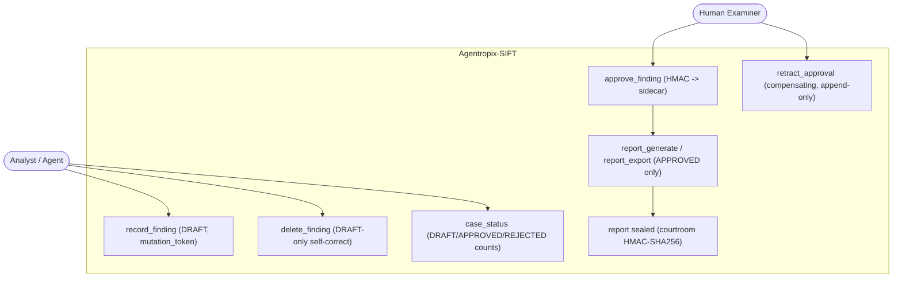
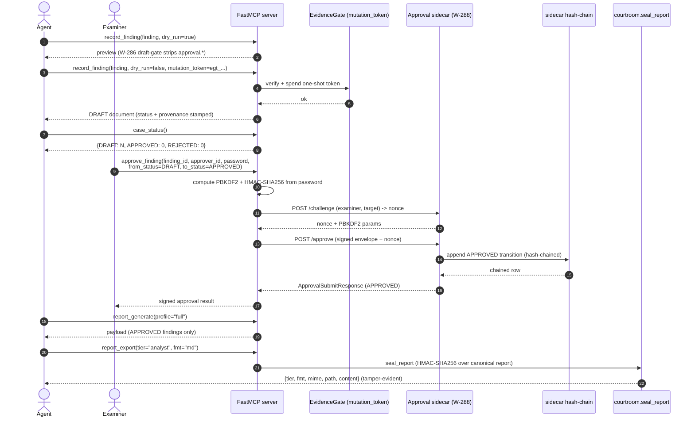

# Use Case — Examiner Reviews and Approves Findings Before the Seal

> **Actors:** the analyst/agent (stages findings) and a **human examiner** (approves them).
> **Goal:** Move a finding from agent-authored **DRAFT** to examiner-signed **APPROVED** before any
> report is generated — so the LLM can never self-approve, and only HMAC-signed approvals reach the
> sealed report.
> **Surfaces exercised:** `record_finding` / `delete_finding` (`wrappers/case_records.py`),
> `approve_finding` / `retract_approval`, and the **HMAC approval sidecar**
> (`approval_sidecar/`). See [`.crew/tool-list.md`](../../.crew/tool-list.md) and
> [`.crew/env-vars.md`](../../.crew/env-vars.md) §Approval-sidecar.

This is the chain-of-custody spine that separates DRAFT analysis from a court-defensible report.
Every finding enters as **DRAFT** through the W-286 draft-gate (which strips any caller-supplied
`approval.*` field — the LLM cannot stamp its own approval), and only an HMAC-signed approval
routed to the W-288 sidecar promotes it. Report generation/export filter to **APPROVED only**, so
the approval step is load-bearing and must precede report tiers
(`docs/guides/playbooks.md` §C; `docs/guides/end-to-end-scenario.md` §Phase 5).

---

## Use-case diagram



The analyst stages DRAFT findings and can self-correct an over-count with `delete_finding`
(DRAFT-only). The **examiner** — a separate human actor — issues the HMAC-signed `approve_finding`,
the only edge that promotes a finding to APPROVED. `retract_approval` is the compensating,
append-only reversal (ADR-016/022). Only APPROVED findings flow into `report_generate` /
`report_export`, which are then sealed by the courtroom.

---

## Sequence — DRAFT → APPROVED → sealed report



Findings are staged with `dry_run=true` first for preview, then committed with `dry_run=false` and a
valid one-shot `mutation_token` (`egt_<ULID>` from `AGENTROPIX_MUTATION_TOKEN`); the **W-286
draft-gate** strips any `approval.*` and stamps `DRAFT` + provenance, so the agent surface cannot
self-approve. Approval is a **two-leg sidecar handshake**: the MCP server first `POST /challenge`s for
a nonce bound to `(examiner, target)`, then `POST /approve`s the PBKDF2 + HMAC-SHA256-signed envelope
(`approval_sidecar/models.py` — `ChallengeRequest`/`ApprovalSubmitRequest`, `from_status`/`to_status`
∈ `DRAFT|APPROVED|REJECTED|REVOKED`). The DRAFT→APPROVED transition lives in the sidecar's
append-only **hash-chain**, never in the LLM. Report generation/export then filter to APPROVED and
seal with `courtroom.seal_report`.

> **Documented caveat (from the `approve_finding` docstring):** in this MVP flow the `password`
> transits the LLM request context for the call duration. Operators uneasy with that wait for the
> Phase-2 browser approval UI (`approval_sidecar/static/`). The `password` is consumed once and
> dropped after the HMAC is computed.

---

## Actor, preconditions, steps, postconditions

**Actors:**
- **Analyst / agent** — stages and self-corrects DRAFT findings.
- **Human examiner** — the only actor who can approve; holds the PBKDF2 credentials.

**Preconditions**

- An active case exists (`case_init` / `case_activate`); the active-case pointer lives at
  `~/.agentropix/active_case`.
- A valid one-shot mutation token is available for the live `record_finding` write
  (`agentropix-sift evidence-gate mint` → `AGENTROPIX_MUTATION_TOKEN`).
- The approval sidecar is running and reachable (`AGENTROPIX_APPROVAL_SIDECAR_URL`, default
  `http://127.0.0.1:8800`).
- The examiner's PBKDF2 identity is configured and **stable across restarts**:
  `AGENTROPIX_APPROVER_USER`, `AGENTROPIX_APPROVER_PASSWORD`, `AGENTROPIX_APPROVER_SALT_HEX`
  ([`.crew/env-vars.md`](../../.crew/env-vars.md) §Approval-sidecar). A changed salt/password
  invalidates the hash-chain continuity.

**Numbered steps**

1. *(Analyst)* `record_finding(finding, dry_run=true)` — preview the staged DRAFT.
2. *(Analyst)* `record_finding(finding, dry_run=false, mutation_token=egt_...)` — commit the DRAFT
   (idempotent on `(case_id, finding_id)`). Self-correct an over-count with
   `delete_finding(finding_id, dry_run=false)` (DRAFT-only).
3. *(Analyst)* `case_status()` — confirm the DRAFT/APPROVED/REJECTED counts before approval.
4. *(Examiner)* `approve_finding(finding_id, approver_id, password, from_status="DRAFT",
   to_status="APPROVED", reason="...")` — the HMAC-signed seal; repeat per finding.
5. *(Analyst)* `report_generate(profile="full")` then `report_export(tier=..., fmt=...)` — render the
   APPROVED-only report and seal it.

**Postconditions**

- The finding is `APPROVED` in the sidecar's append-only hash-chain (PBKDF2 + HMAC-SHA256).
- Only APPROVED findings appear in any report tier; a report run before approval yields only the
  executive/empty shell.
- An accidental approval can be reversed with `retract_approval` — a **compensating, append-only**
  entry (the chain is never edited).
- The exported report is sealed by `courtroom.seal_report` (HMAC-SHA256) and is tamper-evident.

**CLI commands used**

```bash
# Mint the one-shot mutation token the live record_finding needs
agentropix-sift evidence-gate mint   # -> egt_<ULID>; export as AGENTROPIX_MUTATION_TOKEN

# Run the approval sidecar (HMAC human-in-the-loop service)
python -m agentropix_sift.approval_sidecar
```

`record_finding`, `case_status`, `approve_finding`, `retract_approval`, `report_generate`, and
`report_export` are **MCP tool calls** issued by the MCP client against the running server — not CLI
subcommands. The CLI commands above provision the two prerequisites (the mutation token and the
sidecar service).

---

## See also

- [uc-disk-triage.md](uc-disk-triage.md) — where DRAFT disk findings originate.
- [uc-memory-triage.md](uc-memory-triage.md) — where DRAFT memory findings originate.
- [uc-wazuh-push.md](uc-wazuh-push.md) — pushing the APPROVED IOCs onward (optional integration).
- [`.crew/tool-list.md`](../../.crew/tool-list.md) — `[APPR]` approval-gated tools and `[MUT]` writes.
- [`.crew/module-map.md`](../../.crew/module-map.md) — `approval_sidecar/`, `courtroom.py`, `evidence_gate/`.
