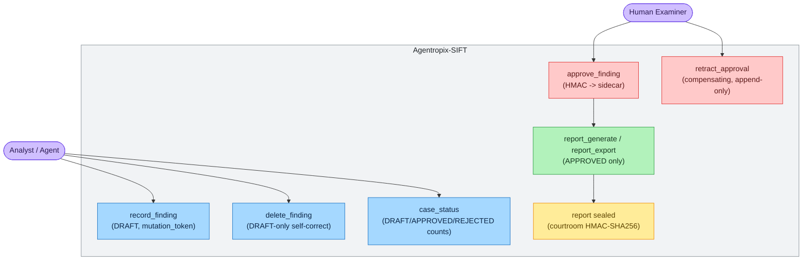
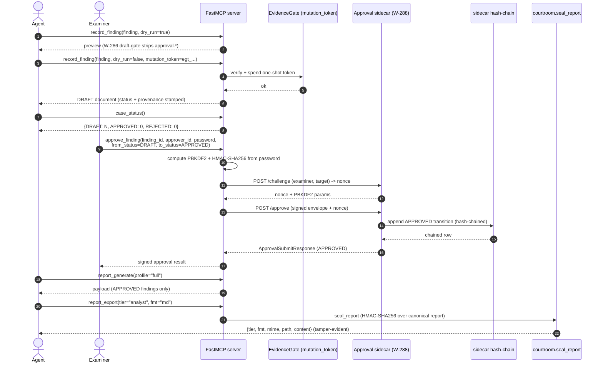

# Use Case — Examiner Reviews and Approves Findings Before the Seal

> **Actors:** the analyst/agent (stages findings) and a **human examiner** (approves them).
> **Goal:** Move a finding from agent-authored **DRAFT** to examiner-signed **APPROVED** before any
> report is generated — so the LLM can never self-approve, and only HMAC-signed approvals reach the
> sealed report.
> **Surfaces exercised:** `record_finding` / `delete_finding` (`wrappers/case_records.py`),
> `approve_finding` / `retract_approval`, and the **HMAC approval sidecar**
> (`approval_sidecar/`). See [`tool-list.md`](../04-mcp-tools/tool-list.md) and
> [`env-vars.md`](../07-sdlc-ops/env-vars.md) §Approval-sidecar.
>
> **Doing the approval in the browser?** The step-by-step
> [Approval Portal walkthrough](../05-safety-forensics/approval-portal.md)
> (screenshot, every field, how to submit) covers the human side of this use case.

> **How to read this page (two audiences at once).** Like the
> [gold-standard user guide](../01-overview/user-guide.md), every operator action below is shown
> **both** ways in an eye-catching callout:
> - **🖥️ Expert (command):** the exact CLI / MCP / `curl` call to type.
> - **💬 End-user (prompt):** the plain-language question to type into a Claude session that has the
>   Agentropix MCP connected. A simple, focused question is enough — the session recognises it as an
>   Agentropix capability and routes it to the right MCP tool automatically.
>
> The **Execution → Output** blocks in [§Walkthrough](#walkthrough--gate-challenge-approval-resumed-run)
> label what you **run** vs what you **get back**. All nonces, tokens, salts, signatures and approval
> IDs are **placeholders** (`<nonce>`, `<egt-token>`, `<signature-hex>`, `<approval-id>`) — never paste
> a real secret into a tracked file.

This is the chain-of-custody spine that separates DRAFT analysis from a court-defensible report.
Every finding enters as **DRAFT** through the W-286 draft-gate (which strips any caller-supplied
`approval.*` field — the LLM cannot stamp its own approval), and only an HMAC-signed approval
routed to the W-288 sidecar promotes it. Report generation/export filter to **APPROVED only**, so
the approval step is load-bearing and must precede report tiers
(`docs/guides/playbooks.md` §C; `docs/guides/end-to-end-scenario.md` §Phase 5).

---

## Contents — what's in this page (and what to expect)

> Jump to any section below. Each row tells you what that part gives you, so you can go straight to your point.

| Section | What you'll get |
|---|---|
| [Use-case diagram](#use-case-diagram) | The actor/tool map showing who can do what — analyst stages DRAFTs, only the examiner approves, APPROVED flows to the sealed report. |
| [Sequence — DRAFT → APPROVED → sealed report](#sequence--draft--approved--sealed-report) | The full handshake timeline: draft-gate write, two-leg sidecar challenge/approve, then APPROVED-only generation and seal. |
| [Actor, preconditions, steps, postconditions](#actor-preconditions-steps-postconditions) | The runbook: actors, what must be true first, numbered steps (expert command + end-user prompt), and the guaranteed end state. |
| [Walkthrough — gate challenge, approval, resumed run](#walkthrough--gate-challenge-approval-resumed-run) | Copy-pasteable Execution → Output transcripts for the `/challenge` nonce, signed `/approve`, the resumed report, and retraction. |
| [See also](#see-also) | Links to where DRAFT findings originate, downstream IOC push, and the tool/module references. |

---

## Use-case diagram



> 🔍 **[Open as SVG — full size, zoomable](assets/uc-approval-gate-1.svg)** (renders larger than the page column; the SVG zooms losslessly in a browser tab).

The analyst stages DRAFT findings and can self-correct an over-count with `delete_finding`
(DRAFT-only). The **examiner** — a separate human actor — issues the HMAC-signed `approve_finding`,
the only edge that promotes a finding to APPROVED. `retract_approval` is the compensating,
append-only reversal (ADR-016/022). Only APPROVED findings flow into `report_generate` /
`report_export`, which are then sealed by the courtroom.

---

## Sequence — DRAFT → APPROVED → sealed report



Findings are staged with `dry_run=true` first for preview, then committed with `dry_run=false` and a
valid one-shot `mutation_token` (`egt_<ULID>` from `AGENTROPIX_MUTATION_TOKEN`); the **W-286
draft-gate** strips any `approval.*` and stamps `DRAFT` + provenance, so the agent surface cannot
self-approve. Approval is a **two-leg sidecar handshake**: the MCP server first `POST /challenge`s for
a nonce bound to `(examiner, target)`, then `POST /approve`s the PBKDF2 + HMAC-SHA256-signed envelope
(`approval_sidecar/models.py` — `ChallengeRequest`/`ApprovalSubmitRequest`, `from_status`/`to_status`
∈ `DRAFT|APPROVED|REJECTED|REVOKED`). The DRAFT→APPROVED transition lives in the sidecar's
append-only **hash-chain**, never in the LLM. Report generation/export then filter to APPROVED and
seal with `courtroom.seal_report`.

> **Documented caveat (from the `approve_finding` docstring):** in this MVP flow the `password`
> transits the LLM request context for the call duration. Operators uneasy with that wait for the
> Phase-2 browser approval UI (`approval_sidecar/static/`). The `password` is consumed once and
> dropped after the HMAC is computed.

---

## Actor, preconditions, steps, postconditions

**Actors:**
- **Analyst / agent** — stages and self-corrects DRAFT findings.
- **Human examiner** — the only actor who can approve; holds the PBKDF2 credentials.

**Preconditions**

- An active case exists (`case_init` / `case_activate`); the active-case pointer lives at
  `~/.agentropix/active_case`.
- A valid one-shot mutation token is available for the live `record_finding` write
  (`agentropix-sift evidence-gate mint` → `AGENTROPIX_MUTATION_TOKEN`).
- The approval sidecar is running and reachable (`AGENTROPIX_APPROVAL_SIDECAR_URL`, default
  `http://127.0.0.1:8800`).
- The examiner's PBKDF2 identity is configured and **stable across restarts**:
  `AGENTROPIX_APPROVER_USER`, `AGENTROPIX_APPROVER_PASSWORD`, `AGENTROPIX_APPROVER_SALT_HEX`
  ([`env-vars.md`](../07-sdlc-ops/env-vars.md) §Approval-sidecar). A changed salt/password
  invalidates the hash-chain continuity.

**Numbered steps**

1. *(Analyst)* `record_finding(finding, dry_run=true)` — preview the staged DRAFT.
2. *(Analyst)* `record_finding(finding, dry_run=false, mutation_token=egt_...)` — commit the DRAFT
   (idempotent on `(case_id, finding_id)`). Self-correct an over-count with
   `delete_finding(finding_id, dry_run=false)` (DRAFT-only).
3. *(Analyst)* `case_status()` — confirm the DRAFT/APPROVED/REJECTED counts before approval.
4. *(Examiner)* `approve_finding(finding_id, approver_id, password, from_status="DRAFT",
   to_status="APPROVED", reason="...")` — the HMAC-signed seal; repeat per finding.
5. *(Analyst)* `report_generate(profile="full")` then `report_export(tier=..., fmt=...)` — render the
   APPROVED-only report and seal it.

Each step is shown in both audiences below. The Execution → Output transcript for the load-bearing
trio — **gate challenge → approval → resumed (APPROVED-only) report run** — is in
[§Walkthrough](#walkthrough--gate-challenge-approval-resumed-run).

#### Step 1–2 — Stage the DRAFT finding *(Analyst)*

> **🖥️ Expert (command):** first mint the one-shot mutation token the live write needs, then call the
> `record_finding` MCP tool (preview, then commit):
> ```bash
> # Mint the one-shot mutation token (prints egt_<26-char-ULID>); export it for the write
> export AGENTROPIX_MUTATION_TOKEN=$(agentropix-sift evidence-gate mint --emit token)
> ```
> ```jsonc
> // MCP tool call — preview (no token spent)
> record_finding(finding={...}, dry_run=true)
> // MCP tool call — commit the DRAFT (spends the one-shot token)
> record_finding(finding={...}, dry_run=false, mutation_token="egt_<ULID>")
> ```
> **💬 End-user (prompt):** *"Record this as a draft finding on the active case: <your finding>."*
> The session routes to the **`record_finding`** MCP tool, previews, and commits the DRAFT. The
> **W-286 draft-gate** strips any `approval.*` you (or the LLM) try to supply — the agent surface
> cannot self-approve.

#### Step 3 — Confirm the counts before approval *(Analyst)*

> **🖥️ Expert (command):**
> ```jsonc
> case_status()   // MCP tool call
> ```
> **💬 End-user (prompt):** *"How many draft, approved and rejected findings does this case have?"*
> The session routes to the **`case_status`** MCP tool and reports the DRAFT / APPROVED / REJECTED
> counts.

#### Step 4 — Examiner approves (HMAC-signed) *(Examiner)*

> **🖥️ Expert (command):** the single-call MCP path (the server runs the two-leg
> `POST /challenge` → `POST /approve` handshake for you):
> ```jsonc
> approve_finding(
>   finding_id="F-alice-001",
>   approver_id="<examiner>",
>   password="<approver-password>",
>   from_status="DRAFT",
>   to_status="APPROVED",
>   reason="verified against source artifact"
> )   // MCP tool call -> approval_sidecar/
> ```
> Prefer to keep the password out of the LLM context entirely? Drive the **two sidecar endpoints
> directly** with `curl` (or use the [browser Approval Portal](../05-safety-forensics/approval-portal.md)) —
> the raw handshake is enumerated in [§Walkthrough](#walkthrough--gate-challenge-approval-resumed-run).
> **💬 End-user (prompt):** *"Approve finding F-alice-001 on this case as <examiner>."*
> The session routes to the **`approve_finding`** MCP tool. It will need the approver password to sign;
> for a password-free flow, point the examiner at the browser portal instead.

#### Step 5 — Render the APPROVED-only report *(Analyst)*

> **🖥️ Expert (command):**
> ```jsonc
> report_generate(profile="full")            // MCP tool call (APPROVED findings only)
> report_export(tier="analyst", fmt="md")    // MCP tool call -> courtroom.seal_report
> ```
> **💬 End-user (prompt):** *"Generate the analyst report for this case and seal it."*
> The session routes to **`report_generate`** then **`report_export`**, which filter to APPROVED-only
> and seal the artifact with `courtroom.seal_report` (HMAC-SHA256).

**Postconditions**

- The finding is `APPROVED` in the sidecar's append-only hash-chain (PBKDF2 + HMAC-SHA256).
- Only APPROVED findings appear in any report tier; a report run before approval yields only the
  executive/empty shell.
- An accidental approval can be reversed with `retract_approval` — a **compensating, append-only**
  entry (the chain is never edited).
- The exported report is sealed by `courtroom.seal_report` (HMAC-SHA256) and is tamper-evident.

**CLI commands used (operator-local prerequisites)**

These two CLI commands provision the prerequisites; the forensic actions themselves are MCP tool calls.

> **🖥️ Expert (command):**
> ```bash
> # Mint the one-shot mutation token the live record_finding needs
> agentropix-sift evidence-gate mint   # -> egt_<ULID>; export as AGENTROPIX_MUTATION_TOKEN
>
> # Run the approval sidecar (HMAC human-in-the-loop service)
> python -m agentropix_sift.approval_sidecar
> ```
> **💬 End-user (prompt):** *(no prompt — these are operator-local setup steps.)* As an end-user you
> never mint tokens or start services; you just ask the session to record/approve/report and it routes
> the MCP tools. Ask your administrator if the sidecar is not up.

`record_finding`, `case_status`, `approve_finding`, `retract_approval`, `report_generate`, and
`report_export` are **MCP tool calls** issued by the MCP client against the running server — not CLI
subcommands. The CLI commands above provision the two prerequisites (the mutation token and the
sidecar service).

---

## Walkthrough — gate challenge, approval, resumed run

> **Real-data note.** The shapes below are the live request/response schemas
> (`approval_sidecar/models.py`: `ChallengeResponse`, `ApprovalSubmitRequest`, `ApprovalSubmitResponse`;
> `reports/export.py: ExportResult`). Every secret-bearing value is a **placeholder** — `<nonce>`,
> `<salt-hex>`, `<egt-token>`, `<signature-hex>`, `<approval-id>`, `<prev-hash>`. The sidecar binds
> loopback by default (`http://127.0.0.1:8800`, `AGENTROPIX_APPROVAL_SIDECAR_URL`).

### Execution A → Output A — request the gate challenge (nonce)

The first leg binds a single-use nonce to `(examiner, target)`. The MCP `approve_finding` tool does
this for you; the raw call (or the browser portal's client-side fetch) is:

*Execution A (POST /challenge):*
```bash
curl -fsS http://127.0.0.1:8800/challenge \
  -H 'content-type: application/json' \
  -d '{"examiner_id":"<examiner>","target_id":"F-alice-001","target_type":"finding"}'
```

*Output A (`ChallengeResponse` — nonce + PBKDF2 params, TTL ~60 s):*
```json
{
  "nonce": "<nonce>",
  "salt_hex": "<salt-hex>",
  "iterations": 600000,
  "ttl_seconds": 60.0
}
```

> The browser tab (or the MCP server) now derives `PBKDF2(password, salt_hex, iterations)` **locally**
> and computes `HMAC-SHA256` over the canonical signed message
> (`nonce ‖ target_id ‖ target_type ‖ from_status ‖ to_status ‖ case_id`, `auth.py:102`). The password
> is never put on the wire. A nonce older than `ttl_seconds` fails closed → `401 nonce_expired`.

### Execution B → Output B — submit the signed approval

Second leg: send the signature (never the password) with the same nonce.

*Execution B (POST /approve):*
```bash
curl -fsS http://127.0.0.1:8800/approve \
  -H 'content-type: application/json' \
  -d '{"case_id":"INC-2026-0042","target_id":"F-alice-001","target_type":"finding",
       "from_status":"DRAFT","to_status":"APPROVED","examiner_id":"<examiner>",
       "nonce":"<nonce>","signature_hex":"<signature-hex>","reason":"verified against source artifact"}'
```

*Output B (`ApprovalSubmitResponse` — APPROVED, hash-chained):*
```json
{
  "approval_id": "<approval-id>",
  "indexed_to": "agentropix-approvals-2026.06.06",
  "prev_approval_hash": "<prev-hash>",
  "approved_at": "2026-06-06T14:22:31Z"
}
```

> The sidecar consumes the nonce (single-use, target-bound), re-derives the key, verifies the HMAC,
> then appends an `APPROVED` transition to the **append-only hash-chain** and writes a deterministic
> doc to the daily `agentropix-approvals-YYYY.MM.DD` index. `prev_approval_hash` is empty on the first
> approval for a target. Failure tokens are machine-readable: `403 unknown_examiner`,
> `401 nonce_expired` / `nonce_unknown`, `401 bad_signature`, `409 precondition_failed` (the `from_status`
> gate). Wrong `from_status` here is the guard that stops a double-approve.

### Execution C → Output C — resume the run (APPROVED-only report)

With the finding APPROVED, the report tiers now include it and the export is sealed.

*Execution C (MCP tool calls):*
```jsonc
report_generate(profile="full")            // APPROVED findings only
report_export(tier="analyst", fmt="md")    // -> courtroom.seal_report
```

*Output C (`ExportResult` — tamper-evident, APPROVED finding present):*
```json
{
  "tier": "analyst",
  "fmt": "md",
  "mime": "text/markdown",
  "path": "/cases/<case>/reports/analyst.md",
  "content": "# Analyst Report ... F-alice-001 (APPROVED) ..."
}
```

> Run **before** approval, the same `report_generate` returns only the executive/empty shell (no DRAFT
> finding leaks into any tier). The exported artifact is sealed by `courtroom.seal_report`
> (HMAC-SHA256 over the canonical report) and is tamper-evident.

> **GOTCHA — `report_generate` on a brand-new DRAFT-only case.** As documented in the
> [user guide Phase 7](../01-overview/user-guide.md#phase-7--generate-and-verify-the-sealed-report),
> a `report_generate` against a case with zero APPROVED findings can return `case_not_found` /
> an empty shell. That is the gate working as designed — approve at least one finding first.

### Reversing an accidental approval

> **🖥️ Expert (command):**
> ```jsonc
> retract_approval(
>   approval_id="<approval-id>",
>   approver_id="<examiner>",
>   password="<approver-password>",
>   reason="approved in error"
> )   // MCP tool call -> compensating REVOKED entry (append-only)
> ```
> **💬 End-user (prompt):** *"Retract approval <approval-id> on this case — it was approved by mistake."*
> The session routes to the **`retract_approval`** MCP tool, which appends a compensating `REVOKED`
> entry referencing the prior `approval_id` (the original row is never mutated; ADR-016/022).

---

## See also

- [uc-disk-triage.md](uc-disk-triage.md) — where DRAFT disk findings originate.
- [uc-memory-triage.md](uc-memory-triage.md) — where DRAFT memory findings originate.
- [uc-wazuh-push.md](uc-wazuh-push.md) — pushing the APPROVED IOCs onward (optional integration).
- [`tool-list.md`](../04-mcp-tools/tool-list.md) — `[APPR]` approval-gated tools and `[MUT]` writes.
- [`module-map.md`](../02-architecture/module-map.md) — `approval_sidecar/`, `courtroom.py`, `evidence_gate/`.

**Design rationale (ADRs).** Why the human-in-the-loop gate is shaped this way:

- [ADR-016 — Courtroom Audit + Cryptographic Sealing](../11-ADR/ADR-016-courtroom-audit.md) — the seal/provenance invariants behind `courtroom.seal_report` (referenced inline as ADR-016).
- [ADR-022 — Audit-Log Seal (HMAC Envelope)](../11-ADR/ADR-022-audit-log-seal.md) — the peer-sealed, append-only audit log that makes `retract_approval` a compensating entry rather than an edit (referenced inline as ADR-022).
- [ADR-021 — Two-Person Rule for Active Response](../11-ADR/ADR-021-two-person-rule-defer.md) — why a **single** examiner confirmation is sufficient today and the two-person rule is **deferred** (the why-denied for stricter approval).

---

## Implementation proof (source)

> **For developers.** This section maps each use-case step to the **real code** that runs it, so an
> engineer can read the source and confirm the gate behaves as documented above. Every path is under
> the oracle `src/agentropix_sift/`; symbols are cited `file:symbol`. Snippets are trimmed; line
> numbers are stable at time of writing.

### Where the code lives

| Concern | Source | Key symbols |
|---|---|---|
| MCP tool surface (FastMCP `@app.tool()` handlers) | `mcp_server/fastmcp_app.py` | `approve_finding` (L1269), `retract_approval` (L1305), `report_generate` (L1330), `report_export` (L1357), `record_finding` (L1111), `delete_finding` (L1133), `case_status` (L977) |
| Wrapper implementations (the real logic) | `mcp_server/wrappers/case_records.py` | `record_finding` (L205), `delete_finding` (L332), `approve_finding` (L545), `retract_approval` (L696), `report_generate` (L1056) |
| W-286 draft-gate (strips `approval.*`, stamps DRAFT) | `mcp_server/wrappers/wazuh_tools.py` | `_apply_draft_gate` (L40); `wazuh_index_findings` (L695) |
| One-shot mutation token | `evidence_gate/registry.py` | `TokenRegistry.verify_and_spend` (L266), `.mint` (L231) |
| Approval sidecar HTTP routes | `approval_sidecar/app.py` | `_challenge_handler` (L129), `_approve_handler` (L166), `build_app` (L320) |
| HMAC / PBKDF2 primitives | `approval_sidecar/auth.py` | `derive_key` (L46), `build_signed_message` (L86), `hmac_signature` (L114), `verify_signature` (L123) |
| Replay-defeating nonce store | `approval_sidecar/nonce.py` | `NonceStore.issue` (L73), `.consume` (L90) |
| Append-only hash-chain | `approval_sidecar/hash_chain.py` | `compute_approval_id` (L48), `compute_prev_approval_hash` (L73) |
| Wire schemas | `approval_sidecar/models.py` | `ApprovalStatus` (L15) = `Literal["DRAFT","APPROVED","REJECTED","REVOKED"]`, `ChallengeRequest`/`ChallengeResponse`/`ApprovalSubmitRequest`/`ApprovalSubmitResponse` |
| Report seal (courtroom) | `courtroom.py` | `seal_report` (L161), `verify_seal` (L173) |
| Export result shape | `reports/export.py` | `ExportResult` (L53) |

### Step → code-path mapping

**Step 1–2 (Analyst stages the DRAFT) → `record_finding` → W-286 draft-gate.**
The MCP `record_finding` (`fastmcp_app.py`) calls the wrapper
`case_records.py:record_finding` (L205), which **does not write directly** — it routes through
`wazuh_index_findings_fn` so the draft-gate fires identically on every path:

```python
# case_records.py:record_finding (trimmed) — routes through the gate, never writes raw
resp = await wazuh_index_findings_fn(
    findings=[finding], case_id=resolved_case_id,
    dry_run=dry_run, mutation_token=mutation_token,
)
```

Inside `wazuh_tools.py:_apply_draft_gate` (L40) the caller-supplied `approval.*` is **stripped and
audit-logged**, then `status="DRAFT"` is stamped — this is the line that makes LLM self-approval
impossible:

```python
# wazuh_tools.py:_apply_draft_gate (L88-107, trimmed)
if "approval" in f:
    strip_events.append(f"approval.* stripped from finding {finding_id} ({shape})")
f["approval"] = {"status": "DRAFT", "approver": None, "approved_at": None,
                 "hmac_signature": None, "prev_doc_hash": None}
```

The live (`dry_run=False`) write spends the one-shot token via
`evidence_gate/registry.py:TokenRegistry.verify_and_spend` (L266) — an atomic SQLite transaction
that raises `TokenAlreadySpent`/`TokenExpired`/`TokenScopeMismatch` and constant-time-compares the
token hash (L299), so a token is good for exactly one mutation. `record_finding` is **idempotent** on
`(case_id, finding_id)` (L238-266: a pre-count suppresses a duplicate append, returning
`duplicate=True`).

`delete_finding` (`case_records.py:delete_finding`, L332) is the DRAFT-only self-correct: it reads the
finding's `approval.status` and **refuses anything but DRAFT** (L399-409), and the live
`delete_by_query` is scoped with `{"term": {"approval.status": "DRAFT"}}` (L427) so the examiner
ledger can never be bypassed.

**Step 3 (counts) → `case_status` / `report_generate(profile="status")`.**
The status profile `case_records.py:_profile_status` (L841) aggregates over `approval.status` and
**bypasses the APPROVED filter** (L843-857), returning the DRAFT/APPROVED/REJECTED breakdown.

**Step 4 (Examiner approves) → two-leg sidecar handshake.**
`case_records.py:approve_finding` (L545) is an HTTP client that runs the documented two legs:

```python
# case_records.py:approve_finding (trimmed) — leg 1: challenge, leg 2: signed approve
status, ch_body, _ = await post(challenge_url, {"examiner_id": approver_id,
    "target_id": finding_id, "target_type": target_type})
nonce, salt_hex, iterations = ch_body["nonce"], ch_body["salt_hex"], int(ch_body["iterations"])
key = derive_key(password, bytes.fromhex(salt_hex), iterations=iterations)
message = build_signed_message(nonce=nonce, target_id=finding_id, target_type=target_type,
    from_status=from_status, to_status=to_status, case_id=resolved_case_id)
signature_hex = hmac_signature(key, message)
status, ap_body, _ = await post(approve_url, {..., "nonce": nonce, "signature_hex": signature_hex})
```

The signed message order is fixed in `auth.py:build_signed_message` (L102):
`[nonce, target_id, target_type, from_status, to_status, case_id]`, NUL-joined — matching the sidecar
exactly so client and server can never drift. The password becomes a 256-bit key via
`auth.py:derive_key` (PBKDF2-HMAC-SHA256, default `DEFAULT_PBKDF2_ITERATIONS = 600_000`, L35); the
**password is never put on the wire** (only `hmac_signature`, L114).

Server side, `app.py:_challenge_handler` (L129) gates on the configured `examiner_id`
(`403 unknown_examiner`, L147-152) and issues a target-bound nonce via `nonce.py:NonceStore.issue`.
`app.py:_approve_handler` (L166) then:
1. **consumes the nonce** single-use/TTL-bound (`store.consume`, L192 → `nonce_expired` / `nonce_unknown`);
2. **re-derives the key from the sidecar-held password and verifies the HMAC** with the
   constant-time `auth.py:verify_signature` (L222 → `401 bad_signature`);
3. enforces the **from_status precondition** (L233-260 → `409 precondition_failed` /
   `409 target_not_found`) — the guard that stops a double-approve and refuses to sign for a
   non-existent record;
4. computes the deterministic `compute_approval_id` (`hash_chain.py`, L48 — includes the nonce, so a
   replayed identical approval still yields a distinct id) and writes the append-only row to
   `agentropix-approvals-YYYY.MM.DD` (`_daily_index_name`, L68).

The `Output A`/`Output B` JSON shapes in the walkthrough are exactly
`models.py:ChallengeResponse` and `models.py:ApprovalSubmitResponse`.

**`retract_approval`** (`case_records.py:retract_approval`, L696) does **not delete** — it delegates to
`approve_finding` with `target_type="approval"`, `from_status="APPROVED"`, `to_status="REVOKED"` and a
**mandatory `reason`** (L720-736), appending a compensating signed row through the same HMAC flow.

**Step 5 (APPROVED-only report + seal) → ledger-reconciled `report_generate`, then sealed export.**
The critical control: report profiles **do not trust the finding doc's `approval.status`** (the
sidecar writes a separate ledger, not the finding). `case_records.py:_approved_target_ids` (L769)
walks the `agentropix-approvals-*` ledger in `@timestamp` order — **last transition per target
wins** (APPROVED→REVOKED ⇒ not approved) — and `_reconciled_approved_query` (L822) pulls only those
ids. So `_profile_findings`/`_profile_full`/`_profile_executive`/`_profile_timeline` surface APPROVED
findings only; a zero-approval case yields the documented `warning` (L1168-1174) and the brand-new
case short-circuits to `case_not_found` (L1114-1121, the GOTCHA box). Finally `report_export`
(`fastmcp_app.py:report_export`, L1357 → `ExportResult`, `reports/export.py:53`) seals the canonical
report via `courtroom.py:seal_report` (L161, HMAC-SHA256 over the sort-keys-canonical JSON), verifiable
with `verify_seal` (L173).

### Why the LLM cannot self-approve (defense-in-depth, in code)

1. **`_apply_draft_gate`** force-stamps `DRAFT` and strips `approval.*` on *every* finding write
   (`wazuh_tools.py:88-107`) — the agent surface has no APPROVED path.
2. The **approval write uses a different credential and a separate service** (the sidecar), reached
   only with a valid PBKDF2-derived HMAC over a server-issued, single-use nonce
   (`app.py:_approve_handler` L192-223).
3. Reports **reconcile against the append-only ledger**, not the agent-writable finding field
   (`case_records.py:_approved_target_ids` L769) — so even a forged finding-doc status would not leak
   into a report.
4. The exported artifact is **HMAC-sealed** (`courtroom.py:seal_report`) and tamper-evident.
