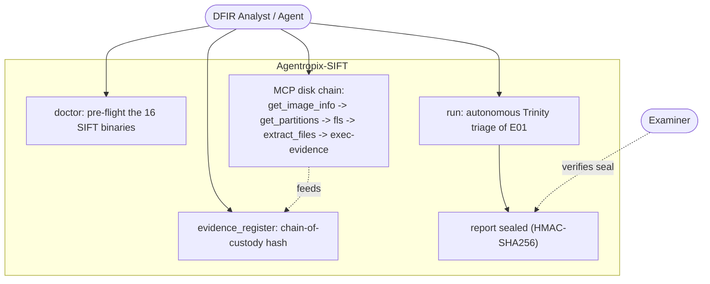
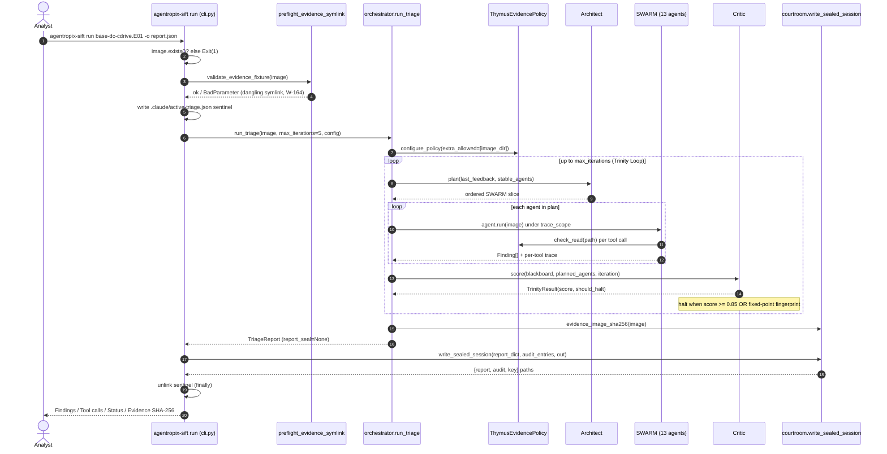
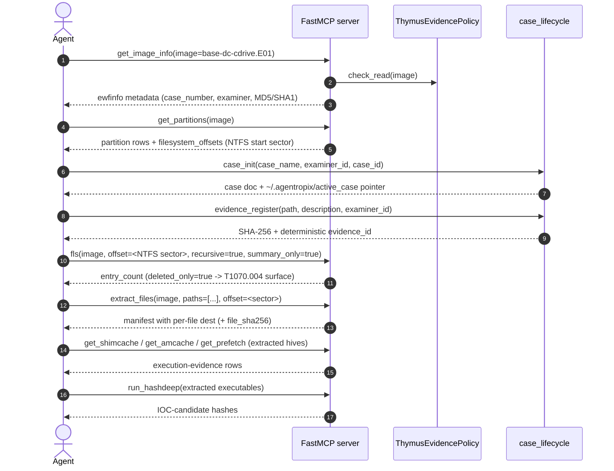

# Use Case — Triage an E01 Disk Image End to End

> **Actor:** DFIR analyst (or an MCP-driving agent) running on the SANS SIFT Workstation.
> **Goal:** Take a freshly acquired E01 disk image, establish chain-of-custody, run the
> autonomous Trinity Loop over it, and produce a **sealed** triage report on disk.
> **Surfaces exercised:** the `agentropix-sift run` CLI (`src/agentropix_sift/cli.py`) and the
> MCP disk-triage tool chain (`src/agentropix_sift/mcp_server/`). See
> [`.crew/facts.md`](../../.crew/facts.md) for every numeric claim.

This use case has two entry points that are deliberately distinct:

1. **The one-shot CLI run** (`agentropix-sift run <image>`) — drives the full 13-class `SWARM`
   under the Trinity Loop and seals the report. This is the autonomous path.
2. **The step-by-step MCP tool chain** — what an interactive agent issues when it wants to drive
   individual forensic tools (modelled on [Playbook A in the upstream guides](../../.crew/facts.md)
   and `docs/guides/playbooks.md`). This is the manual / exploratory path.

Both end at the same artefact: a finding set whose facts each originate from a named deterministic
MCP tool, sealed with an HMAC-SHA256 envelope.

---

## Use-case diagram



The analyst pre-flights the toolchain (`doctor`), then chooses either the autonomous `run` command
or the granular MCP chain. Both bind evidence via `evidence_register` and converge on a sealed
report the examiner can later verify. The dashed `verifies seal` edge is the cross-link into
[uc-approval-gate.md](uc-approval-gate.md), where a human examiner reviews findings before they are
promoted out of DRAFT.

---

## Sequence — the autonomous `agentropix-sift run` path



Steps 1–5 are CLI guard rails: the file must exist, the evidence symlink must not be dangling
(`_load_preflight_validator`, `cli.py:19-41`; W-164 — a broken symlink silently collapses recall
from 7/7 to 4/7), and a `.claude/active-triage.json` sentinel is written so the Ralph-loop Stop hook
knows a triage is in flight (`cli.py:92-114`). The orchestrator then runs the Trinity Loop:
**Architect proposes → SWARM runs deterministic tools → Critic scores** (`orchestrator.py:146-269`).
The Critic halts on a deterministic convergence fingerprint or when the score crosses
`AGENTROPIX_CRITIC_HALT_THRESHOLD` (default **0.85**, `trinity/critic.py:42`) — **no LLM self-rating**.
Finally the CLI seals the report (`courtroom.write_sealed_session`, `cli.py:134-142`), writing three
files: `report.json`, `<stem>.audit-log.json`, and a mode-0600 session key.

---

## Sequence — the granular MCP disk chain



The **load-bearing ordering rule**: you must capture the NTFS start sector from `get_partitions`
(`filesystem_offsets`) and pass it as `offset` to `fls` and `extract_files`. Reading offset 0 lands
on the MBR and fails filesystem detection (NIST1 ISSUE-001; `docs/guides/playbooks.md` §A note).
Every read passes the **Thymus read-only policy** (`mcp_server/thymus_policy.py`) — the image's parent
directory is auto-allowed on first touch (`_auto_allow_parent`), and each access is audited.

---

## Actor, preconditions, steps, postconditions

**Actor:** DFIR analyst, or an MCP client agent (Claude Desktop / Claude Code) driving the server.

**Preconditions**

- The 16 SIFT forensic binaries are installed and resolvable — verify with `agentropix-sift doctor`
  (`cli.py:175-217`), which pre-flights `vol`, `log2timeline.py`, `fls`, `icat`, `mmls`, `ewfinfo`,
  `evtx_dump.py`, `yara`, `bulk_extractor`, `rip.pl`, `pf`, `amcache_parser`, `shimcache_parser`,
  `exiftool`, `foremost`, `hashdeep` (plus `ssdeep`, `strings`). Missing tools can be pointed at an
  alternative binary via the `AGENTROPIX_*_TOOL` overrides (`_DOCTOR_ENV_OVERRIDES`, `cli.py:160-172`).
- The E01 image exists and any evidence symlink resolves (no dangling target).
- Python 3.12+.

**Numbered steps (autonomous path)**

1. `agentropix-sift doctor` — confirm all 16 SIFT tools are present.
2. `agentropix-sift run base-dc-cdrive.E01 --max-iterations 5 --out report.json` — launch the
   Trinity Loop over the image.
3. The Architect plans the SWARM; each agent runs its deterministic tools through the Thymus boundary
   and publishes `Finding`s to the shared `Blackboard`.
4. The Critic scores each pass and halts on the deterministic fingerprint or threshold ≥ 0.85.
5. The CLI seals the report and writes `report.json`, `report.audit-log.json`, and the 0600
   session key.

**Numbered steps (granular MCP path)**

1. `get_image_info(image)` → confirm readability + acquisition hash.
2. `get_partitions(image)` → capture the NTFS start sector.
3. `case_init(...)` then `evidence_register(...)` → chain-of-custody.
4. `fls(image, offset=<sector>, ...)` → filesystem walk (including deleted files).
5. `extract_files(image, paths=[...], offset=<sector>)` → pull hives/artefacts.
6. `get_shimcache` / `get_amcache` / `get_prefetch` over the extracted hives → execution evidence.
7. `run_hashdeep(...)` → IOC-candidate hashes for promotion.

**Postconditions**

- A `TriageReport` (validating against `schema/report.schema.json`) with `findings`, a per-agent and
  per-tool `trace`, the `thymus_audit` log, the final `critic_score`, and `completion_proofs`.
- `evidence_image_sha256` binds the report to the exact bytes triaged (`orchestrator.py:292`).
- `report_seal` — an HMAC-SHA256 envelope over the canonicalised report, computed at write time so it
  covers the final on-disk document (`courtroom.py`; ADR-016/022). Tamper-evident: a single byte
  change breaks `verify_seal`.

**CLI commands used**

```bash
# 1. Pre-flight the 16 SIFT binaries
agentropix-sift doctor

# 2. Autonomous end-to-end triage (Trinity Loop), sealed report
agentropix-sift run /evidence/srl2018/base-dc-cdrive.E01 \
    --max-iterations 5 \
    --out report.json \
    --verbose

# 3. (Optional) mint a one-shot mutation token for any later live write
agentropix-sift evidence-gate mint   # -> egt_<ULID> into AGENTROPIX_MUTATION_TOKEN
```

---

## See also

- [uc-memory-triage.md](uc-memory-triage.md) — the Volatility memory-triage counterpart.
- [uc-approval-gate.md](uc-approval-gate.md) — promote DRAFT findings via examiner approval.
- [uc-wazuh-push.md](uc-wazuh-push.md) — push the resulting IOCs into Wazuh (optional integration).
- [`.crew/tool-list.md`](../../.crew/tool-list.md) — the full 71-tool catalogue and the 16 SIFT wrappers.
- [`.crew/agents-list.md`](../../.crew/agents-list.md) — the SWARM run order and per-agent tools.
