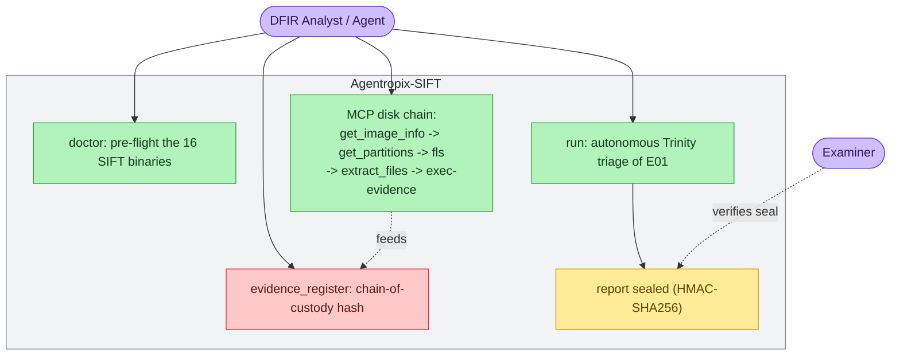
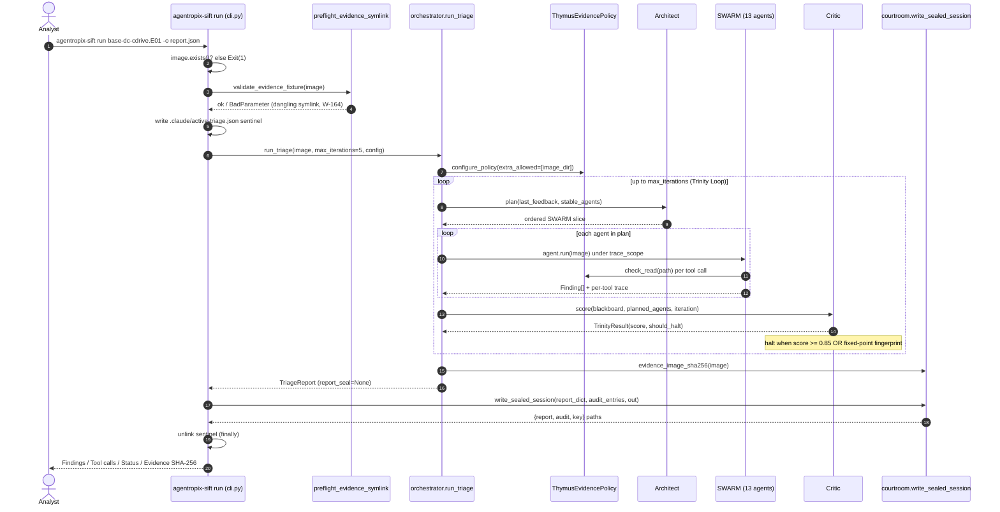
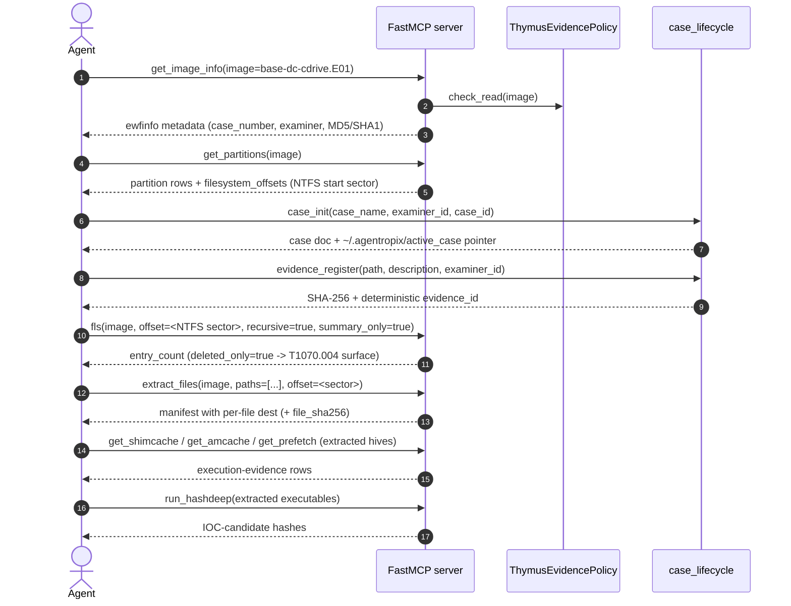

# Use Case — Triage an E01 Disk Image End to End

> **Actor:** DFIR analyst (or an MCP-driving agent) running on the SANS SIFT Workstation.
> **Goal:** Take a freshly acquired E01 disk image, establish chain-of-custody, run the
> autonomous Trinity Loop over it, and produce a **sealed** triage report on disk.
> **Surfaces exercised:** the `agentropix-sift run` CLI (`src/agentropix_sift/cli.py`) and the
> MCP disk-triage tool chain (`src/agentropix_sift/mcp_server/`). See
> [`canonical-facts.md`](../08-reference/canonical-facts.md) for every numeric claim.

This use case has two entry points that are deliberately distinct:

1. **The one-shot CLI run** (`agentropix-sift run <image>`) — drives the full 13-class `SWARM`
   under the Trinity Loop and seals the report. This is the autonomous path.
2. **The step-by-step MCP tool chain** — what an interactive agent issues when it wants to drive
   individual forensic tools (modelled on [Playbook A in the upstream guides](../08-reference/canonical-facts.md)
   and `docs/guides/playbooks.md`). This is the manual / exploratory path.

Both end at the same artefact: a finding set whose facts each originate from a named deterministic
MCP tool, sealed with an HMAC-SHA256 envelope.

---

## Contents — what's in this page (and what to expect)

> Jump to any section below. Each row tells you what that part gives you, so you can go straight to your point.

| Section | What you'll get |
|---|---|
| [How to read this page](#how-to-read-this-page) | The dual-audience convention (🖥️ expert command vs 💬 end-user prompt), the four-lane usability matrix, the real-data note, and how the GOTCHA boxes work. |
| [Use-case diagram](#use-case-diagram) | A Mermaid map of the actors and the path from `doctor` pre-flight through autonomous `run` or the MCP chain to a sealed report the examiner verifies. |
| [Sequence — the autonomous `agentropix-sift run` path](#sequence--the-autonomous-agentropix-sift-run-path) | The one-shot Trinity Loop run end to end — CLI guard rails, Architect→SWARM→Critic, the 0.85 halt, and the three sealed output files (with both audience tracks and validated output). |
| [Sequence — the granular MCP disk chain](#sequence--the-granular-mcp-disk-chain) | The step-by-step manual tool chain (`get_image_info`→`get_partitions`→`case_init`/`evidence_register`→`fls`→`extract_files`→execution-evidence→`run_hashdeep`), each shown both ways with real CFReDS outputs. |
| [Actor, preconditions, steps, postconditions](#actor-preconditions-steps-postconditions) | The formal use-case spec — actor, the 16 SIFT binary prerequisites, numbered steps for both paths, the sealed-report postconditions, and the CLI commands used. |
| [See also](#see-also) | Cross-links to the memory-triage, approval-gate, and Wazuh-push use cases plus the tool and agent catalogues. |

---

## How to read this page

This page follows the portal's **dual-audience** convention (the gold standard is
[`docs/01-overview/user-guide.md`](../01-overview/user-guide.md)). Every tool in the triage sequence is
shown **two ways at once**, side by side:

> **🖥️ Expert (command):** the exact CLI / MCP call to type into a terminal or pass over the MCP.
> **💬 End-user (prompt):** the plain-language question to type into a Claude session that has the
> Agentropix MCP connected. A simple, focused question is enough — the session recognises it as an
> Agentropix capability and routes it to the right MCP tool automatically.

Both surfaces hit the **same deterministic MCP tool** and return the **same facts** — only the surface
differs. Pick your track and follow it; you only need one.

**The example outputs below are from a REAL run.** The case IDs, hashes, sector offsets, and entry
counts (e.g. evidence SHA-256 `96bebe80…`, NTFS @ sector 63, `entry_count 12545`) come from the
**validated 2026-05-29 CFReDS run** (NIST "Hacking Case", Greg Schardt / "Mr. Evil", Windows XP). Your
own run will produce *different* IDs and timestamps, but the *shape* of the output will match. The image
path is written as a placeholder `<IMAGE>` (e.g. `/cases/cfreds-fresh/4Dell-Latitude-CPi.E01`); the
extraction directory as `<OUT_DIR>` (must be under a Thymus-allowlisted prefix —
`/tmp/agentropix-sift-*`, `/cases/`, `/mnt/`, `/media/`, `/evidence/`).

### Usability matrix — find your lane

There are **two ways to drive the triage** (Autonomous `run` vs Manual MCP chain) and **two ways to
interact** (Expert CLI/MCP vs Non-expert prompt). That makes **four lanes** — find yours and follow it
consistently. All four operate on the **same image** and reach the **same sealed artefact**.

| | **🖥️ Expert (types CLI/MCP commands)** | **💬 Non-expert (types a plain-language prompt)** |
|---|---|---|
| **Autonomous** (`agentropix-sift run` drives the whole Trinity Loop unattended, sealing the report) | **Lane Auto-Expert.** Run `agentropix-sift run <IMAGE> --max-iterations 5 --out report.json`. Read `report.json` + the audit log. The one-shot production path. → [autonomous sequence](#sequence--the-autonomous-agentropix-sift-run-path) | **Lane Auto-User.** Paste one autonomous prompt ("triage this disk image end to end and seal the report") and let the assistant narrate progress. → [autonomous sequence](#sequence--the-autonomous-agentropix-sift-run-path) |
| **Manual** (you/the assistant drive each disk tool one at a time, inspecting output before the next step) | **Lane Manual-Expert.** Call each disk-image MCP tool yourself (`get_image_info` → `get_partitions` → `fls` → `extract_files` → execution-evidence). Read raw JSON inline. → [granular MCP chain](#sequence--the-granular-mcp-disk-chain) | **Lane Manual-User.** Ask the assistant one focused question per step ("what's the partition layout?", "list the deleted files"). → use the `💬` prompts in the [granular MCP chain](#sequence--the-granular-mcp-disk-chain) |

> ⚠️ **What a GOTCHA box is.** GOTCHA boxes below flag real-data quirks found during the proving run —
> a tool that needs a partition offset, a path the policy engine rejects. Each explains the snag for
> **both** audiences: the expert symptom and the plain-language fix.

---

## Use-case diagram



The analyst pre-flights the toolchain (`doctor`), then chooses either the autonomous `run` command
or the granular MCP chain. Both bind evidence via `evidence_register` and converge on a sealed
report the examiner can later verify. The dashed `verifies seal` edge is the cross-link into
[uc-approval-gate.md](uc-approval-gate.md), where a human examiner reviews findings before they are
promoted out of DRAFT.

---

## Sequence — the autonomous `agentropix-sift run` path



Steps 1–5 are CLI guard rails: the file must exist, the evidence symlink must not be dangling
(`_load_preflight_validator`, `cli.py:19-41`; W-164 — a broken symlink silently collapses recall
from 7/7 to 4/7), and a `.claude/active-triage.json` sentinel is written so the Ralph-loop Stop hook
knows a triage is in flight (`cli.py:92-114`). The orchestrator then runs the Trinity Loop:
**Architect proposes → SWARM runs deterministic tools → Critic scores** (`orchestrator.py:146-269`).
The Critic halts on a deterministic convergence fingerprint or when the score crosses
`AGENTROPIX_CRITIC_HALT_THRESHOLD` (default **0.85**, `trinity/critic.py:42`) — **no LLM self-rating**.
Finally the CLI seals the report (`courtroom.write_sealed_session`, `cli.py:134-142`), writing three
files: `report.json`, `<stem>.audit-log.json`, and a mode-0600 session key.

### Drive the autonomous path — both audiences

> **🖥️ Expert (command):**
> ```bash
> agentropix-sift run <IMAGE> --max-iterations 5 --out report.json --verbose
> ```
> **💬 End-user (prompt):** *"Triage this disk image end to end with Agentropix and seal the report —
> run the full autonomous sequence, stage findings as DRAFT, and don't approve anything."*
> The session drives the same Trinity Loop (Architect plans → SWARM runs deterministic tools → Critic
> scores) and tells you when the sealed report is on disk. **One focused request is enough — the
> session recognises this as the autonomous triage capability and routes it.**

**Execution A → Output A.**

*Execution A:* `agentropix-sift run <IMAGE> --max-iterations 5 --out report.json --verbose`

*Output A (CFReDS validated):* the CLI prints **Findings**, **Tool calls**, **Status**, and the
**Evidence SHA-256** (`96bebe80f00541bf28fbc2ef0b02b580082ee6ad58837e991852ae66f077ec31`), then writes
three files next to `report.json`:

| Artefact | What it is |
|---|---|
| `report.json` | the `TriageReport` (validates against `schema/report.schema.json`) with `findings`, per-agent + per-tool `trace`, `thymus_audit`, `critic_score`, `completion_proofs`, and the `report_seal` |
| `report.audit-log.json` | the append-only audit entries (every Thymus read decision, every tool call) |
| `report.key` (mode `0600`) | the per-session key material for `verify_seal` |

The Critic halts on the deterministic convergence fingerprint or when the score crosses
`AGENTROPIX_CRITIC_HALT_THRESHOLD` (default **0.85**) — **no LLM self-rating**.

> ⚠️ **GOTCHA (preconditions):** `run` exits `1` if `<IMAGE>` does not exist, and raises `BadParameter`
> (W-164) if the evidence symlink is dangling — a broken symlink silently collapses recall from 7/7 to
> 4/7. Pre-flight with `agentropix-sift doctor` and confirm the image resolves before launching.
> *(End-user: the assistant verifies the image is readable first — that's the `get_image_info` check it
> runs before anything else.)*

---

## Sequence — the granular MCP disk chain



The **load-bearing ordering rule**: you must capture the NTFS start sector from `get_partitions`
(`filesystem_offsets`) and pass it as `offset` to `fls` and `extract_files`. Reading offset 0 lands
on the MBR and fails filesystem detection (NIST1 ISSUE-001; `docs/guides/playbooks.md` §A note).
Every read passes the **Thymus read-only policy** (`mcp_server/thymus_policy.py`) — the image's parent
directory is auto-allowed on first touch (`_auto_allow_parent`), and each access is audited.

### Drive the granular chain — tool by tool, both audiences

Each disk-image tool below is a **real MCP tool** from
[`tool-list.md`](../04-mcp-tools/tool-list.md) (verify the live arg schema with `tools/list`). Follow
either the `🖥️` command track or the `💬` prompt track — both hit the same deterministic tool.

**B.1 — Image metadata (`get_image_info`).** Confirm readability + capture the acquisition hash.

> **🖥️ Expert (MCP call):**
> ```text
> get_image_info { "image":"<IMAGE>" }
> ```
> **💬 End-user (prompt):** *"What does Agentropix report about this disk image — who acquired it, when,
> the media size, and its MD5?"*
> The session calls `get_image_info` (which drives `ewfinfo`) and summarises the acquisition metadata.

**Execution B → Output B.**

*Execution B:* `get_image_info { "image":"<IMAGE>" }`

*Output B (CFReDS validated, `ewfinfo 20140816`):* case_number `Greg Schardt`, examiner `Shane
Robinson`, acquisition_date `Wed Sep 22 14:06:04 2004`, OS `Windows XP`, format `EnCase 4`,
bytes/sector `512`, **media_size `4.5 GiB (4871301120 bytes)`**, **MD5
`aee4fcd9301c03b3b054623ca261959a`**.

**B.2 — Partition table (`get_partitions`).** Capture the NTFS **start sector** — the single most
load-bearing value in the chain.

> **🖥️ Expert (MCP call):**
> ```text
> get_partitions { "image":"<IMAGE>" }
> ```
> (CLI equivalent for an operator shell: `mmls <IMAGE>`.)
> **💬 End-user (prompt):** *"What's the partition layout of this image, and where does the NTFS
> partition start?"*
> The session calls `get_partitions` (mmls) and tells you the start sector — and carries that offset
> forward automatically when you later ask it to list or extract files.

**Execution C → Output C.**

*Execution C:* `get_partitions { "image":"<IMAGE>" }`

*Output C (CFReDS validated):* partition rows with `filesystem_offsets`; the **NTFS partition starts at
sector 63**. Quote this offset (`63`) as `offset` in every downstream `fls` / `extract_files` call.

> ⚠️ **GOTCHA (the load-bearing ordering rule):** reading `offset 0` lands on the MBR and fails
> filesystem detection with `Cannot determine file system type` (NIST1 ISSUE-001). Always pass the
> `get_partitions`-derived sector as `offset` to `fls` and `extract_files`. *(End-user: the assistant
> does this for you — that's why it checks the partition layout before listing files.)*

**B.3 — Chain of custody (`case_init` → `evidence_register`).** Open the case, then hash + bind the
image.

> **🖥️ Expert (MCP calls):**
> ```text
> case_init         { "case_name":"<CASE NAME>", "examiner_id":"<EXAMINER>", "scope":"<IMAGE>" }
> evidence_register { "path":"<IMAGE>", "description":"Windows disk (EWF/E01)", "examiner_id":"<EXAMINER>" }
> ```
> **💬 End-user (prompt):** *"Open a case for this disk image, then register it as evidence and give me
> its SHA-256 custody hash."*
> The session calls `case_init` (writing the active-case pointer) then `evidence_register`, and returns
> the deterministic evidence ID and SHA-256 bound to the active case.

**Execution D → Output D.**

*Execution D:* `case_init` then `evidence_register` (as above).

*Output D (CFReDS validated):*
- `case_init` → `case_id` `INC-2026-0529224443`, status `active`, pointer
  `~/.agentropix/active_case`.
- `evidence_register` → evidence **SHA-256
  `96bebe80f00541bf28fbc2ef0b02b580082ee6ad58837e991852ae66f077ec31`**, deterministic `evidence_id`
  (over case_id + path + sha256), `size_bytes 671094597`, `indexed:true`.

**B.4 — Filesystem walk (`fls`).** List entries including deleted, using the offset from B.2.

> **🖥️ Expert (MCP calls):**
> ```text
> fls { "image":"<IMAGE>", "offset":63, "recursive":true, "summary_only":true }
> fls { "image":"<IMAGE>", "offset":63, "recursive":true, "deleted_only":true }    # T1070.004 surface
> ```
> **💬 End-user (prompt):** *"List the files on this image, then show me just the deleted ones."*
> The session runs `fls` (live, then deleted-only) using the offset it found in B.2 and reports the
> counts plus notable entries.

**Execution E → Output E.**

*Execution E:* `fls` live (summary), then `fls` deleted-only (as above).

*Output E (CFReDS validated):*
- Live: `entry_count` **`12545`**. First entry `/Documents and Settings` (inode `3671-144-7`).
- Deleted-only: `entry_count` **`365`** — the `T1070.004` (Indicator Removal: File Deletion) surface.

**B.5 — Pull hives / artefacts (`extract_files`).** Extract the key hives to an allowlisted dir,
passing the same offset.

> **🖥️ Expert (MCP call):**
> ```text
> extract_files { "image":"<IMAGE>", "offset":63, "paths":["<hive paths>"], "dest":"<OUT_DIR>" }
> ```
> **💬 End-user (prompt):** *"Pull the registry hives off this disk image so we can analyse what was
> executed."*
> The session calls `extract_files` (TSK `ifind`+`icat`) into an allowlisted directory and returns the
> per-file manifest. (Omit `dest` and it auto-creates a tempdir under `/tmp/agentropix-sift-extract-*`.)

**Execution F → Output F.**

*Execution F:* `extract_files { "image":"<IMAGE>", "offset":63, "paths":[...], "dest":"<OUT_DIR>" }`

*Output F (validated shape):* a manifest with a per-file `dest` and `file_sha256` for each extracted
hive — these `dest` keys feed every registry / execution-evidence parser in B.6.

> ⚠️ **GOTCHA (Thymus allowlist):** `dest` / `<OUT_DIR>` MUST be under a Thymus-allowlisted prefix
> (`/tmp/agentropix-sift-*`, `/cases/`, `/mnt/`, `/media/`, `/evidence/`) or Thymus rejects it with
> `path not found`. *(End-user: the assistant picks an allowlisted location for you.)*

**B.6 — Execution evidence (`get_shimcache` / `get_amcache` / `get_prefetch`).** Parse the extracted
hives.

> **🖥️ Expert (MCP calls):**
> ```text
> get_shimcache { "hive":"<OUT_DIR>/SYSTEM" }     # AppCompatCache execution evidence
> get_amcache   { "hive":"<OUT_DIR>/Amcache.hve" }# Win7+ only (XP has none)
> get_prefetch  { "target":"<OUT_DIR>/Prefetch" } # XP-compatible
> ```
> **💬 End-user (prompt):** *"From the hives we pulled, tell me what programs were executed and when."*
> The session runs `get_shimcache` / `get_prefetch` (and `get_amcache` on Win7+) over the extracted
> artefacts and summarises the execution evidence — automatically skipping Amcache on an XP image.

**Execution G → Output G.**

*Execution G:* `get_shimcache` / `get_amcache` / `get_prefetch` over the B.5 artefacts.

*Output G (validated shape):* execution-evidence rows (program path, first/last execution). On the
CFReDS XP image, `get_amcache` is skipped (XP has no Amcache); `get_prefetch` and `get_shimcache`
return rows.

**B.7 — IOC-candidate hashing (`run_hashdeep`).** Hash the recovered executables; the hashes become IOC
candidates for promotion.

> **🖥️ Expert (MCP call):**
> ```text
> run_hashdeep { "target":"<OUT_DIR>" }
> ```
> **💬 End-user (prompt):** *"Hash the executables we recovered so we have IOC candidates to promote."*
> The session calls `run_hashdeep` and returns the multi-algorithm hashes — the IOC candidates that
> later flow into the Executable Artifact Registry and Wazuh.

**Execution H → Output H.**

*Execution H:* `run_hashdeep { "target":"<OUT_DIR>" }`

*Output H (validated shape):* multi-algorithm hashes (MD5 / SHA-256) per recovered executable — the
IOC-candidate set promoted via `promote_iocs` / the EAR and pushed to Wazuh
([uc-wazuh-push.md](uc-wazuh-push.md)).

---

## Actor, preconditions, steps, postconditions

**Actor:** DFIR analyst, or an MCP client agent (Claude Desktop / Claude Code) driving the server.

**Preconditions**

- The 16 SIFT forensic binaries are installed and resolvable — verify with `agentropix-sift doctor`
  (`cli.py:175-217`), which pre-flights `vol`, `log2timeline.py`, `fls`, `icat`, `mmls`, `ewfinfo`,
  `evtx_dump.py`, `yara`, `bulk_extractor`, `rip.pl`, `pf`, `amcache_parser`, `shimcache_parser`,
  `exiftool`, `foremost`, `hashdeep` (plus `ssdeep`, `strings`). Missing tools can be pointed at an
  alternative binary via the `AGENTROPIX_*_TOOL` overrides (`_DOCTOR_ENV_OVERRIDES`, `cli.py:160-172`).
- The E01 image exists and any evidence symlink resolves (no dangling target).
- Python 3.12+.

**Numbered steps (autonomous path)**

1. `agentropix-sift doctor` — confirm all 16 SIFT tools are present.
2. `agentropix-sift run base-dc-cdrive.E01 --max-iterations 5 --out report.json` — launch the
   Trinity Loop over the image.
3. The Architect plans the SWARM; each agent runs its deterministic tools through the Thymus boundary
   and publishes `Finding`s to the shared `Blackboard`.
4. The Critic scores each pass and halts on the deterministic fingerprint or threshold ≥ 0.85.
5. The CLI seals the report and writes `report.json`, `report.audit-log.json`, and the 0600
   session key.

**Numbered steps (granular MCP path)**

1. `get_image_info(image)` → confirm readability + acquisition hash.
2. `get_partitions(image)` → capture the NTFS start sector.
3. `case_init(...)` then `evidence_register(...)` → chain-of-custody.
4. `fls(image, offset=<sector>, ...)` → filesystem walk (including deleted files).
5. `extract_files(image, paths=[...], offset=<sector>)` → pull hives/artefacts.
6. `get_shimcache` / `get_amcache` / `get_prefetch` over the extracted hives → execution evidence.
7. `run_hashdeep(...)` → IOC-candidate hashes for promotion.

**Postconditions**

- A `TriageReport` (validating against `schema/report.schema.json`) with `findings`, a per-agent and
  per-tool `trace`, the `thymus_audit` log, the final `critic_score`, and `completion_proofs`.
- `evidence_image_sha256` binds the report to the exact bytes triaged (`orchestrator.py:292`).
- `report_seal` — an HMAC-SHA256 envelope over the canonicalised report, computed at write time so it
  covers the final on-disk document (`courtroom.py`; ADR-016/022). Tamper-evident: a single byte
  change breaks `verify_seal`.

**CLI commands used**

```bash
# 1. Pre-flight the 16 SIFT binaries
agentropix-sift doctor

# 2. Autonomous end-to-end triage (Trinity Loop), sealed report
agentropix-sift run /evidence/srl2018/base-dc-cdrive.E01 \
    --max-iterations 5 \
    --out report.json \
    --verbose

# 3. (Optional) mint a one-shot mutation token for any later live write
agentropix-sift evidence-gate mint   # -> egt_<ULID> into AGENTROPIX_MUTATION_TOKEN
```

---

## See also

- [uc-memory-triage.md](uc-memory-triage.md) — the Volatility memory-triage counterpart.
- [uc-approval-gate.md](uc-approval-gate.md) — promote DRAFT findings via examiner approval.
- [uc-wazuh-push.md](uc-wazuh-push.md) — push the resulting IOCs into Wazuh (optional integration).
- [`tool-list.md`](../04-mcp-tools/tool-list.md) — the full 71-tool catalogue and the 16 SIFT wrappers.
- [`agents-list.md`](../10-agents/agents-list.md) — the SWARM run order and per-agent tools.
- [agentic-architecture.md](../10-agents/agentic-architecture.md) — how the runtime swarm is wired (the Trinity Loop behind the autonomous path).
